# 알고리즘
: 유한한 단계를 통해 *문제를 해결하기 위한 절차나 방법*이다. 주로 컴퓨터 용어로 쓰이며, 컴퓨터가 어떤 일을 수행하기 위한 단계적 방법
- 의사코드(Pseudocode)
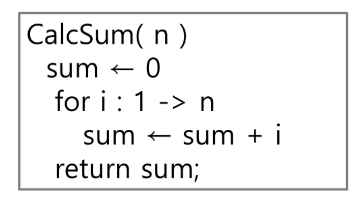
- 순서도
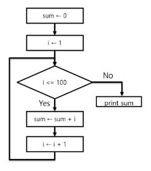
- 무엇이 좋은 알고리즘인가?
	1. 정확성 : 얼마나 정확하게 동작하는가
	2. 작업량 : 얼마나 적은 연산으로 원하는 결과를 얻어내는가
	3. 메모리 사용량 : 얼마나 적은 메모리를 사용하는가
	4. 단순성 : 얼마나 단순한가
	5. 최적성 : 더 이상 개선할 여지없이 최적화되었는가
- 알고리즘의 성능 분석 필요
- 알고리즘의 작업량을 표현할 때 시간복잡도로 표현한다
## 시간 복잡도(Time Complexity)
- 실제 걸리는 시간을 측정
- 실행되는 명령문의 개수를 계산
### 시간복잡도 ≓ 빅-오(O) 표기법
- Big-O Notation
- 시간 복잡도 함수 중에서 가장 큰 영향력을 주는 n에 대한 항만을 표시
- 계수(Coefficient)는 생략하여 표시
- 예
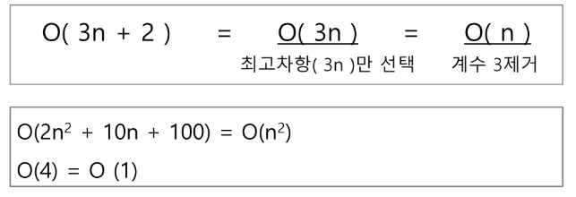
- 요소 수가 증가함에 따라 각기 다른 시간복잡도의 알고리즘은 아래와 같은 연산 수를 보인다.
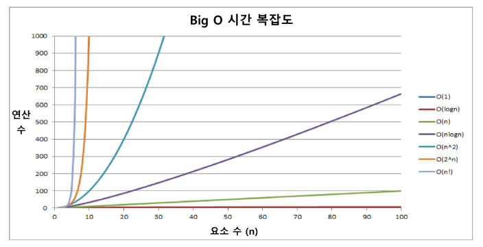
## 배열 1(Array 1)
: 일정한 자료형의 변수들을 하나의 이름으로 열거하여 사용하는 자료구조
6개의 변수를 사용해야 하는 경우, 이를 배열로 바꾸어 사용하는 예
### 배열의 필요성
- 프로그램 내에서 여러 개의 변수가 필요할 때, 일일이 다른 변수명을 이용하여 자료에 접근하는 것은 매우 비효율적
- 배열을 사용하면 하나의 선언을 통해서 둘 이상의 변수를 선언할 수 있다.
- 단순히 다수의 변수 선언을 의미하는 것이 아니라, 다수의 변수로는 하기 힘든 작업을 배열을 활용해 쉽게 할 수 있다.
  ### 1차원 배열의 선언
  - 별도의 선언 방법이 없으면 변수에 처음 값을 할당할 때 생성
  - 이름 : 프로그램에서 사용할 배열의 이름
  - `Arr = list()`
  - `Arr = []`
  - `Arr = [1, 2, 3]`
  - `Arr = [0] * 10`
### 1차원 배열의 접근
- `Arr[0] = 10`
- `Arr[idx] = 20`
## 버블 정렬(Bubble Sort)
: 2개 이상의 자료를 특정 기준에 의해 작은 값부터 큰 값(오름차순: ascending), 혹은 그 반대의 순서대로(내림차순: descending) 재배열하는 것
- 키 : 자료를 정렬하는 기준이 되는 특정 값
- 인접한 두 개의 원소를 비교하며 자리를 계속 교환하는 방식
### 정렬 과정
- 첫 번쨰 원소부터 인접한 원소끼리 계속 자리를 교환하면서 맨 마지막 자리까지 이동한다.
- 한 단계가 끝나면 가장 큰 원소가 마지막 자리로 정렬된다.
- 교환하며 자리를 이동하는 모습이 물 위에 올라오는 거품 모양과 같다고 하여 버블 정렬이라고 한다.
### 시간 복잡도
- O(n²)
### 배열을 활용한 버블 정렬
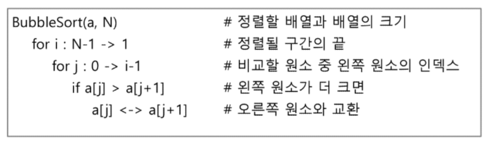
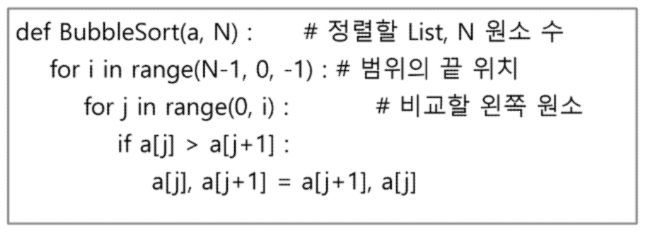
## 카운팅 정렬(Counting Sort)
: 항목들의 순서를 결정하기 위해 집합에 각 항목이 몇 개씩 있는지 세는 작업을 하여, 선형 시간에 정렬하는 효율적인 알고리즘
### 제한 사항
- 정수나 정수로 표현할 수 있는 자료에 대해서만 적용 가능: 각 항목의 발생 횟수를 기록하기 위해, 정수 항목으로 인덱스 되는 카운트들의 배열을 사용하기 때문이다.
- 카운트들을 위한 충분한 공간을 할당하려면 집합 내의 가장 큰 정수를 알아야 한다.
### 시간 복잡도
- O(n + k) : n은 리스트 길이, k는 정수의 최대값
### 카운팅 정렬 과정
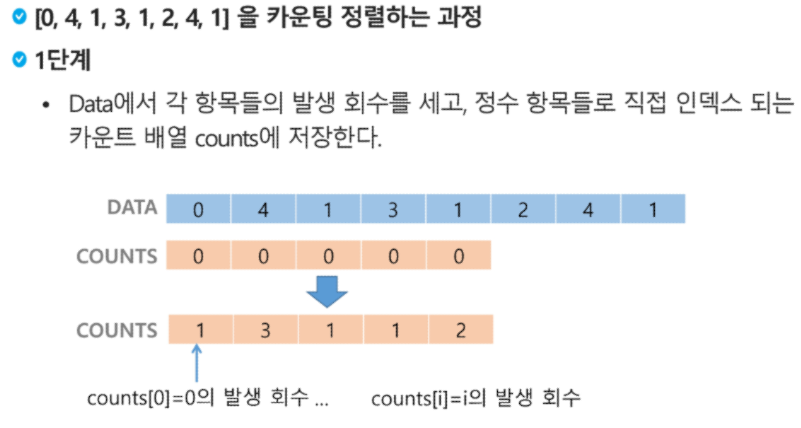
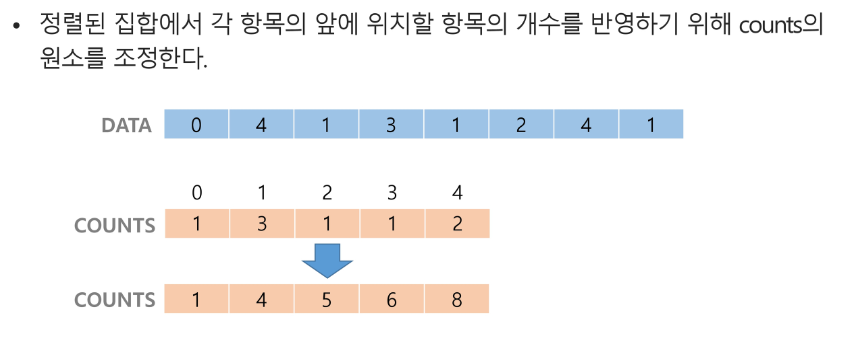
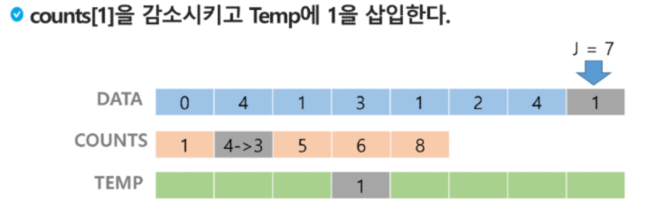
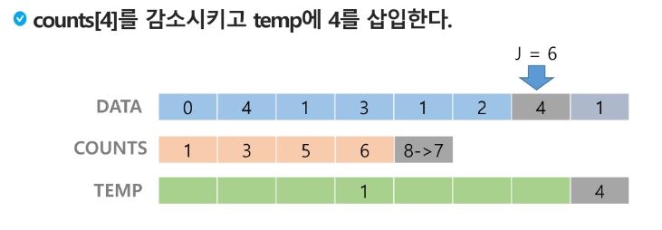
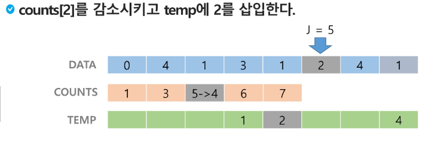
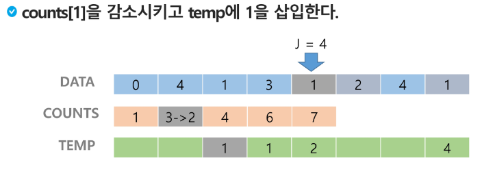
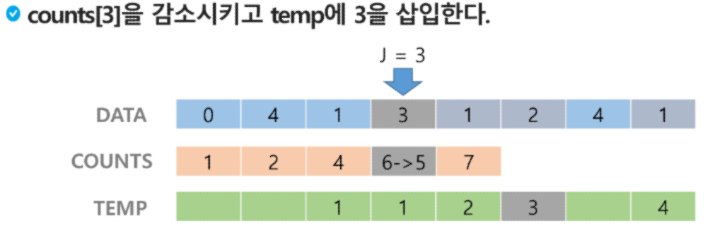
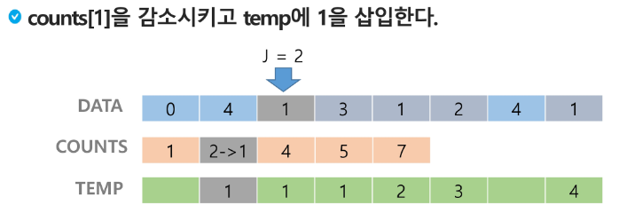
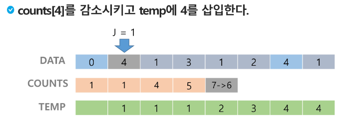
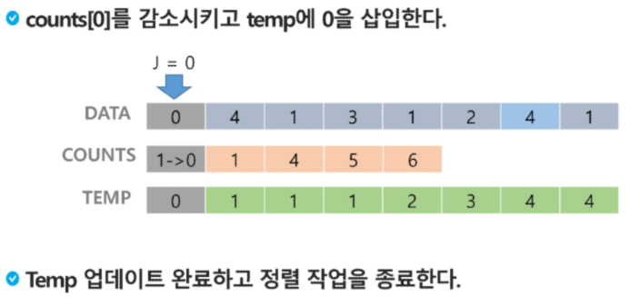
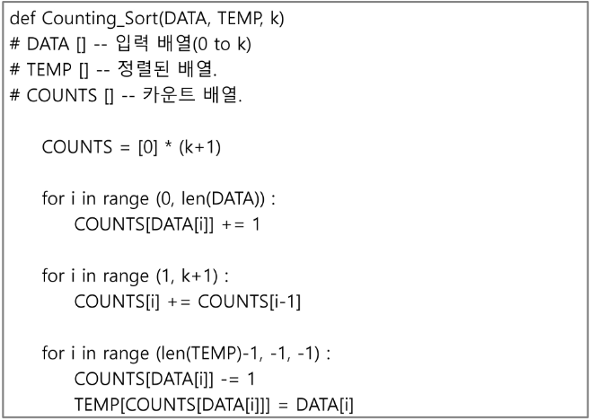
### 대표적인 정렬 방식의 종류
- 버블 정렬 (Bubble Sort)
- 카운팅 정렬 (Counting Sort)
- 선택 정렬 (Selection Sort)
- 퀵 정렬 (Quick Sort)
- 삽입 정렬 (Insertion Sort)
- 병합 정렬 (Merge Sort)
### 정렬 알고리즘 비교
| 알고리즘 | 평균 수행시간 | 최악 수행시간 | 알고리즘 기법 | 비고 |
| ---- | ---- | ---- | ---- | ---- |
| 버블 정렬 | O(n²) | O(n²) | 비교와 교환 | 코딩이 가장 손쉽다 |
| 카운팅 정렬 | O(n+K) | O(n+K) | 비교환 방식 | n이 비교적 작을 때만 가능하다 |
## 완전 검색(Exhaustive Search)
: 문제의 해법으로 생각할 수 있는 모든 경우의 수를 나열해보고 확인하는 기법
- Brute-Force 혹은 generate-and-text 기법이라고도 불림
- 모든 경우를 테스트한 후, 최종 해법을 도출
- 일반적으로 경우의 수가 상대적으로 작을 때 유용
- 모든 경우의 수를 생성하고 테스트하기 때문에 수행 속도는 느리지만, 해답을 찾아내지 못할 확률이 작다.
- [!] 자격검정평가 등에서 주어진 문제를 풀 때, 우선 완전 검색으로 접근하여 해답을 도출한 후, 성능 개선을 위해 다른 알고리즘을 사용하고 해답을 확인하는 것이 바람직
## 탐욕