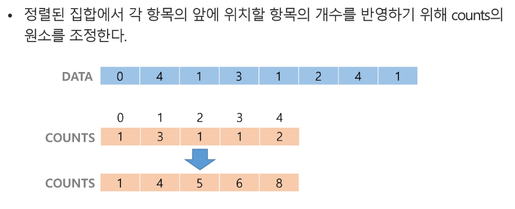
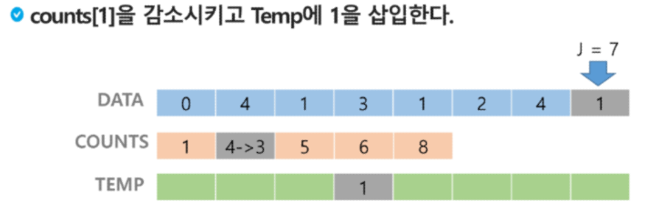
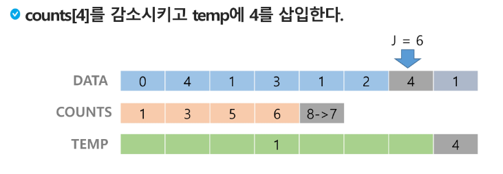
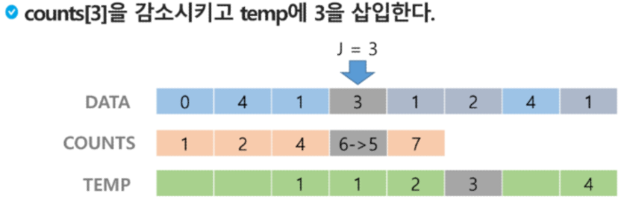
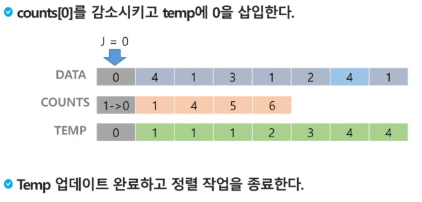

## 카운팅 정렬[(Counting Sort)](./Counting_Sort.md)
: 항목들의 순서를 결정하기 위해 집합에 각 항목이 몇 개씩 있는지 세는 작업을 하여, 선형 시간에 정렬하는 효율적인 알고리즘
### 제한 사항
- 정수나 정수로 표현할 수 있는 자료에 대해서만 적용 가능: 각 항목의 발생 횟수를 기록하기 위해, 정수 항목으로 인덱스 되는 카운트들의 배열을 사용하기 때문이다.
- 카운트들을 위한 충분한 공간을 할당하려면 집합 내의 가장 큰 정수를 알아야 한다.
### 시간 복잡도
- O(n + k) : n은 리스트 길이, k는 정수의 최대값
### 카운팅 정렬 과정

- 앞의 개수 누적
	- `count[i] = count[i-1] + count[i]` (첫 항목부터 맨 마지막 항목까지)




- 같은 값인 경우 원본의 순서를 유지한 채로 정렬 (Stable)





```python
def Counting_Sort(DATA, TEMP, k)
# DATA [] -- 입력 배열 (0 to k)
# TEMP [] -- 정렬된 배열
# COUNTS [] -- 카운트 배열

	COUNTS = [0] * (k+1)

	for i in range(0, len(DATA)):
		COUNTS[DATA[i]] += 1
		
	for i in range(1, k+1):
		COUNTS[i] += COUNTS[i-1]
	
	for i in range(len(TEMP)-1, -1, -1):
		COUNTS[DATA[i]] -= 1 #개수를 인덱스로 변환
		TEMP[COUNTS[DATA[i]]] = DATA[i]
```
### 대표적인 정렬 방식의 종류
- 버블 정렬 (Bubble Sort)
- 카운팅 정렬 (Counting Sort)
- 선택 정렬 (Selection Sort)
- 퀵 정렬 (Quick Sort)
- 삽입 정렬 (Insertion Sort)
- 병합 정렬 (Merge Sort)
### 정렬 알고리즘 비교
| 알고리즘 | 평균 수행시간 | 최악 수행시간 | 알고리즘 기법 | 비고 |
| ---- | ---- | ---- | ---- | ---- |
| [버블 정렬](./240129_algorithm1.md) | O(n²) | O(n²) | 비교와 교환 | 코딩이 가장 손쉽다 |
| 카운팅 정렬 | O(n+K) | O(n+K) | 비교환 방식 | n이 비교적 작을 때만 가능하다 |
## Baby-gin Game
: 0~9 사이의 숫자 카드에서 임의의 카드 6장을 뽑았을 때, 3장의 카드가 연속적인 번호를 갖는 경우를 run이라 하고, 3장의 카드가 동일한 번호를 갖는 경우를 triplet이라고 한다.
6장의 카드가 run과 triplet로만 구성된 경우를 baby-gin으로 부름
## 완전 검색[(Exhaustive Search)](./Brute_Force.md)
: 문제의 해법으로 생각할 수 있는 모든 경우의 수를 나열해보고 확인하는 기법
- Brute-Force 혹은 generate-and-text 기법이라고도 불림
- 모든 경우를 테스트한 후, 최종 해법을 도출
- 일반적으로 경우의 수가 상대적으로 작을 때 유용
- 모든 경우의 수를 생성하고 테스트하기 때문에 수행 속도는 느리지만, 해답을 찾아내지 못할 확률이 작다.
- [!] 자격검정평가 등에서 주어진 문제를 풀 때, 우선 완전 검색으로 접근하여 해답을 도출한 후, 성능 개선을 위해 다른 알고리즘을 사용하고 해답을 확인하는 것이 바람직
### 완전 검색을 활용한 Baby-gin 접근
- 6개의 숫자로 만들 수 있는 모든 숫자 나열 (중복 포함)
- 입력으로 받은 숫자들으로 순열 생성
- 모든 경우의 수를 테스트 → baby-gin 판단
### 순열 (Permutation)
- 서로 다른 것들 중 몇 개를 뽑아서 한 줄로 나열하는 것
- 서로 다른 n개 중 r개를 택하는 순열
	- $_nP_r$
-  $_nP_r$ 은 다음과 같은 식 성립
	-  $_nP_r = n * (n-1) * ... * (n - r + 1)$
-  $_nP_n = n!$ 이라고 표기하며 Factorial이라고 부름
## 탐욕(Greedy) 알고리즘
- 탐욕 알고리즘은 최적해를 구하는 데 사용되는 근시안적인 방법
- 여러 경우 중 하나를 결정해야 할 때마다 그 순간에 최적이라고 생각되는 것을 선택해 나가는 방식으로 진행하여 최종적인 해답에 도달한다.
- 각 선택의 시점에서 이루어지는 결정은 지역적으로는 최적이지만, 그 선택들을 계속 수집하여 최종적인 해답을 만들었다고 하여, 그것이 최적이라는 보장은 없다.
- 일반적으로, 머릿속에 떠오르는 생각을 검증 없이 바로 구현하면 Greedy 접근이 된다.
1. 해 선택
	  : 현재 상태에서 부분 문제의 최적 해를 구한 뒤, 이를 부분해 집함(Solution Set)에 추가한다
2. 실행 가능성 검사
	  : 새로운 부분해 집합이 실행 가능한지를 확인
	  곧, 문제의 제약 조건을 위반하지 않는지 검사
3. 해 검사
	  : 새로운 부분해 집합이 문제의 해가 되는지 확인
	  아직 전체 문제의 해가 완성되지 않았다면 1의 해 선택부터 다시 시작
### 탐욕 알고리즘의 예
  - 거스름돈 줄이기
	  1. 해 선택 : 가장 좋은 해 선택, 단위가 큰 동전으로만 거스름돈을 만들면 동전의 개수가 줄어들므로 현재 고를 수 있는 가장 단위가 큰 동전을 하나 골라 거스름돈에 추가
	  2. 실행 가능성 검사: 거스름돈이 손님에게 내드려야 할 액수를 초과하는 지 확인, 초과한다면 마지막에 추가한 동전을 빼고 1로 돌아가서 한 단계 작은 단위의 동전 추가
	  3. 해 검사: 거스름돈 == 손님에게 드려야하는 액수 가 해다. 다르면 1로 돌아가서 다시 추가할 동전 선택
- Baby-gin
	- counts 배열의 각 원소를 체크하여 run과 triplet 및 baby-gin 여부 판단


```python
num = 456789 # Baby Gin을 확인할 6자리 수
c = [0] * 12 # 6자리 수로부터 각 자리 수를 추출하여 개수를 누적할 리스트

for i in range(6):
	c[num % 10] += 1
	num // 10

i = 0
tri = run = 0
while i < 10:
	if c[i] >= 3: # triplet 조사 후 데이터 삭제
		c[i] -= 3
		tri += 1
		continue
	if c[i] >= 1 and c[i+1] >= 1 and c[i+2] >= 1: # run 조사 후 데이터 삭제
		c[i] -= 1
		c[i+1] -= 1
		c[i+2] -= 1
		run += 1
		continue
	i += 1

if run + tri == 2: print("Baby Gin")
else: print("Lose")
```
### 자주 실수하는 오답
- 입력받은 숫자를 정렬한 후, 앞뒤 3자리씩 끊어서 run 및 triplet을 확인하는 방법을 고려할 수도 있다.
	- \[6, 4, 4, 5, 4, 4] : 정렬하여 \[4, 4, 4, 4, 5, 6]을 얻어내면 쉽게 baby-gin 확인 가능
	- \[1, 2, 3, 1, 2, 3] : 정렬하면 \[1, 2, 3, 1, 2, 3]로서, 오히려 baby-gin 확인을 실패할 수 있다.
- 위의 예처럼, 탐욕 알고리즘적인 접근은 해답을 찾아내지 못하는 경우도 있으니 유의해야 한다.