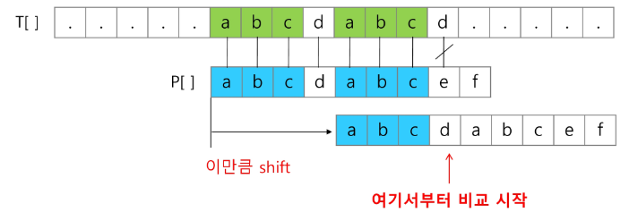
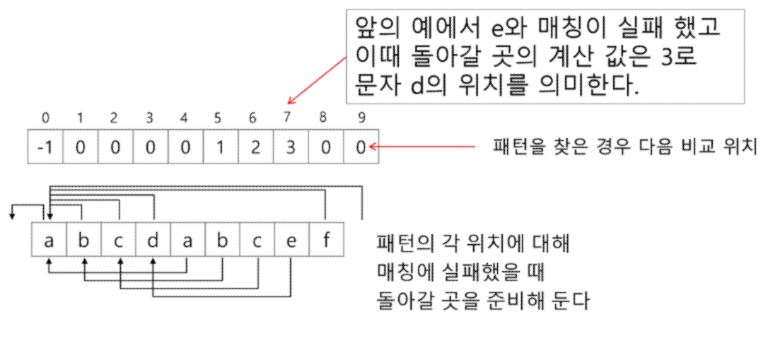
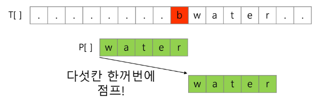
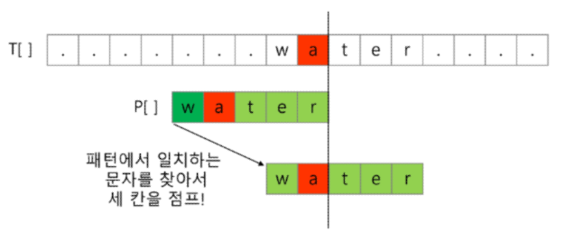
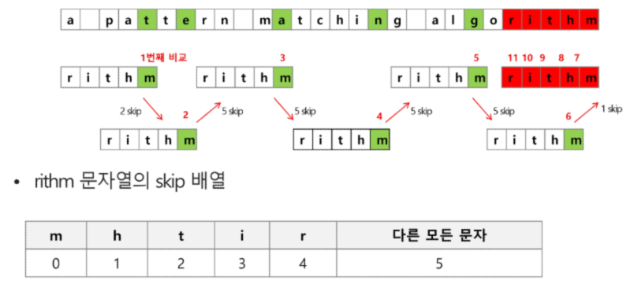

# 패턴 매칭에 사용되는 알고리즘들
## 고지식한 알고리즘(Brute Force)
- 본문 문자열을 처음부터 끝까지 차례대로 순회하면서 패턴 내의 문자들을 일일이 비교하는 방식으로 동작
```python
p = 'is'  # 찾을 패턴
t = "This is a book~!"  # 전체 텍스트
M = len(p)  # 찾을 패턴의 길이
N = len(t)  # 전체 텍스트의 길이

def BruteForce(p, t):
	i = 0  # t의 인덱스
	j = 0  # p의 인덱스
	while j < M and i < N:
		if t[i] != p[j]:
			i = i - j
			j = -1
		i = i + 1
		j = j + 1
	if j == M: return i - M  # 검색 성공
	else: return -1  # 검색 실패
```
- 시간 복잡도
	- 최악의 경우 시간 복잡도는 텍스트의 모든 위치에서 패턴을 비교해야 하므로 O(MN)이 됨
	- 길이가 10000인 문자열에서 길이 80인 패턴을 찾는다고 할 때, 최악의 경우 약 10000 \* 80 = 800,000 번의 비교가 일어난다.
## KMP 알고리즘
- 불일치가 발생한 텍스트 스트링의 앞 부분에 어떤 문자가 있는지를 미리 알고 있으므로, 불일치가 발생한 앞 부분에 대하여 다시 비교하지 않고 매칭을 수행
- 패턴을 전처리하여 배열 next\[M]을 구해서 잘못된 시작을 최소화함
	- next\[M] : 불일치가 발생했을 경우 이동할 다음 위치
- 시간 복잡도 : O(M + N)
### 아이디어 설명
- 텍스트에서 abcdabc까지는 매치되고, e에서 실패한 상황 패턴의 맨 앞의 abc와 실패 직전의 abc는 동일함을 이용할 수 있다.
- 실패한 텍스트 문자와 P\[4]를 비교한다.

- 매칭이 실패했을 때 돌아갈 곳을 계산한다.

```python
def kmp(t, p):
	N = len(t)
	M = len(p)
	lps = [0] * (M+1)
	# preprocessing
	j = 0  # 일치한 갯수 == 비교할 패턴 위치
	lps[0] = -1
	for i in range(1, M):
		lps[i] = j
		if p[i] == p[j]:
			j += 1
		else:
			j = 0
	lps[M] = j
	# search
	i = 0  # 비교할 텍스트 위치
	j = 0  # 비교할 패턴 위치
	while i < N and j <= M:
		if j==-1 or t[i]==p[j]:  # 첫 글자가 불일치했거나, 일치하면
			i += 1
			j += 1
		else:  # 불일치
			j = lps[j]
		if  j == M:  # 패턴을 찾을 경우
			print(i-M, end=' ')  # 패턴의 인덱스 출력
			j = lps[j]
	print()
	return
```
- [긱스포긱스](https://www.geeksforgeeks.org/)
```python
def KMPSearch(pat, txt):
	M = len(pat)
	N = len(txt)
	
	# create lps[] that will hold the longest prefix suffix
	# values for pattern
	lps = [0] * M
	j = 0  # index for pat[]
	
	# Preprocess the pattern (calculate lps[] array)
	computeLPSArray(pat, M, lps)
	
	i = 0  # index for txt[]
	while i < N:
		if pat[j] == txt[i]:
			i += 1
			j += 1
		
		if j == M:
			print("Found pattern at index " + str(i - j))
			j = lps[j - 1]
		
		# mismatch after j matches
		elif i < N and pat[j] != txt[i]:
			# Do not match lps[0 ... lps[j-1]] characters,
			# they will match anyway
			if j != 0:
				j = lps[j - 1]
			else:
				i += 1

def computeLPSArray(pat, M, lps):
	len = 0  # length of the previous longest prefix suffix
	
	lps[0]  # lps[0] is always 0
	i = 1
	
	# the loop calculates lps[i] for i = 1 to M-1
	while i < M:
		if pat[i] == pat[len]:
			len += 1
			lps[i] = len
			i += 1
		else:
			if len != 0:
				len = lps[len - 1]
			else:
				lps[i] = 0
				i += 1
```
## 보이어-무어 알고리즘
- 오른쪽에서 왼쪽으로 비교
- 대부분의 상용 소프트웨어에서 채택하고 있는 알고리즘
- 보이어-무어 알고리즘은 패턴에 오른쪽 끝에 있는 문자가 불일치하고 이 문자가 패턴 내에 존재하지 않는 경우, 이동 거리는 무려 패턴의 길이만큼이 된다.

- 오른쪽 끝에 있는 문자가 불일치하고 이 문자가 패턴 내에 존재할 경우

- 보이어-무어 알고리즘을 이용한 예

```python

```
### 문자열 매칭 알고리즘 비교
- 찾고자 하는 문자열 패턴의 길이 m, 총 문자열 길이 n

| 알고리즘 | 수행시간 | 최선 | 최악 |
| ---- | ---- | ---- | ---- |
| 고지식한 패턴 검색 알고리즘 | O(mn) |  |  |
| 카프-라빈 알고리즘 | O(n) | Ω(n) |  |
| KMP 알고리즘 | O(n) | Ω(n) |  |
| 보이어-무어 알고리즘 | Θ(n) |  | Θ(mn) |
- 앞의 두 매칭 알고리즘들은 최선의 경우에도 Ω(n)
- 보이어-무어 알고리즘은 텍스트 문자를 다 보지 않아도 됨
- 발상의 전환 : 패턴의 오른쪽부터 비교
- 최악의 경우 Θ(mn)
- 일반적으로 Θ(n)보다 시간이 덜 든다