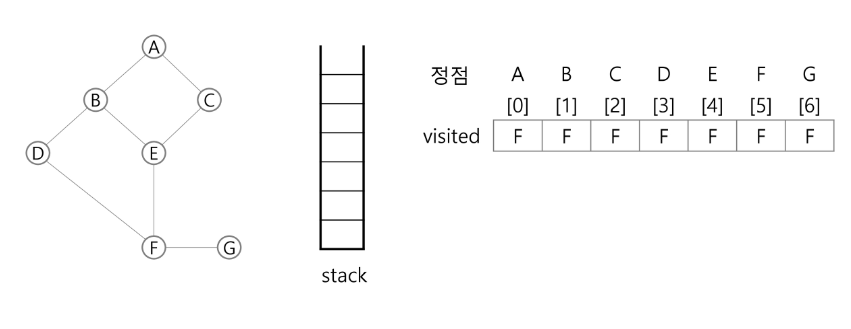
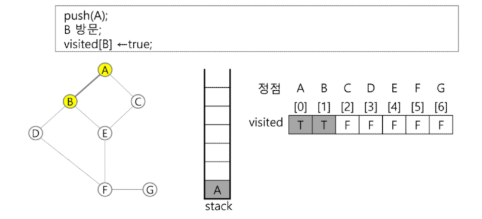

# DP (Dynamic Programming)
- 동적 계획 알고리즘은 그리디 알고리즘과 같이 *최적화 문제*를 해결하는 알고리즘
- 동적 계획 알고리즘은 먼저 입력 크기가 작은 부분 문제들을 모두 해결한 후에 그 해들을 이용하여 보다 큰 크기의 부분 문제들을 해결하여, 최종적으로 원래 주어진 입력의 문제를 해결하는 알고리즘
### 피보나치 수 DP 적용
- 피보나치 수는 부분 문제의 답으로부터 본 문제의 답을 얻을 수 있으므로  최적 부분 구조로 이루어져 있다
1. 문제를 부분 문제로 분할
2. 부분 문제로 나누는 일을 끝냈으면 가장 작은 부분 문제부터 해를 구한다.
3. 그 결과는 테이블에 저장, 테이블에 저장된 부분 문제의 해를 이용하여 상위 문제의 해를 구한다.
#### 피보나치 수 DP 적용 알고리즘
```python
def fibo2(n):
	f = [0] * (n+1)
	f[0] = 0
	f[1] = 1
	for i in range(2, n+1):
		f[i] = f[i-1] + f[i-2]
		
	return f[n]
```
#### DP의 구현 방식
- recursive 방식: fib1()
- iterative 방식: fib2()
- memoization을 재귀적 구조에 사용하는 것보다 반복적 구조로 DP를 구현한 것이 성능 면에서 보다 효율적
- 재귀적 구조는 내부에 시스템 호출 스택을 사용하는 오버헤드가 발생하기 때문
# DFS (깊이우선탐색)
- 비선형 구조인 그래프 구조는 그래프로 표현된 모든 자료를 빠짐없이 검색하는 것이 중요
- 두 가지 방법
	- 깊이 우선 탐색(Depth First Search)
	- 너비 우선 탐색(Breadth First Search)
- 시작 정점의 한 방향으로 갈 수 있는 경로가 있는 곳까지 깊이 탐색해 가다가 더 이상 갈 곳이 없게 되면, 가장 마지막에 만났던 갈림길 간선이 있는 정점으로 되돌아와서 다른 방향의 정점으로 탐색을 계속 반복하여 결국 모든 정점을 방문하는 순회방법
- 가장 마지막에 만났던 갈림길의 정점으로 되돌아가서 다시 깊이 우선 탐색을 반복해야 하므로 후입선출 구조의 스택 사용
## DFS 알고리즘
1. 시작 정점 v를 결정하여 방문
2. 정점 v에 인접한 정점 중에서
	1. 방문하지 않은 정점 w가 있으면, 정점 v를 스택에 push하고 정점 w를 방문한다. 그리고 w를 v로 하여 다시 2 반복
	2. 방문하지 않은 정점이 없으면, 탐색의 방향을 바꾸기 위해서 스택을 pop하여 받은 가장 마지막 방문 정점을 v로 하여 다시 2 반복
3. 스택이 공백이 될 때까지 2 반복

### DFS 예
- 초기상태: 배열 visited를 False로 초기화하고, 공백 스택을 생성

1. 정점 A를 시작으로 깊이 우선 탐색을 시작

2. 정점 A에 방문하지 않은 정점 B, C가 있으므로 A를 스택에 push하고 인접정점 B와 C 중에서 오름차순에 따라 B를 선택하여 탐색을 계속한다.

3. 정점 B에 방문하지 않은 정점 D, E가 있으므로 B를 스택에 push하고, 인접정점 D와 E 중에서 오름차순에 따라 D를 선택하여 탐색을 계속한다.

4. 정점 D에 방문하지 않은 정점 F가 있으므로 D를 스택에 push하고, 인접정점 F를 선택하여 탐색을 계속한다.

5. 정점 F에 방문하지 않은 정점 E, G가 있으므로 F를 스택에 push하고, 인접정점 E와 G 중에서 오름차순에 따라 E를 선택하여 탐색을 계속한다.

6. 정점 E에 방문하지 않은 정점 C가 있으므로 E를 스택에 push하고, 인접정점 C를 선택하여 탐색을 계속한다.

7. 정점 C에서 방문하지 않은 인접정점이 없으므로, 마지막 정점으로 돌아가기 위해 스택을 pop하여 받은 정점 E에 대해서 방문하지 않은 인접정점이 있는지 확인한다.

8. 정점 E는 방문하지 않은 인접정점이 없으므로, 다시 스택을 pop하여 받은 정점 F에 대해서 방문하지 않은 인접정점이 있는지 확인한다.

9. 정점 F에 방문하지 않은 정점 G가 있으므로 F를 스택에 push하고, 인접정점 G를 선택하여 탐색을 계속한다.

10. 정점 G에서 방문하지 않은 인접정점이 없으므로, 마지막 정점으로 돌아가기 위해 스택을 pop하여 받은 정점 F에 대해서 방문하지 않은 인접정점이 있는지 확인한다.

11. 정점 F에서 방문하지 않은 인접정점이 없으므로, 다시 마지막 정점으로 돌아가기 위해 스택을 pop하여 받은 정점 D에 대해서 방문하지 않은 인접정점이 있는지 확인한다.

12. 정점 D에서 방문하지 않은 인접정점이 없으므로, 다시 마지막 정점으로 돌아가기 위해 스택을 pop하여 받은 정점 B에 대해서 방문하지 않은 인접정점이 있는지 확인한다.

13. 정점 B에서 방문하지 않은 인접정점이 없으므로, 다시 마지막 정점으로 돌아가기 위해 스택을 pop하여 받은 정점 A에 대해서 방문하지 않은 인접정점이 있는지 확인한다.

14. 현재 정점 A에서 방문하지 않은 인접 정점이 없으므로 마지막 정점으로 돌아가기 위해 스택을 pop하는데, 스택이 공백이므로 깊이 우선 탐색을 종료한다.

### 인접리스트
```python
# 7 8
# 1 2 1 3 2 4 2 5 4 6 5 6 6 7 3 7
# 주로 인풋은 간선(E), 정점(V) 정보를 같이 줌
# 인접 배열을 저장할 때는 간선의 정보를 이용해서 저장하면 됨
# 인접 배열을 초기화할 때는 정점 정보를 이용하면 됨
V, E = 7, 8     # map(int, input().split())
edge_list = [1, 2, 1, 3, 2, 4, 2, 5, 4, 6, 5, 6, 6, 7, 3, 7]    # list(map(int, input().split()))
# 정점 번호를 그대로 index로 사용하기 위해 +1을 함
adj_list = [[] for _ in range(V+1)]
for idx in range(E):
    start = edge_list[idx*2]
    end = edge_list[idx*2 + 1]
    adj_list[start].append(end)
    # 만약 양방향으로 저장해야 하는 경우
    # adj_list[end].append(start)
for i in range(V+1):
    print(adj_list[i])
```
### 인접배열
```python
# 7 8
# 1 2 1 3 2 4 2 5 4 6 5 6 6 7 3 7
# 주로 인풋은 간선(E), 정점(V) 정보를 같이 줌
# 인접 배열을 저장할 때는 간선의 정보를 이용해서 저장하면 됨
# 인접 배열을 초기화할 때는 정점 정보를 이용하면 됨
V, E = 7, 8     # map(int, input().split())
edge_list = [1, 2, 1, 3, 2, 4, 2, 5, 4, 6, 5, 6, 6, 7, 3, 7]    # list(map(int, input().split()))
# 정점의 개수만큼 2차원 리스트로 만들면 됨
# 0은 연결되어 있지 않음을 의미
# 정점의 번호를 그대로 저장하기 위해 +1 을 함
adj_arr = [[0] * (V+1) for _ in range(V+1)]
for idx in range(E):
    # 시작점(idx*2), 도착점(idx*2 + 1)
    start = edge_list[idx*2]
    end = edge_list[idx*2 + 1]
    # 인접 배열 저장
    adj_arr[start][end] = 1
    # 만약 양방향으로 저장해야 한다면
    # adj_arr[end][start] = 1
for i in range(V+1):
    print(*adj_arr[i])
```