# 계산기1
- 문자열로 된 계산식이 주어질 때, 스택을 이용하여 이 계산식의 값을 계산할 수 있다.
- 문자열 수식 계산의 일반적 방법
	1. 중위 표기법의 수식을 후위 표기법으로 변경한다. (스택 이용)
	2. 후위 표기법의 수식을 스택을 이용하여 계산한다.
	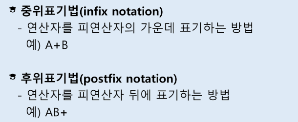
### step 1. 중위표기식의 후위표기식 변환 방법1
- 수식의 각 연산자에 대해서 우선순위에 따라 괄호를 사용하여 다시 표현한다.
- 각 연산자를 그에 대응하는 오른쪽괄호의 뒤로 이동시킨다.
- 괄호를 제거한다.
  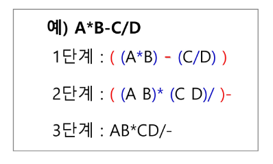
  ### step1. 중위 표기법에서 후위 표기법으로의 변환 알고리즘(스택 이용)2
  1. 입력 받은 중위 표기식에서 토큰을 읽는다.
  2. 토큰이 피연산자이면 토큰을 출력한다
  3. 토큰이 연산자(괄호포함)일 때, 이 토큰이 스택의 top에 저장되어 있는 연산자보다 우선순위가 높으면 스택에 push하고, 그렇지 않다면 스택 top의 연산자의 우선순위가 토큰의 우선순위보다 작을 때까지 스택에서 pop한 후 토큰의 연산자를 push한다. 만약 top에 연산자가 없으면 push한다.
  4. 토큰이 오른쪽 괄호 ')'이면 스택 top에 왼쪽 괄호 '('가 올 때까지 스택에 pop 연산을 수행하고 pop한 연산자를 출력한다. 왼쪽 괄호를 만나면 pop만 하고 출력하지는 않는다.
  5. 중위 표기식에 더 읽을 것이 없다면 중지하고, 더 읽을 것이 있다면 1부터 다시 반복한다.
  6. 스택에 남아 있는 연산자를 모두 pop하여 출력한다.
	  - 스택 밖의 왼쪽 괄호는 우선 순위가 가장 높으며, 스택 안의 왼쪽 괄호는 우선 순위가 가장 낮다.
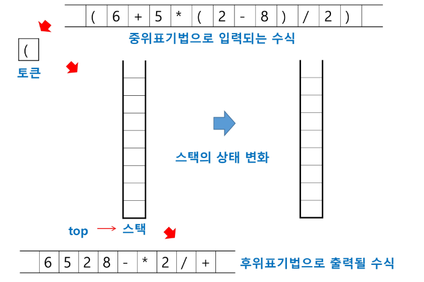
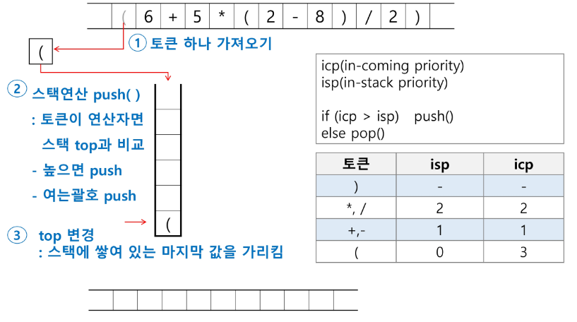
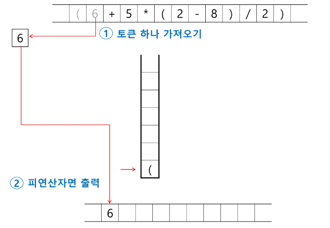
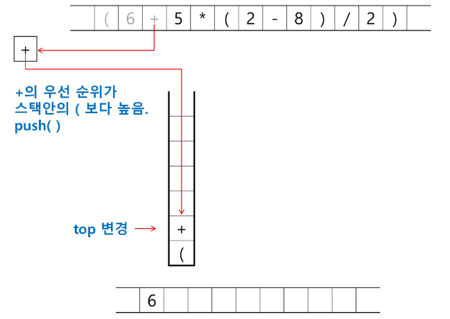
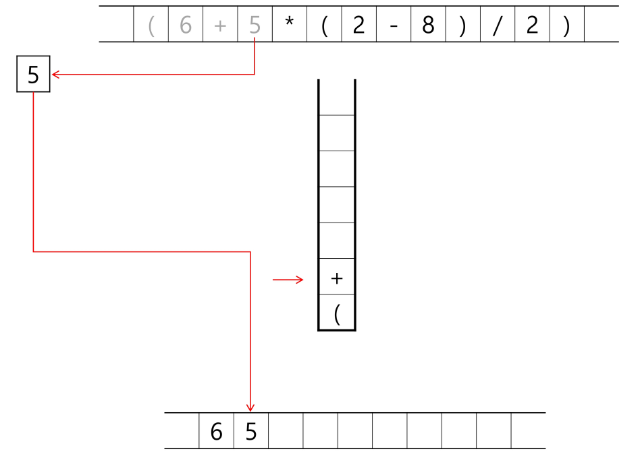
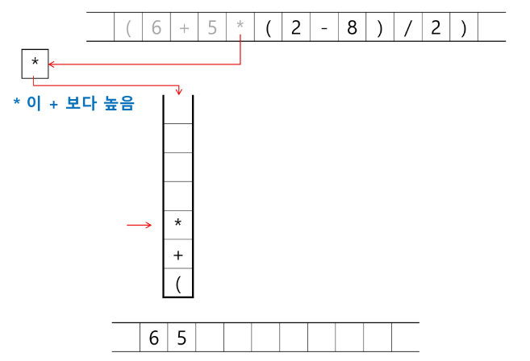
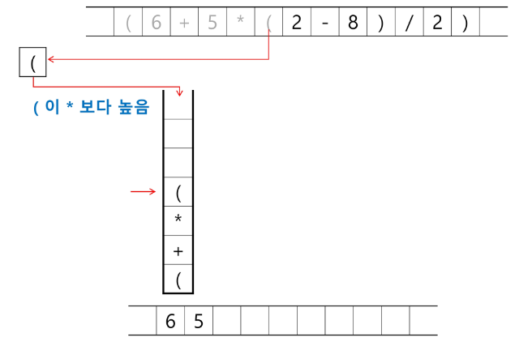
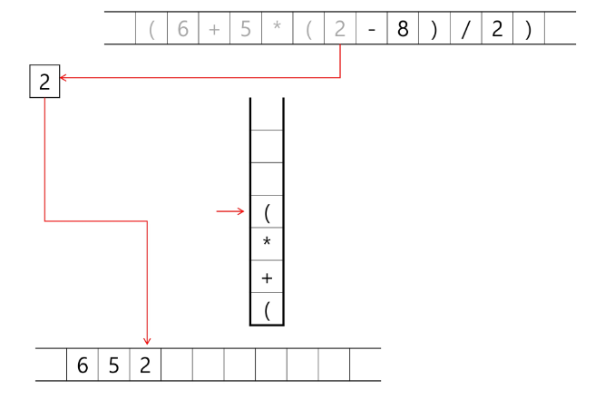
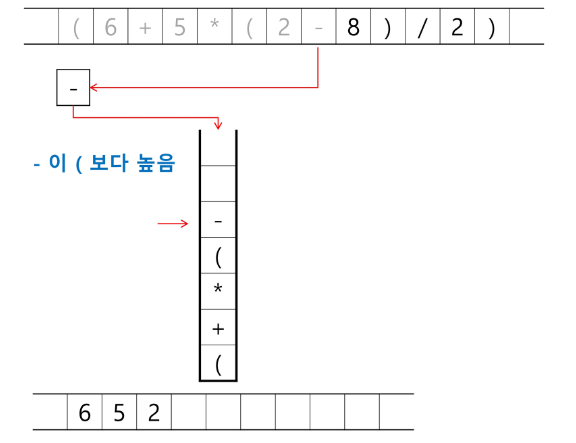
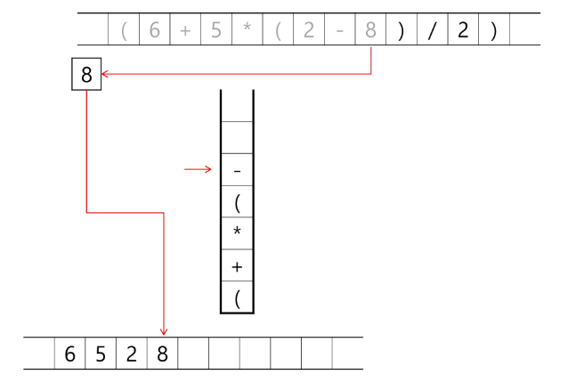
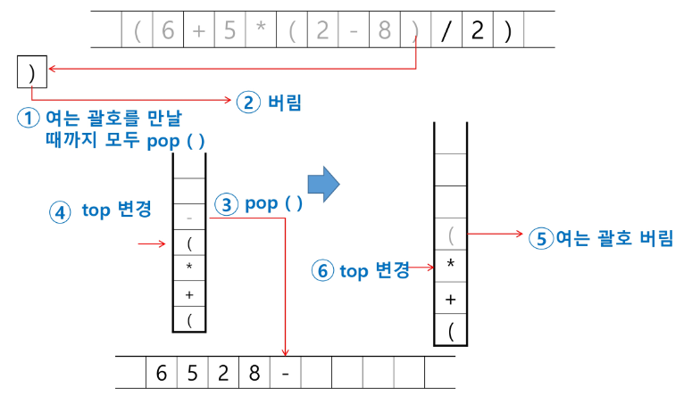
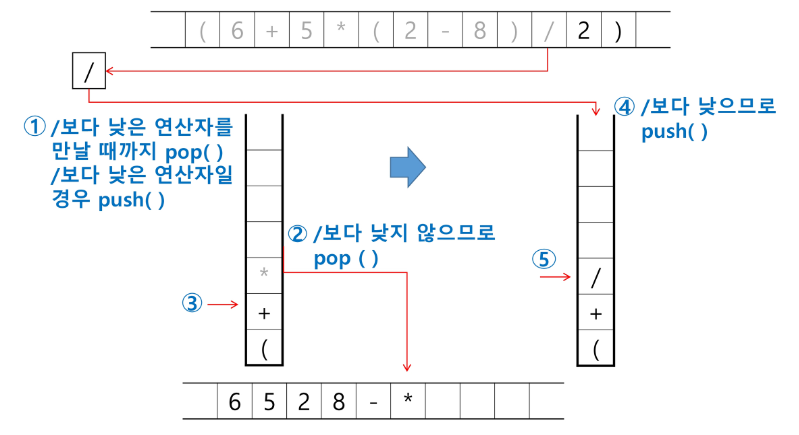
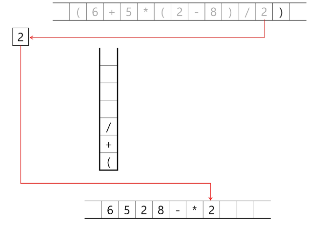
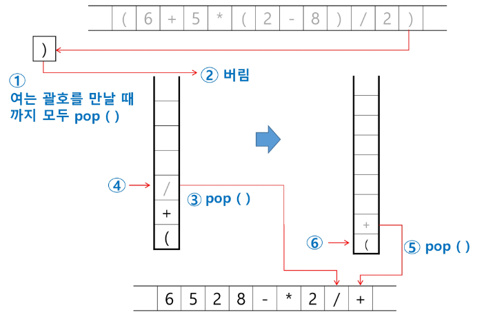
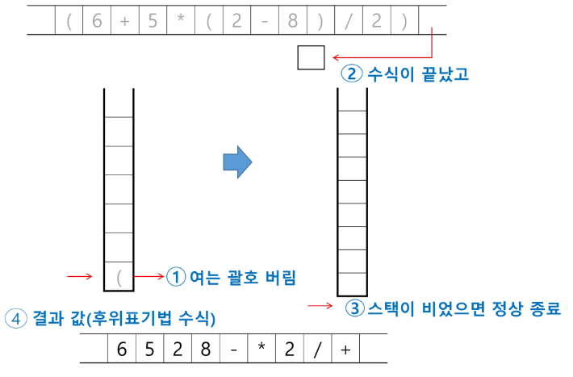
# 계산기2
### step2. 후위 표기법의 수식을 스택을 이용하여 계산
1. 피연산자를 만나면 스택에 push한다.
2. 연산자를 만나면 필요한 만큼의 피연산자를 스택에서 pop하여 연산하고, 연산결과를 다시 스택에 push한다.
3. 수식이 끝나면, 마지막으로 스택을 pop하여 출력한다.
   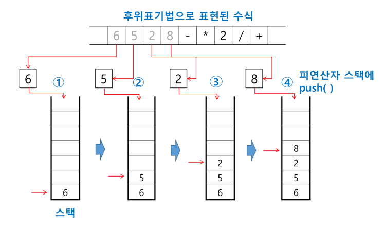
   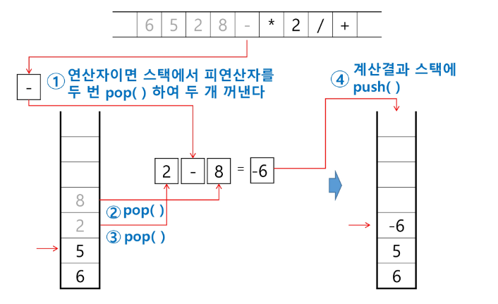
   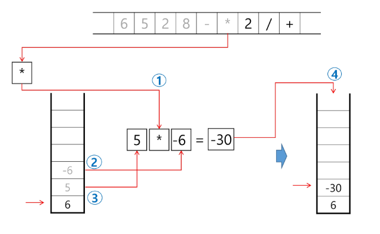
   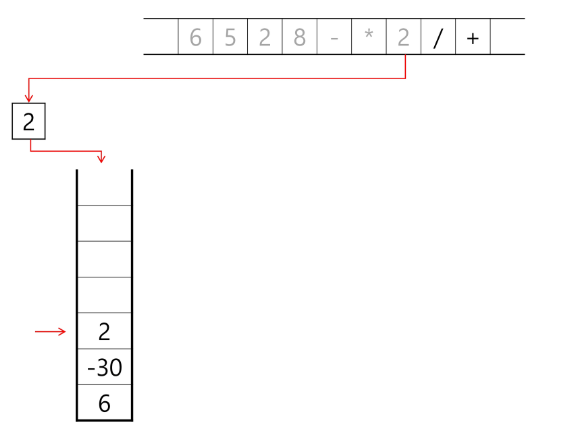
   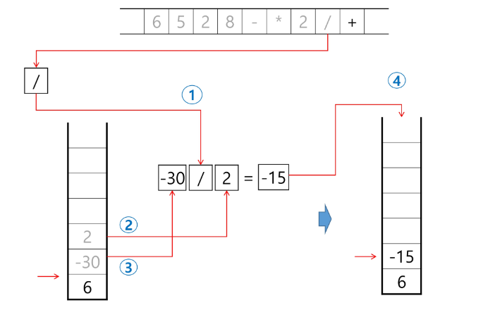
   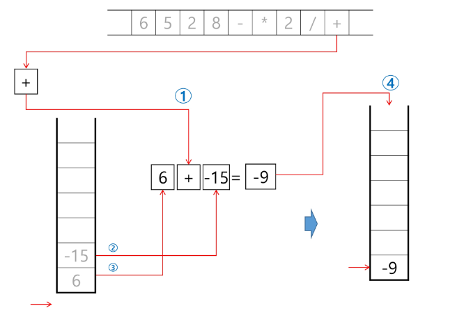
   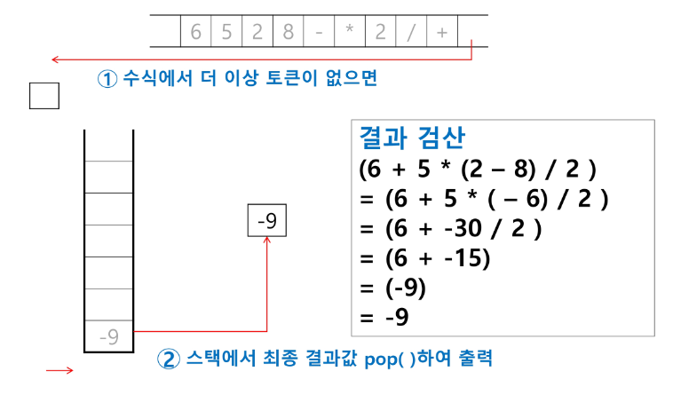
   # 백트래킹
   : 해를 찾는 도중에 '막히면' (즉, 해가 아니면) 되돌아가서 다시 해를 찾아 가는 기법
   - 최적화(optimization) 문제와 결정(decision) 문제를 해결할 수 있다.
   - 결정 문제: 문제의 조건을 만족하는 해가 존재하는지의 여부를 'yes' 또는 'no'가 답하는 문제
	   - 미로 찾기
	   - n-Queen 문제
	   - Map coloring
	   - 부분 집합의 합(Subset Sum) 문제
### 미로 찾기
- 아래 그림과 같이 입구와 출구가 주어진 미로에서 입구부터 출구까지의 경로를 찾는 문제
- 이동할 수 있는 방향은 4방향으로 제한
	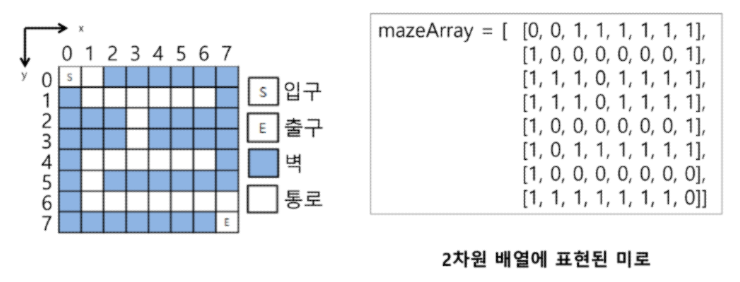
#### 미로 찾기 알고리즘
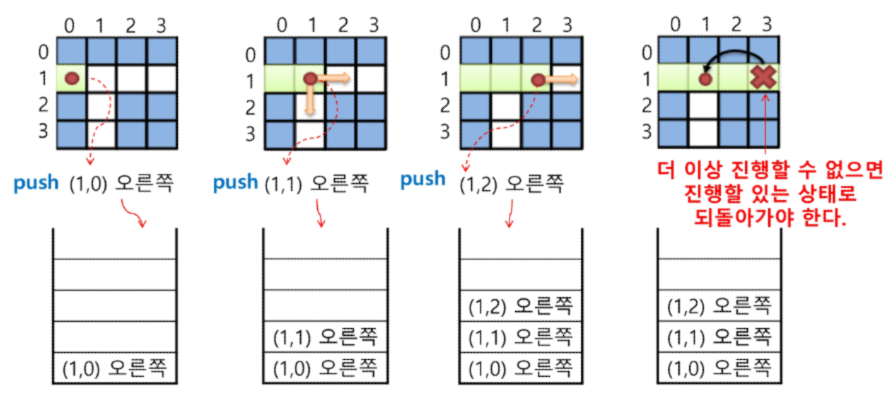
- 스택을 이용하여 지나온 경로를 역으로 되돌아 간다.
  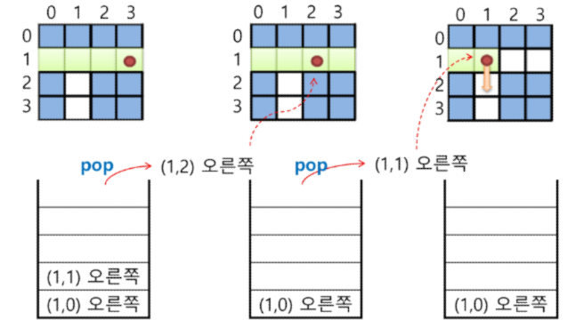
  - 스택을 이용하여 다시 경로를 찾는다.
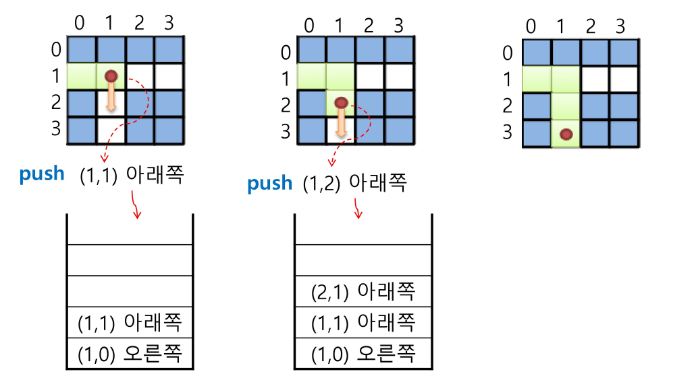
### 백트래킹과 깊이우선탐색과의 차이
- 어떤 노드에서 출발하는 경로가 해결책으로 이어질 것 같지 않으면 더 이상 그 경로를 따라가지 않음으로써 시도의 횟수를 줄임. (Prunning 가지치기)
- 깊이우선탐색이 모든 경로를 추적하는데 비해 백트래킹은 불필요한 경로를 조기에 차단.
- 깊이우선탐색을 가하기에는 경우의 수가 너무나 많음. 즉, N! 가지의 경우의 수를 가진 문제에 대해 깊이우선탐색을 가하면 당연히 처리 불가능한 문제.
- 백트래킹 알고리즘을 적용하면 일반적으로 경우의 수가 줄어들지만 이 역시 최악의 경우에는 여전히 지수함수 시간(Exponential Time)을 요하므로 처리 불가능
  - 모든 후보를 검사?
	  - No
### 백트래킹 기법
  - 어떤 노드의 유망성을 점검한 후에 유망(promising)하지 않다고 결정되면 그 노드의 부모로 되돌아가(backtracking) 다음 자식 노드로 감
  - 어떤 노드를 방문하였을 때 그 노드를 포함한 경로가 해답이 될 수 없으면 그 노드는 유망하지 않다고 하며, 반대로 해답의 가능성이 있으면 유망하다고 한다.
  - 가지치기(pruning): 유망하지 않는 노드가 포함되는 경로는 더 이상 고려하지 않는다.
### 백트래킹을 이용한 알고리즘은 다음과 같은 절차로 진행된다.
  1. 상태 공간 트리의 깊이 우선 검색을 실시한다.
  2. 각 노드가 유망한지를 점검한다.
  3. 만일 그 노드가 유망하지 않으면, 그 노드의 부모 노드로 돌아가서 검색을 계속한다.
## 일반 백트래킹 알고리즘
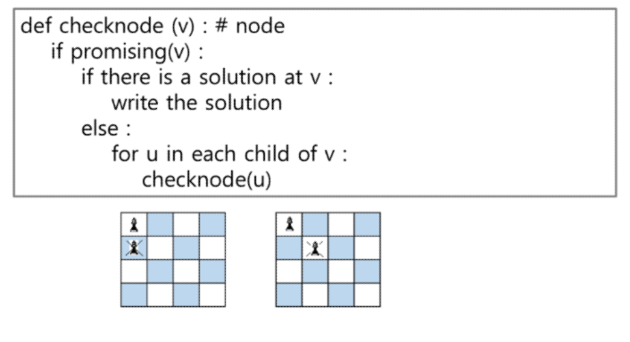
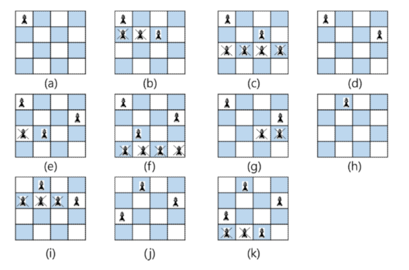
- 상태 공간  트리
  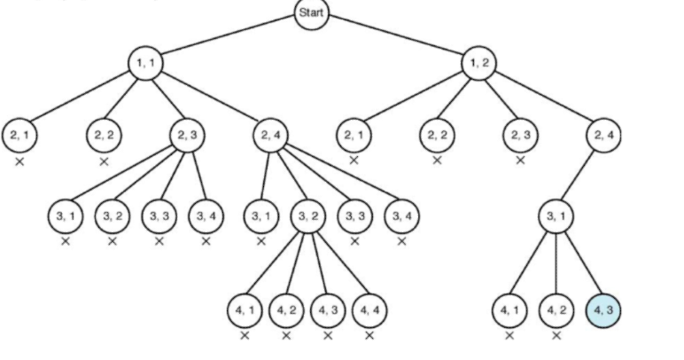
#### 깊이 우선 검색 vs 백트래킹
  - 순수한 깊이 우선 검색 - 155노드
  - 백트래킹 = 27노드
# 부분집합
- 어떤 집합의 공집합과 자기자신을 포함한 모든 부분집합을 powerset이라고 하며 구하고자 하는 어떤 집합의 원소 개수가 n일 경우 부분집합의 개수는 2ⁿ개 이다.
- 백트래킹 기법으로 powerset을 만들어 보자.
	- 앞에서 설명한 일반적인 백트래킹 접근 방법을 이용
	- n개의 원소가 들어있는 집합의 2ⁿ개의 부분집합을 만들 때는, true 또는 false값을 가지는 항목들로 구성된 n개의 배열을 만드는 방법을 이용
	- 여기서 배열의 i번째 항목은 i번째의 원소가 부분집합의 값인지 아닌지를 나타내는 값이다
### 각 원소가 부분집합에 포함되었는지를 loop 이용하여 확인하고 부분집합을 생성하는 방법
```python
bit = [0, 0, 0, 0]
for i in range(2):
	bit[0] = i
	for j in range(2):
		bit[1] = j
		for k in range(2):
			bit[2] = k
			for l in range(2):
				bit[3] = l
				print(bit)
```
- {1, 2, 3}의 부분집합 표현
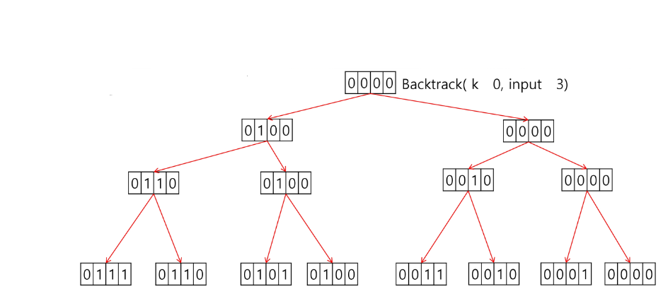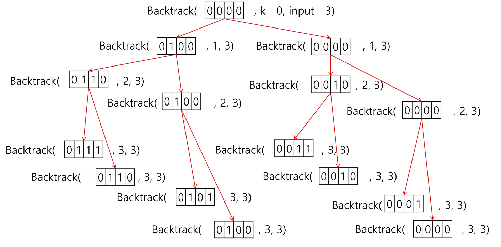
### powerset을 구하는 백트래킹 알고리즘
```python
def backtrack(a, k, input):
	global MAXCANDIDATES
	c = [0] * MAXCANDIDATES

	if k == input:
		process_solution(a, k) # 답이면 원하는 작업을 한다.
	else:
		k += 1
		ncandidates = construct_candidates(a, k, input, c)
		for i in range(ncandidates):
			a[k] = c[i]
			backtrack(a, k, input)

def construct_candidates(a, k, input, c):
	c[0] = True
	c[1] = False
	return 2

MAXCANDIDATES = 2
NMAX = 4
a = [0] * NMAX
backtrack(a, 0, 3)
```
```python
  
def powerset(idx, arr):  
    global ans  
    if idx == len(arr):  
        # print(sel, ":", end = ' ')  
        total = 0  
        for i in range(len(arr)):  
            if sel[i]:  
                total += arr[i]  
        #         print(arr[i], end=' ')  
        # print()        if total == 10:  
            ans += 1  
  
    else:  
        sel[idx] = 1  
        powerset(idx+1, arr)  
  
        sel[idx] = 0  
        powerset(idx+1, arr)  
  
    return ans  
  
T = 1  # Test Case가 주어지는 경우  
  
for test_case in range(1, T+1):  # 총 T개의 test case가 존재  
    nums = list(map(int, input().split()))  
    ans = 0  
    sel = [0] * len(nums)  
    a = powerset(0, nums)  
    print(f'#{test_case} {a}')
```
# 순열
## 단순하게 순열을 생성하는 방법
### 예) {1, 2, 3}을 포함하는 모든 순열을 생성하는 함수
- 동일한 숫자가 포함되지 않았을 때, 각 자리 수 별로 loop을 이용해 아래와 같이 구현할 수 있다.
```python
for i1 in range(1, 4):
	for i2 in range(1, 4):
		if i2 != i1:
			for i3 in range(1, 4):
				if i3 != i1 and i3 != i2:
					print(i1, i2, i3)
```
## 백트래킹을 이용하여 순열 구하기
- 접근 방법은 앞의 부분집합 구하는 방법과 유사하다.
```python
def backtrack(a, k, input):
	global MAXCANDIDATES
	c = [0] * MAXCANDIDATES

	if k == input:
		for i in range(1, k+1):
			print(a[i], end=" ")
		print()
	else:
		k += 1
		ncandidates = construct_candidates(a, k, input, c)
		for i in range(ncandidates):
			a[k] = c[i]
			backtrack(a, k, input)

def construct_candidates(a, k, input, c):
	in_perm = [False] * NMAX
	
	for i in range(1, k):
		in_perm[a[i]] = True
	
	ncandidates = 0
	for i in range(1, input+1):
		if in_perm[i] == False:
			c[ncandidates] = i
			ncandidates += 1
	return ncandidates
```
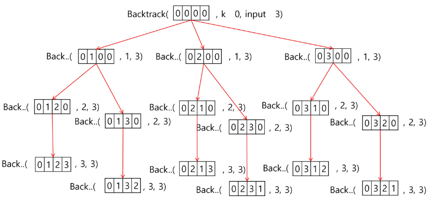