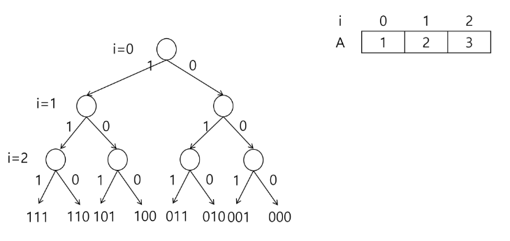
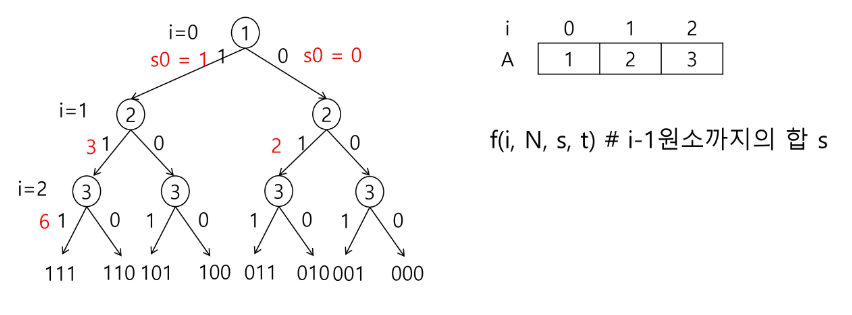
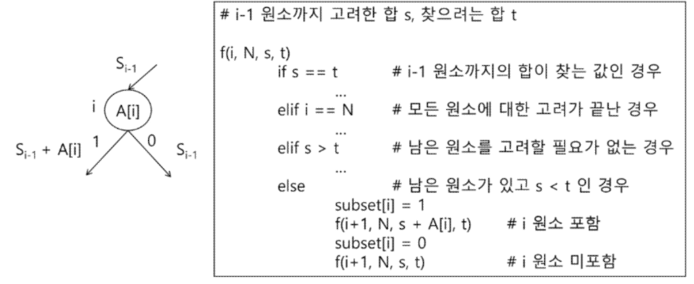
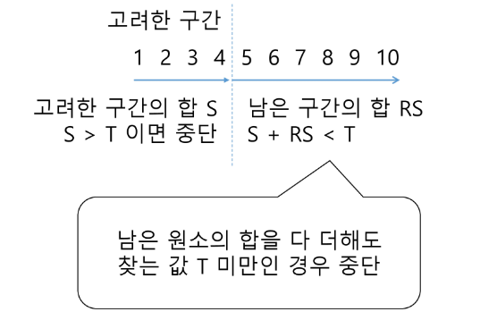
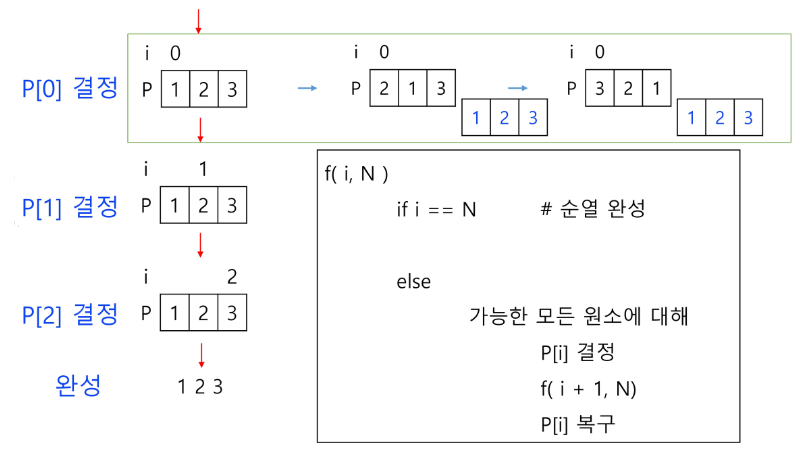
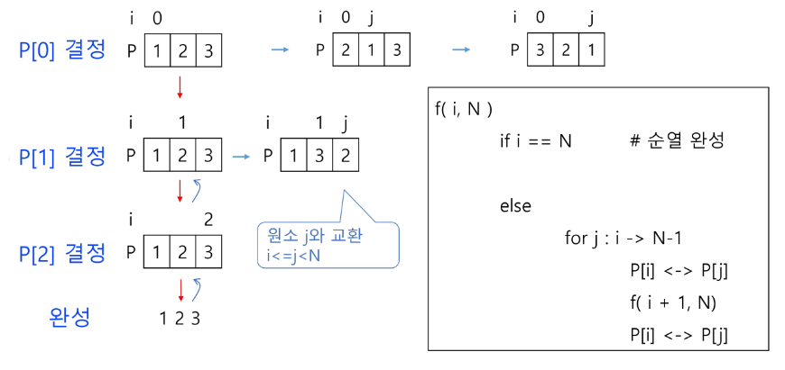
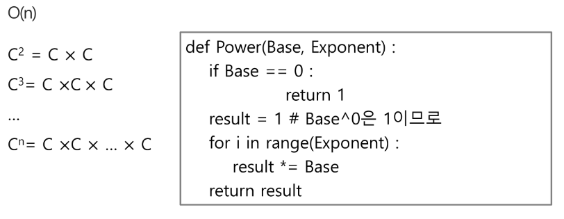
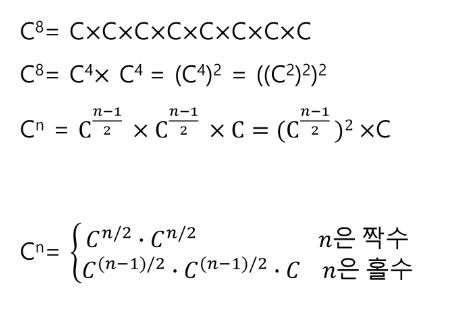
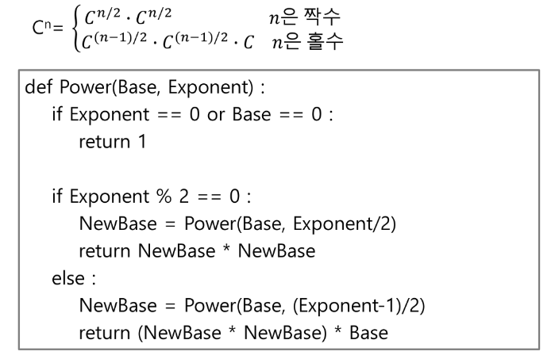

# 부분집합의 합
### 부분집합 예제: 합이 10인 부분집합이 몇 개?
```python
def f(i, k, t):  # k개의 원소를 가진 배열 A, 부분집합 합이 t인 경우
	if i==k:  # 모든 원소에 대해 결정하면
		ss = 0  # 부분집합 원소의 합
		for j in range(k):
			if bit[i]:  # A[j]가 포함된 경우
				ss += A[j]
		if ss == t:
			for j in range(k):
				if bit[i]:
					print(A[j], end=' ')
			print()  # 부분집합 출력
	else:
		for j in range(1, -1, -1):
			bit[i] = j
			f(i+1, k)
		#  bit[i] = 1
		#  f(i+1, k)
		#  bit[i] = 0
		#  f(i+1, k)

N = 10
A = [1, 2, 3, 4, 5, 6, 7, 8, 9, 10]
bit = [0]*N  # bit[i]는 A[i]가 부분집합에 포함되는지 표시
f(0, N, 10)
```
### 집합{1, 2, 3}의 원소에 대해 각 부분집합에서의 포함 여부를 트리로 표현

- i 원소의 포함 여부를 결정하면 i까지의 부분 집합의 합 si 를 결정할 수 있음
- si-1이 찾고자 하는 부분집합의 합보다 크면 남은 원소를 고려할 필요가 없음

- A\[i] 원소를 부분 집합의 원소로 고려하는 재귀 함수 (A는 서로 다른 자연수의 집합)

- 추가 고려 사항

# 순열


```python
def f(i, k):
	if i==k:
		print(*P)
	else:
		for j in range(i, k):  # P[i] 자리에 올 원소 P[j]
			P[i], P[j] = P[j], P[i]  # P[i] <-> P[j]
			f(i+1, k)
			P[i], P[j] = P[j], P[i]  # 교환 전으로 복구

N = 3
P = [1, 2, 3]
f(0, N)
```
```python
def f(i, k, s):  # i-1까지 선택한 원소의 합
	global cnt
	global min_v
	cnt += 1
	if i == k:
		# print(*P)
		s = 0  # 선택한 원소의 합
		for j in range(k):  # j행에 대해
			s += arr[j][P[j]]  # j행에서 P[j]열을 고른 경우의 합 구하기
		if min_v > s:
			min_v = s
	elif s >= min_v:
		return
	else:
		for j in range(i, k):  # P[i] 자리에 올 원소 P[j]
			P[i], P[j] = P[j], P[i]  # P[i]<->P[j]
			f(i+1, k, s+arr[i][P[i]])
			P[i], P[j] = P[j], P[i]  # 복구

N = int(input())
arr = [list(map(int, input().split())) for _ in range(N)]
P = [i for i in range(N)]
min_v = 100
cnt = 0
f(0, N, 0)
print(min_v, cnt)
```
# 분할정복 알고리즘
- 유래
	- 1805년 12월 2일 아우스터리츠 전투에서 나폴레옹이 사용한 전략
	- 전력이 우세한 연합군을 공격하기 위해 나폴레옹은 연합군의 중앙부로 쳐들어가 연합군을 둘로 나눔
	- 둘로 나뉜 연합군을 한 부분씩 격파함
- 설계 전략
	- 분할(Divide): 해결할 문제를 여러 개의 작은 부분으로 나눈다.
	- 정복(Conquer): 나눈 작은 문제를 각각 해결한다.
	- 통합(Combine): (필요하다면) 해결된 해답을 모은다.
### 분할정복 예제
- 거듭 제곱(Exponentiation)

- 분할 정복 기반의 알고리즘: O(log₂n)


## 퀵 정렬
- 주어진 배열을 두 개로 분할하고, 각각을 정렬한다.
	- 합병정렬과 동일?
- 다른점1: 합병정렬은 그냥 두 부분으로 나누는 반면에, 퀵정렬은 분할할 때 기준 아이템(pivot item) 중심으로 이보다 작은 것은 왼편, 큰 것은 오른편에 위치시킨다.
- 다른점2: 각 부분 정렬이 끝난 후, 합병정렬은 "합병"이란 후처리 작업이 필요하나 퀵정렬은 필요로 하지 않는다.
### 알고리즘
```python
def quickSort(a, begin, end):
	if begin < end:
		p = partition(a, begin, end)
		quickSort(a, begin, p-1)
		quickSort(a, p+1, en

def partition(a, begin, end):
	pivot = (begin + end) // 2
	L = begin
	R = end
	while L < R:
		while(L<R and a[L]<a[pivot]): L += 1
		while(L<R and a[R]>=a[pivot]): R -= 1
		if L < R:
			if L == pivot: 
				pivot = R
				a[L], a[R] = a[R], a[L]
	a[pivot], a[R] = a[R], a[pivot]
	return R
```
- 퀵 정렬의 최악의 시간 복잡도는 O(n²)로, 합병정렬에 비해 좋지 못하다.
- 그런데, 왜 "빠른" 정렬이라고 했을까?
- 평균복잡도가 nlogn 이기 때문

| 알고리즘 | 평균 수행시간 | 최악 수행시간 | 알고리즘 기법 | 비고 |
| ---- | ---- | ---- | ---- | ---- |
| 퀵 정렬 | O(n log n) | O(n²) | 분할 정복 | 평균적으로는 가장 빠름 |