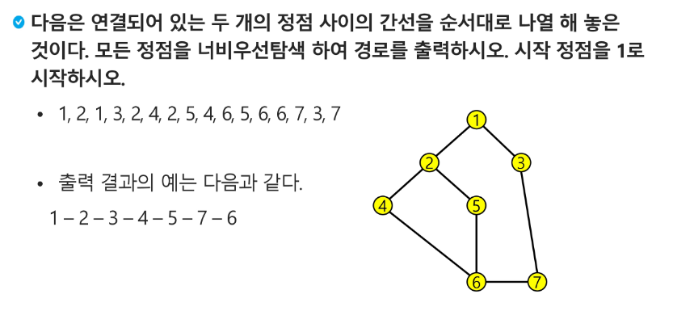

# BFS(Breadth First Search)
- 너비우선탐색은 탐색 시작점의 인접한 정점들을 먼저 모두 차례로 방문한 후에, 방문했던 정점을 시작점으로 하여 다시 인접한 정점들을 차례로 방문하는 방식
- 인접한 정점들에 대해 탐색을 한 후, 차례로 다시 너비우선탐색을 진행해야 하므로, 선입선출 형태의 자료구조인 큐를 활용함

- 입력 파라미터: 그래프 G와 탐색 시작점 v
```python
def BFS(G, v):  # 그래프 G, 탐색 시작점 v
	visited = [0]*(n+1)  # n: 정점의 개수
	queue = []           # 큐 생성
	queue.append(v)      # 시작점 v를 큐에 삽입
	while queue:                  # 큐가 비어있지 않은 경우
		t = queue.pop(0)          # 큐의 첫번째 원소 반환
		if not visited[t]:   # 방문되지 않은 곳이라면
			visited[t] = True    # 방문한 것으로 표시
			visit(t)   # 정점 t에서 할 일
			for i in G[t]:   # t와 연결된 모든 정점에 대해
				if not visited[i]:   # 방문되지 않은 곳이라면
					queue.append(i)   # 큐에 넣기
```
### BFS 예제
- 초기 상태
	- visited 배열 초기화
	- Q 생성
	- 시작점 enqueue
- A부터 시작
	- dequeue: A
	- A 방문한 것으로 표시
	- A의 인접점 enqueue
- 탐색 진행
	- dequeue: B
	- B 방문한 것으로 표시
	- B의 인접점(and 방문하지 않은 인접점) enqueue 
- Q 빌 때까지 반복
## BFS 예제

- 중간중간 이어져 있어도 가장 빠른 순서로 처리가 되므로 중간에 이어진 것이 없는 것과 같은 효과
```python
def BFS(G, v, n):   # 그래프 G, 탐색 시작점 v
	visited = [0]*(n+1)  # n: 정점의 개수
	queue = []           # 큐 생성
	queue.append(v)      # 시작점 v를 큐에 삽입
	visited[v] = 1
	while queue:              # 큐가 비어있지 않은 경우
		t = queue.pop(0)      # 큐의 첫 번째 원소 반환
		visit(t)
		for i in G[t]:            # t와 연결된 모든 정점에 대해
			if not visited[i]:    # 방문되지 않은 곳이라면
				queue.append(i)   # 큐에 넣기
				visited[i] = visited[t] + 1    # n으로 부터 1만큼 이동
```
## 연습문제3

```python
def bfs(s, N):  # 시작정점 s, 노드개수 N
	q= []                  # 큐
	visited = [0]*(N+1)    # visited
	q.append(s)            # 시작점 인큐
	visited[s] = 1         # 시작점 방문표시
	while q:               # 큐가 비워질때까지... (남은 정점이 있으면)
		t = q.pop(0)
		# t에서 할일
		print(t)
		for i in adjl[t]:  # t에 인접인 정점 
			if visited[i] == 0:  # 방문하지 않은 정점이면
				q.append(i)      # 인큐
				visited[i] = 1 + visited[t] # 방문표시
		

V, E = map(int, input().split())
arr = list(map(int, input().split()))
# 인접리스트
adjl = [[] for _ in range(V+1)]
for i in range(E):
	n1, n2 = arr[i*2], arr[i*2+1]
	adjl[n1].append(n2)
	adjl[n2].append(n1)  # 무향 그래프

bfs(1, V)
```
# [swea 5102 노드의 거리](https://swexpertacademy.com/main/talk/solvingClub/problemView.do?solveclubId=AY04wxoK0EoDFAXz&contestProbId=AYn5h36KWu4DFAU6&probBoxId=AY2vZXzKsQwDFATh&type=USER&problemBoxTitle=02-16+Queue+2&problemBoxCnt=6)
```python
from collections import deque  
  
  
def bfs(s, g, N):  
    q = deque()  
    visited = [0]*(N+1)  
    q.append(s)  
    visited[s] = 1  
    while q:  
        t = q.popleft()  
        if t == g:  
            return visited[t]-1  # 최단 경로 간선 수  
        for i in adj1[t]:  
            if visited[i] == 0:  
                q.append(i)  
                visited[i] = 1 + visited[t]  
    return 0  
  
T = int(input())  # Test Case가 주어지는 경우  
  
for test_case in range(1, T+1):  # 총 T개의 test case가 존재  
    V, E = map(int, input().split())  
    adj1 = [[] for _ in range(V + 1)]  
    for _ in range(E):  
        n1, n2 = map(int, input().split())  
        adj1[n1].append(n2)  
        adj1[n2].append(n1)  
    S, G = map(int, input().split())  
  
    ans = bfs(S, G, V)  
    print(f'#{test_case}', ans)
```