# 트리
## 트리의 개념
- 비선형 구조
- 원소들 간에 1:n 관계를 가지는 자료구조
- 원소들 간에 계층관계를 가지는 계층형 자료구조
- 상위 원소에서 하위 원소로 내려가면서 확장되는 트리(나무)모양의 구조
## 정의
- 한 개 이상의 노드로 이루어진 유한 집합이며 다음 조건을 만족한다.
	- 노드 중 최상위 노드를 루트(root)라 한다.
	- 나머지 노드들은 n(>=0)개의 분리 집합 T1, ... , TN으로 분리될 수 있다.
- 이들 T1, ... , TN은 각각 하나의 트리가 되며(재귀적 정의) 루트의 부 트리(subtree)라 한다.
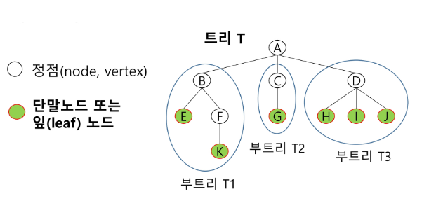
## 용어정리
- 노드(node) - 트리의 원소
	- 트리 T의 노드 - A, B, C, D, E, F, G, H, I, J, K
- 간선(edge) - 노드를 연결하는 선. 부모 노드와 자식 노드를 연결
- 루트 노드(root node) - 트리의 시작 노드
	- 트리 T의 루트노드 - A
- 형제 노드(sibling node) - 같은 부모 노드의 자식 노드들
	- B, C, D는 형제 노드
- 조상 노드 - 간선을 따라 루트 노드까지 이르는 경로에 있는 모든 노드들
	- K의 조상 노드: F, B, A
- 서브 트리(subtree) - 부모 노드와 연결된 간선을 끊었을 때 생성되는 트리
- 자손 노드 - 서브 트리에 있는 하위 레벨의 노드들
	- B의 자손 노드 - E, F, K
  - 차수(degree)
	  - 노드의 차수: 노드에 연결된 자식 노드의 수
		  - B의 차수 = 2, C의 차수 = 1
	  - 트리의 차수: 트리에 있는 노드의 차수 중에서 가장 큰 값
		  - 트리 T의 차수 = 3
	  - 단말 노드(리프 노드): 차수가 0인 노드, 자식 노드가 없는 노드
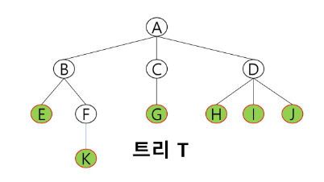
- 높이
	- 노드의 높이: 루트에서 노드에 이르는 간선의 수. 노드의 레벨
		- B의 높이=1, F의 높이=2
	- 트리의 높이: 트리에 있는 노드의 높이 중에서 가장 큰 값. 최대 레벨
		- 트리 T의 높이=3
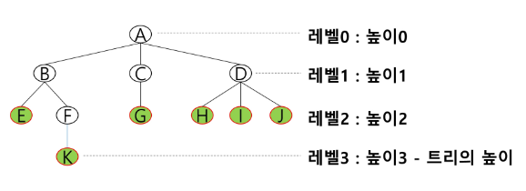
# 이진 트리
- 모든 노드들이 2개의 서브트리를 갖는 특별한 형태의 트리
- 각 노드가 자식 노드를 최대한 2개 까지만 가질 수 있는 트리
	- 왼쪽 자식 노드(left child node)
	- 오른쪽 자식 노드(right child node)
  - 이진 트리의 예
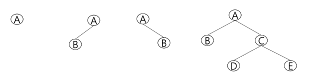
## 특성
- 레벨 n에서의 노드의 최대 개수는 2ⁿ개
	- 높이가 h인 이진 트리가 가질 수 있는 노드의 최소 개수는 (h+1)개가 되며, 최대 개수는 (2^(h+1)-1) 개가 된다.
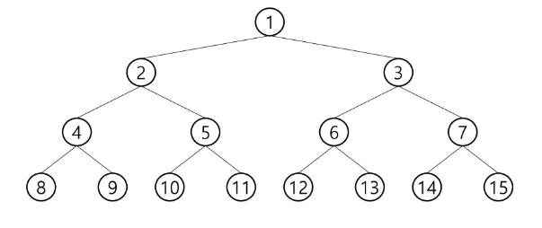
## 종류
### 포화 이진 트리(Full Binary Tree)
- 모든 레벨에 노드가 포화상태로 차 있는 이진 트리
- 높이가 h일 때, 최대의 노드 개수인 2^(h+1)-1 의 노드를 가진 이진 트리
	- 높이 3일 때 2⁴-1 = 15개의 노드
- 루트를 1번으로 하여 2^(h+1)-1 까지 정해진 위치에 대한 노드 번호를 가짐
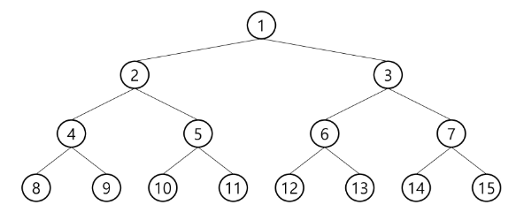
### 완전 이진 트리(Complete Binary Tree)
- 높이가 h이고 노드 수가 n개일 때 (단, $$2^h <= n <= 2^{h+1}-1$$), 포화 이진 트리의 노드 번호 1번부터 n번까지 빈 자리가 없는 이진 트리
- 예) 노드가 10개인 완전 이진 트리
  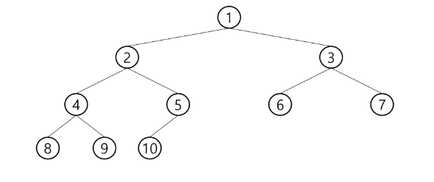
  ### 편향 이진 트리(Skewed Binary Tree)
  - 높이 h에 대한 최소 개수의 노드를 가지면서 한쪽 방향의 자식 노드만을 가진 이진 트리
	  - 왼쪽 편향 이진 트리
	  - 오른쪽 편향 이진 트리
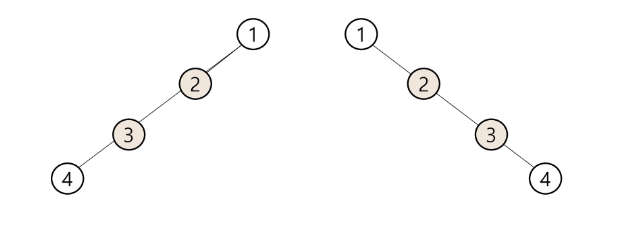
## 순회(traversal)
- 순회란 트리의 각 노드를 중복되지 않게 전부 방문(visit)하는 것을 말하는데 트리는 비선형 구조이기 때문에 선형구조에서와 같이 선후 연결 관계를 알 수 없다.
- 순회: 트리의 노드들을 체계적으로 방문하는 것
- 3가지의 기본적인 순회방법
	- 전위순회(preorder traversal): VLR
		- 부모노드 방문 후, 자식노드를 좌, 우 순서로 방문한다.
	- 중위순회(inorder traversal): LVR
		- 왼쪽 자식노드, 부모노드, 오른쪽 자식노드 순으로 방문한다.
	- 후위순회(postorder traversal): LRV
		- 자식노드를 좌우 순서로 방문한 후, 부모노드로 방문한다.
	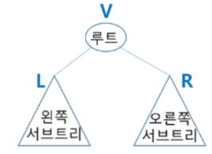
### 전위 순회(preorder traversal)
- 수행 방법
	1. 현재 노드 n을 방문하여 처리한다. -> V
	2. 현재 노드 n의 왼쪽 서브트리로 이동한다. -> L
	3. 현재 노드 n의 오른쪽 서브트리로 이동한다. -> R
- 전위 순회 알고리즘
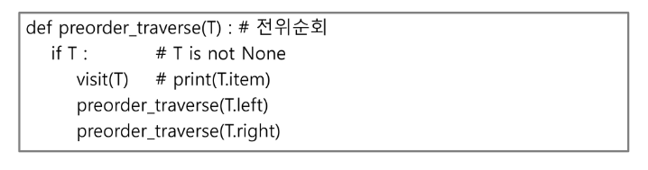
### 중위 순회(inorder traversal)
- 수행 방법
	1. 현재 노드 n의 왼쪽 서브트리로 이동한다: L
	2. 현재 노드 n을 방문하여 처리한다: V
	3. 현재 노드 n의 오른쪽 서브트리로 이동한다: R
- 중위 순회 알고리즘
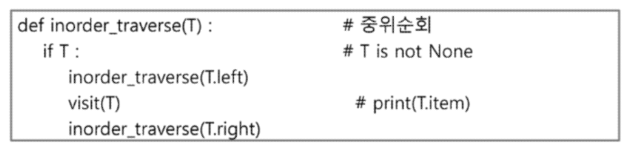
### 후위 순회(postorder traversal)
- 수행 방법
	1. 현재 노드 n의 왼쪽 서브트리로 이동한다: L
	2. 현재 노드 n의 오른쪽 서브트리로 이동한다: R
	3. 현재 노드 n을 방문하여 처리한다: V
- 후위 순회 알고리즘
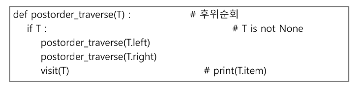
# 이진 트리의 표현1
- 배열을 이용한 이진 트리의 표현
	- 이진 트리에 각 노드 번호를 다음과 같이 부여
	- 루트의 번호를 1로 함
	- 레벨 n에 있는 노드에 대하여 왼쪽부터 오른쪽으로 2ⁿ부터 2^(n+1)-1 까지 번호를 차례로 부여
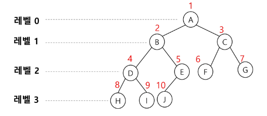
## 배열
- 배열을 이용한 이진 트리의 표현
- 노드 번호의 성질
	- 노드 번호가 i인 노드의 부모 노드 번호
	- 노드 번호가 i인 노드의 왼쪽 자식 노드 번호 2\*i
	- 노드 번호가 i인 노드의 오른쪽 자식 노드 번호 2\*i + 1
	- 레벨 n의 노드 번호 시작 번호 2ⁿ 
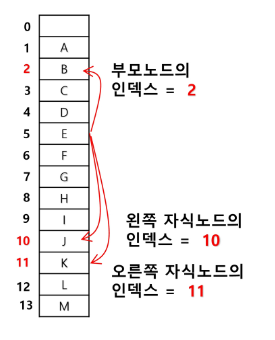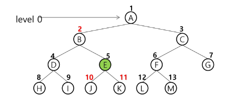
- 배열을 이용한 이진 트리의 표현
	- 노드 번호를 배열의 인덱스로 사용
	- 높이가 h인 이진 트리를 위한 배열의 크기는?
		- 레벨 i의 최대 노드 수는 2^i
		- 따라서 2^(h+1) - 1
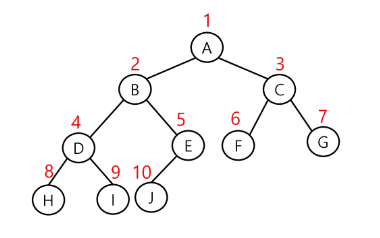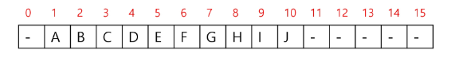
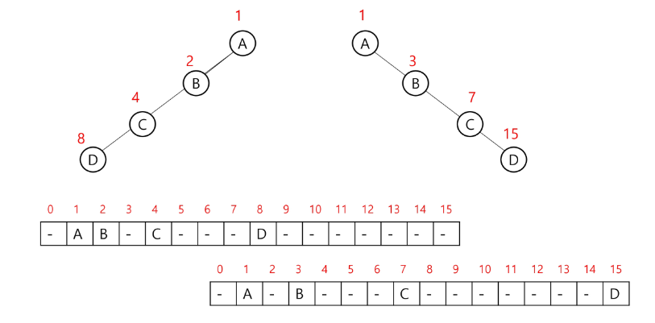
# 이진 트리 표현2
## 이진 트리의 저장
### 부모 번호를 인덱스로 자식 번호를 저장
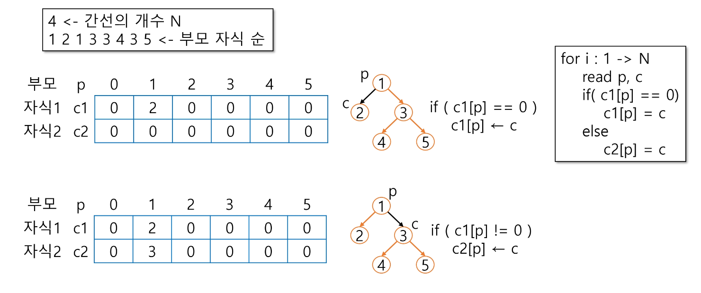
### 자식 번호를 인덱스로 부모 번호를 저장
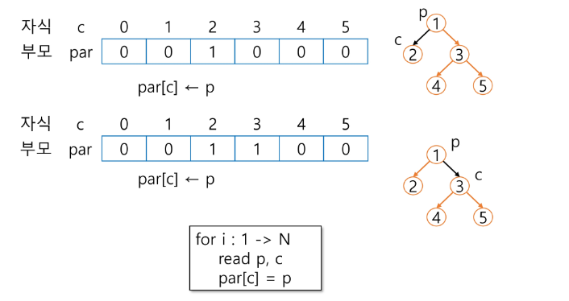
### 루트 찾기, 조상 찾기
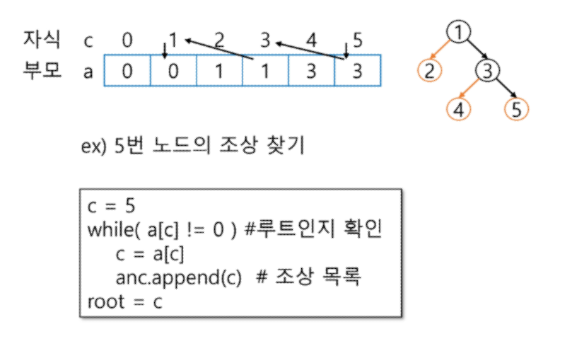
### 배열을 이용한 이진 트리 표현의 단점
- 편향 이진 트리의 경우에 사용하지 않는 배열 원소에 대한 메모리 공간 낭비 발생
- 트리의 중간에 새로운 노드를 삽입하거나 기존의 노드를 삭제할 경우 배열의 크기 변경 어려워 비효율적
## 연결 리스트
- 배열을 이용한 이진 트리의 표현의 단점을 보완하기 위해 연결리스트를 이용하여 트리를 표현할 수 있다.
- 연결 자료구조를 이용한 이진트리의 표현
	- 이진 트리의 모든 노드는 최대 2개의 자식 노드를 가지므로 일정한 구조의 단순 연결 리스트 노드를 사용하여 구현
	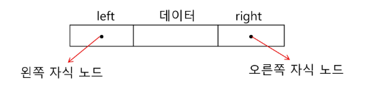
	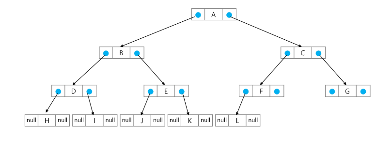
## 수식 트리
- 수식을 표현하는 이진 트리
- 수식 이진 트리(Expression Binary Tree)라고 부르기도 함
- 연산자는 루트 노드이거나 가지 노드
- 피연산자는 모두 잎 노드
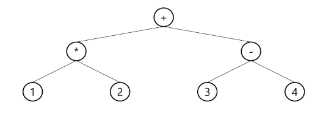
### 순회
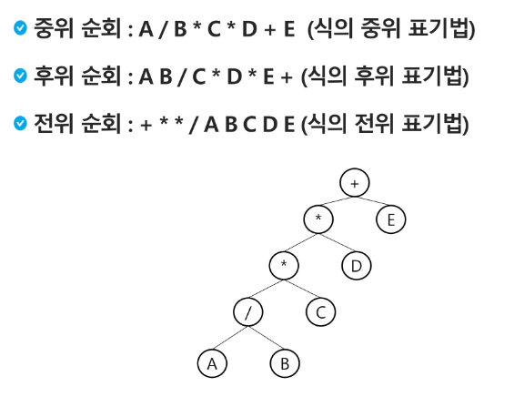