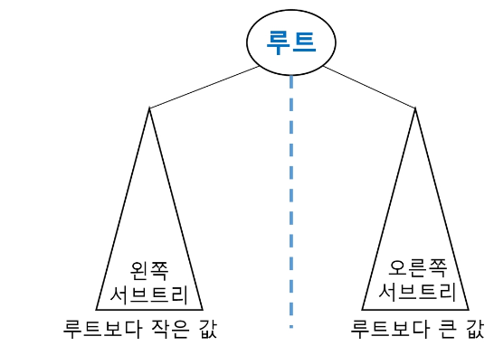
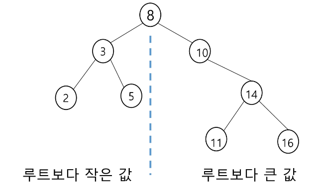
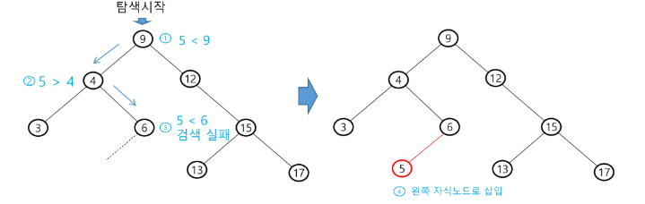
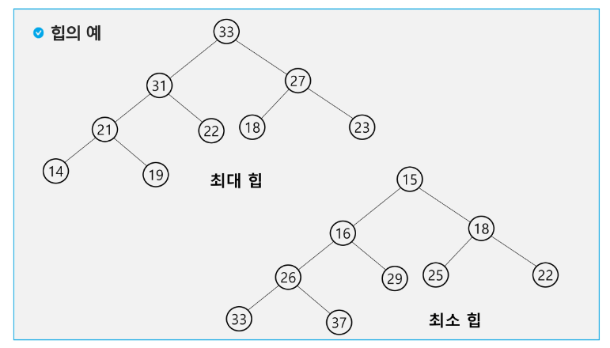
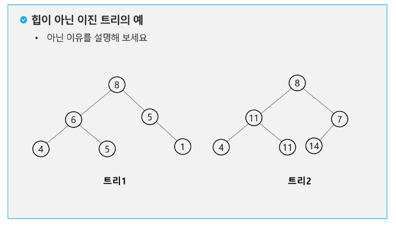

# 이진 탐색 트리
- 탐색작업을 효율적으로 하기 위한 자료구조
- 모든 원소는 서로 다른 유일한 키를 갖는다.
- key(왼쪽 서브트리) < key(루트 노드) < key(오른쪽 서브트리)
- 왼쪽 서브트리와 오른쪽 서브트리도 이진 탐색 트리다.
- 중위 순회하면 오름차순으로 정렬된 값을 얻을 수 있다.
  
  
  ## 탐색연산
  - 루트에서 시작한다.
  - 탐색할 키 값 x를 루트 노드의 키 값과 비교한다.
	-  (키 값 x = 루트 노드의 키 값)인 경우: 원하는 원소를 찾았으므로 탐색연산 성공
	- (키 값 x < 루트 노드의 키 값)인 경우: 루트노드의 왼쪽 서브트리에 대해서 탐색연산 수행
	- (키 값 x > 루트 노드의 키 값)인 경우: 루트노드의 오른쪽 서브트리에 대해서 탐색연산 수행
- 서브트리에 대해서 순환적으로 탐색 연산을 반복한다.
  ## 삽입 연산
  1. 탐색 연산을 수행
	  - 삽입할 원소와 같은 원소가 트리에 있으면 삽입할 수 없으므로, 같은 원소가 트리에 있는지 탐색하여 확인
	  - 탐색에서 탐색 실패가 결정되는 위치가 삽입 위치가 된다.
  2. 탐색 실패한 위치에 원소를 삽입한다.
	  - 5를 삽입하는 예
	    
## 성능
- 탐색(searching), 삽입(insertion), 삭제(deletion) 시간은 트리의 높이 만큼 시간이 걸린다.
	- O(h), h: BST의 깊이
- 평균의 경우
	- 이진 트리가 균형적으로 생성되어 있는 경우
	- O(log n)
- 최악의 경우
	- 한쪽으로 치우친 경사 이진트리의 경우
	- O(n)
	- 순차탐색과 시간복잡도가 같다.
- 검색 알고리즘의 비교
	- 배열에서의 순차 검색: O(N)
	- 정렬된 배열에서의 순차 검색: O(N)
	- 정렬된 배열에서의 이진탐색: O(logN)
		- 고정 배열 크기와 삽입, 삭제 시 추가 연산 필요
	- 이진 탐색트리에서의 평균: O(logN)
		- 최악의 경우: O(N)
		- 완전 이진 트리 또는 균형트리로 바꿀 수 있다면 최악의 경우를 없앨 수 있다.
			- 새로운 원소를 삽입할 때 삽입 시간을 줄인다.
			- 평균과 최악의 시간이 같다. O(logn)
	- 해쉬 검색: O(1)
		- 추가 저장 공간이 필요
## 삭제 연산
# 힙(heap)
- 완전 이진 트리에 있는 노드 중에서 키값이 가장 큰 노드나 키값이 가장 작은 노드를 찾기 위해서 만든 자료구조
- 최대 힙(max heap)
	- 키값이 가장 큰 노드를 찾기 위한 *완전 이진 트리*
	- {부모 노드의 키값 > 자식노드의 키값}
	- 루트 노드: 키값이 가장 큰 노드
- 최소 힙(min heap)
	- 키값이 가장 작은 노드를 찾기 위한 *완전 이진 트리*
	- {부모노드의 키값 < 자식노드의 키값}
	- 루트 노드: 키값이 가장 작은 노드


### 최대힙 구현
```python
# 최대힙  
def max_enq(n):  
    global last  
    last += 1    # 마지막 노드 추가(완전이진트리 유지)  
    h[last] = n  # 마지막 노드에 데이터 삽입  
    c = last     # 부모>자식 비교를 위해  
    p = c//2     # 부모번호 계산  
    while p >= 1 and h[p] < h[c]:  # 부모가 있는데, 부모가 더 작을 경우  
        h[p], h[c] = h[c], h[p]  # 자리 교환  
        c = p  
        p = c//2  
  
# 최소힙: key가 가장 작은 값, 최대힙: key가 가장 큰 값  
def deq():  
    global last  
    tmp = h[1]      # 루트의 키 값 보관  
    h[1] = h[last]  
    last -= 1  
    p = 1           # 새로 옮긴 루트  
    c = p*2  
    while c<=last:  # 자식이 있으면  
        if c+1 <= last and h[c] < h[c+1]:  # 오른쪽 자식이 있고 더 크면  
            c += 1  
        if h[p] < h[c]:  
            h[p], h[c] = h[c], h[p]  # 자리 교환  
            p = c  
            c = p*2  
        else:  
            break  
    return tmp  
  
T = int(input())  # Test Case가 주어지는 경우  
  
for test_case in range(1, T+1):  # 총 T개의 test case가 존재  
    N = int(input())  
    nums = list(map(int, input().split()))  
    h = [0] * (N+1)  # 힙  
    last = 0         # 힙의 마지막 노드 번호  
  
    print(f'#{test_case}')
```