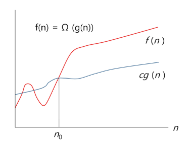

# SW 문제 해결
### 문제 해결 과정
1. 문제를 읽고 이해한다.
2. 문제를 익숙한 용어로 재정의한다.
3. 어떻게 해결할지 계획을 세운다.
4. 계획을 검증한다.
5. 프로그램으로 구현한다.
6. 어떻게 풀었는지 돌아보고, 개선할 방법이 있는지 찾아본다.
# 복잡도 분석
## 알고리즘?
- 알고리즘: 유한한 단계를 통해 문제를 해결하기 위한 절차나 방법, 주로 컴퓨터 용어로 쓰이며 컴퓨터가 어떤 일을 수행하기 위한 단계적 방법을 말한다.
- 간단하게 다시 말하면 어떠한 문제를 해결하기 위한 절차라고 볼 수 있다.
## 알고리즘의 효율
- 공간적 효율성과 시간적 효율성
	- 공간적 효율성은 연산량 대비 얼마나 적은 메모리 공간을 요하는 가
	- 시간적 효율성은 연산량 대비 얼마나 적은 시간을 요하는 가
	- 효율성을 뒤집어 표현하면 복잡도(Complexity)가 된다. 복잡도가 높을수록 효율성 저하
- 시간적 복잡도 분석
	- 하드웨어 환경에 따라 처리시간이 달라짐
		- 부동소수 처리 프로세서 존재유무, 나눗셈 가속기능 유무
		- 입출력 장비의 성능, 공유여부
	- 소프트웨어 환경에 따라 처리시간이 달라진다.
		- 프로그램 언어의 종류
		- 운영체제, 컴파일러의 종류
	- 이런 환경적 차이로 인해 분석 어려움
## 복잡도의 점근적 표기
- 시간(또는 공간) 복잡도는 입력 크기에 대한 함수로 표기하는데, 이 함수는 주로 여러개의 항을 가지는 다항식
- 단순한 함수로 표현하기 위해 점근적 표기(Asymptotic Notation) 사용
- 입력 크기 n이 무한대로 커질 때의 복잡도를 간단히 표현하기 위해 사용하는 표기법
	- O(Big-Oh) 표기
	- Ω(Big-Omega) 표기
	- Θ(Big-Theta) 표기
### O(Big-Oh) 표기
- O-표기는 복잡도의 *점근적 상한*을 나타냄
- 복잡도가 f(n) = 2n²-7n+4 이라면 f(n)의 O-표기는 O(n²)
- f(n)의 단순화된 표현은 n²이다.
- 단순화된 함수 n²에 임의의 상수 c를 곱한 cn²이 n이 증가함에 따라 f(n)의 상한이 된다. (단 c>0)

- 복잡도 f(n)과 O-표기를 그래프로 나타내고 있다.
- n이 증가함에 따라 O(g(n))이 점근적 상한이라는 것 (즉, g(n)이 n₀보다 큰 모든 n에 대해서 항상 f(n)보다 크다는 것)을 보여준다.
  
  ### Ω(Big-Omega) 표기
  - 복잡도의 *점근적 하한*을 의미
  - f(n) = 2n²-7n+4의 Ω-표기는 Ω(n²)
  - f(n)=Ω(n²)은 "n이 증가함에 따라 2n²-7n+4 이 cn²보다 작을 수 없다"라는 의미이다. 이때 상수 c=1로 놓으면 된다.
  - O-표기 떄와 마찬가지로 Ω-표기도 복잡도 다항식의 최고차항만 계수 없이 취하면 된다.
  - *최소한 이만한 시간은 걸린다*
- 복잡도 f(n)과 Ω-표기를 그래프로 나타낸 것인데, n이 증가함에 따라 Ω(g(n))이 점근적 하한이라는 것 (즉, g(n)이 n₀보다 큰 모든 n에 대해서 항상 f(n)보다 작다는 것)을 보여준다.
  
  ### Θ(Big-Theta) 표기
  - O-표기와  Ω-표기가 같은 경우에 사용한다.
  - f(n) = 2n²-7n+4 = O(n²) = Ω(n²) 이므로, f(n) = Θ(n²) 이다.
  - f(n)은 n이 증가함에 따라 *n²과 동일한 증가율을 가진다*라는 의미이다.
    
### 자주 사용하는 O-표기

### 왜 효율적인 알고리즘이 필요한가

# 표준 입출력
## Python3 표준입출력
### 입력
- Raw 값의 입력: `input()`
	- 받은 입력값을 문자열로 취급
- Evaluated된 값 입력: `eval(input())`
	- 받은 입력값을 평가된 데이터 형으로 취급
### 출력
- `print()`
	- 표준 출력 함수. 출력값의 마지막에 개행 문자 포함
- `print('text', end='')`
	- 출력 시 마지막에 개행문자 제외할 시
- `print('%d' %number)`
	- Formatting된 출력
### 파일의 내용을 표준 입력으로 읽어오는 방법
```python
import sys
sys.stdin = open("a.txt", "r")
```

# 진수
- 2진수, 8진수, 10진수, 16진수
- 10진수 -> 타 진수로 변환
	- 원하는 타진법의 수로 나눈 뒤 나머지를 거꾸로 읽는다.
- 타 진수 -> 10진수로 변환
	- (135.12)₈ = 1\*8² + 3\*8¹ + 5\*8⁰ + 1\*⅛ + 2\*(⅛)²
	
## 컴퓨터에서의 음의 정수 표현 방법
- 1의 보수: 부호와 절대값으로 표현된 값을 부호 비트를 제외한 나머지 비트들을 0은 1로, 1은 0으로 변환
- 2의 보수: 1의 보수방법으로 표현된 값의 최하위 비트에 1을 더한다
- 