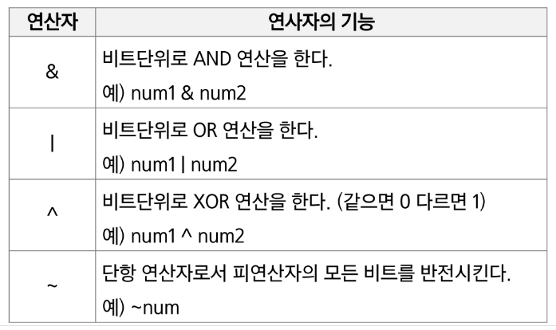
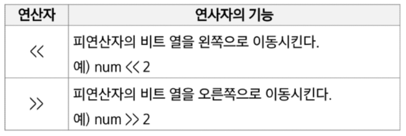
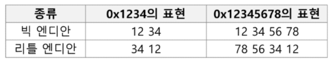

# 비트 연산
## 비트 연산자


### 1 << n
- 2ⁿ의 값을 갖는다.
- 원소가 n개일 경우의 모든 부분집합의 수를 의미한다.
- Power set (모든 부분 집합)
	- 공집합과 자기 자신을 포함한 모든 부분집합
	- 각 원소가 포함되거나 포함되지 않는 2가지 경우의 수를 계산하면 모든 부분집합의 수가 계산된다.
### i & (1<<j)
- 계산 결과는 i의 j번째 비트가 1인지 아닌지를 의미한다.
### 엔디안(Endianness)
- 컴퓨터의 메모리와 같은 1차원의 공간에 여러 개의 연속된 대상을 배열하는 방법을 의미하며 HW 아키텍처마다 다르다.
- 주의 : 속도 향상을 위해 바이트 단위와 워드 단위를 변환하여 연산 할 때 올바로 이해하지 않으면 오류를 발생 시킬 수 있다.
- 엔디안은 크게 두 가지로 나뉨
	- 빅 엔디안(Big-endian)
		- 보통 큰 단위가 앞에 나옴. 네트워크.
	- 리틀 엔디안(Little-endian)
		- 작은 단위가 앞에 나옴. 대다수 데스크탑 컴퓨터

- 엔디안 확인 코드
```python
import sys

print(sys.byteorder)
```
### NOT 연산자
- (~) NOT 연산자: 모든 비트를 반전시킨다.
- 만약 8 bit 일때 ~(0001 1111)이라면 값은 1110 0000이 된다.
#### NOT 연산자를 파이썬에서 수행하기
- 파이썬에서는 ~4를 수행하면 -5가 출력된다.
- 파이썬이 ~4를 -5로 출력하는 과정
	- 4는 0b0100이다. (MSB: 양수이므로 0)
	- NOT 연산자로 인해 뒤집으면 1011이 된다.
	- MSB는 1이 되었고(음수), 나머지 bit는 011이다.
	- 나머지 bit에 대해 2의 보수를 취하면 100+1=101 이므로 5가 된다.
	- 따라서 -5
	