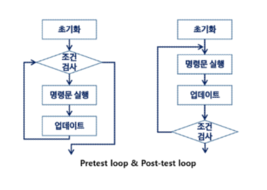

# 완전 검색 & 그리디
## 반복(Iteration)과 재귀(Recursion)
- 반복과 재귀는 유사한 작업을 수행할 수 있다.
- 반복은 수행하는 작업이 완료될 때 까지 계속 반복
- 재귀는 주어진 문제의 해를 구하기 위해 동일하면서 더 작은 문제의 해를 이용하는 방법
### 반복 구조
- 초기화
	- 반복되는 명령문을 실행하기 전에 (한번만) 조건 검사에 사용할 변수의 초기값 설정
- 조건 검사(check control expression)
- 반복할 명령문 실행(action)
- 업데이트 (loop update)
	- 무한 루프가 되지 않게 조건이 거짓이 되어야 한다.
	
### 재귀적 알고리즘
- 재귀적 정의는 두 부분으로 나뉜다.
- 하나 또는 그 이상의 기본 경우(basis case or rule)
	- 집합에 포함되어 있는 원소로 induction을 생성하기 위한 시드(seed) 역할
- 하나 또는 그 이상의 유도된 경우(inductive case or rule)
	- 새로운 집합의 원소를 생성하기 위해 결합되어지는 방법