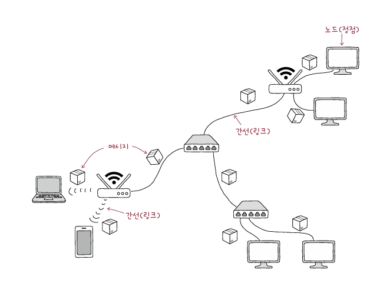
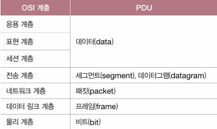
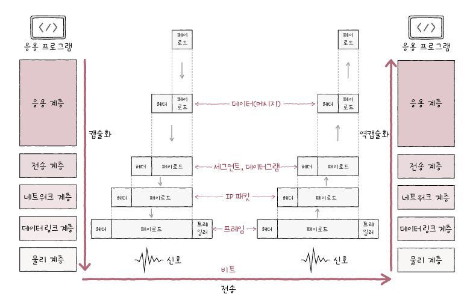

# 1. 컴퓨터 네트워크 시작하기
## 1. 컴퓨터 네트워크를 알아야 하는 이유
- 컴퓨터 네트워크: 여러 장치가 그물처럼 서로 연결되어 정보를 주고받을 수 있는 통신망
- 인터넷: 여러 네트워크를 연결한 '네트워크의 네트워크'
### 개발자가 컴퓨터 네트워크를 알아야 하는 이유
#### 프로그램을 만드는 업무에서 네트워크 지식을 활용하는 경우
- 웹 프레임워크, 라이브러리 사용시 네트워크 지식 필요
- HTTP나 쿠키 등 배경지식 필요
- 프로그램 안전성을 위해 네트워크 지식이 유용하게 활용됨
#### 프로그램을 유지 보수하는 업무에서 네트워크 지식을 활용하는 경우
- 문제 발생 시 해결의 큰 실마리가 됨
- 유지 보수할 떄 자주 사용하는 도구나 명령어 중 네트워크 지식을 필요로 하는 것이 많음
## 2. 네트워크 거시적으로 살펴보기
### 네트워크 기본 구조

- 모든 네트워크 - 노드
- 노드를 연결하는 - 간선
- 노드 간 주고받는 - 메시지
#### 호스트
- 네트워크의 가장자리에 위치한 노드
	- 네트워크를 통해 흐르는 정보를 최초로 생성 및 송신하고, 최종적으로 수신
	- 일상에서 사용하는 네트워크 기기 대부분이 속함
##### 서버
- 어떠한 서비스를 제공하는 호스트
##### 클라이언트
- 서버에게 어떠한 서비스를 요청하고 서버의 응답을 제공받는 호스트
	- 서버에세 요청을 보내고 응답을 제공받음
#### 네트워크 장비
- 중간 노드
	- 이더넷 허브, 스위치, 라우터, 공유기 등
	- 호스트 간 주고받는 정보가 원하는 수신지까지 안정적이고 안전하게 전송될 수 있게 함
#### 통신 매체
- 각 노드를 연결하는 간선
	- 유선 매체, 무선 매체
#### 메시지
- 통신 매체로 연결된 노드가 주고받는 정보
### 범위에 따른 네트워크 분류
#### LAN
- Local Area Network
- 가까운 지역을 연결한 근거리 통신망
#### WAN
- Wide Area Network
- 먼 지역을 연결하는 광역 통신망
- ex. 인터넷
- ISP(Internet Service Provider): 인터넷 서비스 업체가 구축, 관리
### 회선 교환 방식
- 회선 교환: 메시지 전송로인 회선을 설정하고 이를 통해 메시지를 주고받는 방식
- 회선 스위치: 호스트 사이에 일대일 전송로를 확보하는 네트워크 장비
- 가능한 모든 회선에 끊임없이 메시지가 흘러야 이용 효율이 높아짐
	- 메시지 주고받지 않을 때 낭비된다는 문제점
### 패킷 교환 방식
- 회선 교환 방식의 문제점 해결한 방식, 메시지를 패킷이라는 작은 단위로 쪼개어 전송
	- 패킷: 패킷 교환 네트워크상에서 송수신되는 메시지의 단위
- 중간 노드인 패킷 스위치는 패킷이 수신지까지 올바르게 도달할 수 있도록 최적의 경로를 결정하거나 패킷의 송수신지를 식별함
- ex. 라우터, 스위치
- 페이로드: 전송하고자 하는 데이터
- 패킷에 붙는 일종의 부가 정보, 제어 정보
	- 헤더: 패킷 앞에 포함
	- 트레일러: 패킷 뒤에 포함되기도 함
#### 주소와 송수진지 유형에 따른 전송 방식
- 주소: 송수신지를 특정하는 정보
- 전송 방식
	- 유니캐스트: 일반적 형태의 송수신 방식, 송신지와 수신지 일대일로 메시지 주고받음
	- 브로드캐스트: 자신을 제외한 네트워크 상의 모든 호스트에게 전송하는 방식
		- 브로드캐스트 도메인: 전송되는 범위
	- 멀티캐스트, 애니캐스트 등
## 3. 네트워크 미시적으로 살펴보기
### 프로토콜
- 노드 간에 정보를 올바르게 주고받기 위해 합의된 규칙이나 방법
- 프로토콜은 저마다 목적과 특징을 가짐
### 네트워크 참조 모델
- 네트워크를 통해 정보를 주고받을 때 정형화된 여러 단계를 거침
	- 계층으로 표현 가능
	- 네트워크 참조 모델: 통신 과정을 각 계층으로 나눈 구조
- 계층으로 나눈 이유
	1. 네트워크 구성과 설계가 용이
	2. 네트워크 문제 진단과 해결이 용이
#### OSI 모델
- 국제 표준화 기구에서 만든 네트워크 참조 모델
- 7개의 계층으로 나눔
##### 1. 물리 계층
- 최하단 계층
- 1과 0으로 표현되는 비트 신호를 주고 받음
##### 2. 데이터 링크 계층
- 네트워크 내 주변 장치 간의 정보를 올바르게 주고받기 위한 계층
- 물리 계층을 통해 주고받는 정보에 오류가 없는지 확인 후 네트워크 내 송수신지 특정
##### 3. 네트워크 계층
- 메시지를 (다른 네트워크에 속한) 수신지까지 전달하는 계층
- 네트워크 간 통신이 이루어짐
##### 4. 전송 계층
- 신뢰성 있고 안정성 있는 전송을 해야 할 때 필요한 계층
- 오류 없이 전송됐는지 확인
##### 5. 세션 계층
- '세션'을 관리하기 위한 계층
	- 세션: 통신을 주고받는 호스트의 응용 프로그램 간 연결 상태
##### 6. 표현 계층
- 사람이 이해하는 언어를 컴퓨터가 이해할 수 있는 코드로 변환/ 압축/ 암호화와 같은 작업
##### 7. 응용 계층
- OSI 참조 모델 최상단
- 사용자 및 사용자가 이용하는 응용 프로그램과 가장 밀접히 맞닿아 있는 계층
#### TCP/IP 모델
- OSI는 이상적 설계에 가깝고 TCP/IP는 실용적 구현에 가까움
- IP: 인터넷 프로토콜의 약자
##### 1. 네트워크 액세스 계층
- 전통적 TCP/IP 모델에서의 최하위 계층은 데이터 링크 계층 역할 수행에 가까움
	- 물리계층에 해당하는 개념이 없다고 보기도 함
##### 2. 인터넷 계층
- OSI 네트워크 계층과 유사
##### 3. 전송 계층
- OSI 전송 계층과 유사
##### 4. 응용 계층
-  OSI 모델의 세션 계층, 표현 계층, 응용 계층을 합친 것과 유사
### 캡슐화와 역캡슐화
- 캡슐화: 한 단계 아래 계층은 바로 위의 계층으로부터 받은 패킷에 헤더 및 트레일러를 추가해 나가는 과정
	- 송신 과정
	- 인캡슐레이션
- 역캡슐화: 캡슐화 과정에서 붙였던 헤더를 각 계층에서 확인한 뒤 제거
	- 수신 과정
	- 디캡슐레이션
### PDU (Protocol Data Unit)
- 각 계층에서 송수신되는 메시지의 단위

- 네트워크 계층의 PDU: IP 패킷

## 트래픽과 네트워크 성능 지표
- 트래픽: 네트워크 내의 정보량
- 과부하: 특정 노드에 트래픽이 몰리면 생길 수 있음 -> 성능의 저하로 이어질 수 있다
### 처리율 (throughput)
- 단위 시간당 네트워크를 통해 실제로 전송되는 정보량
- bps (bits per second), Mbps, Gbps 단위
### 대역폭 (bandwidth)
- 네트워크 성능 측정 영역에서는 단위 시간 동안 통신 매체를 통해 송수신할 수 있는 최대 정보량 의미함
- bps, Mbps, Gbps
### 패킷 손실 (packet loss)
- 송수신되는 패킷이 손실된 상황 의미
- CMD or 터미널에서 확인 가능
# 예상 질문
1. 처리율과 대역폭의 차이점이 무엇인가요?
	- **처리율(Throughput)**: 단위 시간당 실제로 전송된 데이터 양을 의미합니다. 네트워크 상태나 혼잡도에 따라 값이 달라질 수 있습니다.
	- **대역폭(Bandwidth)**: 단위 시간 동안 네트워크가 최대로 전송할 수 있는 데이터 용량을 의미합니다. 이론적인 한계를 나타내며, 항상 처리율과 같지 않을 수 있습니다.
	    즉, 대역폭은 네트워크의 최대 용량이고, 처리율은 실제 성능을 나타냅니다.
	
2. 웹 개발자로서 네트워크 지식이 왜 중요한지와 네트워크 관련 경험 있으면 얘기해주세요
	- 프로그램 보안, 안정성을 위해
	- 웹 프레임워크, 라이브러리 사용시 네트워크 지식 필요한 경우 있음
	- 유지 보수, 문제 발생 시 네트워크 지식을 필요로 함
	- HTTP 프로토콜, 쿠키를 이해하면 웹 요청 및 응답을 더 잘 설계 가능