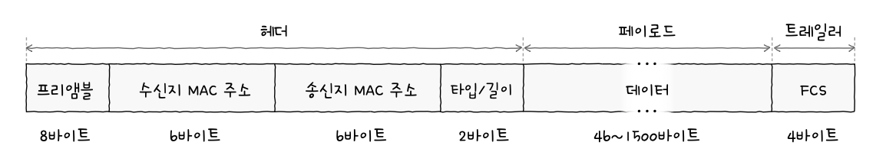
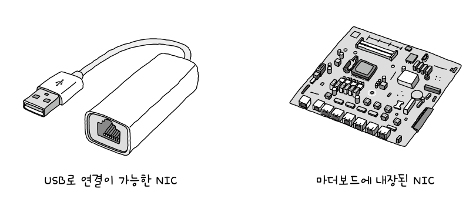

# 물리 계층과 데이터 링크 계층
## 1. 이더넷
- 다양한 통신 매체의 규격들과 송수신되는 프레임의 형태, 프레임을 주고받는 방법 등이 정의된 네트워크 기술
- 현대 LAN, 특히 유선 LAN 환경에서 가장 대중적으로 사용되는 기술
	- *케이블* 같은 통신 매체 필요
### 이더넷 표준
- IEEE 802.3 : 전기전자공학자협회가 표준화한 이더넷 관련 기술
### 통신 매체 표기 형태
```
전송 속도BASE-추가 특성
```
#### 전송 속도
 - 숫자만 표기되어 있으면 Mbps, G가 붙으면 Gbps 속도
#### BASE
- 베이스밴드의 약자
- 변조 타입을 의미함
	- 변조 타입: 비트 신호로 변환된 데이터를 통신 매체로 전송하는 방법
#### 추가 특성
- 명시할 수 있응 특성 종류 다양함
	- 전송 가능한 최대 거리
	- 물리 계층 인코딩 방식
	- 레인 수
### 통신 매체 종류
| 추가 특성 표기(통신 매체의 종류) | 케이블 종류       |
| ------------------- | ------------ |
| C                   | 동축 케이블       |
| T                   | 트위스티드 페어 케이블 |
| S                   | 단파장 광섬유 케이블  |
| L                   | 장파장 광섬유 케이블  |
### 이더넷 프레임
- 이더넷 네트워크에서 주고받는 프레임
- 캡슐화 과정을 통해 만들어짐 (수신지에서 역캡슐화 과정 거침)

#### 프리앰블
- 이더넷 프레임의 시작을 알리는 8바이트 정보
- 첫 바이트 10101010, 마지막 10101011
#### 수신지 MAC 주소와 송신지 MAC 주소
- MAC 주소: 네트워크 인터페이스마다 부여되는 6바이트 길이의 주소
	- LAN 내의 수신지, 송신지 특정 가능
	- '물리적 주소'라고도 불림
#### 타입/길이
- 타입 or 길이 명시
- 길이: 필드에 명시된 크기가 1500 이하일 경우 사용
- 타입: 이더넷 프레임이 '어떤 정보를 캡슐화했는지' 나타냄 (이더타입)
#### 데이터
- 상위 계층에서 전달받거나 상위 계층으로 전달해야 할 내용
- 패딩: 일정 크기 이상 유지해야하기 때문에 그 이하면 보통 46바이트 이상이 될 때까지 0으로 채움
#### FCS (Frame Check Sequence)
- 수신한 이더넷 프레임에 오류가 있는지 확인하기 위한 필드
- CRC(Cyclic Redundancy Check) 순환 중복 검사: 오류 검출용 값 들어감
### 토큰 링
- 호스트들이 링 형태로 연결됨
- 호스트끼리 돌아가며 *토큰*이라는 특별한 정보를 주고받음
	- 토큰이 있어야만 메시지 송신 가능
## 2. NIC와 케이블
- NIC(Network Interface Controller): 호스트와 통신 매체를 연결하고, MAC 주소가 부여되는 네트워크 장비
- 케이블: NIC에 연결되는 물리 계층의 유선 통신 매체
### NIC
- 호스트는 NIC가 있어야 네트워크에 참여 가능
#### NIC의 생김새

#### NIC의 역할
- 통신 매체에 흐르는 신호를 호스트가 이해하는 프레임으로 변환, 그 반대도 수행
- *네트워크 인터페이스 역할 수행*
### 트위스티드 페어 케이블
- 구리 선으로 전기 신호를 주고받는 통신 매체
#### 트위스티드 페어 케이블의 생김새

- 케이블 본체와 커넥터(RJ-45)로 이루어짐

- 구리 선이 두 가닥씩 꼬아져 있음

- 구리 선 사용시 노이즈가 발생할 수 있음
	- 주변을 감싸 *차폐* (노이즈 감소 방식) 시킴
	- 브레이드 실드, 포일 실드
#### 실드에 따른 트위스티드 페어 케이블의 분류
- STP(Shielded Twisted Pair): 브레이드 실드 사용
- FTP(Foil Twisted Pair): 포일 실드 사용
- UTP(Unshielded Twisted Pair): 아무것도 감싸지 X
#### 카테고리에 따른 트위스티드 페어 케이블의 분류
- 카테고리: 성능 등급 구분, 높을 수록 성능 높음
- Cat으로 줄여 표기
### 광섬유 케이블
- 빛(광신호)을 이용해 정보를 주고받는 케이블
- 전기 신호를 이용하는 케이블보다 속도 빠름, 먼 거리 전송 가능
#### 광섬유 케이블의 생김새


- 코어: 광섬유 중심, 실질적으로 빛이 흐르는 부분
- 클래딩: 코어를 둘러쌈, 빛이 코어 안에서만 흐르도록 가두는 역할
- 코어 지름에 따라
	- 싱글 모드 광섬유 케이블
	- 멀티 모드 광섬유 케이블
#### 싱글 모드 광섬유 케이블

- 신호 손실이 적어 장거리 전송에 적합
- 비용 높음
#### 멀티 모드 광섬유 케이블

- 빛이 여러 경로로 이동 가능
- 장거리 전송에 부적합
## 3. 허브
### 주소 개념이 없는 물리 계층
- 물리 계층에 주소 개념 없음
- 데이터 링크부터 존재 -> 물리 계층 장비는 정보에 대한 판단 x
### 허브
- 여러 대의 호스트를 연결하는 장치
- 이더넷 허브: 이더넷 네트워크의 허브
- 포트: 커넥터를 연결할 수 있는 지점
#### 허브의 특징
1. 전달받은 신호를 다른 모든 포트로 그대로 다시 내보냄
	- 물리 계층 장비라 주소 개념 없어서 걍 다 보냄
2. 반이중 모드로 통신
	- 반이중 모드: 1차선 도로처럼 송수신을 번갈아가면서 하는 통신 방식
	- 전이중 모드: 송수신을 동시에 양방향으로 가능
#### 콜리전 도메인
- 충돌(콜리전): 동시에 허브에 신호 송신하면 발생
- 콜리전 도메인: 충돌이 발생할 수 있는 영역
### CSMA/CD
- Carrier Sense Multiple Access with Collision Detection
1. CS는 Carrier Sense, 캐리어 감지를 의미
	- 캐리어 감지: 현재 통신 매체의 사용 가능 여부 검사
2. MA는 Multiple Access, 다중 접근을 의미
	- 다중 접근: 복수의 호스트가 네트워크에 접근하려는 상황
3. CD는 Collision Detection, 충돌 검출을 의미
	- 잼 신호: 충돌 발생했음을 알리고자 보내는 특별한 신호
## 4. 스위치
### 스위치
- 데이터 링크 계층의 네트워크 장비
#### 스위치의 특징
- MAC 주소 학습: 특정 포트와 연결된 호스트의 MAC 주소와의 관계를 기억
- MAC 주소 테이블: 스위치의 포트와 연결된 호스트의 MAC 주소 연관 관계를 나타내는 정보
### MAC 주소 학습
1. 플러딩: 허브처럼 송신지 포트를 제외한 모든 포트로 프레임 전송
2. 포워딩과 필터링
	- 포워딩: 프레임이 전송될 포트에 실제로 프레임을 내보내는 것
	- 필터링: 전달받은 프레임을 어디로 내보내고 어디로 내보내지 않을지 결정하는 기능
3. 에이징: MAC 주소 테이블에 등록된 특정 포트에서 일정 시간 동안 프레임을 전송받지 못했다면 해당 항목 삭제
### VLAN
- Virtual LAN
- 한 대의 스위치로 가상의 LAN을 만드는 방법
- 여러 대의 스위치가 있는 것처럼 논리적인 단위로 LAN을 구획할 수 있음
#### 포트 기반 VLAN
- 스위치의 포트가 VLAN을 결정하는 방식
- VLAN 트렁킹: 두 대 이상의 VLAN 스위치를 효율적으로 연결하여 확장하는 방법 (트렁크 포트에 VLAN 스위치 서로 연결)
	- 트렁크 포트: 스위치 간의 통신을 위한 특별한 포트
#### MAC 기반 VLAN
- 포트 기반 VLAN 이외에도 사전에 설정된 MAC 주소에 따라 VLAN이 결정되는 방식