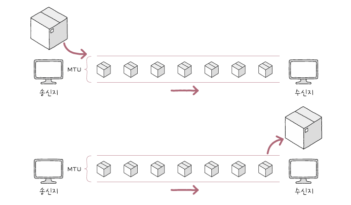
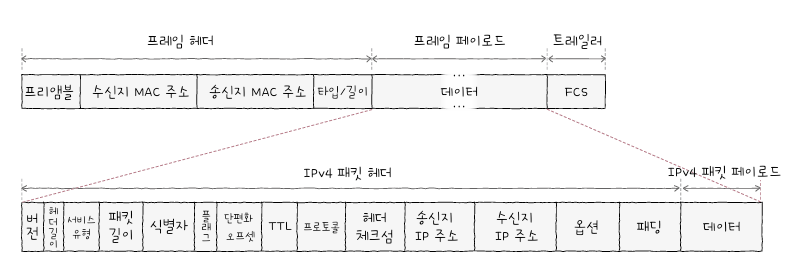
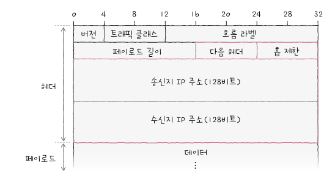
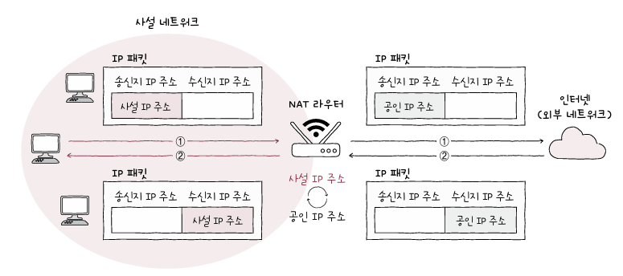
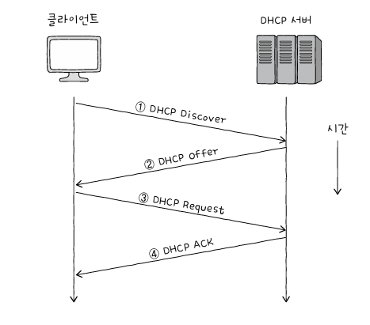
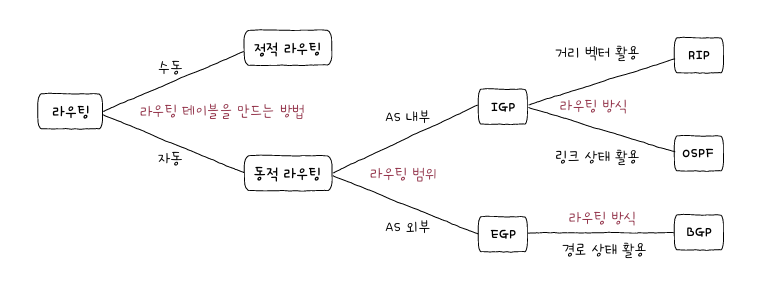

# 네트워크 계층
## 1. LAN을 넘어서는 네트워크 계층
### 데이터 링크 계층의 한계
#### 1. 물리 계층과 데이터 링크 계층만으로는 다른 네트워크까지의 도달 경로를 파악하기 어렵습니다.
- 라우팅: 패킷이 이동할 최적의 경로 결정하는 것
- 라우터: 라우팅을 수행하는 대표적인 장비
#### 2. MAC 주소만으로는 모든 네트워크에 속한 호스트의 위치를 특정하기 어렵습니다.
- 모든 호스트가 모든 네트워크에 속한 호스트의 MAC 주소를 서로 알고 있기 어려움
	- IP 주소가 수신지 역할
	- IP 주소와 같이 사용하며 IP 주소를 우선으로 활용
- IP 주소를 논리 주소라고도 함
- DHCP(Dynamic Host Configuration Protocol) 프로토콜로 자동 할당 or 사용자 직접 할당
### 인터넷 프로토콜
- IP (Internet Protocol)
	- IPv4
	- IPv6
#### IP 주소 형태
- 4바이트(32비트)로 주소 표현
	- 0~255범위 안에 있는 네 개의 10진수로 표기
	- 옥텟(octet): 점으로 구분된 8비트
	- ex. 192.168.1.1
#### IP의 기능
- IP 주소 지정: IP 주소를 바탕으로 송수신 대상을 지정하는 것
- IP 단편화: 전송하고자 하는 패킷의 크기가 MTU라는 최대 전송 단위보다 클 경우, 이를 MTU 크기 이하의 복수의 패킷으로 나누는 것
- MTU(Maximum Transmission Unit): 한 번에 전송 가능한 IP 패킷의 최대 크기

#### IPv4

1. 식별자: 패킷에 할당된 번호
2. 플래그: 총 세 개의 비트로 구성된 필드
   1. 항상 0으로 예약된 비트 (현재 사용 X)
   2. DF(Don't Fragment): IP 단편화를 수행하지 말라는 표시
   3. MF(More Fragment): 단편화된 패킷이 더 있는지 나타냄
3. 단편화 오프셋: 패킷이 단편화되기 전에 패킷의 초기 데이터에서 몇 번째로 떨어진 패킷인지를 나타냄
4. TTL(Time To Live): 패킷의 수명
   - 호스트 또는 라우터에 한 번 전달되는 것을 홉(hop) 이라 함
5. 프로토콜: 상위 계층의 프로토콜이 무엇인지 나타냄
6. 송신지 IP 주소
7. 수신지 IP 주소

- 1-3: IP 단편화 기능 관여
- 6-7: IP 주소 지정 기능 관여
#### IPv6
- 16바이트(128비트)로 주소 표현
- 콜론으로 구분된 8개 그룹의 16진수로 표현

1. 다음 헤더: 상위 계층의 프로토콜을 가리키거나 확장 헤더를 가리킴
   - 기본 헤더: 위의 그림
   - 확장 헤더: 추가 헤더 정보가 필요할 떄 추가함
2. 홉 제한: 패킷의 수명을 나타냄
3. 송신지 IP 주소
4. 수신지 IP 주소
### ARP(Address Resolution Protocol)
- IP 주소를 통해 MAC 주소를 알아내는 프로토콜
#### 1. ARP 요청
- 네트워크 내의 모든 호스트에게 브로드캐스트 메시지 보냄
	- 통신하고 싶은 곳의 MAC 주소가 무엇인지
#### 2. ARP 응답
- 나머지 호스트는 자신의 IP 주소가 아니므로 무시
- 해당 호스트는 자신의 MAC 주소를 담은 메시지를 보냄
#### 3. ARP 테이블 갱신
- ARP를 사용 가능한 모든 호스트는 ARP 테이블이라는 정보 유지
- 1,2 단계를 통해 알게된 MAC 주소를 ARP 테이블에 추가

- 만약 동일 네트워크 상에 없다면 거치는 모든 라우터도 해당 단계를 거친다
### IP 단편화를 피하는 방법
- IP 단편화는 많이 안할수록 좋음
	- 그러려면 MTU 고려해야 함
- 경로 MTU: IP 단편화 없이 주고 받을 수 있는 최대 크기
- 경로 MTU 발견: 경로 MTU를 구하고 해당 크기만큼만 송수신하여 IP 단편화를 회피하는 기술
## 2. IP 주소
### 네트워크 주소와 호스트 주소
- 네트워크 주소: 네트워크 ID, 네트워크 식별자
- 호스트 주소: 호스트 ID, 호스트 식별자
- ex. 172.16 (네트워크 주소) .12.45 (호스트 주소)
- 네트워크가 하나의 옥텟 or 호스트가 하나의 옥텟을 가지는 경우도 있음
	- 유동적으로 범위가 구분됨
### 클래스풀 주소 체계
- 클래스: 네트워크 크기에 따라 IP 주소를 분류하는 기준
- 클래스풀 주소 체계: 클래스를 기반으로 IP 주소를 관리하는 주소 체계
### 클래스리스 주소 체계
- 클래스풀 주소 체계의 한계: 클래스별 네트워크 크기가 고정되어 있어 IP 주소가 낭비될 가능성 있음
- 클래스 개념 없이 클래스에 구애받지 않고 네트워크의 영역을 나누어서 호스트에게 IP 주소 공간을 할당하는 방식
#### 서브넷 마스크
- 클래스리스에서 네트워크와 호스트를 구분 짓는 수단
- IP 주소상에서 네트워크 주소는 1, 호스트 주소는 0으로 표기한 비트열을 의미
- 서브네팅: 서브넷 마스크를 이용해 클래스를 원하는 크기로 더 잘게 쪼개어 사용하는 것
#### 서브네팅: 비트 AND 연산
- IP 주소와 서브넷 마스크를 비트 AND 연산하여 네트워크와 호스트 주소 구분
#### 서브넷 마스크 표기: CIDR 표기법 (Classless Inter-Domain Routing notation)
- 서브넷 마스크를 표기하는 방법
	1. 10진수로 직접 표기
	2. IP 주소/서브넷 마스크상의 1의 개수 형식으로 표기하는 방법 -> 이게 CIDR
- ex. 192.168.0.2/25 - 1이 총 25개 - 11111111.11111111.11111111.10000000
### 공인 IP 주소와 사설 IP 주소
#### 공인 IP 주소 (public IP address)
- 전 세계에서 고유한 IP 주소
#### 사설 IP 주소와 NAT
- 사설 IP 주소 (private IP address): 사설 네트워크에서 사용하기 위한 IP 주소
- 인터넷, 외부 네트워크에 공개되지 않은 네트워크
- 라우터가 사설 IP 주소 할당함
- NAT(Network Address Translation): IP 주소를 변환하는 기술
	- 사설 IP 주소를 사용하는 호스트가 외부 네트워크와 통신할 때 사용

### 정적 IP 주소와 동적 IP 주소
#### 정적 할당
- 호스트에 직접 수작업으로 IP 주소를 부여하는 방법
	- 정적 IP 주소
#### 동적 할당과 DHCP
- IP 주소를 직접 일일이 입력하지 않아도 호스트에 IP 주소에 동적으로 할당되는 방식
	- 동적 IP 주소
- 대표적인 프로토콜: DHCP(Dynamic Host Configuration Protocol)
	- IP 주소를 할당받고자 하는 호스트와 해당 호스트에게 IP 주소를 제공하는 DHCP 서버 간에 메시지를 주고받음으로써 이루어짐
- 주고받는 메시지의 종류
	1. DHCP Discover(클라이언트 → DHCP 서버)
	   - DHCP 서버를 찾음
	2. DHCP Offer(DHCP 서버 → 클라이언트)
	   - 클라이언트에게 할당해줄 IP 주소를 제안
	3. DHCP Request(클라이언트 → DHCP 서버)
	   - Offer 메시지에 대한 응답
	4. DHCP Acknowledgment(이하 DHCP ACK) (DHCP 서버 → 클라이언트)
	   - 최종 승인 메시지
	   - 임대 기간동안 IP 주소 사용
   - 임대 갱신: IP 주소 임대 기간이 끝나기 전에 임대 기간 연장 가능

### 예약 주소
- 루프백 주소: 자기 자신을 가리키는 특별한 주소
	- 일반적으로 127.0.0.1 사용
	- 로컬호스트 라고도 함
## 3. 라우팅
- 라우팅: 패킷이 이동할 최적의 경로를 설정한 뒤 해당 경로로 패킷을 이동시키는 것
### 라우터
- 홉: 라우팅 도중 패킷이 호스트와 라우터 간에, 혹은 라우터와 라우터 간에 이동하는 하나의 과정
### 라우팅 테이블
- 라우팅 테이블: 특정 수신지까지 도달하기 위한 정보를 명시한 일종의 표와 같은 정보
- 라우팅 테이블에 포함되는 정보
	- 수신지 IP 주소와 서브넷 마스크: 최종적으로 패킷을 전달할 대상을 의미
	- 다음 홉: 최종 수신지까지 가기 위해 다음으로 거쳐야 할 호스트의 IP 주소나 인터페이스를 의미(게이트웨이라고도 함)
	- 네트워크 인터페이스: 패킷을 내보낼 통로
	- 메트릭: 해당 경로로 이동하는 데에 드는 비용
- 디폴트 라우트: 패킷을 내보낼 기본 경로
### 정적 라우팅과 동적 라우팅
- 라우팅 테이블을 만드는 방법
#### 정적 라우팅
- 사용자가 수동으로 직접 채워 넣은 라우팅 테이블의 항목을 토대로 라우팅되는 방식
#### 동적 라우팅
- 자동으로 라우팅 테이블 항목을 만들고, 이를 이용하여 라우팅하는 방식
- 라우팅 테이블 항목이 수시로 변할 수 있음
	- 경로상 문제 발생 시 우회할 수 있게 경로가 자동 갱신됨
- 이 때 사용하는 프로토콜이 "(동적) 라우팅 프로토콜"
### 라우팅 프로토콜
- 라우터끼리 자신들의 정보를 교환하며 패킷이 이동할 최적의 경로를 찾기 위한 프로토콜
- 크게 AS 내부에서 수행되느냐 외부에서 수행되느냐에 따라 종류가 나뉨
	- IGP
	- EGP
#### IGP(Interior Gateway Protocol): RIP와 OSPF
- 대표적인 IGP
	- RIP(Routing Information Protocol): 거리 벡터 사용
	- OSPF(Open Shortest Path FIrst): 링크 상태 사용
- 거리 벡터 라우팅 프로토콜: 이름 그대로 거리를 기반으로 최적의 경로를 찾는 라우팅 프로토콜을 의미함
	- 거리: 패킷이 경유한 라우터의 수 (홉의 수)
- 링크 상태 라우팅 프로토콜: 네트워크의 상태를 그래프의 형태로 링크 상태 데이터베이스에 저장
	- 링크 상태 데이터베이스를 기반으로 현재 네트워크 구성을 마치 지도처럼 그린 뒤에 최적의 경로 선택
	- 대역폭을 기반으로 계산 (대역폭이 높은 링크일수록 메트릭이 낮은 경로로 인식)
	- AS를 에어리어 단위로 나누고 구분된 에어리어 내에서만 링크 상태를 공유
	- 에어리어 경계에 있는 ABR 이라는 라우터가 에어리어 간 연결 담당
#### EGP: BGP
- 대표적인 EGP로 BGP가 있음
- AS간의 통신에서 사용되는 대표적인 프로토콜, AS간 통신이 '가능한' 프로토콜
- 피어: BGP 메시지를 주고받을 수 있도록 연결된 BGP 라우터
- 피어링: 피어 관계가 되도록 연결되는 과정
#### 1. AS-PATH 속성
- 메시지가 수신지에 이르는 과정에서 통과하는 AS들의 목록
1. BGP는 AS 간 라우팅을 할 때 거치게 될 '라우터'의 수가 아닌 'AS'의 수를 고려
2. BGP는 RIP처럼 단순히 수신지에 이르는 '거리'가 아닌, 메시지가 어디를 거쳐 어디로 이동하는지를 나타내는 '경로'를 고려

#### 2. NEXT-HOP 속성
- 다음 홉, 다음으로 거칠 라우터의 IP 주소를 나타냄
#### 3. LOCAL-PREF 속성
- 지역 선호도의 약자
- AS 외부 경로에 있어 AS 내부에서 어떤 경로를 선호할지에 대한 척도를 나타내는 속성
# 예상 질문
1. IPv4와 IPv6의 대표적인 차이점 설명해주세요.
   - 주소를 표현하는 바이트 수가 다름
   - 헤더 내용이 다름 (IPv4는 항상 고정된 패킷 헤더를 가짐, IPv6는 기본 헤더가 매우 간소화 되어있고 필요 시 확장하여 사용)
   - IPv6는 사설IP가 의미 없음(중복 거의 안됨)
2. 사설 IP 주소를 사용하는 호스트가 외부 네트워크와 통신하는 흐름에 대해 설명해주세요.
   - 사설 네트워크상의 사설 IP 주소는 공유기를 거쳐 공인 IP로 변경 후 외부 네트워크로 전송
   - 외부 네트워크로부터 받은 패킷 속 공인 IP 주소는 사설 IP 주소로 변경됨