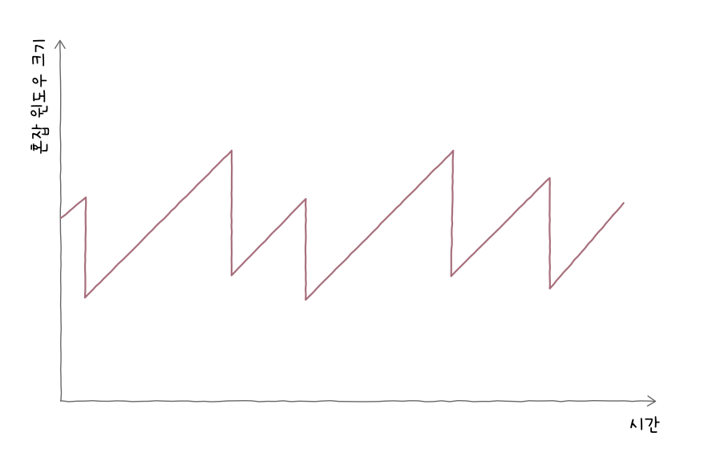

# 전송 계층
## 1. 전송 계층 개요: IP의 한계와 포트
- 네트워크 계층의 한계: 신뢰할 수 없는 통신, 비연결형 통신을 수행할 수 있음
	- 이런 IP의 한계 극복
### 신뢰할 수 없는 통신과 비연결형 통신
- IP는 *신뢰할 수 없는 (비신뢰성) 프로토콜*이자 *비연결형 프로토콜*
	- 신뢰할 수 없는 통신: 패킷이 수신지까지 제대로 전송되었다는 보장 X
		- 최선형 전달
	- 비연결형 통신: 송수신 호스트 간에 사전 연결 수립 작업을 거치지 않는 특징
- 왜 비신뢰성, 비연결형 통신을 할까?
	- 성능 때문
	- 모든 패킷을 일일이 확인하고, 호스트 간 연결을 수립하는 작업이 성능상 악영향으로 이어질 수 있음
	- ex. 실시간 동영상 스트리밍 서비스
### IP의 한계를 보완하는 전송 계층
#### 1. 전송 계층은 연결형 통신을 가능하게 함
- TCP: 전송 계층의 연결형 프로토콜
	- 두 호스트가 정보를 주고받기 전 가상의 회선을 설정하듯 연결 수립
	- 송수신하는 동안에는 연결 유지, 끝나면 연결 종료
#### 2. 전송 계층은 신뢰성 있는 통신을 가능하게 함
- TCP를 통해 수행
	- 패킷 순서를 보장하기 위해 재전송을 통해 오류 제어 등 다양한 기능 제공
- UDP: 비신뢰성, 비연결형 통신을 가능하게 함 (TCP보다 빠른 전송 가능)
### 응용 계층과의 연결 다리, 포트
#### 포트의 정의
- 패킷이 도달 후에 실행 중인 특정 애플리케이션까지 도달해야 함
	- 따라서 패킷에 특정 애플리케이션을 식별할 정보 포함해야 함
	- 이런 정보를 *포트*라고 함
#### 포트의 분류
- 포트 번호는 16비트로 표현 가능
- 0~1023: 잘 알려진 포트(well known port), 시스템 포트
- 1024~49151: 등록된 포트(registered port)
	- 흔히 사용되는 애플리케이션 할당에 사용
- 49152~65535: 동적 포트(dynamic port), 사설 포트(private port), 임시 포트(ephemeral port)
	- 인터넷 할당 번호 관리 기관에 의해 할당된 애플리케이션 프로토콜 X
	- 자유롭게 사용 가능
- 특정 호스트에서 실행 중인 특정 애플리케이션 프로세스 식별 가능
	- ex. 192.168.0.15:*8000*
### 포트 기반 NAT
- NAT: IP주소를 변환하는 기술
#### NAT 변환 테이블
- 변환의 대상이 되는 IP 주소 쌍이 명시되어 있음
- 공인과 사설 IP를 일대일 대응하면 사설 IP 수만큼 공인 IP 주소 필요
	- 따라서 오늘날 일대일 대응하지 않는 경우가 많음
#### NAPT (Network Address Port Translation)
- 포트 기반의 NAT
	- APT(Address Port Translation) 라고도 함
- 포트를 사용해 네트워크 내부의 호스트를 특정할 수 있음
### 포트 포워딩(port forwarding)
- 네트워크 내 특정 호스트에 IP 주소와 포트 번호를 미리 할당하고, 해당 IP 주소:포트 번호로서 해당 호스트에게 패킷을 전달하는 기능
### ICMP(Internet Control Message Protocol)
- IP의 비신뢰성, 비연결형 전송 특성을 보완하기 위한 네트워크 계층의 프로토콜
	- IP 패킷의 전송 과정에 대한 피드백 메시지를 얻기 위해 사용
- 메시지 종류
	1. 전송 과정에서 발생한 문제 상황에 대한 오류 보고
	2. 네트워크에 대한 진단 정보
## 2. TCP와 UDP
- TCP(Transmission Control Protocol): 신뢰할 수 있는 통신을 위한 연결형 프로토콜
- UDP(User Datagram Protocol): TCP보다 신뢰성은 떨어지지만 비교적 빠른 통신이 가능한 비연결형 프로토콜
### TCP 통신 단계와 세그먼트 구조

- 통신하기 전에 연결을 수립하고 통신이 끝나면 연결 종료
	- 데이터 송수신 과정에서 재전송을 통한 오류 제어, 흐름 제어, 혼잡 제어 기능 제공
- MSS(Maximum Segment Size): TCP로 전송할 수 있는 최대 페이로드 크기
	- 헤더 크기 제외

- 송신지 포트와 수신지 포트: 송신지, 수신지 애플리케이션을 식별하는 포트 번호가 명시되는 필드
- 순서 번호: 순서 번호가 명시되는 필드 (순서 번호: 송수신되는 세그먼트의 올바른 순서를 보장하기 위해 부여되는 번호)
- 확인 응답 번호: 상대 호스트가 보낸 세그먼트에 대한 응답
- 제어 비트: 플래그 비트, 현재 세그먼트에 대한 부가 정보
- 윈도우: 수신 윈도우(한 번에 수신하고자 하는 데이터의 양)의 크기 명시
#### 제어 비트
- 기본적으로 8비트로 구성
	- ACK: 세그먼트의 승인을 나타내기 위한 비트
	- SYN: 연결을 수립하기 위한 비트
	- FIN: 연결을 종료하기 위한 비트
#### 순서 번호와 확인 응답 번호
- TCP의 신뢰성을 보장하기 위해 사용되는 중요한 필드
- 순서 번호: 세그먼트의 올바른 송수신 순서를 보장하기 위한 번호
	- 초기 순서 번호(ISN: Initial Sequence Number): 처음 통신을 위한 연결을 수립할 때 연결을 수립하기 위한 비트인 SYN 플래그가 1로 설정된 세그먼트의 순서 번호(무작위값 부여됨)
- 초기 순서 번호 + 송신한 바이트 수 (누적값을 가짐)
- 확인 응답 번호: 순서 번호에 대한 응답
	- 다음으로 받기를 기대하는 순서 번호
	- 일반적으로 '수신한 순서 번호 + 1'
### TCP 연결 수립과 종료
#### 연결 수립: 쓰리 웨이 핸드셰이크
- 쓰리 웨이 핸드셰이크: 세 개의 단계로 이루어진 TCP의 연결 수립 과정

- 액티브 오픈: 처음 연결을 시작하는 호스트의 연결 수립 과정
	- 주로 클라이언트에 의해 수행됨
- 패시브 오픈: 연결 요청을 받고 나서 요청에 따라 연결을 수립해 주는 호스트
	- 주로 서버에 의해 수행됨
#### 연결 종료
- 액티브 클로즈: 먼저 연결을 종료하려는 호스트에 의해 수행
- 패시브 클로즈: 연결 종료 요청을 받아들이는 호스트에 의해 수행
### TCP 상태
- 상태: 현재 어떤 통신 과정에 있는지를 나타내는 정보
- TCP는 상태를 유지하고 활용한다는 점에서 스테이트풀 프로토콜이라고도 부름

| 상태 분류 | 주요 상태                                                            |
| ----- | ---------------------------------------------------------------- |
| 1     | CLOSED, LISTEN                                                   |
| 2     | SYN-SENT, SYN-RECEIVED, ESTABLISHED                              |
| 3     | FIN-WAIT-1, CLOSE-WAIT, FIN-WAIT-2, LAST-ACK, TIME-WAIT, CLOSING |
#### 1. 연결이 수립되지 않은 상태
- CLOSED: 아무런 연결이 없는 상태
- LISTEN: 일종의 연결 대기 상태
#### 2. 연결 수립 상태
- SYN-SENT: 연결 요청을 보낸 뒤 대기하는 상태
- SYN-RECEIVED: 패시브 오픈 호스트가 SYN + ACK 세그먼트를 보낸 뒤 그에 대한 ACK 세그먼트를 기다리는 상태
- ESTABLISHED: 연결이 확립되었음을 나타내는 상태
#### 3. 연결 종료 상태
- FIN-WAIT-1: 연결 종료의 첫 단계
- CLOSE-WAIT: 종료 요청 세그먼트를 받은 패시브 클로즈 호스트가 그에 대한 응답으로 ACK 세그먼트를 보낸 후 대기하는 상태
- FIN-WAIT-2: FIN-WAIT-1 상태에서 ACK 세그먼트를 받게되면 되는 상태
- LAST-ACK: CLOSE-WAIT 상태에서 FIN 세그먼트를 전송한 뒤 이에 대한 ACK 세그먼트를 기다리는 상태
- TIME-WAIT: 액티브 클로즈 호스트가 FIN 세그먼트를 수신한 뒤 이에 대한 ACK 세그먼트를 전송한 뒤 접어드는 상태
- CLOSING: 보통 동시에 연결을 종료하려 할 때 전이되는 상태

### UDP 데이터그램 구조
- UDP는 TCP처럼 상태 유지, 활용을 하지 않음 -> 스테이트리스 프로토콜의 일종
- 데이터그램 구조
	- 송신지 포트, 수신지 포트
	- 길이: 헤더를 포함한 UDP 데이터그램의 바이트
	- 체크섬: 오류 발생 검사 필드

## 3. TCP의 오류, 흐름, 혼잡 제어
### 오류 제어: 재전송 기법
#### 오류 검출과 재전송
- 오류를 검출하고 세그먼트를 재전송하는 두 가지 상황
##### 1. 중복된 ACK 세그먼트를 수신했을 때
- 세그먼트가 누락됐을 경우 중복된 ACK 세그먼트 전송
- RTT(Round Trip Time): 메시지를 전송한 뒤 그에 대한 답변을 받는 데까지 걸리는 시간
##### 2. 타임아웃이 발생했을 때
- TCP 세그먼트를 송신하는 호스트는 모두 *재전송 타이머*라는 값을 유지
- 타임아웃: 타이머의 카운트다운이 끝난 상황
#### ARQ: 재전송 기법
- Automatic Repeat Request(자동 재전송 기법): 수신 호스트의 답변과 타임아웃 발생을 토대로 문제를 진단하고, 문제가 생긴 메시지를 재전송함으로써 신뢰성을 확보하는 방식
##### Stop-and-Wait ARQ
- 제대로 전달했음을 확인하기 전까지는 새로운 메시지를 보내지 않는 방식
- 단순하지만 높은 신뢰성 보장
- but 네트워크 이용 효율 낮아짐
##### Go-Back-N ARQ
- 파이프라이닝: 연속해서 메시지를 전송할 수 있는 기술
- 파이프라이닝 방식을 이용해 여러 세그멘트 전송, 잘못 전송된 세그먼트 발생 시 해당 세그먼트부터 전부 다시 전송
- 누적 확인 응답: 순서 번호 n번에 대한 ACK 세그먼트는 'n번까지의' 확인 응답
##### Selective Repeat ARQ
- 선택적으로 재전송하는 방법
- 제대로 전송받은 패킷에 대해 각각 ACK 세그먼트를 보냄
	- 개별 확인 응답
### 흐름 제어: 슬라이딩 윈도우
- 호스트가 한 번에 받아서 처리 가능한 세그먼트의 양에 한계가 있기 때문에 흐름제어 필요
- 수신 버퍼: 수신된 세그먼트가 애플리케이션 프로세스에 의해 읽히기 전에 임시로 저장되는 공간
- 버퍼 오버플로: 버퍼가 넘치는 문제 상황
- 흐름 제어로 *슬라이딩 윈도우* 사용
	- 윈도우: 송신 호스트가 파이프라이닝할 수 있는 최대량 의미
- 수신 호스트가 세그먼트를 올바르게 수신했다면 수신 윈도우 오른쪽으로 한 칸 이동
### 혼잡 제어
- 혼잡(congestion): 많은 트래픽으로 인해 패킷의 처리 속도가 늦어지거나 유실될 우려가 있는 네트워크 상황
- 혼잡 윈도우: 혼잡 없이 전송할 수 있을 법한 데이터양
	- 혼잡 윈도우 크기는 혼잡 제어 알고리즘을 통해 결정
- AIMD(Additive Increase/Multiplicative Decrease) 알고리즘: 합으로 증가, 곱으로 감소
	- 혼잡 감지x: RTT마다 1씩 선형적 증가
	- 혼잡 감지: 혼잡 윈도우를 절반으로 떨어뜨리는 동작 반복

#### 1. 느린 시작 알고리즘
- 혼잡 윈도우를 1부터 시작해 문제없이 수신된 ACK 세그먼트 하나당 1씩 증가시키는 방식
	- 혼잡 윈도우는 RTT마다 2배씩 지수적으로 증가
- 느린 시작 임계치(slow start threshold): 혼잡 윈도우 값이 계속 증가하다가 느린 시작 임계치 이상이 되거나, 타임아웃이 발생하거나, 세 번의 중복된 ACK 세그먼트가 발생하여 혼잡이 감지되면 다음 세 가지 방법 중 하나 사용

| 상황 분류               | 방법                                                                    |
| ------------------- | --------------------------------------------------------------------- |
| 타임아웃 발생             | 혼잡 윈도우 값을 1로, 느린 시작 임계치를 혼잡이 감지되었을 시점의 혼잡 윈도우 값의 절반으로 초기화한 뒤 느린 시작 재개 |
| 혼잡 윈도우 >= 느린 시작 임계치 | 느린 시작 종료, 혼잡 윈도우를 절반으로 초기화한 뒤 혼잡 회피 수행                                |
| 세 번의 중복 ACK 발생      | (빠른 재전송 후) 빠른 회복 수행                                                   |
#### 2. 혼잡 회피 알고리즘
- 혼잡 회피 알고리즘: RTT마다 혼잡 윈도우를 1 MSS(Maximum Segment Size)씩 증가시키는 알고리즘
- 혼잡 윈도우 크기를 선형적으로 증가시킴
#### 3. 빠른 회복 알고리즘
- 빠른 회복 알고리즘: 세 번의 중복 ACK 세그먼트를 수신 시 느린 시작은 건너뛰고 혼잡 회피를 수행하는 알고리즘

# 예상 질문
1. TCP와 UDP의 가장 큰 차이점과 어떤 경우에 두 프로토콜을 사용하는지 설명해주세요.
	- TCP: 파일 전송
	- UDP: 실시간 스트리밍
2. TCP가 재전송을 하는 방식이 크게 세 가지 있는데 이 중 하나에 대해 설명해주세요.