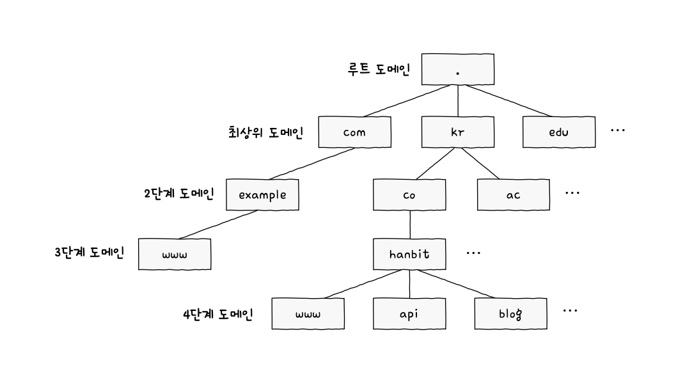
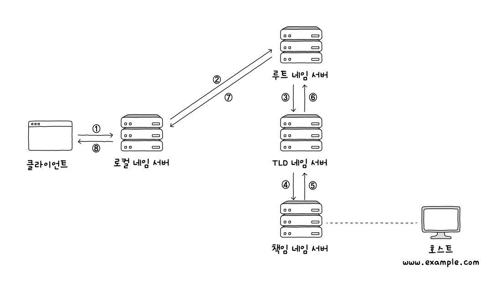
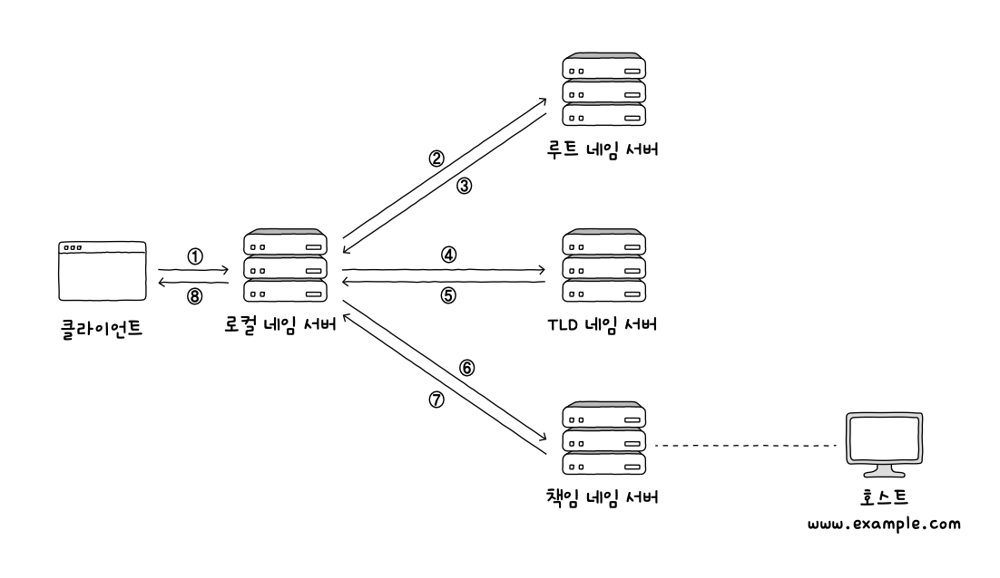
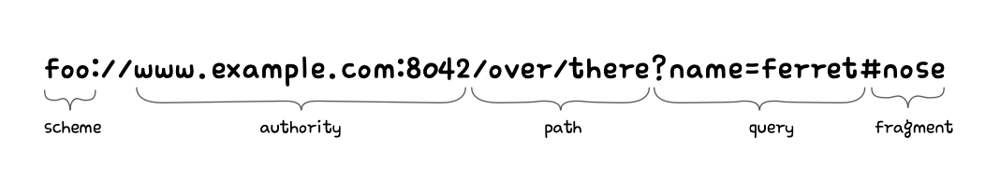

# 응용 계층
## 1. DNS와 지원
- 도메인 네임: 메시지 송수신 대상 파악에 사용
- URL: 위치 기반 식별자
- URN: 이름 기반 식별자
### 도메인 네임과 네임 서버
- 모든 호스트의 IP 주소를 기억하고 있기 어렵고 IP 주소는 언제든 바뀔 수 있음
	- 도메인 네임 사용
	- ex. www.example.com
- 네임 서버: 도메인 네임, IP 주소 관리
	- DNS 서버: 도메인 네임을 관리하는 네임 서버

- www.example.com
	- 점을 기준으로 분류
	- 최상단: 루트 도메인
	- 최상위 도메인(TLD, Top-Level Domain): 마지막 부분
	- 2단계 도메인(Second Level Domain): 최상위 도메인의 하부 도메인
	- 전체 주소 도메인 네임(FQDN: Fully-Qualified Domain Name): 도메인 네임을 모두 포함하는 도메인 네임
	- 호스트 네임: FQDN의 첫 번째 부분 (www)
- 도메인 네임 시스템(DNS, Domain Name System): 분산된 도메인 네임에 대한 관리 체계
### 계층적 네임 서버
- 리졸빙: IP 주소를 모르는 상태에서 도메인 네임에 대응되는 IP 주소를 알아내는 과정
- 로컬 네임 서버: 클라이언트와 맞닿아 있는 네임 서버
	- 클라이언트가 도메인 네임을 통해 IP 주소를 알아내고자 할 때 가장 먼저 찾게 되는 네임 서버
	- 보통 ISP에서 할당하지만 공개 DNS 서버 사용하기도 함
- 루트 네임 서버: 로컬 네임 서버가 대응되는 IP 주소를 모를 때 여기로 해당 도메인 네임을 질의하게 됨
- TLD 네임 서버: TLD를 관리하는 네임 서버, 질의에 대해 TLD의 하위 도메인 네임을 관리하는 네임 서버 주소를 반환 가능
- 책임 네임 서버: 특정 도메인 영역을 관리하는 네임 서버
	- 자신이 관리하는 도메인 영역에 대한 질의에 대해서는 다른 네임 서버에게 떠넘기지 않고 곧바로 답할 수 있는 네임 서버
- 재귀적 질의: 클라이언트가 로컬 네임 서버에게 도메인 네임을 질의하면, 로컬 네임 서버가 루트 네임 서버에게 질의하고, 루트 네임 서버가 TLD 네임 서버에게 질의하고, TLD 네임 서버가 다음 단계에 질의하는 과정 반복 -> 최종 응답 결과 역순으로 전달

- 반복적 질의: 클라이언트가 로컬 네임 서버에게 IP 주소를 알고 싶은 도메인 네임을 질의하면, 로컬 네임 서버는 루트 도메인 서버에게 질의해서 다음으로 질의할 네임 서버의 주소를 응답받고, 다음으로 TLD 네임 서버에게 질의해서 다음으로 질의할 네임 서버의 주소를 응답받는 과정을 반복하다가 최종 응답 결과를 클라이언트에게 알려 주는 방식
	- 위의 두 방식은 시간이 오래 걸리고 네트워크 메시지 수가 지나치게 늘어난다는 단점 존재

- DNS 캐시: 서버 과부화를 막기 위해 기존에 응답받은 결과를 임시로 저장했다가 추후 같은 질의에 이를 활용함
### 자원을 식별하는 URI
- 자원: 네트워크상의 메시지를 통해 주고받는 대상
- URI(Uniform Resource Identifier): 자원을 식별할 수 있는 정보
	- URL(Uniform Resource Locator): 위치로 식별
	- URN(Uniform Resource Name): 이름으로 식별
#### URL
- 인터넷 환경에서 자원 식별에 더 많이 활용

1. scheme: 자원에 접근하는 방법
   - 사용할 프로토콜
2. authority: 호스트를 특정할 수 있는 정보
   - IP 주소, 도메인 네임
3. path: 자원이 위치한 경로
   - 슬래시 기준 계층적으로 표현
4. query: 요청-응답 기반 프로토콜
   - 쿼리 문자열(쿼리 파라미터): 물음표로 시작되는 키=값 의 형태
   - 앰퍼샌드(&)를 사용하여 여러 쿼리 문자열 연결
5. fragment: 자원의 한 조각을 가리키기 위한 정보
   - 흔히 HTML 파일과 같은 자원에서 특정 부분을 가리키기 위해 사용
#### URN
- 자원에 고유한 이름을 붙이는 이름 기반 식별자
	- 자원의 위치와 무관하게 자원을 식별 가능하다는 장점
## 2. HTTP
### HTTP의 특성
- HTTP (Hypertext Transfer Protocol)
#### 1. 요청-응답 기반 프로토콜
- 클라이언트-서버 구조 기반의 요청-응답 프로토콜
#### 2. 미디어 독립적 프로토콜
- HTTP는 자원의 특성을 제한하지 않으며, 단지 자원과 상호 작용하는 데 사용할 수 있는 인터페이스 정의할 뿐
- 대부분의 자원을 URI로 식별
- 미디어 타입: HTTP에서 메시지로 주고받는 자원의 종류
	- MIME 타입(Multipurpose Internet Mail Extensions Type)
	- 슬래시 기준으로 '타입/서브타입' 형식으로 구성
		- 타입: 데이터의 유형
		- 서브타입: 주어진 타입에 대한 세부 유형
#### 3. 스테이트리스 프로토콜
- 상태를 유지하지 않는 스테이트리스 프로토콜
	- 서버가 HTTP 요청을 보낸 클라이언트와 관련된 상태를 기억하지 않는다는 의미
	- 독립적 요청으로 간주됨
- 상태 유지 x 특성의 장점
	- 모든 클라이언트의 상태 정보를 유지하는 것은 서버에 큰 부담
	- 서버가 여러 대일 경우 모든 서버가 모든 클라이언트의 상태를 유지할 경우, 클라이언트는 여러 서버를 동시에 이용하기 어려워짐 -> 특정 서버에 종속
- HTTP의 설계 목표
	- 확장성
	- 견고성
	- 스테이트리스여야 목표 달성 가능
#### 4. 지속 연결 프로토콜
- 지속 연결(킵 얼라이브): 하나의 TCP 연결 상태에서 여러 개의 요청-응답을 주고받을 수 있는 기술
### HTTP 메시지 구조
#### 시작 라인
- 요청 메시지 - '요청 라인', 응답 메시지 - '상태 라인'
- 요청 라인의 형식
	- 메서드: 클라이언트가 서버의 자원에 대해 수행할 작업의 종류
	- 요청 대상: 요청을 보낼 서버의 자원 (URI 경로 명시)
	- HTTP 버전: 'HTTP/버전' 으로 표기
- 응답 메시지일 경우 (상태 라인)
	- 상태 코드: 요청에 대한 결과를 나타내는 세 자리 정수
	- 이유 구문: 상태 코드에 대한 문자열 형태의 설명
	- ex. HTTP/1.1 200 OK

#### 필드 라인
- 0개 이상의 HTTP 헤더 명시
	- 헤더 라인
	- 통신에 필요한 부가 정보 의미
- 
#### 메시지 본문