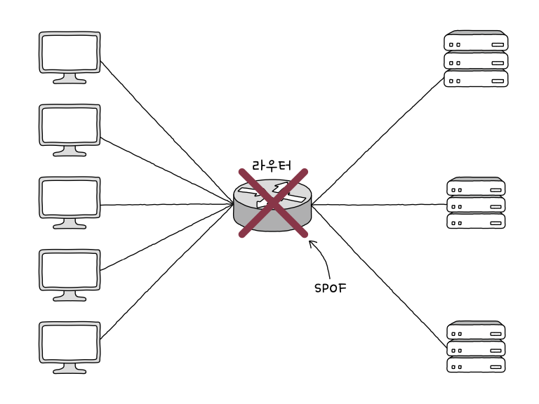
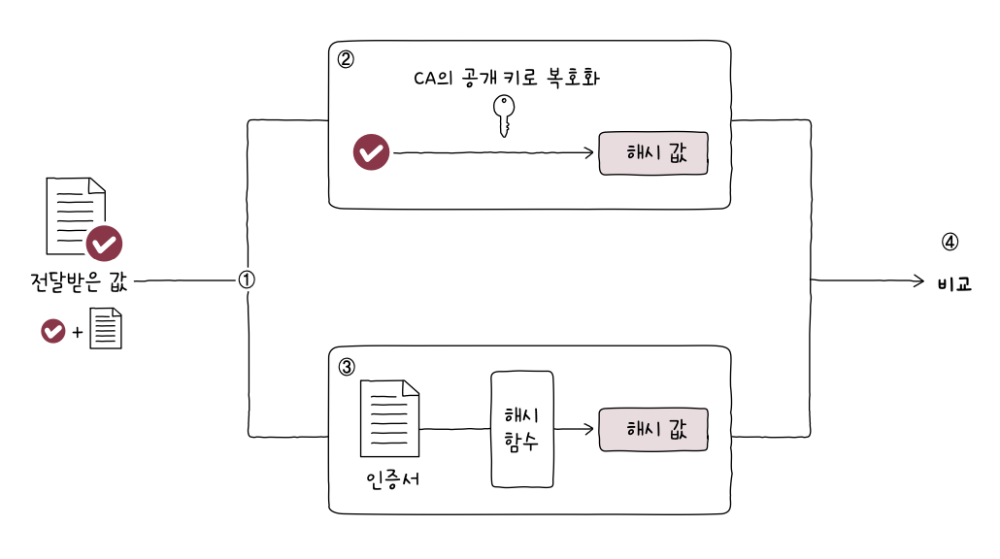

# 네트워크 심화
## 1. 안정성을 위한 기술
### 가용성
- 안전성: 특정 기능을 언제든 균일한 성능으로 수행할 수 있는 특성
- 가용성: 컴퓨터 시스템이 특정 기능을 실제로 수행할 수 있는 시간의 비율
	- 전체 사용 시간 중에서 정상적인 사용 시간
	- 가용성 = 업타임 / (업타임 + 다운타임)
	- 업타임: 정상적 사용 시간, 다운타임: 정상적 사용 불가능한 시간
- 일반적으로 '안정적' 평가받는 시스템은 99.999% 이상이 목표
- 결함 감내: 문제가 발생하더라도 기능할 수 있는 능력
### 이중화
- 무언가를 이중으로 두는 기술, 예비(백업)를 마련하는 방법
	- 이중화하는 대상은 '문제가 발생할 경우 시스템이 중단될 수있는 대상 - 단일 장애점(SPOF)'

- 이중화 구성의 두 가지 방식
	- 액티브/스탠바이: 한 시스템 가동, 다른 시스템 백업 용도로 대기 상태
	- 액티브/액티브: 두 시스템 모두 가동시킨 상태로 두는 구성 방식
- 다중화: 무언가를 여러 개 두는 기술
- 이중화, 다중화의 사례
	- 티밍: 주로 윈도우에서 사용
	- 본딩: 주로 리눅스에서 사용
	- 여러 개의 네트워크 인터페이스(NIC)를 이중화/다중화하여 마치 더 뛰어나고 안정적인 성능을 보유한 하나의 인터페이스처럼 보이게 하는 기술
### 로드 밸런싱
- 트래픽: 주어진 시점에 네트워크를 경유한 데이터의 양
	- 주어진 시점에 특정 노드를 경유한 패킷의 양
- 로드 밸런싱: 트래픽의 고른 분배를 위해 사용되는 기술
	- 로드 밸런서에 의해 수행됨
- 로드 밸런서: 네트워크 장비로도 수행할 수 있지만 로드 밸런싱 기능을 제공하는 소프트웨어를 설치하면 일반 호스트도 로드 밸런서로 사용 가능
	- Nginx도 로드 밸런싱 기능 내포됨
- 로드 밸런싱 알고리즘
	- 라운드 로빈 알고리즘: 단순히 서버를 돌아가며 부하 전달
	- 최소 연결 알고리즘: 연결이 적은 서버부터 우선적으로 부하를 전달
	- 서버마다 가중치 부여 가능
### 포워드 프록시와 리버스 프록시
- 오리진 서버: 자원을 생성하고 클라이언트에게 권한 있는 응답을 보낼 수 있는 HTTP 서버
- 대표적 중간 서버의 유형
	- 게이트웨이(리버스 프록시): 아웃바운드 연결에 대해 *오리진 서버 역할*을 하지만, 수신된 요청을 변환하여 다른 인바운드 서버로 전달하는 중개자 역할을 함
	- 프록시: *클라이언트가 선택한* 메시지 전달 대리자
		- 캐시 저장, 클라이언트 암호화 및 접근 제한 등 기능 제공
## 2. 안전성을 위한 기술
- 암호화: 원문 데이터를 알아볼 수 없는 형태로 변경하는 것
- 복호화: 암호화된 데이터를 원문 데이터로 되돌리는 과정
### 암호와 인증서
#### 대칭 키 암호화 방식과 공개 키 암호화 방식
- 키: 컴퓨터 보안에서 사용되는 키는 무작위해 보이는 문자열처럼 생김
- 키의 원문 데이터에 수학적 연산 과정을 거쳐 암호문 생성
	- 암호화 알고리즘: 위의 수학적 연산 과정
- 대칭 키 암호화: 암호화와 복호화에 사용하는 키가 동일함
	- 상대방에게 안전하게 키를 전달하기 어려움
- 공개 키 암호화 (비대칭 키 암호화): 암호화 키와 복호화 키가 다름
	- 각각 공개 키, 개인 키라 부름
	- 키는 안전하게 공유 가능
	- 암호화 복호화에 시간과 부하가 상대적으로 많이 듦
- 두 방식을 함께 사용하기도 한다
	- 세션 키(대칭 키)를 공개 방식으로 암호화, 복호화
#### 인증서와 디지털 서명
- 인증서: 일반적으로 공개 키 인증서 의미
	- 공개키 인증서: 공개 키와 공개 키의 유효성을 입증하기 위한 전자 문서
	- 인증 기관(CA)에서 발급
	- 서명값: 공개 키 인증서가 진짜라는 서명 값을 통해 검증
		1. 인증서 내용에 대한 해시 값을
		2. CA의 개인 키로 암호화하는 방식으로 만듦
- 디지털 서명: 개인 키로 암호화된 메시지를 공개 키로 복호화함으로써 신원을 증명하는 절차

### HTTPS: SSL과 TLS
- SSL(Secure Sockets Layer): 인증과 암호화를 수행하는 프로토콜
- TLS(Transport Layer Security): SSL을 계승한 프로토콜
- HTTPS(HTTP over TLS): 위의 두 프로토콜을 사용하는 대표적 프로토콜
	- HTTP 메시지의 안전한 송수신을 위해 개발됨
- 동작하는 단계
	1. TCP 쓰리 웨이 핸드셰이크
	2. TLS 핸드셰이크
	3. 암호화된 메시지 송수신
## 3. 무선 네트워크
### 전파와 주파수
- 전파: 3kHz부터 3THz 사이의 진동수를 갖는 전자기파
- 용도에 따라 주파수 대역이 나뉨
### 와이파이와 802.11
- IEEE 802.11 표준은 대부분 2.4GHz, 5GHz 사용
- *채널*이라는 하위 주파수 대역으로 또 한 번 세분화하여 통신이 이루어짐
### AP와 서비스 셋
- AP(Access Point): 무선 통신 기기들을 연결하여 무선 네트워크를 구성하는 장치
- 인프라스트럭처 모드: AP를 경유하여 통신이 이루어지는 무선 네트워크 통신 방식
- 서비스 셋: 무선 네트워크를 이루는 AP와 여러 장치들의 집합
- 서비스 셋 식별자(SSID): 서비스 셋을 구별하기 위해 사용
- 비컨 프레임: AP가 불특정 다수 모두에게 자신을 알리는 브로드캐스트 메시지를 주기적으로 전송하는데 이 때 이 브로드캐스트 메시지
	- AP의 MAC 주소 등 포함되어있음
# 예상 질문
1. 이중화 방식 두 가지의 차이점 설명해주세요
2. 프로젝트에서 보안에 관해 신경썼던 경험이 있으면 얘기해주세요