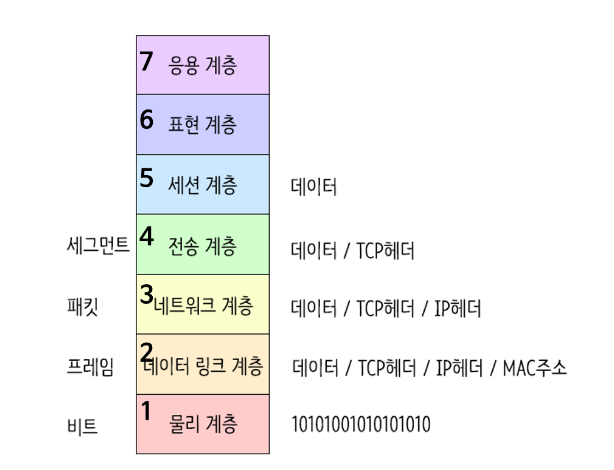
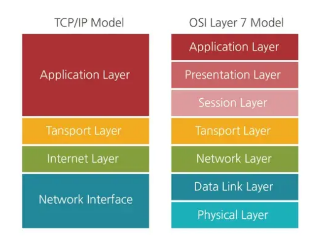

# 네트워크(Network)
## 개념
- 분산되어 있는 컴퓨터들을 자원이나 정보를 공유하기 위해 통신망으로 연결한 것을 의미
- 프로토콜을 사용하여 데이터를 교환하는 시스템의 집합을 통칭
- 전송 매체로 서로 연결된 시스템의 모음
## 네트워크 활용의 장단점
### 장점
- 모든 종류의 물리적 및 논리적 자원을 공유할 수 있으므로 자원 활용 극대화
- 병렬 처리 가능해지고 성능 향상
- 데이터의 중복 저장이 가능
	- 데이터 복구 용이
	- 신뢰성 향상
### 단점
- 데이터의 중복 저장이 가능
	- 일관성 문제가 발생할 가능성 있음
- 컴퓨터가 누구나 손쉽게 접근할 수 있어서 보안 문제 발생 가능성 증가
## 네트워크의 필요성
### 1. 프로그램이나 데이터를 공유하여 사용 가능
### 2. 프린터 또는 스캐너 등 주변장치 공유하여 사용 가능
### 3. 인터넷 회선 공유하여 여러 대의 컴퓨터가 편리하게 인터넷 사용 가능
### 4. 데이터를 쉽게 백업 가능
## 네트워크 기초용어
### 시스템
- 내부 규칙에 따라 능동적으로 동작하는 대상
- ex) 컴퓨터, 자동차, 운영체제, 프로세스 등
### 인터페이스
- 시스템과 시스템을 연결하기 위한 표준화된 접근 방법
### 전송매체
- 시스템끼리 데이터를 전달하기 위한 물리적인 전송 수단
### 프로토콜
- 전송 매체를 통해 데이터를 교환하기 위한 특정 규칙
### 인터넷
- ARPANET에서 시작된 세계 최대 규모의 컴퓨터 통신망
- 전세계 네트워크가 유기적으로 연결되어 동작하는 통합 네트워크
### 인트라넷
- 인터넷의 기술을 응용하는 기업 내 전용 컴퓨터 네트워크
- 기업의 각종 정보를 표준화하여 서버를 통해 공유하는 기업 내 인터넷
## 시스템 구분
### 노드(Node)
- 인터넷에 연결된 시스템의 가장 일반적인 용어
### 호스트(Host)
- 컴퓨터 기능이 있는 시스템
### 클라이언트(Client)
- 서비스를 요청하는 시스템
### 서버(Server)
- 서비스를 제공하는 시스템
## 네트워크 주소
### 네트워크 주소
- 네트워크 상에 존재하는 노드를 고유하게 식별
### 주소 종류
- MAC 주소
	- Link 계층에서 사용
	- LAN 카드에 내장
- IP 주소
	- Network 계층에서 사용
- 포트 번호
	- 전송 계층에서 사용
	- TCP와 UDP가 독립적으로 관리 (소켓 주소)
- 메일 주소
	- 메일 시스템에서 사용
# OSI 7 Layers
- 네트워크 통신이 일어나는 과정을 7단계로 나누는 국제 표준화 기구(ISO)에서 정의한 네트워크 표준 모델

- 각 계층을 지날 때마다 각 계층에서 Header가 붙고 수신측은 역순으로 헤더를 분석함
## 1계층 - 물리계층 (Physical Layer)
- 통신 케이블로 데이터를 전송하는 *물리적 장비*
- 데이터 이진 변환 후 주고받는 기능만 함
- 통신 단위: *비트(Bit)* 
- 장비: 통신 케이블, 리피터, 허브 등
## 2계층 - 데이터 링크계층 (DataLink Layer)
- 물리계층을 통해 송수신되는 정보의 오류와 흐름을 관리하여 안전한 통신의 흐름을 관리
- 프레임에 *물리적 주소(MAC address)* 부여
	- 에러 검출
	- 재전송
	- 흐름제어
- 단위 :프레임(Frame)
- 장비: 브리지, 스위치, 이더넷 등(여기서 MAC 주소 사용)
## 3계층 - 네트워크 계층 (Network Layer)
- 데이터를 목적지까지 가장 안전하고 빠르게 전달
- 라우터(Router)를 통해 경로를 선택하고 주소를 정하고(IP) 경로(Route)에 따라 패킷 전달
	- IP 헤더 붙음
- 단위: 패킷(Packet)
- 장비: 라우터
## 4계층 - 전송 계층 (Transport Layer)
- *port 번호*, *전송방식(TCP/UDP)* 결정
	- TCP 헤더 붙음
	- TCP: 신뢰성, 연결지향적
	- UDP: 비신뢰성, 비연결성, 실시간
- 두 지점간의 *신뢰성*있는 데이터를 주고 받게 해주는 역할
- 신호를 분산하고 다시 합치는 과정을 통해서 에러와 경로 제어
## 5계층 - 세션 계층 (Session Layer)
- 주 지점간 프로세스 및 통신하는 호스트 간의 연결 유지
- TCP/IP 세션 체결, 포트번호를 기반으로 *통신 세션* 구성
- API, Socket
## 6계층 - 표현 계층 (Presentation Layer)
- 전송하는 *데이터의 표현방식* 결정
	- ex) 데이터 변환, 압축, 암호화 등
- 파일 인코딩, 명령어 포장, 압축, 암호화
- JPEG, MPEG, GIF, ASCII 등
## 7계층 - 응용 계층 (Application Layer)
- 최종 목적지로 응용 프로세스와 직접 관계하여 일반적인 응용 서비스를 수행
	- ex. explore, chrome 등
- HTTP, FTP, SMTP, POP3, IMAP, Telnet 등과 같은 프로토콜 있음
# TCP/IP 4계층
- OSI 7계층보다 먼저 나온 규격이나 현재 더 많이 활용됨

## 1계층 - 네트워크 액세스 계층 (Network Access Layer)
1. OSI 7계층에서 *물리계층(1)과 데이터 링크 계층(2)* 에 해당
2. TCP/IP 패킷을 네트워크 매체로 전달하는 것과 네트워크 매체에서 TCP/IP 패킷을 받아들이는 과정 담당
3. 에러 검출 기능(Detecting errors), 패킷의 프레임화(Framing packets)
4. 네트워크 접근 방법, 프레임 포맷, 매체에 대해 독립적으로 동작하도록 설계
5. 물리적인 주소로 MAC을 사용
6. LAN, 패킷망 등에 사용됨
## 2계층 - 인터넷 계층 (Internet Layer)
1. OSI 7계층의 네트워크 계층(3)에 해당
2. 어드레싱(addressing), 패키징(packaging), 라우팅(routing) 기능 제공
3. 네트워크 상 최종 목적지까지 정확하게 연결되도록 연결성 제공
4. 프로토콜 종류 - IP, ARP, RARP
## 3계층 - 전송 계층 (Transport Layer)
1. OSI 7계층의 전송 계층(4)에 해당
2. *IP와 Port* 이용하여 프로세스와 통신
3. 애플리케이션 계층의 세션과 데이터그램(datagram) 통신서비스 제공
4. 통신 노드 간의 연결을 제어하고, *신뢰성* 있는 데이터 전송 담당
5. 프로토콜 종류 - TCP, UDP
## 4계층 - 응용 계층 (Application Layer)
1. OSI 7계층의 세션 계층(5), 표현 계층(6), 응용 계층(7)에 해당
2. 프로그램(브라우저)이 직접 인터랙트하는 레이어, 데이터를 처음으로 받는 곳
3. 다른 계층의 서비스에 접근할 수 있게 하는 애플리케이션 제공
4. 애플리케이션들이 데이터를 교환하기 위해 사용하는 프로토콜 정의
5. HTTP, SMTP 등의 프로토콜을 가짐
6. TCP/UDP 기반의 응용 프로그램을 구현할 때 사용
7. 프로토콜 종류 - FTP, HTTP, SSH