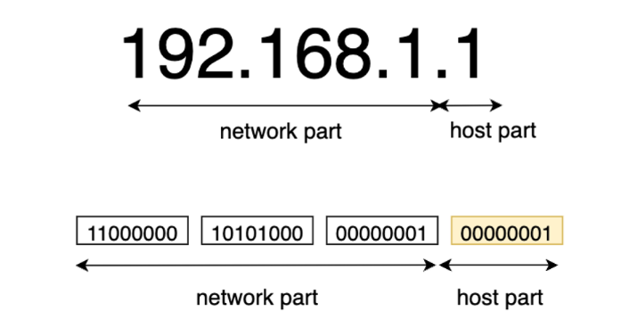
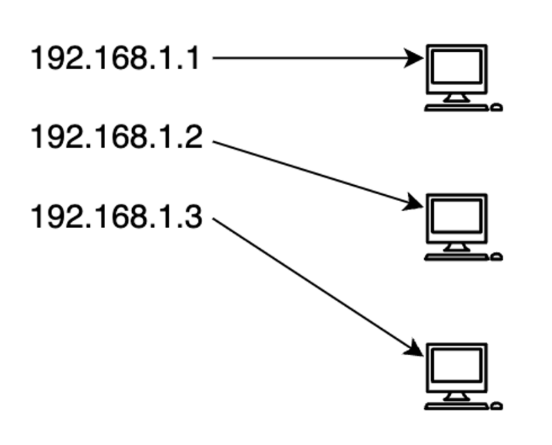

# IPv4 주소 체계와 서브넷팅
## IP 주소
- 특정 PC의 주소를 나타내는 체계
- TCP/IP 네트워크 모델 구조에서 컴퓨터를 식별하기 위해 사용하는 주소
- IPv4 기준 192.xxx.xxx.xxx
## IPv4 주소체계의 구조
### 표현
- 0.0.0.0 - 255.255.255.255
- 2^32 개로 약 43억 개 주소 가능
- 마침표로 구분된 4개의 8비트 필드

- 네트워크부와 호스트부로 나뉨
	- 네트워크부: 어떤 네트워크인지 알 수 있는 정보
	- 호스트부: 그 네트워크 안의 특정 컴퓨터를 지칭하는 정보
## 서브넷 마스크 (Subnet Mask)
- 하나의 IP 네트워크 주소를 다시 여러 IP 서브 네트워크로 분할하는 기능을 수행
- IP 네트워크 ID 주소부를 나타내는 영역을 IP 호스트 주소 영역까지 확장하여, 하나의 IP 네트워크 주소를 또 다른 여러 개의 IP 네트워크 주소로 만듦
## IP 주소의 할당과 관리

- IP 주소는 처음부터 주어지는 것이 아닌 할당이 되는 것
- 호스트부를 변경하면서 IP 할당 이루어짐
## IP 프로토콜의 한계
- IP 프로토콜은 비연결성 비신뢰성 프로토콜
- 받을 대상 x, 특정한 이유로 서비스 불능 상태에 빠지더라도 데이터를 받을 상대의 상태 파악이 불가능
	- 패킷을 그대로 전송하는 비연결성 문제가 있음
- 패킷이 사라져도 송신 기기측에서 알 수 없음
- 이런 한계 극복을 위해 TCP, UDP 함께 사용
# 공인 IP와 사설 IP
## 공인 IP (Public IP)
- ISP(인터넷 서비스 공급자)가 제공하는 IP 주소
- 외부에 공개
- 전세계에서 유일한 IP 주소를 가짐
- 인터넷에 연결된 다른 PC로부터의 접근 가능
	- 사용하는 경우에 방화벽 등의 보안 프로그램 필요
## 사설 IP (Private IP)
- 일반 가정이나 회사 내 등에 할당된 네트워크의 IP 주소
- 로컬 IP, 가상 IP
- IPv4의 주소 부족으로 인해 서브넷팅된 IP
	- 라우터에 의해 로컬 네트워크상의 PC
# ARP 프로토콜 동작 원리