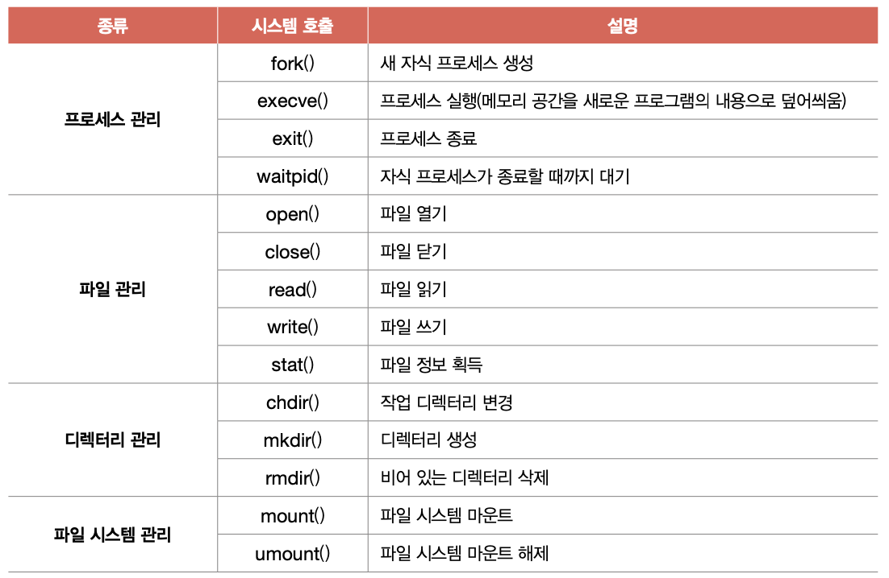

# 9. 운영체제 시작하기
## 1. 운영체제를 알아야 하는 이유
### 운영체제란
- 시스템 자원: 프로그램 실행에 마땅히 필요한 요소들
- 운영체제: 실행할 프로그램에 필요한 자원 할당, 프로그램이 올바르게 실행되도록 돕는 특별한 프로그램
	- 컴퓨터가 부팅될 때 메모리 내 *커널 영역*에 따로 적재되어 실행
	- 사용자 영역: 커널 영역을 제외한 나머지, 사용자가 이용하는 응용 프로그램이 적재되는 영역

- 응용 프로그램과 하드웨어 사이에서 응용 프로그램에 필요한 자원 할당, 올바르게 실행되도록 관리
### 운영체제를 알아야 하는 이유
- *문제 해결의 실마리*를 찾을 수 있다
## 2. 운영체제의 큰 그림
### 운영체제의 심장, 커널
- 운영체제의 핵심 서비스를 담당하는 부분

- 운영체제가 제공하는 서비스 중 *커널에 포함 X*
	- 사용자 인터페이스: 윈도우의 바탕화면과 같이 사용자가 컴퓨터와 상호작용할 수 있는 통로
		- 그래픽 유저 인터페이스(GUI: Graphic User Interface)
		- 커맨드 라인 인터페이스(CLI: Command Line Interface)
### 이중 모드와 시스템 호출
- 운영체제는 응용 프로그램이 자원에 직접 접근하는 것을 막아 자원 보호
- 이중 모드(dual mode): CPU가 명령어를 실행하는 모드를 크게 사용자 모드와 커널 모드로 구분하는 방식
	- 사용자 모드(user mode): 운영체제 서비스를 제공받을 수 없는 실행 모드
		- 커널 영역 코드 실행 불가능한 모드
		- 입출력 명령어 같은 하드웨어 자원에 접근 불가능
	- 커널 모드(kernel mode): 운영체제 서비스를 제공받을 수 있는 실행 모드
		- 커널 영역의 코드 실행
		- 자원에 접근하는 명령어 등 모든 명령어 실행 가능
- 시스템 호출(system call): 운영체제 서비스를 제공받기 위한 요청
	- 일종의 인터럽트임 (소프트웨어적인 인터럽트)

1. 하드디스크에 데이터를 저장하는 시스템 호출 발생시켜 커널 모드로 전환
2. 운영체제 내의 '하드디스크에 데이터를 저장하는 코드'를 실행함으로써 하드디스크에 접근
3. 하드디스크에 접근이 끝났다면 다시 사용자 모드로 복귀
### 운영체제의 핵심 서비스
#### 프로세스 관리
- 프로세스: 실행중인 프로그램
	- 일반적으로 CPU는 한 번에 하나의 프로세스만 실행 가능
	-> 운영체제가 프로세스 관리&실행
#### 자원 접근 및 할당
##### CPU
- 프로세스에게 CPU를 공정하게 할당하기 위해 *CPU 스케줄링*
##### 메모리
- 프로세스를 어느 주소에 적재할지, 메모리 공간 관리
##### 입출력장치
- 인터럽트 서비스 루틴(인터럽트를 처리하는 프로그램) 제공함으로써 입출력 작업 수행
##### 파일 시스템 관리
- 파일/폴더 열기, 생성, 삭제 등 파일 시스템도 운영체제가 관리
	- 보조기억장치 속 데이터를 파일과 디렉토리로 관리
### 가상 머신과 이중 모드의 발전
- 가상 머신: 소프트웨어적으로 만들어낸 가상 컴퓨터

- 가상화 지원하는 CPU는 가상 머신을 위한 모드인 *하이퍼바이저 모드*를 따로 제공
### 시스템 호출의 종류

# 10. 프로세스와 스레드
## 1. 프로세스 개요
- 프로세스: 실행 중인 프로그램 자체
### 프로세스 직접 확인하기
- 포그라운드 프로세스: 사용자가 보는 앞에서 실행되는 프로세스
- 백그라운드 프로세스: 사용자가 보지 못하는 뒤편에서 실행되는 프로세스
	- 데몬: 유닉스 체계의 운영체제에서 백그라운드 프로세스를 부르는 이름
	- 서비스: 윈도우 운영체제에서 "
### 프로세스 제어 블록

- *프로세스 제어 블록(PCB: Process Control Block)*: 프로세스의 실행 순서 관리, 프로세스에 자원 배분을 위해 이용
	- 프로세스와 관련된 정보를 저장하는 자료 구조
	- 커널 영역에 생성
#### 프로세스 ID (PID)
- 특정 프로세스를 식별하기 위해 부여하는 고유한 번호
#### 레지스터 값
- 프로세스는 자신의 실행 차례가 돌아오면 이전까지 사용한 레지스터의 중간값 모두 복원
#### 프로세스 상태
- 프로세스 상태 정보
	- 입출력장치를 위해 기다리는지
	- CPU 사용을 위해 기다리는지
	- CPU 이용하고 있는지 등
#### CPU 스케줄링 정보
- 언제, 어떤 순서로 CPU를 할당받을지
#### 메모리 관리 정보
- 프로세스가 메모리 어느 주소에 저장되어 있는지
#### 사용한 파일과 입출력장치 목록
- 프로세스 실행 과정에서 특정 입출력장치나 파일 사용하면 PCB에 정보 명시됨
### 문맥 교환(context switch)
- 문맥: 하나의 프로세스 수행을 재개하기 위해 기억해야 할 정보
	- 문맥을 잘 기억해둬야 해당 프로세스 실행 재개 가능 -> CPU 사용 끝나면 PCB에 문맥 백업

- 문맥 교환: 기존 프로세스의 문맥을 PCB에 백업하고, 새로운 프로세스를 실행하는 것
### 프로세스의 메모리 영역
#### 코드 영역 (텍스트 영역)
- 실행할 수 있는 코드, 기계어로 이루어진 명령어 저장
- 정적 할당 영역
#### 데이터 영역
- 잠깐 썼다가 없앨 데이터가 아닌 프로그램이 실행되는 동안 유지할 데이터가 저장되는 공간
	- ex. 전역 변수
- 정적 할당 영역
#### 힙 영역
- 프로그램을 만드는 사용자, 프로그래머가 직접 할당할 수 있는 저장 공간
	- 프로그래밍 과정에서 힙 영역에 메모리 할당했다면 언젠간 반환해야됨
	- *메모리 누수*: 메모리 반환하지 않으면 계속 남아 메모리 낭비 초래
- 동적 할당 영역
#### 스택 영역
- 데이터를 일시적으로 저장하는 공간, 잠깐 쓰다가 말 값들이 저장됨
	- ex. 매개 변수, 지역 변수
- 동적 할당 영역
## 2. 프로세스 상태와 계층 구조
### 프로세스 상태
#### 생성 상태(new)
- 프로세스를 생성 중인 상태
- 이제 막 메모리에 적재되어 PCB를 할당받은 상태
#### 준비 상태(ready)
- 당장이라도 CPU를 할당받아 실행할 수 있지만 자신의 차례가 아니어서 기다리고 있는 상태
#### 디스패치(dispatch)
- 준비 상태 -> 실행 상태
#### 실행 상태(running)
- CPU를 할당받아 실행 중인 상태
#### 대기 상태(blocked)
- 입출력장치의 작업을 기다리는 상태
#### 종료 상태(terminated)
- 프로세스가 종료된 상태
#### 프로세스 상태 다이어그램

### 프로세스 계층 구조
- 부모 프로세스: 새 프로세스를 생성한 프로세스
- 자식 프로세스: 부모 프로세스에 의해 생성된 프로세스
- PPID(Parent PID): 일부 운영체제에서 자식 프로세스의 PCB에 부모 프로세스의 PID 기록
- 프로세스 계층 구조

### 프로세스 생성 기법
- 복제와 옷 갈아입기
	- fork: 부모 프로세스는 자신의 복사본을 자식 프로세스로 생성
	- exec: 만들어진 복사본은 자신의 메모리 공간을 다른 프로그램으로 교체
	- 둘다 시스템 호출

## 3. 스레드
- 스레드: 실행의 단위, 프로세스를 구성하는 실행의 흐름 단위
### 프로세스와 스레드
- 단일 스레드 프로세스: 하나의 실행 흐름을 가지고 한 번에 하나의 부분만 실행되는 프로세스
- 멀티 스레드 프로세스: 하나의 프로세스가 여러 일을 동시에 처리할 수 있음
- 스레드의 구성 요소
	- 스레드 ID
	- 레지스터 값(프로그램 카운터 등)
	- 스택
- 스레드 실행에 필요한 최소한의 정보를 유지한 채 프로세스의 자원을 공유하여 사용
### 멀티프로세스와 멀티스레드
- 멀티프로세스: 여러 프로세스를 동시에 실행하는 것
- 멀티스레드: 여러 스레드로 프로세스를 동시에 실행하는 것

- 장점
	- 메모리 더 효율적으로 사용
	- 프로세스 자원을 공유하기 때문에 협력/통신에 유리
- 단점
	- 하나의 스레드에 문제가 생기면 프로세스 전체에 문제가 발생할 수 있음