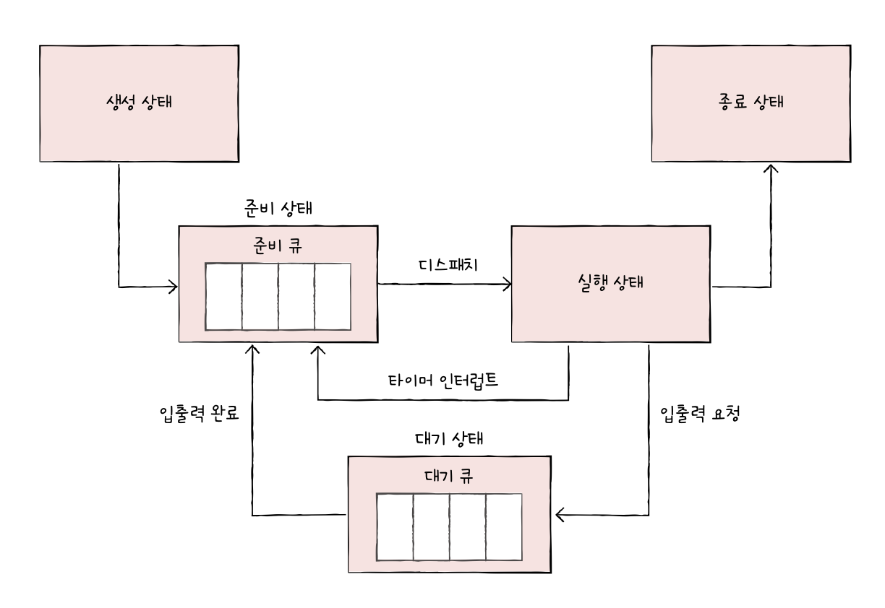

# 11. CPU 스케줄링
## 1. CPU 스케줄링 개요
- CPU 스케줄링: 운영체제가 프로세스들에게 공정하고 합리적으로 CPU 자원을 배분하는 것
### 프로세스 우선순위
- 우선순위가 프로세스마다 다름

- 입출력 집중 프로세스: 입출력 작업이 많은 프로세스
- CPU 집중 프로세스: CPU 작업이 많은 프로세스
- 프로세스의 중요도에 맞게 CPU를 이용할 수 있도록 운영체제가 프로세스마다 *우선순위 부여*
### 스케줄링 큐
- CPU가 프로세스마다 PCB를 검사하는 것은 비효율적
	- 줄이 필요함
- 스케줄링 큐에 프로세스 삽입하여 관리
	- 준비 큐: CPU를 이용하고 싶은 프로세스들이 서는 줄
	- 대기 큐: 입출력장치를 이용하기 위해 대기 상태에 접어든 프로세스들이 서는 줄

### 선점형과 비선점형 스케줄링
- 선점형 스케줄링: 운영체제가 프로세스로부터 자원을 강제로 빼앗아 다른 프로세스에 할당할 수 있는 스케줄링 방식
	- 장점: 한 프로세스의 자원 독점 막음
	- 단점: 교환 과정에서 오버헤드 발생 가능
- 비선점형 스케줄링: 사용 중인 프로세스가 비킬 때까지 끼어들 수 없음
	- 장점: 오버헤드가 선점형보다 작음
	- 단점: 모든 프로세스가 골고루 자원 사용 불가능
## 2. CPU 스케줄링 알고리즘
### 스케줄링 알고리즘의 종류
#### 선입 선처리 스케줄링 (FCFS: First Come First Scheduling)
- 비선점형
- 단순히 큐에 삽입된 순서대로
- *호위 효과(convoy effect)*: 짧은 실행 시간을 위해 훨씬 긴 시간을 기다림
#### 최단 작업 우선 스케줄링 (SJF: Shortest Job First Scheduling)
- 기본적으로 비선점형 (선점형도 가능)
- CPU 이용 시간의 길이가 가장 짧은 프로세스부터 실행
#### 라운드 로빈 스케줄링 (Round Robin)
- 선점형
- 타임 슬라이스: 프로세스가 CPU를 사용할 수 있는 정해진 시간
- 타임 슬라이스만큼 돌아가며 CPU 이용

#### 최소 잔여 시간 우선 스케줄링 (SRT: Shortest Remaining Time)
- 선점형
- 최단 작업 우선 + 라운드 로빈
- 최소 잔여 시간 우선 스케줄링 하에서 정해진 타임 슬라이스 만큼 사용, 그 후 남은 작업 시간이 가장 짧은 프로세스가 선택됨
#### 우선순위 스케줄링 (priority scheduling)
- 프로세스에 우선순위 부여, 가장 높은 우선순위부터 실행
- 기아 현상: 우선순위가 낮은 프로세스는 계속해서 실행이 연기될 수 있음
- 에이징: 기아 현상 방지, 우선순위를 나이 먹듯 점차 높여줌
#### 다단계 큐 스케줄링 (multilevel queue scheduling)
- 우선순위 별로 준비 큐 여러 개 사용
- 우선순위가 가장 높은 큐 먼저 처리, 비어 있으면 그다음 우선순위 큐 처리

#### 다단계 피드백 큐 스케줄링
- 다단계 큐 스케줄링의 발전된 형태
	- 큐 사이를 이동할 수 없음 -> 기아 현상 발생 가능
- 프로세스들이 큐 사이 이동 가능
	- 해당 큐에서 끝내지 못하면 다음 큐에 삽입 -> 점점 우선순위 낮아짐
	- 너무 오래 기다린 프로세스는 높은 큐로 이동

# 예상 질문
1. 선점형과 비선점형 스케줄링의 차이점을 말해주세요
2. FCFS 스케줄링의 단점에 대해 말해주세요