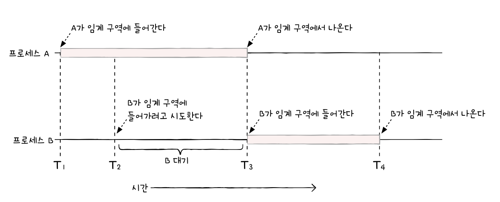
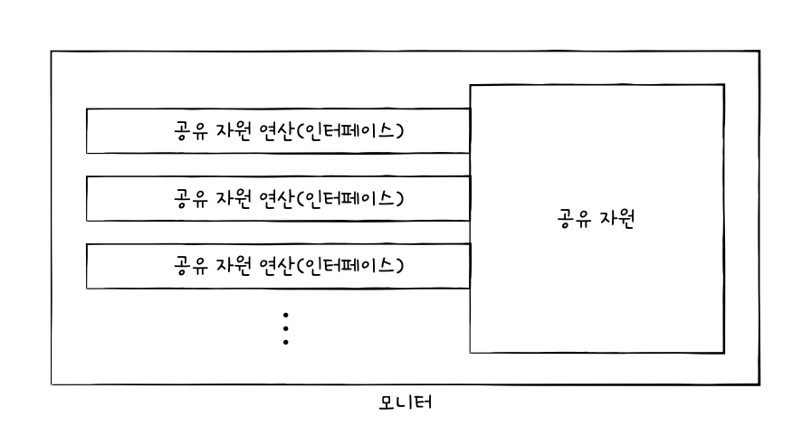
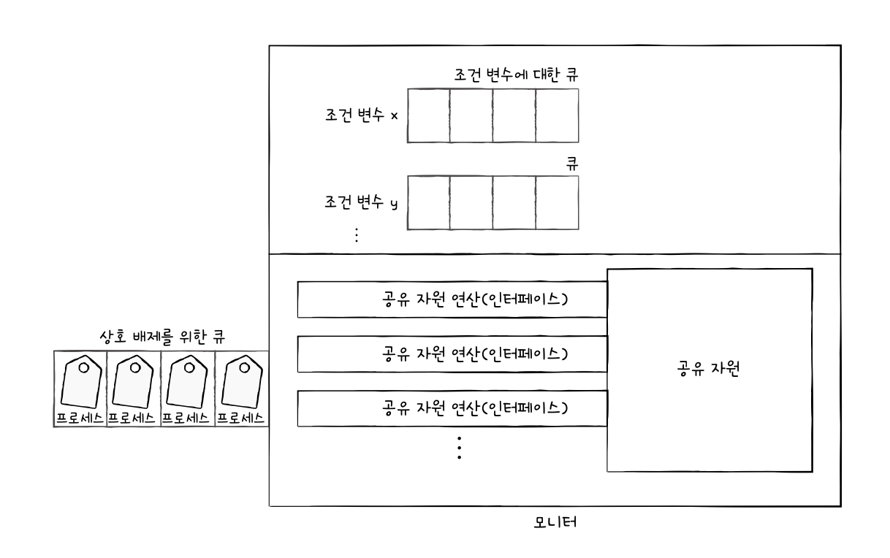

# 12. 프로세스 동기화
## 1. 동기화란
### 동기화의 의미
- 동기화(synchronization): 작업들 사이의 수행 시기를 맞추는 것
- 프로세스 동기화: 프로세스들 사이의 수행 시기를 맞추는 것
#### 1. 실행 순서 제어를 위한 동기화
- 프로세스를 올바른 순서대로 실행
#### 2. 상호 배제를 위한 동기화
- 동시에 접근해서는 안 되는 자원에 하나의 프로세스만 접근하게 하기
- 상호 배제: 공유가 불가능한 자원의 동시 사용을 피하기 위해 사용하는 알고리즘
### 생산자와 소비자 문제
- 생산자는 총합 +1
- 소비자는 총합 -1
- 생산 100000, 소비 100000 동시에 실행하면 총합이 이상하게 나옴
	- 상호 배제가 안되었기 때문
### 공유 자원과 임계 구역
- 공유 자원: 여러 프로세스가 접근하는 자원(전역 변수, 파일, 입출력장치, 보조기억장치 등)
- *임계 구역*: 동시에 실행하면 문제가 발생하는 자원에 접근하는 코드 영역

- 임계 구역에 먼저 진입한 프로세스의 작업이 끝나야 다음 프로세스가 진입 가능
- *레이스 컨디션*: 여러 프로세스가 동시 다발적으로 임계 구역의 코드를 실행하여 문제가 발생하는 경우
- 상호 배제를 위한 동기화를 위한 세 가지 원칙
	- 상호 배제
	- 진행: 임계 구역에 어떤 프로세스도 없으면 진입하고자 하는 프로세스 들어갈 수 있음
	- 유한 대기: 임계 구역에 진입하고 싶어하는 프로세스는 언젠간 임계 구역 들어올 수 있어야 함
## 2. 동기화 기법
### 뮤텍스 락
- 동시에 접근해서는 안 되는 자원에 동시에 접근하지 않도록 만드는 도구
- 구현 방법
	- 자물쇠 역할: 프로세스들이 공유하는 전역 변수 lock
	- 임계 구역을 잠그는 역할: acquire 함수
	- 임계 구역의 잠금을 해제하는 역할: release 함수
#### acquire 함수
- lock이 false가 될 때까지 임계 구역 반복적 확인
- 열려있다면 lock을 true로 바꿈
#### release 함수
- lock을 false로 바꿈
#### 바쁜 대기
- 프로세스는 반복적으로 lock을 확인함, 이런 대기 방식
### 세마포 (semaphore)
- 공유 자원이 여러 개 있는 상황에서도 적용이 가능한 동기화 도구
- 프로세스는 임계 구역 앞에서 멈춤 신호를 받으면 기다리고, 가도 좋다는 신호를 받으면 들어감
- 구현 방법
	- 전역 변수 S: 임계 구역에 진입할 수 있는 프로세스 개수
	- wait 함수: 들어가도 좋은지, 기다려야 할지 알려줌
	- signal 함수: 임계 구역 앞에서 기다리는 프로세스에게 가도 된다고 신호를 주는 함수
#### 문제점
- 뮤텍스락에도 동일한 문제점 발생
- 바쁜 대기를 확인할 때 CPU 주기를 낭비하게 됨
	- 해결하기 위해 세마포는 더 좋은 방법 사용
	- 대기 큐, 준비 큐로 wait 함수의 무한 반복 확인 없앰
### 모니터
#### 세마포의 잘못된 사용
- 세마포 누락
- wait, signal 순서 헷갈림
- wait, signal 중복 사용
- 세마포보다 사용하기 편리한 도구로서 모니터 사용
#### 방법

- 공유 자원에 접근하고자 하는 프로세스를 큐에 삽입
- 삽입된 순서대로 공유 자원 이용
- 모니터 내에 항상 상호 배제를 위한 동기화 제공
- 실행 순서 제어를 위한 동기화 제공
- *조건 변수*: 프로세스나 스레드의 실행 순서를 제어하기 위해 사용하는 특별한 변수

- 상호배제를 위한 큐: 모니터에 하나의 프로세스만 진입하도록 만들어진 큐
- 조건 변수에 대한 큐: 모니터에 이미 진입한 프로세스의 실행 조건이 만족될 때까지 잠시 실행이 중단되어 기다리기 위해 만들어진 큐
# 예상 질문
1. 레이스 컨디션이 뭔지 설명해주세요
2. 뮤텍스와 세마포어의 차이점에 대해 설명해주세요