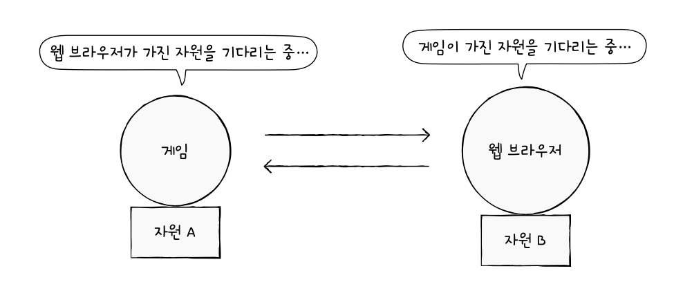

# 13. 교착 상태
## 1. 교착 상태란
### 식사하는 철학자 문제
- 교착 상태: 일어나지 않을 사건을 기다리며 진행이 멈춰 버리는 현상

### 자원 할당 그래프
1. 프로세스는 원으로, 자원의 종류는 사각형으로 표현
2. 사용할 수 있는 자원의 개수는 자원 사각형 내에 점으로 표현
3. 프로세스가 어떤 자원을 할당받아 사용 중이라면 자원에서 프로세스를 향해 화살표 표시
4. 프로세스가 어떤 자원을 기다리고 있다면 프로세스에서 자원으로 화살표 표시
### 교착 상태 발생 조건
#### 상호 배제
#### 점유와 대기
#### 비선점
#### 원형 대기
- 요청 및 할당받은 자원이 원의 형태
## 2. 교착 상태 해결 방법
###  교착 상태 예방
- 상호 배제 없앰
- 점유와 대기 없앰
- 비선점 조건 없앰
- 원형 대기 조건 없앰
### 교착 상태 회피
- 교착 상태가 발생하지 않을 정도로만 조심 조심 자원 할당
- 안전 상태: 교착 상태 없이 정상적으로 자원 할당, 종료 가능한 상태 (안전 순서열 대로)
- 불안전 상태: 교착 상태가 발생할 수도 있는 상황 (안전 순서열이 없는 상황)
- 안전 순서열: 교착 상태 없이 안전하게 프로세스들에 자원을 할당할 수 있는 순서
### 교착 상태 검출 후 회복
#### 선점을 통한 회복
#### 프로세스 강제 종료를 통한 회복
#### 잠재적 무시를 무시로 대처하는 방법
- 타조 알고리즘
# 예상 질문
1. 교착 상태의 발생 조건 중 하나 설명해주세요
2. 교착 상태 회피 방식에 대해 설명해주세요