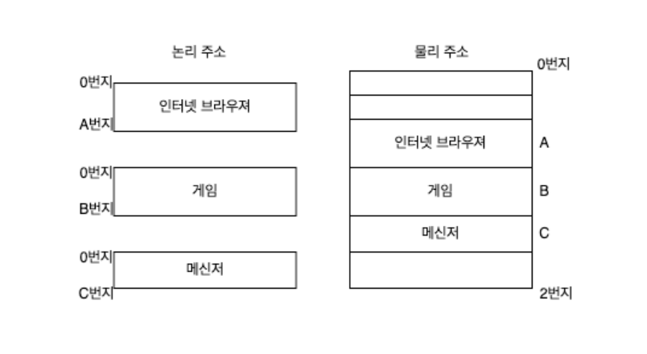
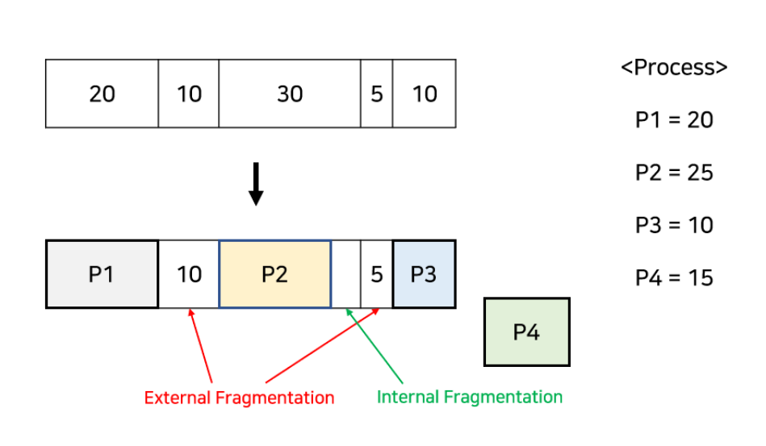
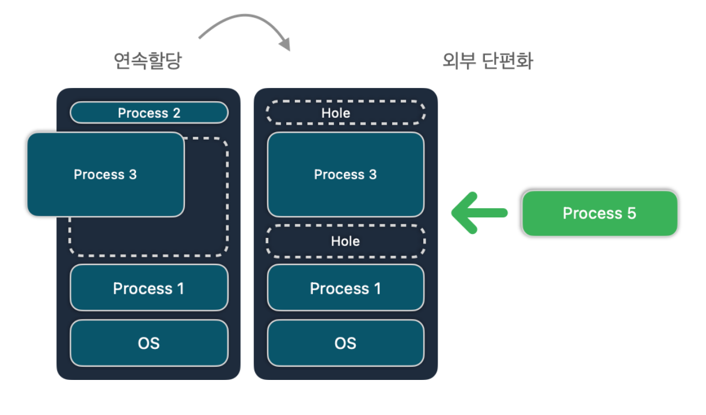
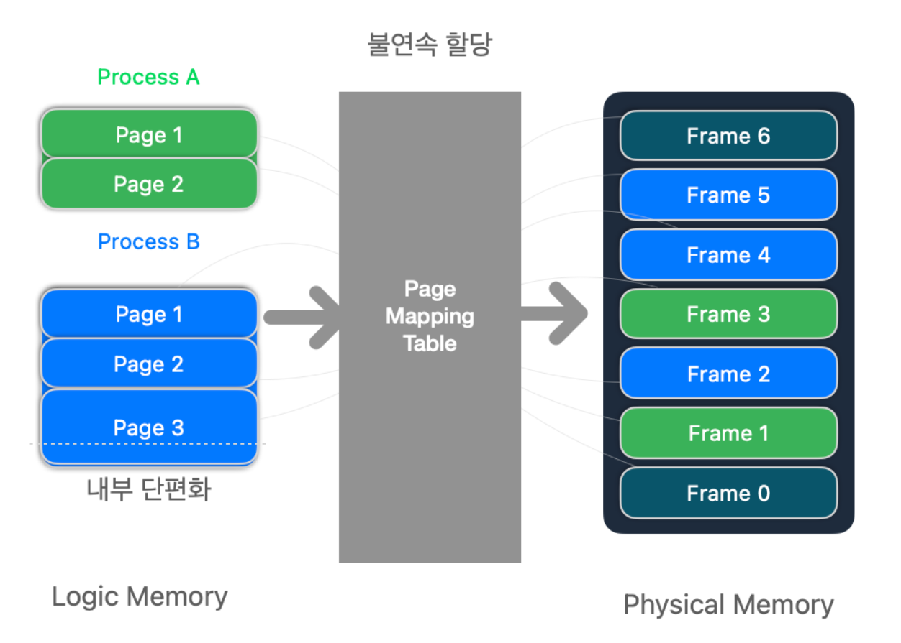
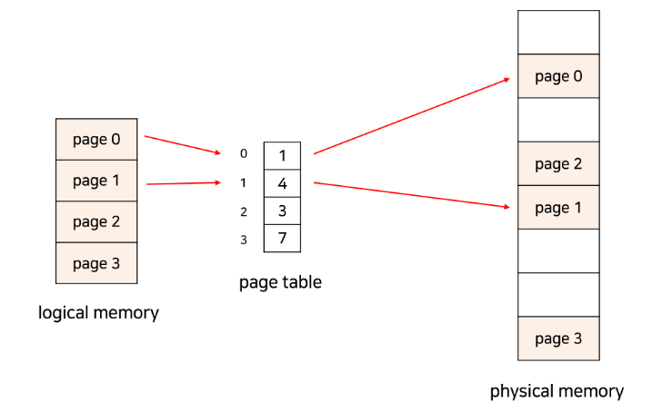
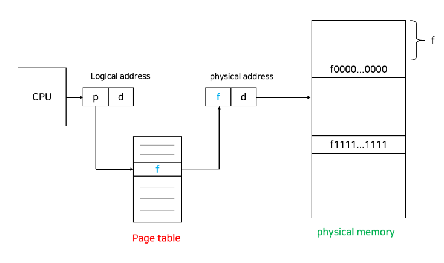

# 메모리 관리
- 운영체제의 대표적인 일 중 하나
- 사용자가 쉽게 메모리를 사용할 수 있게 도와주는 것
- 메모리를 효율적으로 관리
- 교착 상태를 막기 위해 메모리 보호
- [!] 메모리: 컴퓨터의 기억을 담당, 상태나 명령어 등 기록하는 장치
## 사전 개념
### 링킹 (Linking)
- 기계어 파일들을 라이브러리 파일들을 링킹(linking)하여 실행 가능한 파일로 만드는 역할
#### 정적 링킹
- 코드 유출을 막고 시간을 단축시키지만 컴파일할 때마다 공통 라이브러리를 포함시켜야 해서 메모리 문제 발생
#### 동적 링킹
- 하나를 올려놓고 왔다갔다하면서 사용하는 방법으로 메모리를 적게 사용 (오버헤드 발생)
### 로딩 (Loading)
- 프로그램을 실행시킬 때 메모리에 파일(데이터)를 적재하는 것
#### 동적 적재(Dynamic Loading)
- 메모리 크기가 프로세스 크기보다 큰 경우에 사용하는 방식으로 필요할때만 사용하고 빼내는 방식
#### 오버레이 적재(Overlays Loading)
- 프로세스가 더 클 때 사용
- 프로세스 두 개가 있다면 A를 올린 다음 끝내고 B를 올리는 방식
- 사람이 직접 구현해야한다는 단점 존재
→ 단점을 보완하고자 Paging 기법, VMM이 현재도 사용됨 (사람대신 OS가 관리하기 때문)
### VMM (Virtual Machine Moniter)
- 스와핑은 프로세스 단위, VMM은 페이징 단위로 메인 메모리에 페이지를 올리고 빠진 페이지를 보조 기억장치에 저장했다가 바꿔줌
#### \[참고] 스와핑(Swaping)
- 메모리에 최대 10개의 프로세스를 올릴 수 있다고 할 때, 11번째 프로세스를 실행시킨다면 10개 중 하나를 내리고 11번째를 올리자 → Swap Out 이라고 함
- 빼낸 프로세스는 버려지는게 아니라 보조 기억장치에 실행 상태를 유지하게 됨 → 11번쨰 프로세스가 종료되고 보조기억장치에 있던 프로세스를 올리는 것이 Swap In
### 바인딩 (메모리 주소 할당)
- 데이터를 메모리에 저장할 떄, 데이터에 저장된 메모리 주소를 명시하는 것
- 현대에는 마지막 방법을 적용함
#### 1. 컴파일시 메모리 주소 할당
- 물리적인 주소만을 사용해 물리주소와 논리주소가 동일 (물리주소 직접 접근)
#### 2. 로드타임 메모리 주소 할당
- 동일한 주소의 프로그램을 사용하고 있지 않으니 다른 논리주소(가상주소) 사용
- 이렇게 매핑해주는 것이 MMU
#### 3. 실행타임 메모리 주소 할당
- 매번 메모리에 로딩할 때, 주소 변환 작업을 해야하므로 병목현상 발생
- 하드웨어가 대신 변환할 때 연산을 해준다.

## 메모리 관리 기법 (연속 메모리 할당, 분할 메모리 할당)
#### 단편화 (Fragmentation)
- 프로세스들이 메모리에 적재되고 제거되는 일이 반복되면 프로세스들이 차지하는 메모리 틈 사이에 사용하지 못할 만큼의 작은 공간들이 늘어나게 되는 현상
1. 외부 단편화
   - 총 공간을 계산했을 때 프로세스가 들어갈 수 있는 메모리가 있음에도 불구하고 공간들이 연속하지 않아 사용할 수 없는 경우
   - 데이터에게 메모리를 할당할 때 연속적으로 할당할 때
2. 내부 단편화
   - 프로세스가 사용하는 메모리 공간보다 분할된 공간이 더 커서 메모리가 남는 경우

### 연속 할당 (Contiguous Allocation)
- 말 그대로 메모리 주소를 연속적으로 사용하기 때문에 두가지로 분할해서 올릴 수 없는 할당 방법
#### 단일 프로그래밍(Uni)
- 오직 하나의 프로그램만 저장
- 두 개가 들어오면 하나가 끝난 다음에 다음 프로그램이 저장됨 (오버레이)
#### 다중 프로그래밍
- 다른 프로세스들도 같이 저장하는 멀티 프로그래밍 방식
##### 1. 고정 분할 방식 (MFT, Fixed)
   - 메모리를 미리 나누어 공간을 할당하기 때문에 내부 단편화가 발생할 수 있음
   - 프로세스가 고정 파티션 크기보다 클 수 있음
##### 2. 가변 분할 방식 (MVT, Variable)
   - 프로그램 크기에 맞게 나눠 사용
   - 외부 단편화 발생 가능

#### 프로세스는 어디에 넣는게 적합할까?
- 새로운 프로세스를 어디에 넣는게 적합할지 판단하는 기준이 있음
1. 최초 적합(First-fit) : 메모리를 탐색하다 최초로 발견되는 공간에 할당하는 기법 (속도 최적)
2. 최적 적합(Best-fit) : 모든 공간을 다 탐색하고 가장 적합한 공간에 넣는 기법 (공간 최적)
3. 최악 적합(Worst-fit) : 불필요한 공간에 넣는 기법 (프로세스 크기 차이가 많이 나는 곳에 할당)
### 불연속 할당(Noncontiguous Allocation)
- 페이지들을 메모리 적재하는 것
- 페이징(Paging): 프로세스를 고정된 크기로 쪼갠 단위

- 그림처럼 A, B라는 프로세스를 물리 메모리에 적재해 실행시킨다고 가정
	- Page Mapping table이란 것을 통해 물리주소에 적재되는 것을 볼 수 있음
	- 물리 메모리에 프레임 뒤죽박죽으로 섞여있고 가상메모리는 정리되어있음
	- *매핑 테이블이 대응되는 페이지와 프로세스끼리 연속적으로 연결해주어서 순차적으로 프레임을 실행*시키게 도와줌
	- 이렇게 물리 메모리에 불연속적으로 할당되는 것을 불연속 할당이라고 한다.
#### 고정 분할(페이징 paging)
- 외부 단편화의 압축 작업의 비효율성을 해결하기 위한 방법
- 메모리 - *프레임(Frame)*, 프로세스 - *페이지(Page)* 라 불리는 고정 크기의 블록(Block)으로 분리됨
- *한 프로세스가 사용하는 공간은 여러 page로 나뉘어 관리되고, 각각의 page는 순서와 관계 없이 메모리의 frame에 mapping되어 저장*
  
  - 프로세스가 순서대로 메모리에 저장되지 않기 때문에 프로세스 실행을 위해선 page가 어느 frame에 들어있는지를 알아야 함
	  - page table이라는 테이블에 저장
	  - 이 테이블을 이용해 논리적 주소 -> 물리적 주소 변환
##### 장점
- page들이 연속할 필요가 없어 외부 단편화 해결
- 할당&해제 빠름
- swap out 간단
- 코드 쉽게 공유
##### 단점
- 내부 단편화 해결 못함 (그림 참고)
- page table을 위한 메모리 추가 소모
- page table이 메모리에 상주하기 때문에 메모리에 접근하는 연산은 2번의 메모리 접근 필요 -> 속도 느려짐
	- 속도 향상을 위해 TLB(Translation Look-aside Buffer)라는 고속의 하드웨어 캐시 사용

#### 가변 분할(segmentation)
- 의미 단위로 하나의 프로세스를 나누는 것
	- 일반적으로 code, data, stack 부분이 하나의 세그먼트로 정의됨
- 논리적 주소: **<segment number, offset>** 으로 구성
	- 각각의 segment는 base, limit, protection 가짐
##### 장점
- segment들이 연속적으로 할당될 필요 x
- stack, heap이 독립적으로 커질 수 있음
- segment마다 protection을 따로 수행할 수 있음
-> paging과 유사한 장점들 가짐
##### 단점
- 반드시 연속적으로 할당해야 함
## 가상 메모리(Virtual Memory)
- 실제 메모리 크기보다 요구 메모리가 큰 프로그램(프로세스)를 실행하기 위해 사용
핵심 아이디어
- 모든 데이터를 주 기억장치에 올리지 않고, 필요한 것들만 올려서 사용
- 남은 것들은 보조 기억장치에 존재
- 필요할때 보조 -> 주 기억장치로 옮겨서 사용
가상메모리 주소 ≠ 실제 메모리 주소
- 가상 메모리 주소와 실제 메모리 주소 1:1 대응 시켜야함
	- 이를 해결해 주는 것이 MMU(Memory Management Unit)
### MMU (Memory Management Unit, 메모리 관리 장치)
- 논리주소를 물리주소로 변환
- 메모리 보호: 잘못된 주소를 참조하지 않게 막아줌
- 캐시 관리
- 메모리를 일정 단위로 쪼개서 관리
	- 쪼개는 방법에 따라 페이징, 세그멘테이션으로 나뉘는 것
but 단점 존재, *외부 단편화(External Fragmentation) 발생* → 현재 안 쓰게 됨