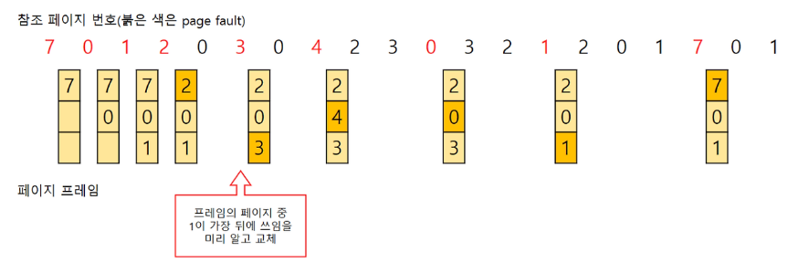
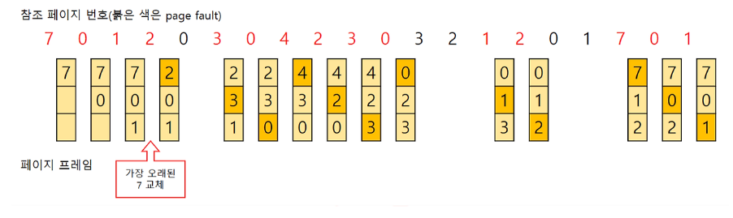
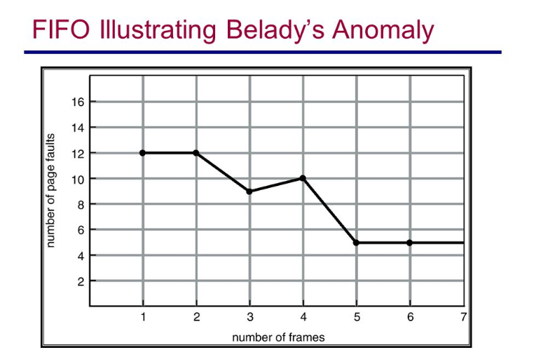
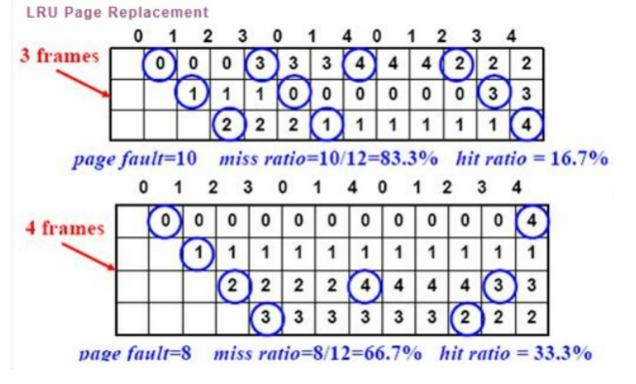
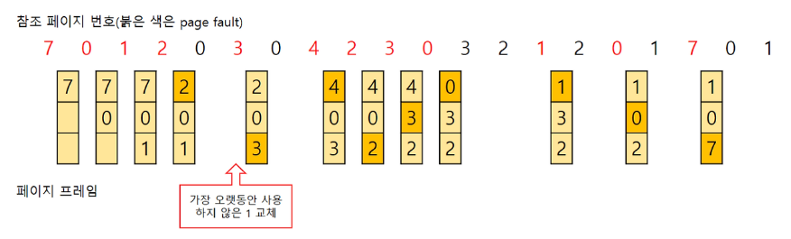
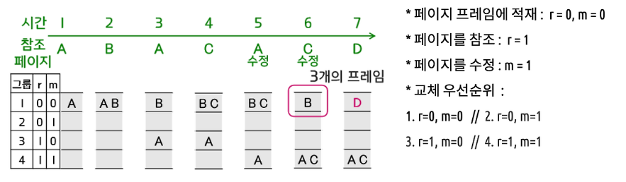

# 5주차: 페이지 교체 알고리즘 (FIFO, LRU, Optimal)
## OPT(Optimal)
>앞으로 가장 오랫동안 사용되지 않을 페이지 교체

- 가장 이상적임
- 프로세스가 앞으로 사용할 페이지를 미리 알아야 함 → 불가능
- 비교 연구 목적을 위해 사용
## FIFO (First In First Out)
>가장 먼저 들어온 페이지를 교체

- 메모리에 가장 먼저 올라온 페이지를 먼저 내보냄
- 간단하고, 초기화 코드에 대해 적절한 방법
- 들어온 시간을 저장하거나 올라온 순서를 큐에 저장
- 직관적으로 생각할 때 프레임의 수가 많아질수록 페이지 결함의 횟수는 감소함
- Belady's Anomaly(FIFO anomaly) : 실제로 그렇지 않게 되는 현상이 나타날 수 있다.
### Belady's Anomaly(벨레이디의 모순)
- *page fault* : 사용해야할 프로그램 조각이 메모리에 올라와있지 않으면 디스크에서 load를 해야하는데 이러한 상황
- page fault가 발생한 상황은 메모리에 모든 프레임이 할당된 상태이고 페이지 교체 알고리즘에 따라 새로운 페이지가 할당된다. 그렇다면 페이지 프레임을 증가시켜 페이지 수를 늘려준다면 사용하려는 페이지가 메모리에 없는 page fault가 발생 빈도가 줄어들고, 실행속도가 빨라진다고 추론할 수 있고 실제로도 그렇다.
- 가끔 페이지 수가 늘어날 수록 page fault가 발생하는 빈도가 늘어나는 경우가 있는데 이것이 *Belady's Anomaly*

## LRU(Least Recently Used)
> 가장 오랫동안 사용하지 않은 페이지를 교체

- 위의 3개 중에 가장 효율적 → 가장 많이 사용됨
- 가정: 가장 오랫동안 사용하지 않았던 데이터라면 앞으로도 사용할 확률이 적을 것이다.
	- 시간 지역성(temporal locality) 성질 고려함.
	- 최근에 참조된 페이지가 가까운 미래에 다시 참조될 가능성이 높은 성질
- 사용된 시간을 알 수 있는 부분을 저장하여 가장 오랫동안 참조되지 않는 데이터를 제거
	- 페이지마다 카운터 필요
- 큐로 구현가능
	- 사용한 데이터를 큐에서 제거하여 맨 위로 다시 올리고, 프레임이 모자랄 경우 맨 아래에 있는 데이터를 삭제
- 단점
	- 프로세스가 주기억장치에 접근할때마다 참조된 페이지 시간을 기록해야 하므로 막대한 오버헤드가 발생
	- 카운터나 큐, 스택과 같은 별도의 하드웨어가 필요
	- 카운터: 각 페이지별로 존재하는 논리적 시계(logical clock)로, 해당 페이지가 사용될때마다 0으로 클리어 시킨 후 시간을 증가시켜 시간이 가장 오래된 페이지를 교체
- 카운터 구현
	- 페이지 변경해야 할 경우 카운터를 보고 가장 작은 값을 찾음
		- 테이블 전체 검색 필요 → 프레임 갯수 크면 사용 못함
- 카운터 구현의 대안책 *스택 구현*
	- 페이지 번호 스택을 이중 링크 형식으로 유지
	- page referenced
		- 그것을 맨 위로 옮김
		- 6개의 포인터를 변경해야 함
	- 하지만 업데이트 할 때마다 비용이 더 많이 듦 (시간 많이 걸림)
## LFU (Least Frequently Used)
> 참조 횟수가 가장 낮은 페이지를 교체
- 잘 사용 안함 (구현 비용 많이 듦)
- 페이지의 참조 횟수로 교체할 페이지 결정
- LRU는 직전 참조된 시점만을 반영하지만, LFU는 참조횟수를 통해 장기적 시간규모에서의 참조성향 고려할 수 있음
- 단점
	- 가장 최근에 불러온 페이지가 교체될 수 있음
	- 구현 더 복잡
	- 막대한 오버헤드
## MFU (Most Frequently Used)
> 참조 횟수가 가장 많은 페이지 교체
- 잘 사용 안함 (구현 비용 많이 듦)
- 가정: 가장 많이 사용된 페이지가 앞으로는 사용되지 않을 것이다
## NUR = NRU (Not Used Recently, Not Recently Used)
> 클럭 알고리즘

- 최근에 사용하지 않은 페이지 교체 (LRU를 근사한 알고리즘)
- 교체되는 페이지의 참조 시점이 가장 오래되었다는 것을 보장하지는 못함
- 적은 오버헤드로 적절한 성능
- 동일 그룹 내에서 선택 무작위
- 각 페이지마다 두 개의 비트 *참조 비트(Reference Bit)* 와 *변형 비트(Modified Bit)* 가 사용됨
	- 참조비트: 페이지가 참조되지 않았을 때 0, 호출되었을 때 1
		- 모든 참조비트를 주기적으로 0으로 변경
	- 변형비트: 페이지 내용이 변경되지 않았을 떄는 0, 변경되었을 때 1
- 우선순위: 참조 > 변형