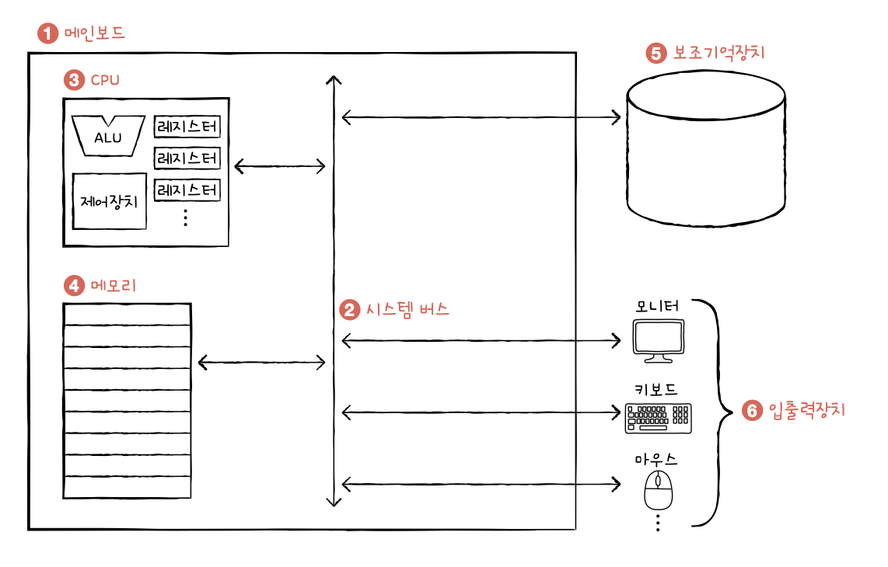
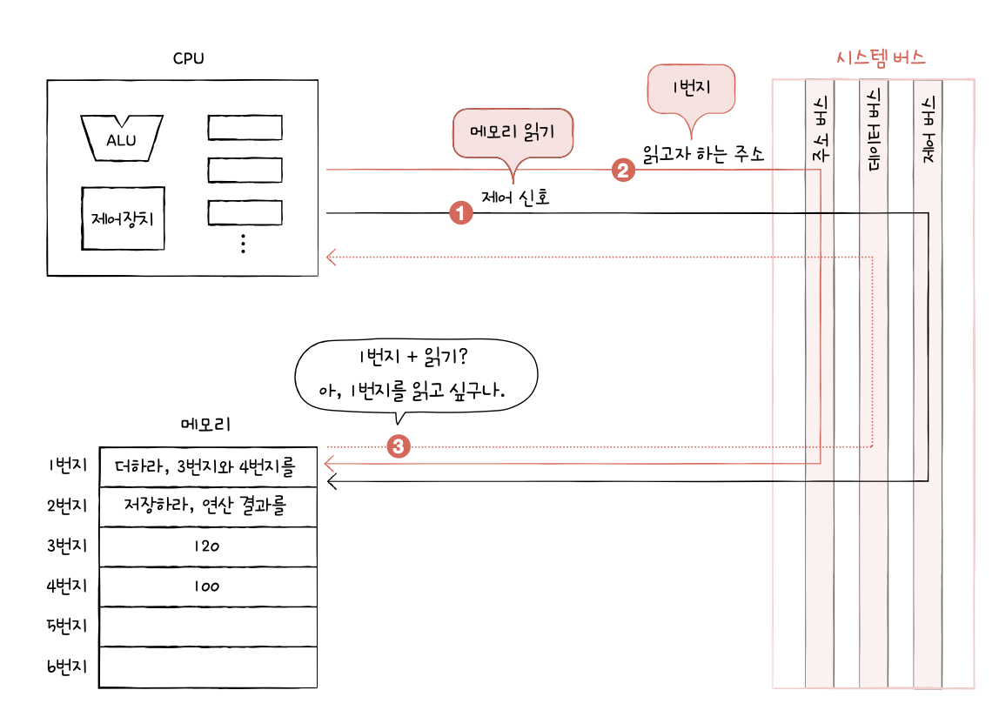

# 컴퓨터 구조 시작하기
## 1. 컴퓨터 구조를 알아야 하는 이유
### 문제 해결
- 컴퓨터 구조를 이해하면 문제 상황 진단 및 문제 해결 가능
### 성능, 용량, 비용
- 서버
## 2. 컴퓨터 구조의 큰 그림
### 컴퓨터가 이해하는 정보
- 데이터(data): 컴퓨터가 이해하는 정적인 정보
- 명령어(instruction): 데이터를 움직이고 컴퓨터를 작동시키는 정보
### 컴퓨터의 4가지 핵심 부품
- 중앙처리장치
- 주기억장치
- 보조기억장치
- 입출력장치

#### 메모리
- 현재 실행되는 프로그램의 명령어와 데이터를 저장하는 부품
- 주소: 저장된 값에 효율적으로 접근하기 위한 개념
#### CPU
- 컴퓨터의 두뇌
- 메모리에 저장된 명령어를 읽어 들이고, 읽어 들인 명령어를 해석하고 실행하는 부품
- 내부 구성 요소
	- 산술논리연산장치(ALU): 계산만을 위해 존재하는 부품
	- 레지스터: 임시 저장 장치
	- 제어장치: 제어 신호라는 전기 신호를 내보내고 명령어를 해석하는 장치
#### 보조기억장치
- 메모리의 단점
	1. 가격이 비싸 저장 용량이 적음
	2. 전원이 꺼지면 저장된 내용을 잃음
- 하드디스크, ssd 등
#### 입출력장치
- 컴퓨터 외부에 연결되어 컴퓨터 내부와 정보를 교환하는 장치
- 주변장치
#### 메인보드와 시스템 버스
- 메인보드라는 판에 부품 연결
- 내부에 버스라는 통로로 정보를 주고 받음
- 시스템 버스: 핵심 부품을 연결하는 가장 중요한 버스
	- 주소 버스: 주소를 주고 받는 통로
	- 데이터 버스: 명령어, 데이터
	- 제어 버스: 제어 신호

# 데이터
## 1. 0과 1로 숫자를 표현하는 방법
### 정보 단위
- 비트: 0과 1을 나타내는 가장 작은 정보 단위
- 바이트: 8비트
- 1킬로바이트: 1000바이트
### 이진법
- 0과 1로 모든 숫자를 표현하는 방법
- 이진수: 이진법으로 표현한 수
#### 이진수의 음수 표현
- 2의 보수: 어떤 수를 그보다 큰 2^n에서 뺀 값
- 플래그: 양수, 음수 구분을 위해 사용
#### 십육진법
- 수가 15를 넘어가는 시점에 자리 올림을 하는 숫자 표현 방식
#### 십육진수를 이진수로 변환하기
- 십육진수 각 자리를 4비트 이진수로 변환
#### 이진수를 십육진수로 변환하기
- 4자리씩 묶어 변환
## 2. 0과 1로 문자를 표현하는 방법
### 문자 집합과 인코딩
- 문자 집합: 컴퓨터가 인식하고 표현할 수 있는 문자의 모음
- 문자 인코딩: 문자를 0과 1로 변환하는 과정
- 문자 디코딩: 0과 1로 이루어진 문자 코드를 문자로 변환하는 과정
### 아스키 코드
- 아스키: 초창기 문자 집합 중 하나
- 아스키 코드: 아스키 문자에 대응된 고유한 수
### EUC-KR
- 한글 인코딩 방식
	- 완성형 인코딩: 초성, 중성, 종성의 조합으로 이루어진 완성된 글자에 고유한 코드 부여
	- 조합형 인코딩: 초성을 위한 비트열, 중성을 위한 비트열, 종성을 위한 비트열 할당
### 유니코드와 UTF-8
- 유니코드: 훨씬 다양한 문자, 기호 등을 표현 가능
- UTF-8: 유니코드 문자에 부여된 값을 인코딩하는 방식
# 예상 질문
1. 시스템 버스의 세 가지 구성 요소에 대해 설명해보세요
2. cpu의 핵심 기능에 대해 설명해보세요