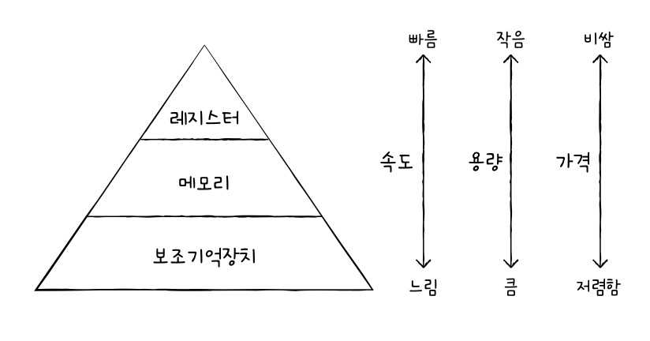
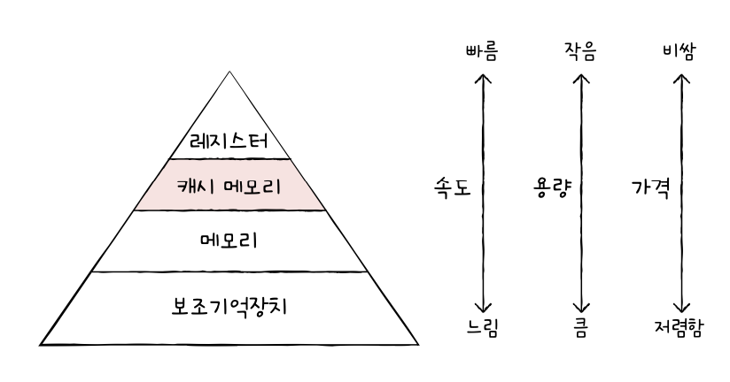
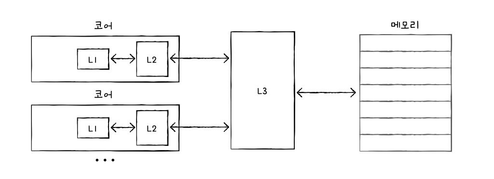

# 메모리와 캐시 메모리
## 1. RAM의 특징과 종류
### RAM의 특징
- 실행할 프로그램의 명령어와 데이터가 저장됨
- 휘발성 저장 장치: 전원을 끄면 저장된 내용이 사라짐 (RAM)
- 비휘발성 저장 장치: 전원이 꺼져도 저장된 내용이 유지됨 (보조기억장치)
### RAM의 용량과 성능
- RAM 용량이 클 때 장점
	- CPU가 실행하고 싶은 프로그램이 보조기억장치에 있다면 RAM으로 가져와야 함
	- 용량이 적으면 보조기억장치에서 실행할 프로그램을 가져오는 일이 잦아 실행 시간 길어짐
### RAM의 종류
#### DRAM
- Dynamic RAM
- 저장된 데이터가 동적으로 변하는(사라지는) RAM
- 단점
	- 시간이 지나면 저장된 데이터가 점차 사라짐
	- 데이터 소멸을 막기 위해 일정 주기로 데이터 재활성화(다시 저장) 필요
- 장점
	- 소비 전력 비교적 낮음
	- 저렴
	- 집적도 높음
#### SRAM
- Static RAM
- 저장된 데이터 변하지 않음
- 장점
	- 시간이 지나도 저장된 데이터 변하지 않음
	- 주기적으로 데이터 재활성화할 필요 없음
	- 일반적으로 속도 더 빠름
- 단점
	- 집적도 낮음
	- 소비 전력 큼
	- 가격 비쌈
- 대용량으로 만들어질 필요는 없지만 속도는 빨라야 하는 저장 장치에 사용됨
	- ex. 캐시 메모리
#### SDRAM
- Synchronous Dynamic RAM
- 클럭 신호와 동기화된 발전된 형태의 DRAM
	- 클럭에 맞춰 동작하며 클럭마다 CPU와 정보를 주고받을 수 있는 DRAM
#### DDR SDRAM
- Double Data Rate SDRAM
- 최근 가장 흔히 사용되는 RAM
- 대역폭을 넓혀 속도를 빠르게 만든 DRAM
	- 한 클럭 당 두 번씩 CPU와 데이터를 주고받을 수 있음
	- 전송 속도 두 배가량 빠름
## 2. 메모리의 주소 공간
- 물리 주소: 메모리 하드웨어가 사용하는 주소
- 논리 주소: CPU와 실행 중인 프로그램이 사용하는 주소
### 물리 주소와 논리 주소
- CPU와 메모리에 저장되어 실행되는 프로그램은 메모리 몇 번지에 무엇이 저장되어 있는지 다 알지 못함
	- 메모리에 저장된 정보는 시시각각 변하기 때문
- 각각 프로그램은 다른 프로그램의 메모리 주소를 알 필요가 없기 때문에 각 프로그램은 0번지부터 시작하는 자신만을 위한 논리 주소를 가짐
- CPU가 논리 주소를 받아들이고 해석, 연산
- *MMU(Memory Management Unit) 메모리 관리 장치*: 논리 주소와 물리 주소 간의 변환 담당
	- 논리 주소와 베이스 레지스터에 저장된 값을 더해서 물리 주소로 변환함
	- *베이스 레지스터*: 프로그램의 가장 작은 물리 주소, 프로그램의 첫 물리 주소를 저장하는 셈
	- 논리 주소: 프로그램의 시작점으로부터 떨어진 거리
### 메모리 보호 기법
- 한계 레지스터: 다른 프로그램의 영역을 침범할 수 있는 명령어는 위험하기 때문에 논리 주소 범위를 벗어나는 명령어 실행을 방지하고 실행 중인 프로그램이 다른 프로그램에 영향을 받지 않도록 보호할 방법을 담당함
	- 프로그램의 물리 주소 범위: 베이스 레지스터 값 이상, 베이스 레지스터 값 + 한계 레지스터 값 미만
- 한계 레지스터보다 높은 논리 주소에 접근하려고 하면 인터럽트 발생시켜 실행을 중단함
## 3. 캐시 메모리
- CPU가 메모리에 접근하는 시간이 연산 속도보다 느림
	- 이를 극복하기 위한 저장장치
### 저장 장치 계층 구조
- 저장 장치가 일반적으로 따르는 명제
	1. CPU와 가까운 저장 장치는 빠르고, 멀리 있는 저장 장치는 느리다.
	2. 속도가 빠른 저장 장치는 저장 용량이 작고, 가격이 비쌈
- 저장 장치 계층 구조: 저장 장치들은 'CPU에 얼마나 가까운가'를 기준으로 계층적으로 나타낼 수 있다

### 캐시 메모리
- CPU와 메모리 사이에 위치하고 레지스터보다 용량이 크고 메모리보다 빠른 SRAM 기반의 저장 장치
- 매번 메모리에 접근하는게 오래 걸려서 메모리에서 CPU가 사용할 일부 데이터를 미리 캐시 메모리로 가지고 와서 활용

- 여러 개의 캐시 메모리 사용
	- L1 캐시: 코어와 가장 가까운 캐시 메모리
	- L2 캐시: 그 다음
	- L3 캐시: 그 다음

### 참조 지역성 원리
- 캐시 히트: 캐시 메모리는 CPU가 사용할 법한 대상을 예측하여 저장함, 이 때 자주 사용될 것으로 예측한 데이터가 실제로 들어맞아 캐시 메모리 내 데이터가 CPU에서 활용되는 경우
- 캐시 미스: 예측이 틀려 메모리에서 필요한 데이터를 직접 가져와야 하는 경우
- 캐시 적중률: 캐시가 히트되는 비율
	- 캐시 히트 횟수 / (캐시 히트 횟수 + 캐시 미스 횟수)
- 참조 지역성의 원리: 캐시 메모리가 메모리로부터 가져올 데이터를 결정하는 원칙
	1. CPU는 최근에 접근했던 메모리 공간에 다시 접근하려는 경향(시간 지역성)이 있다
	2. CPU는 접근한 메모리 공간 근처를 접근하려는 경향(공간 지역성)이 있다
# 예상 질문
1. 논리 주소와 물리 주소의 차이와 각각이 CPU 내부에서 어떻게 사용되는지 설명해주세요
2. DRAM보다 SRAM이 더 빠른데, 왜 모든 메모리를 SRAM으로 대체하지 않는지 설명해주세요