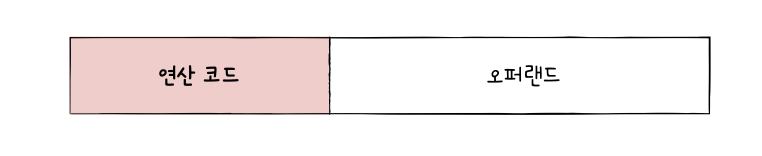
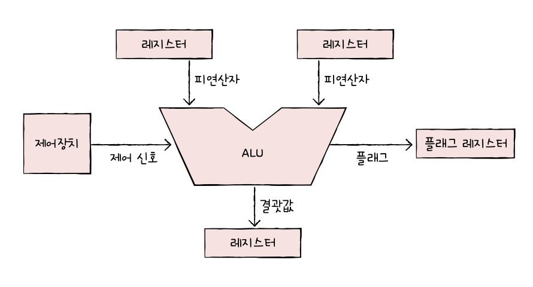
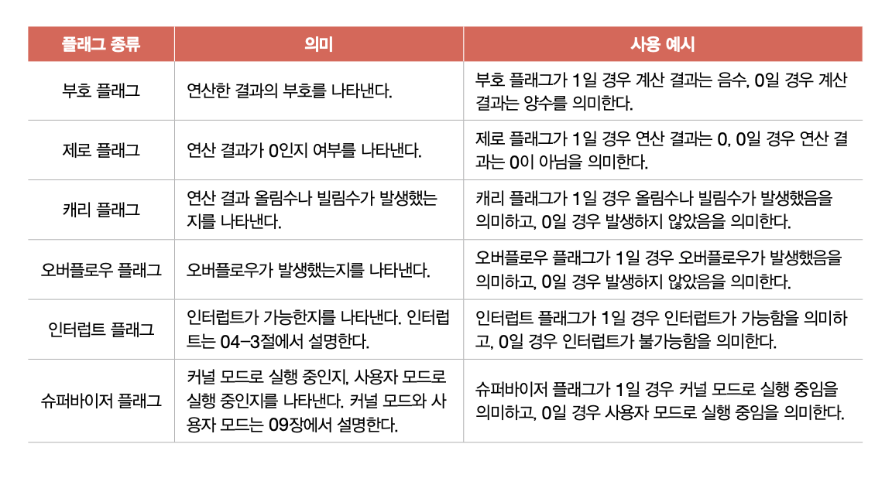
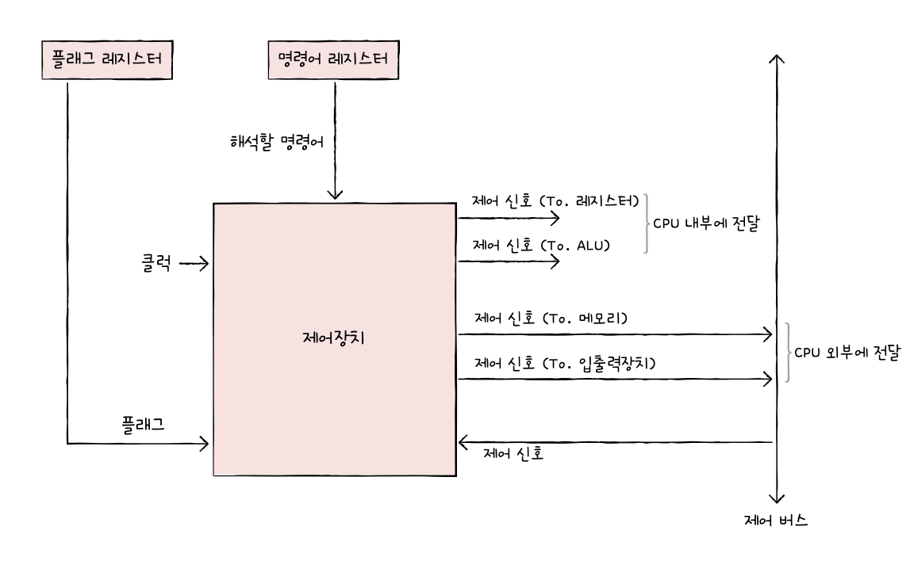
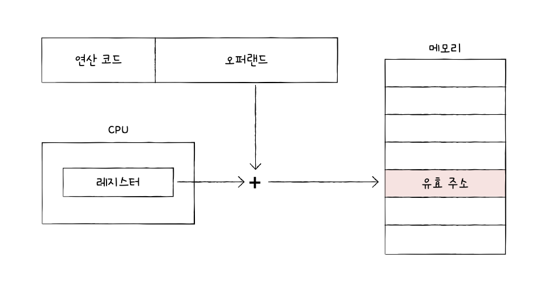
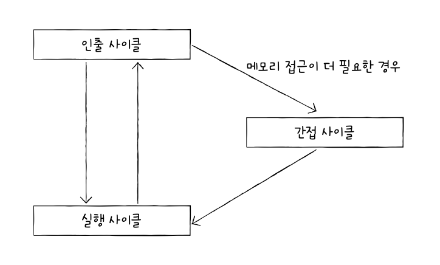

# 명령어
## 1. 소스 코드와 명령어
### 고급 언어와 저급 언어
- 고급 언어: 사람을 위한 언어
- 저급 언어: 컴퓨터가 직접 이해하고 실행할 수 있는 언어
	- 기계어: 0과 1의 명령어 비트로 이루어진 언어
	- 어셈블리어: 기계어를 읽기 편한 형태로 번역한 언어
### 컴파일 언어와 인터프리터 언어
- 고급 언어로 작성한 소스 코드를 저급 언어로 변환하는 두 가지 방식
	- 컴파일 방식
	- 인터프리트 방식
#### 컴파일 언어
- 컴파일러에 의해 소스 코드 전체가 저급 언어로 변환되어 실행되는 고급 언어
- ex. C
- 컴파일: 코드 전체가 저급 언어로 변환되는 과정
- 컴파일러: 컴파일을 수행해 주는 도구
- 목적 코드: 컴파일러를 통해 저급 언어로 변환된 코드
#### 인터프리터 언어
- 인터프리터에 의해 소스 코드가 한 줄씩 실행되는 고급 언어
- ex. Python
- 인터프리터: 소스 코드를 한 줄씩 저급 언어로 변환하여 실행해 주는 도구

- 인터프리터 언어가 컴파일 언어보다 느림
### 목적 파일 vs 실행 파일
- 목적 파일: 목적 코드로 이루어진 파일
- 실행 파일: 실행 코드로 이루어진 파일 (exe파일 등)
- 링킹: 목적 코드가 실행 파일이 되기 위해서는 *링킹*을 거침
	- 여러 파일에 나뉜 기능을 메인에 연결 지어야 함 -> 이 과정을 링킹이라 함
## 2. 명령어의 구조
### 연산 코드와 오퍼랜드
- 명령어: 연산 코드와 오퍼랜드로 구성
	- 연산 코드(연산자): 명령어가 수행할 연산
	- 오퍼랜드(피연산자): 연산에 사용할 데이터 or 연산에 사용할 데이터가 저장된 위치

- 연산 코드 필드: 연산 코드가 담기는 영역
- 오퍼랜드 필드: 오퍼랜드가 담기는 영역
#### 오퍼랜드
- 오퍼랜드 필드에 숫자와 문자 등을 나타내는 데이터 or 메모리나 레지스터 주소가 올 수 있음
	- 많은 경우에 저장된 위치가 담김
	- *주소 필드*라고도 부름
- 0-주소 명령어: 오퍼랜드가 하나도 없는 명령어
- 1-주소 명령어: 오퍼랜드 1개
- 2-주소 명령어: 오퍼랜드 2개
- 3-주소 명령어: 오퍼랜드 3개
#### 연산 코드
1. 데이터 전송
2. 산술/논리 연산
3. 제어 흐름 변경
4. 입출력 제어
### 주소 지정 방식
- 오퍼랜드 필드에 주소를 담는 이유
	- 명령어 길이 때문
	- 필드 당 비트가 정해져 있기 때문에 나타낼 수 있는 정보의 가짓수가 한정적임
- 유효 주소: 연산 코드에 사용할 데이터가 저장된 위치
- 주소 지정 방식: 오퍼랜드 필드에 데이터가 저장된 위치를 명시할 때 연산에 사용할 데이터 위치를 찾는 방법
#### 즉시 주소 지정 방식
- 연산에 사용할 데이터를 오퍼랜드 필드에 직접 명시하는 방식
- 표현 가능한 데이터 크기 작아짐
- 가장 빠름
#### 직접 주소 지정 방식
- 오퍼랜드 필드에 유효 주소를 직접적으로 명시하는 방식
- 유효 주소를 표현할 수 있는 범위가 연산 코드의 비트 수만큼 줄어듦
#### 간접 주소 지정 방식
- 유효 주소의 주소를 오퍼랜드 필드에 명시
- 표현 범위는 넓어졌지만 두 번의 메모리 접근이 필요해 더 느림
#### 레지스터 주소 지정 방식
- 직접 주소 지정 방식과 비슷하게 연산에 사용할 데이터를 저장한 레지스터를 오퍼랜드 필드에 직접 명시하는 방법
- CPU 내부의 레지스터에 접근하기 때문에 더 빠름
- 표현 가능한 레지스터 크기에 제한
#### 레지스터 간접 주소 지정 방식
- 연산에 사용할 데이터를 메모리에 저장, 그 주소를 저장한 레지스터를 오퍼랜드 필드에 명시
- 메모리에 접근하는 횟수가 1번
- 간접 주소 지정 방식보다 빠름
# CPU의 작동 원리
## 1. ALU와 제어장치
### ALU

- 레지스터를 통해 피연산자를 받아들이고, 제어장치로부터 수행할 연산을 알려주는 제어 신호를 받아들임
- 계산 결과와 함께 *플래그* 내보냄
	- 플래그: 연산 결과에 대한 추가적인 상태 정보

- 플래그 레지스터라는 레지스터에 저장됨
### 제어장치
- 제어 신호를 내보내고, 명령어를 해석하는 부품
- 제어 신호: 컴퓨터 부품들을 관리하고 작동시키기 위한 일종의 전기 신호

1. 제어장치는 클럭 신호를 받아들인다
   - 클럭: 컴퓨터의 모든 부품을 일사불란하게 움직일 수 있게 하는 시간 단위
2. 제어장치는 '해석해야 할 명령어'를 받아들인다
   - 명령어 레지스터에 저장
3. 제어장치는 플래그 레지스터 속 플래그 값을 받아들인다
4. 제어장치는 시스템 버스, 그중에서 제어 버스로 전달된 제어 신호를 받아들인다
## 2. 레지스터
### 반드시 알아야 할 레지스터
#### 프로그램 카운터 (명령어 포인터)
- 메모리에서 가져올 명령어의 주소, 즉 메모리에서 읽어 들일 명령어의 주소를 저장
#### 명령어 레지스터
- 해석할 명령어, 즉 메모리에서 방금 읽어 들인 명령어를 저장하는 레지스터
#### 메모리 주소 레지스터
- 메모리의 주소를 저장하는 레지스터
#### 메모리 버퍼 레지스터
- 메모리와 주고받을 값(데이터와 명령어)을 저장하는 레지스터
#### 범용 레지스터
- 이름 그대로 다양하고 일반적인 상황에서 자유롭게 사용할 수 있는 레지스터
#### 플래그 레지스터
- ALU 연산 결과 또는 CPU 상태에 대한 부가적인 정보 저장
### 특정 레지스터를 이용한 주소 지정 방식(1): 스택 주소 지정 방식
- 스택 포인터: 스택 주소 지정 방식이라는 주소 지정 방식에 사용
   - 스택의 꼭대기를 가리키는 레지스터
- 스택 주소 지정 방식: 스택, 스택 포인터를 이용한 주소 지정 방식
- 스택 영역: 메모리 안에 스택처럼 사용할 영역이 정해져 있음
### 특정 레지스터를 이용한 주소 지정 방식(2): 변위 주소 지정 방식
- 변위 주소 지정 방식: 오퍼랜드 필드의 값(변위)과 특정 레지스터의 값을 더하여 유효 주소를 얻어내는 주소 지정 방식

- 오퍼랜드 필드의 주소와 어떤 레지스터를 더하는지에 따라 방식이 나뉨
#### 상대 주소 지정 방식
- 오퍼랜드와 프로그램 카운터의 값을 더하여 유효 주소를 얻는 방식
#### 베이스 레지스터 주소 지정 방식
- 오퍼랜드와 베이스 레지스터의 값을 더하여 유효 주소를 얻는 방식
## 명령어 사이클과 인터럽트
- 명령어 사이클: CPU가 명령어를 처리하는 정형화된 흐름
- 인터럽트: 흐름이 끊어지는 상황
### 명령어 사이클
- 명령어들이 실행되는 주기
- 인출 사이클: 메모리에 있는 명령어를 CPU로 가지고 오는 단계
- 실행 사이클: 명령어를 실행하는 단계
- 간접 사이클: 명령어 실행을 위해 메모리에 접근하는 단계

### 인터럽트
- CPU의 작업을 방해하는 신호
- 동기 인터럽트: CPU에 의해 발생하는 인터럽트 *예외*
- 비동기 인터럽트: 주로 입출력장치에 의해 발생하는 인터럽트 *하드웨어 인터럽트*
#### 하드웨어 인터럽트
- 알림과 같은 인터럽트
#### 하드웨어 인터럽트 처리 순서
1. 입출력장치가 CPU에 인터럽트 요청 신호를 보냄
2. CPU는 실행 사이클이 끝나고 명령어를 인출하기 전 항상 인터럽트 여부 확인
3. 인터럽트 요청을 확인하고 인터럽트 플래그를 통해 현재 인터럽트를 받아들일 수 있는지 여부 확인
4. 인터럽트를 받아들일 수 있다면 CPU는 지금까지의 작업을 백업
5. CPU는 인터럽트 벡터를 참조하여 인터럽트 서비스 루틴을 실행
6. 인터럽트 서비스 루틴 실행이 끝나면 4에서 백업해 둔 작업 복구하여 실행 재개

- 인터럽트 요청 신호: CPU에 인터럽트 가능한지 물어봄
- 인터럽트 플래그: 플래그 레지스터의 인터럽트 플래그가 활성화되어 있어야 인터럽트 요청 수용 가능
- 인터럽트 서비스 루틴(인터럽트 핸들러): 인터럽트를 처리하기 위한 프로그램
- 인터럽트 벡터: 인터럽트 서비스 루틴을 식별하기 위한 정보
# 예상 질문
- 동기 인터럽트와 비동기 인터럽트의 차이점
- ALU의 역할과 ALU가 연산 결과와 함께 내보내는 플래그에 대한 간단한 설명해주세요