# 7. 보조기억장치
## 1. 다양한 보조기억장치
### 하드디스크
- 자기적인 방식로 데이터를 저장하는 보조기억장치 (자기 디스크의 일종으로 지칭함)
- 플래터(platter): 실질적으로 데이터가 저장되는 곳
	- 자기 물질로 덮여 있어 수많은 N극, S극을 저장함 (0,1의 역할 수행)
- 스핀들(spindle): 플래터를 회전시키는 구성 요소
	- RPM(Revolution Per Minute): 분당 회전수를 나타내는 단위
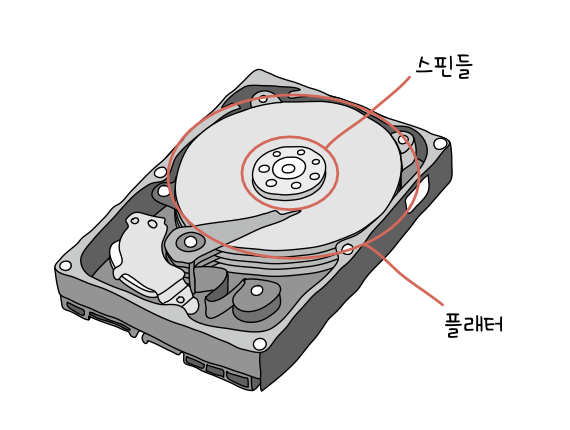
- 헤드(head): 플래터를 대상으로 데이터를 읽고 쓰는 구성 요소
- 디스크 암(disk arm): 원하는 위치로 헤드를 이동시키는 부품
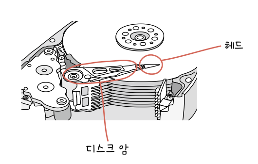
- 플래터는 트랙(track), 섹터(sector)라는 단위로 데이터 저장
	- 트랙: 플래터를 여러 동심원으로 나누었을 때 그 중 하나의 원
	- 섹터: 트랙을 나눈 한 조각 (일반적으로 512바이트)
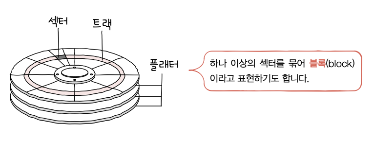
- 실린더(cylinder): 여러 겹의 플래터 상에서 같은 트랙이 위치한 곳을 모아 연결한 논리적 단위
	- 정보는 보통 한 실린더에 기록됨
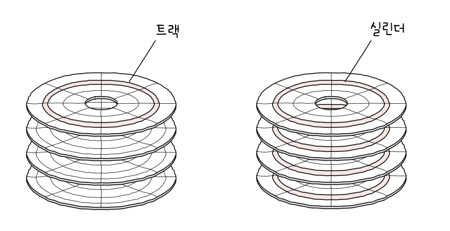
- 하드 디스크가 저장된 데이터에 접근하는 시간
	- 탐색 시간: 접근하려는 데이터가 저장된 트랙까지 헤드를 이동시키는 시간
	- 회전 지연: 헤드가 있는 곳으로 플래터를 회전시키는 시간
	- 전송 시간: 하드 디스크와 컴퓨터 간에 데이터를 전송하는 시간
### 플래시 메모리
- USB 메모리, SD 카드, SSD 모두 플래시 메모리 기반
- 전기적으로 데이터를 읽고 쓸 수 있는 반도체 기반의 저장 장치
- 아래 그림에서 붉은 부분
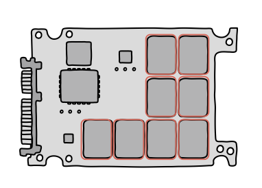
- 셀(cell): 플래시 메모리에서 데이터를 저장하는 가장 작은 단위
- 셀에 몇 비트를 저장할 수 있느냐에 따라 종류가 나뉨
	- SLC(Single Level Cell) 타입: 한 셀에 1비트
	- MLC(Multiple Level Cell) 타입: 한 셀에 2비트
	- TLC(Triple Level Cell) 타입: 한 셀에 3비트
	- QLC 타입: 한 셀에 4비트
#### SLC 타입
- 한 셀로 0,1 표현 가능
- 다른 타입에 비해 비트의 빠른 입출력 가능
#### MLC 타입
- 한 셀로 00, 01, 10, 11 표현 가능
- SLC보다 일반적으로 속도, 수명 떨어짐
- 한 셀에 두 비트씩 저장 가능하기 때문에 SLC대비 대용량화하기 유리함
- 용량 대비 가격 저렴
#### TLC 타입
- 한 셀로 여덟개 정보(000 - 111) 표현 가능
- 대용량화에 유리
- 수명과 속도가 앞 두 타입보다 떨어지지만 용량 대비 가격 저렴
#### 세 타입 정리
| 구분       | SLC  | MLC  | TLC  |
| -------- | ---- | ---- | ---- |
| 셀당 bit   | 1bit | 2bit | 3bit |
| 수명       | 길다   | 보통   | 짧다   |
| 읽기/쓰기 속도 | 빠르다  | 보통   | 느리다  |
| 용량 대비 가격 | 높다   | 보통   | 낮다   |
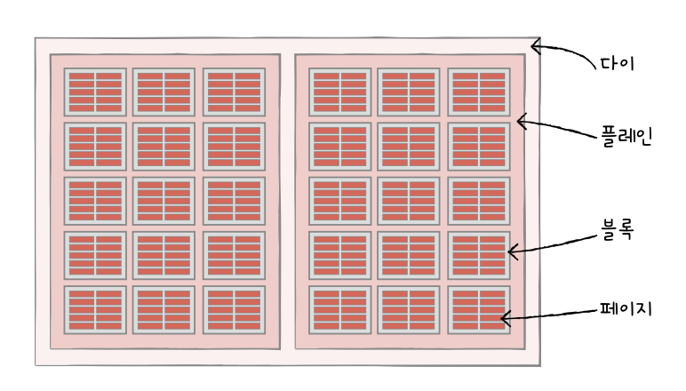
- 페이지: 셀들이 모여 만들어진 단위
- 블록: 페이지가 모여 만들어진 단위
- 플레인: 블록이 모여
- 다이: 플레인이 모여
- 읽기/쓰기와 삭제 단위가 다름
	- 읽기와 쓰기는 *페이지 단위로 이루어짐*
	- 삭제는 *블록 단위로 이루어짐*
- 페이지가 가지는 상태
	- Free 상태: 어떠한 데이터도 저장하고 있지 않아 새로운 데이터를 저장할 수 있는 상태
	- Valid 상태: 이미 유효한 데이터를 저장하고 있는 상태
	- Invalid 상태: 쓰레기값이라 부르는 유효하지 않은 데이터를 저장하고 있는 상태
- 가비지 컬렉션: 유효한 페이지들만 새로운 블록으로 옮기고 기존 블록을 삭제하는 기능
## 2. RAID의 정의와 종류
### RAID의 정의
- Redundant Array of Independent Disks
- 데이터의 안전성 혹은 높은 성능을 위해 여러 개의 물리적 보조기억장치를 마치 하나의 논리적 보조기억장치처럼 사용하는 기술
	- 하드 디스크와 SSD를 사용
### RAID의 종류
- RAID 레벨: RAID 구성 방법
#### RAID 0
- 여러 개의 보조기억장치에 데이터를 단순히 나누어 저장하는 구성 방식
- 데이터를 저장할 때 각 하드 디스크는 번갈아 가며 데이터를 저장
	- 저장되는 데이터가 하드 디스크 개수만큼 나뉘어 저장됨
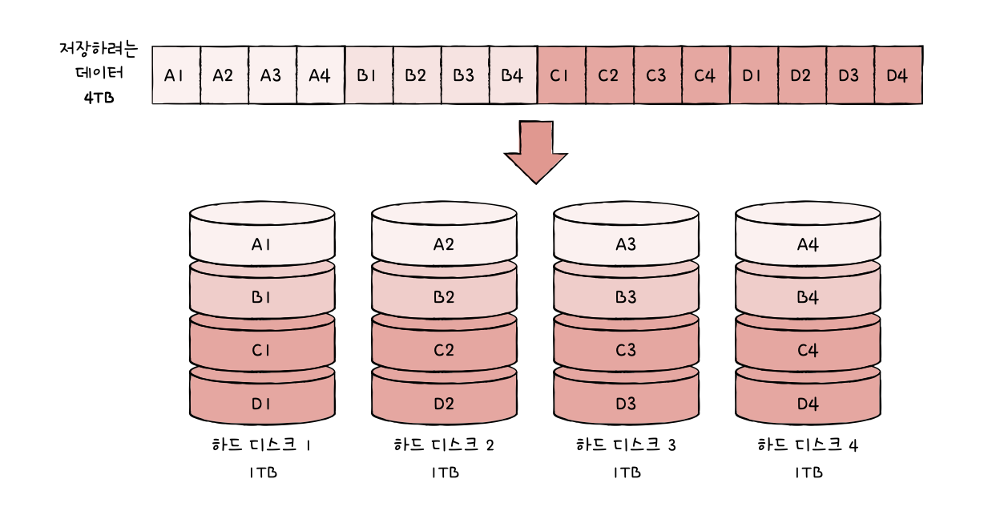
- 스트라입(stripe): 줄무늬처럼 분산되어 저장된 데이터
- 스트라이핑(striping): 분산하여 저장하는 것
- 장점
	- 하나의 대용량 저장 장치였다면 여러 번에 걸쳐 읽고 썼을 데이터를 동시에 읽고 쓰기 때문에 4TB 한 개보다 RAID 0으로 구성된 1TB 네 개가 이론상 네 배 빠름
- 단점
	- 저장된 정보가 안전하지 않음
	- 디스크 중 하나에 문제가 생기면 다른 모든 하드디스크의 정보를 읽는데 문제가 생김
#### RAID 1
- 복사본을 만드는 방식 (미러링이라고도 부름)
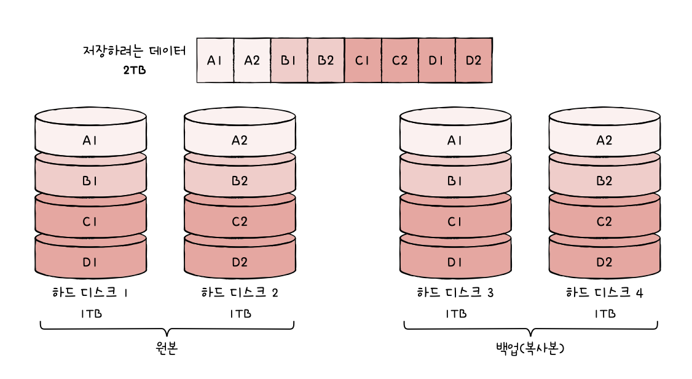
- 데이터를 쓸 때 원본과 복사본 두 군데에 씀
	- 쓰기 속도가 RAID 0보다 느림
- 장점
	- 복구가 매우 간단함
- 단점
	- 하드 디스크 개수가 한정되었을 때 사용 가능한 용량이 적어짐
	- 많은 양의 하드 디스크가 필요하게 됨 -> 비용 증가
#### RAID 4
- 완전한 복사본을 만드는 대신 오류를 검출하고 복구하기 위한 정보를 저장한 장치를 두는 구성 방식
- 패리티 비트: 오류를 검출하고 복구하기 위한 정보
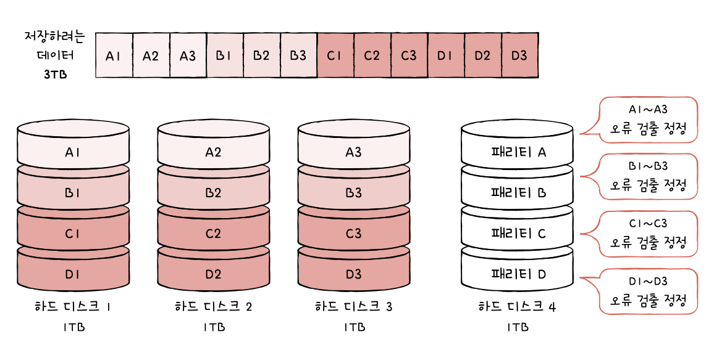
- 장점
	- RAID 1보다 적은 하드 디스크로도 데이터를 안전하게 보관
- 단점
	- 어떤 새로운 데이터가 저장될 때마다 패리티를 저장하는 디스크에도 데이터를 쓰게 되므로 패리티를 저장하는 장치에 병목 현상 발생
#### RAID 5
- 패리티 정보를 분산하여 저장 -> 병목 현상 해소
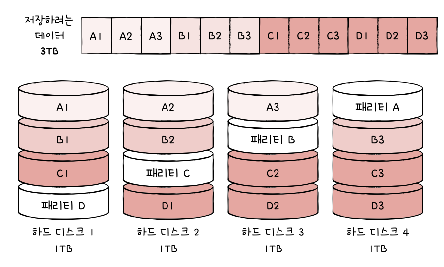
#### RAID 6
- 기본적으로 5와 같으나 서로 다른 두 개의 패리티를 두는 방식
	- 오류 검출/복구할 수단이 두 개
- 장점
	- 4나 5보다 안전한 구성
- 단점
	- 쓰기 속도는 5보다 느림
- 속도는 조금 희생하더라도 안전하게 보관하고 싶을 떄 사용
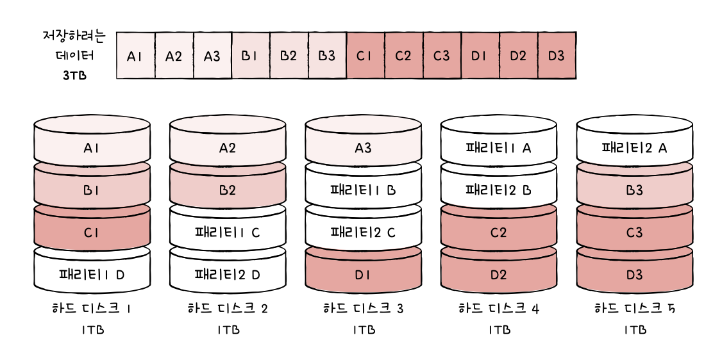
# 8. 입출력장치
