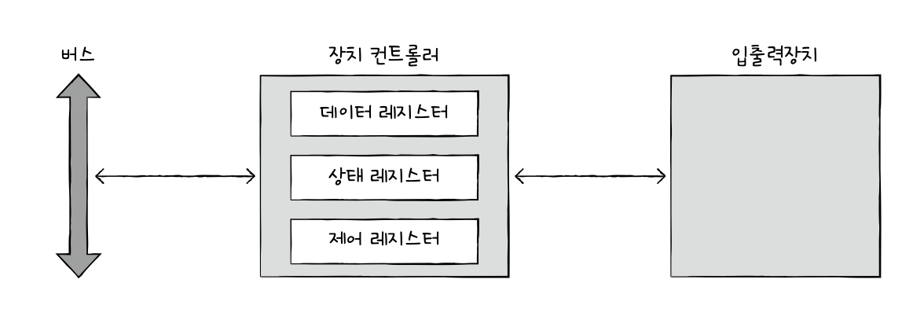
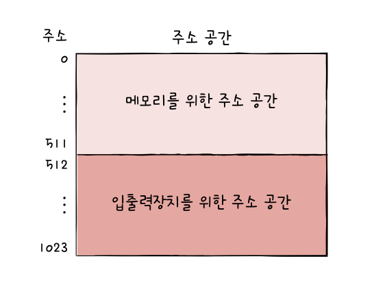
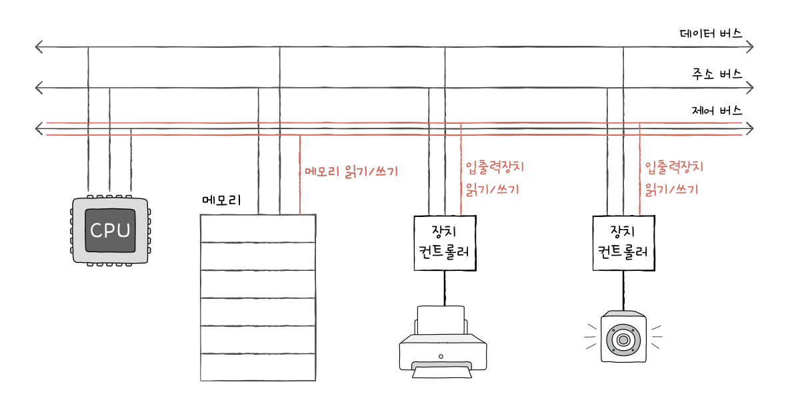
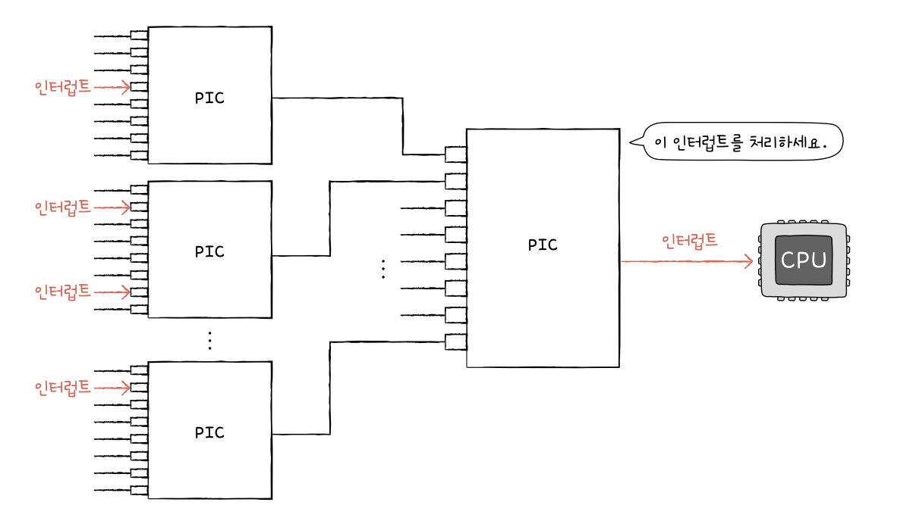
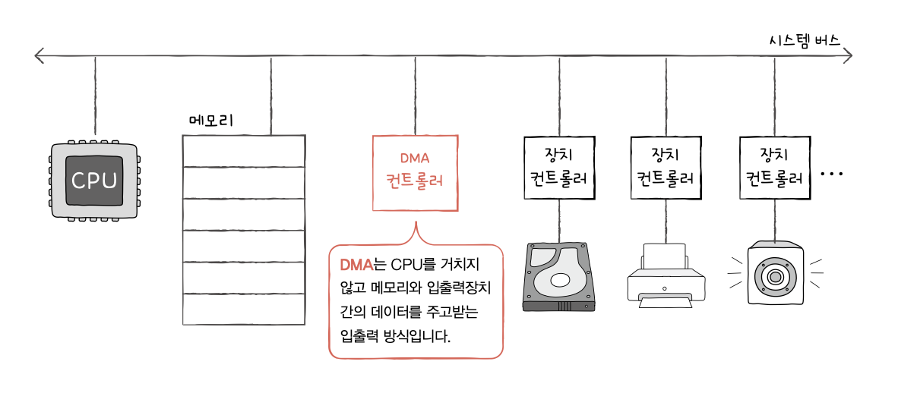

# 7. 보조기억장치
## 1. 다양한 보조기억장치
### 하드디스크
- 자기적인 방식로 데이터를 저장하는 보조기억장치 (자기 디스크의 일종으로 지칭함)
- 플래터(platter): 실질적으로 데이터가 저장되는 곳
	- 자기 물질로 덮여 있어 수많은 N극, S극을 저장함 (0,1의 역할 수행)
- 스핀들(spindle): 플래터를 회전시키는 구성 요소
	- RPM(Revolution Per Minute): 분당 회전수를 나타내는 단위

- 헤드(head): 플래터를 대상으로 데이터를 읽고 쓰는 구성 요소
- 디스크 암(disk arm): 원하는 위치로 헤드를 이동시키는 부품

- 플래터는 트랙(track), 섹터(sector)라는 단위로 데이터 저장
	- 트랙: 플래터를 여러 동심원으로 나누었을 때 그 중 하나의 원
	- 섹터: 트랙을 나눈 한 조각 (일반적으로 512바이트)

- 실린더(cylinder): 여러 겹의 플래터 상에서 같은 트랙이 위치한 곳을 모아 연결한 논리적 단위
	- 정보는 보통 한 실린더에 기록됨

- 하드 디스크가 저장된 데이터에 접근하는 시간
	- 탐색 시간: 접근하려는 데이터가 저장된 트랙까지 헤드를 이동시키는 시간
	- 회전 지연: 헤드가 있는 곳으로 플래터를 회전시키는 시간
	- 전송 시간: 하드 디스크와 컴퓨터 간에 데이터를 전송하는 시간
### 플래시 메모리
- USB 메모리, SD 카드, SSD 모두 플래시 메모리 기반
- 전기적으로 데이터를 읽고 쓸 수 있는 반도체 기반의 저장 장치
- 아래 그림에서 붉은 부분

- 셀(cell): 플래시 메모리에서 데이터를 저장하는 가장 작은 단위
- 셀에 몇 비트를 저장할 수 있느냐에 따라 종류가 나뉨
	- SLC(Single Level Cell) 타입: 한 셀에 1비트
	- MLC(Multiple Level Cell) 타입: 한 셀에 2비트
	- TLC(Triple Level Cell) 타입: 한 셀에 3비트
	- QLC 타입: 한 셀에 4비트
#### SLC 타입
- 한 셀로 0,1 표현 가능
- 다른 타입에 비해 비트의 빠른 입출력 가능
#### MLC 타입
- 한 셀로 00, 01, 10, 11 표현 가능
- SLC보다 일반적으로 속도, 수명 떨어짐
- 한 셀에 두 비트씩 저장 가능하기 때문에 SLC대비 대용량화하기 유리함
- 용량 대비 가격 저렴
#### TLC 타입
- 한 셀로 여덟개 정보(000 - 111) 표현 가능
- 대용량화에 유리
- 수명과 속도가 앞 두 타입보다 떨어지지만 용량 대비 가격 저렴
#### 세 타입 정리
| 구분       | SLC  | MLC  | TLC  |
| -------- | ---- | ---- | ---- |
| 셀당 bit   | 1bit | 2bit | 3bit |
| 수명       | 길다   | 보통   | 짧다   |
| 읽기/쓰기 속도 | 빠르다  | 보통   | 느리다  |
| 용량 대비 가격 | 높다   | 보통   | 낮다   |

- 페이지: 셀들이 모여 만들어진 단위
- 블록: 페이지가 모여 만들어진 단위
- 플레인: 블록이 모여
- 다이: 플레인이 모여
- 읽기/쓰기와 삭제 단위가 다름
	- 읽기와 쓰기는 *페이지 단위로 이루어짐*
	- 삭제는 *블록 단위로 이루어짐*
- 페이지가 가지는 상태
	- Free 상태: 어떠한 데이터도 저장하고 있지 않아 새로운 데이터를 저장할 수 있는 상태
	- Valid 상태: 이미 유효한 데이터를 저장하고 있는 상태
	- Invalid 상태: 쓰레기값이라 부르는 유효하지 않은 데이터를 저장하고 있는 상태
- 가비지 컬렉션: 유효한 페이지들만 새로운 블록으로 옮기고 기존 블록을 삭제하는 기능
## 2. RAID의 정의와 종류
### RAID의 정의
- Redundant Array of Independent Disks
- 데이터의 안전성 혹은 높은 성능을 위해 여러 개의 물리적 보조기억장치를 마치 하나의 논리적 보조기억장치처럼 사용하는 기술
	- 하드 디스크와 SSD를 사용
### RAID의 종류
- RAID 레벨: RAID 구성 방법
#### RAID 0
- 여러 개의 보조기억장치에 데이터를 단순히 나누어 저장하는 구성 방식
- 데이터를 저장할 때 각 하드 디스크는 번갈아 가며 데이터를 저장
	- 저장되는 데이터가 하드 디스크 개수만큼 나뉘어 저장됨

- 스트라입(stripe): 줄무늬처럼 분산되어 저장된 데이터
- 스트라이핑(striping): 분산하여 저장하는 것
- 장점
	- 하나의 대용량 저장 장치였다면 여러 번에 걸쳐 읽고 썼을 데이터를 동시에 읽고 쓰기 때문에 4TB 한 개보다 RAID 0으로 구성된 1TB 네 개가 이론상 네 배 빠름
- 단점
	- 저장된 정보가 안전하지 않음
	- 디스크 중 하나에 문제가 생기면 다른 모든 하드디스크의 정보를 읽는데 문제가 생김
#### RAID 1
- 복사본을 만드는 방식 (미러링이라고도 부름)

- 데이터를 쓸 때 원본과 복사본 두 군데에 씀
	- 쓰기 속도가 RAID 0보다 느림
- 장점
	- 복구가 매우 간단함
- 단점
	- 하드 디스크 개수가 한정되었을 때 사용 가능한 용량이 적어짐
	- 많은 양의 하드 디스크가 필요하게 됨 -> 비용 증가
#### RAID 4
- 완전한 복사본을 만드는 대신 오류를 검출하고 복구하기 위한 정보를 저장한 장치를 두는 구성 방식
- 패리티 비트: 오류를 검출하고 복구하기 위한 정보

- 장점
	- RAID 1보다 적은 하드 디스크로도 데이터를 안전하게 보관
- 단점
	- 어떤 새로운 데이터가 저장될 때마다 패리티를 저장하는 디스크에도 데이터를 쓰게 되므로 패리티를 저장하는 장치에 병목 현상 발생
#### RAID 5
- 패리티 정보를 분산하여 저장 -> 병목 현상 해소

#### RAID 6
- 기본적으로 5와 같으나 서로 다른 두 개의 패리티를 두는 방식
	- 오류 검출/복구할 수단이 두 개
- 장점
	- 4나 5보다 안전한 구성
- 단점
	- 쓰기 속도는 5보다 느림
- 속도는 조금 희생하더라도 안전하게 보관하고 싶을 떄 사용

# 8. 입출력장치
## 1. 장치 컨트롤러와 장치 드라이버
### 장치 컨트롤러
- 입출력장치는 CPU, 메모리보다 다루기 더 까다로움 
	1. 입출력장치에는 종류가 너무나도 많습니다.
	2. 일반적으로 CPU와 메모리의 데이터 전송률은 높지만 입출력장치의 데이터 전송률은 낮습니다.
- 전송률: 데이터를 얼마나 빨리 교환할 수 있는지를 나타내는 지표
-> 장치 컨트롤러를 통해 컴퓨터에 입출력장치 연결
#### 기능 3가지
- CPU와 입출력장치 간의 통신 중개
- 오류 검출
- 데이터 버퍼링
	- 버퍼링: 전송률이 높은 장치와 낮은 장치 사이에 주고받는 데이터를 *버퍼*라는 임시 저장 공간에 저장하여 전송률을 비슷하게 맞추는 방법
#### 내부 구조

- 데이터 레지스터: CPU와 입출력장치 사이에 주고받을 데이터가 담기는 레지스터
- 상태 레지스터: 입출력장치가 입출력 작업을 할 준비가 되었는지, 입출력 작업이 완료되었는지, 입출력장치에 오류는 없는지 등 상태 정보 저장
- 제어 레지스터: 입출력장치가 수행할 내용에 대한 제어 정보와 명령 저장
### 장치 드라이버
- 장치 컨트롤러의 동작을 감지하고 제어함으로써 장치 컨트롤러가 컴퓨터 내부와 정보를 주고받을 수 있게 하는 프로그램
- 소프트웨어적인 통로
## 2. 다양한 입출력 방법
### 프로그램 입출력
- 기본적으로 프로그램 속 명령어로 입출력장치를 제어하는 방법
- CPU가 장치 컨트롤러의 레지스터 값을 읽고 씀으로써 이루어짐
#### 메모리 맵 입출력
- 메모리에 접근하기 위한 주소 공간과 입출력장치에 접근하기 위한 주소 공간을 하나의 주소 공간으로 간주

#### 고립형 입출력
- 메모리를 위한 주소 공간과 입출력장치를 위한 주소 공간을 분리하는 방법

| 메모리 맵 입출력                | 고립형 입출력                  |
| ------------------------ | ------------------------ |
| 메모리와 입출력장치는 같은 주소 공간 사용  | 메모리와 입출력장치는 분리된 주소 공간 사용 |
| 메모리 주소 공간이 축소됨           | 메모리 주소 공간이 축소되지 않음       |
| 메모리와 입출력장치에 같은 명령어 사용 가능 | 입출력 전용 명령어 사용            |
### 인터럽트 기반 입출력
- 장치 컨트롤러가 입출력 작업을 끝낸 뒤 CPU에게 인터럽트 요청 신호를 보내면 CPU는 하던 일을 잠시 백업하고 인터럽트 서비스 루틴 실행
- 인터럽트를 기반으로 하는 입출력
#### 동시에 인터럽트가 발생한 경우
- 인터럽트 발생 순서대로 처리
- 우선순위대로 처리
- NMI(Non-Maskable Interrupt): 인터럽트 비트를 비활성해도 무시할 수 없는 인터럽트
-> PIC(Programmable Imterrupt Controller) 사용
- 인터럽트 요청들의 우선순위 판별한 뒤 CPU에 지금 처리해야 할 하드웨어 인터럽트는 무엇인지 알려줌
- 처리 과정
	1. 장치 컨트롤러로부터 인터럽트 요청 신호 받아들임
	2. 우선순위 판단한 뒤 CPU에 처리해야 할 인터럽트 요청 신호 보냄
	3. CPU는 PIC에 인터럽트 확인 신호 보냄
	4. PIC는 데이터 버스를 통해 CPU에 인터럽트 벡터 보냄
	5. CPU는 인터럽트 벡터를 통해 인터럽트 요청의 주체를 알게 되고 해당 장치의 인터럽트 서비스 루틴 실행
	
### DMA(Direct Memory Access) 입출력
- 입출력장치와 메모리가 CPU를 거치지 않고도 상호작용할 수 있는 입출력 방식
- DMA 컨트롤러 필요

#### DMA 입출력 과정
1. CPU는 DMA 컨트롤러에 입출력장치의 주소, 수행할 연산(읽기/쓰기), 읽거나 쓸 메모리의 주소 등과 같은 정보로 입출력 작업 명령
2. DMA 컨트롤러는 CPU 대신 장치 컨트롤러와 상호작용하며 입출력 작업 수행 (필요시 메모리에 직접 접근)
3. 입출력 작업이 끝나면 DMA 컨트롤러는 CPU에 인터럽트를 걸어 작업이 끝났음을 알림
- 시스템 버스는 동시 사용 불가능 -> DMA 컨트롤러가 사용 가능할 때
	- CPU 사용 X일 때
	- CPU한테 허락 구하고
#### 입출력 버스
- 시스템 버스를 DMA 컨트롤러가 너무 자주 이용하면 CPU가 그만큼 이용 못함
	- 입출력 버스라는 별도의 버스에 연결하여 해결
- PCI(Peripheral Component Interconnect) 버스, PCI Express(PCIe) 버스 등