# Computer Science
# File Management
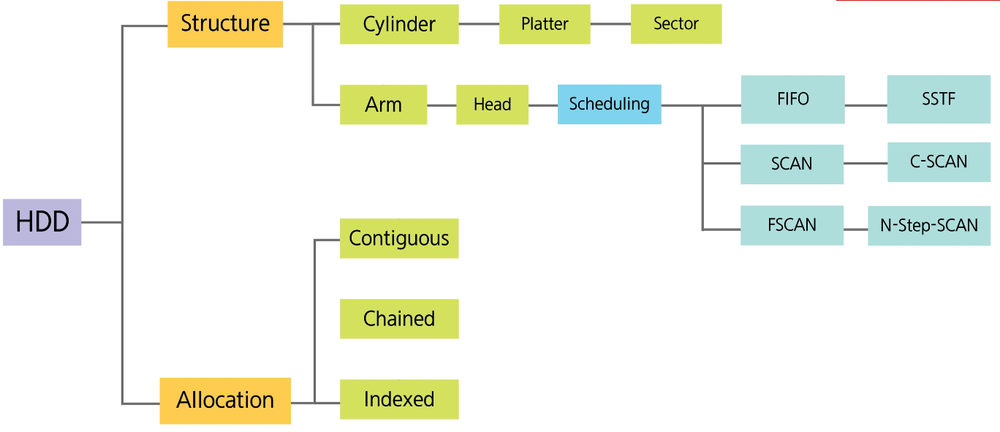
## Computer File
: 컴퓨터 저장 장치에 *데이터를 기록하기 위한 리소스*이며 *파일의 이름으로 구별*한다.
- Computer Resource
  : 제한된 가용 상황에서의 물리적 부품과 가상 구성 요소. (파일, 네트워크 연결, 메모리 등...)
- 파일은 어떻게 구분되고 실행할 수 있을까?
- 운영체제는 어떻게 파일을 인식할까?
## File Extension
- .jgp .pdf .png .docx 와 같이 *파일의 이름 뒤에 . 으로 구분하여 사용되는 것*
- 운영체제는 파일 확장자를 파악하여 관련 프로그램을 실행
1. Windows 파일 확장자 표시 방법
   - 제어판 - 파일 탐색기 옵션 - 보기 - 알려진 파일 확장자 숨기기 *체크 해제*
2. 확장자를 변경하면 어떻게 될까?
   - .png 파일을 .pdf 로 변경하더라도 PDF 파일로 변경되는 것은 아니다.
   - 파일 확장자를 변경하여 실행하는 경우, ==지원하지 않는 파일 형식입니다. 파일이 손상되어 열 수 없습니다==. 와 같은 에러 메시지를 마주하게 된다.
    - [!] PDF 뷰어는 PDF 파일 구졸르 해석하는 도구로 이미지 파일을 해석하는 도구가 아님
## File Signature
: Magin Number, Checksum을 참조하여 *파일의 내용을 검증하거나 식별*하는데 사용하는 데이터.
### Magin Number
: 여러 운영체제에서 공통적으로 사용되며, 간단하고 효과적인 파일 형식을 구별하는 값.
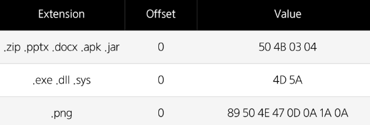
### Checksum
: 에러를 탐지하기 위한 작은 크기의 데이터 블록.
- Parity Bit : 7bit 데이터 중 1인 비트의 개수가 홀수 또는 짝수인지 확인하는 방법

- Cyclic Redundancy Check (CRC)
  : 송신자는 데이터와 계산한 CRC 값을 전달하고 수신자는 전달받은 데이터의 CRC 값을 계산하여 전달받은 CRC와 일치하는지 확인하는 방법
  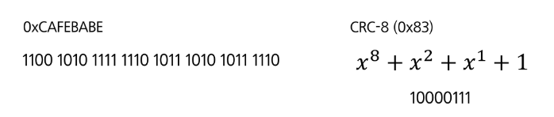
  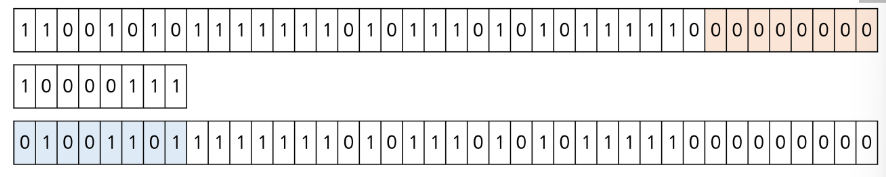
## File Header
: 저장, 전송되는 데이터 블록의 맨 앞에 위치하는 추가적인 데이터
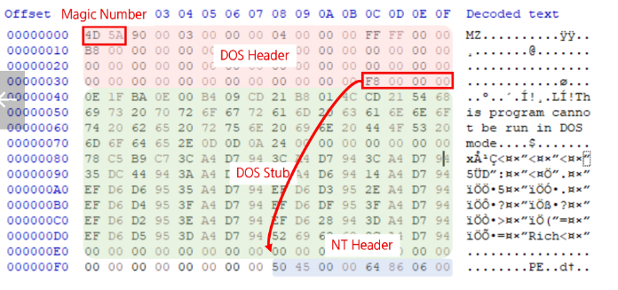
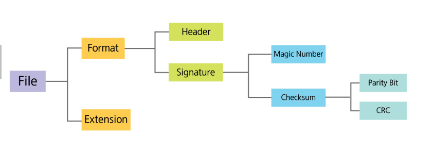
## Hard Disk Drive
| 구성 요소    |                   |
| -------- | ----------------- |
| Cylinder | 여러 개의 Platter로 구성 |
| Platter  | 여러 개의 Track으로 구성  |
| Track    | 여러 개의 Sector로 구성  |
| Sector   | 데이터를 저장하는 공간      |
| Arm      | Cylinder 이동       |
| Head     | Sector를 읽고        |
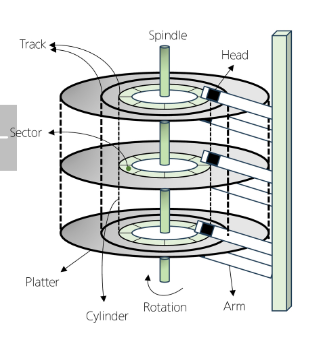
### Sector(Block)
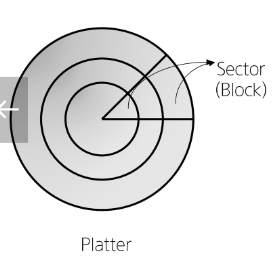
- 데이터가 저장되는 공간
- 1개의 Sector에는 4KB 크기의 데이터가 저장.
- Sector의 크기가 다르더라도 저장하는 데이터의 크기는 동일
- 1KB를 저장하면 남은 3KB는 어떻게 될까?
	- 1KB여도 4KB 공간을 모두 사용하고, *남은 공간은 의미 없는 데이터로 채움.*
### Partition
- 하나의 HDD를 논리적으로 나누어 사용하는 방법.
- C 드라이브와  D 드라이브를 사용하는 경우, C 드라이브는 0~99 실린더를 D 드라이브는 100~199번 실린더 사용
###  Seek Time
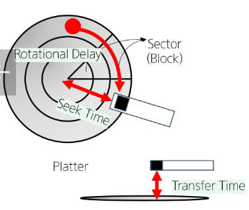
- Head가 원하는 트랙까지 찾아가는 시간.
- 현재 위치한 Head에 따라 Track을 찾아가는 시간이 다름.(평균)
### Rotation Delay(Latency)
- 현재 위치의 Sector에서 읽고자하는 Sector까지 회전하여 Head 밑까지 오는 시간
### Transfer Time
- 디스크 표면에서 데이터를 읽어 메모리로 이동하는 시간. 메모리로 이동하는 시간은 매우 짧음
## Disk Scheduling
: 필요한 데이터를 찾기 위해 Track을 어떤 순서대로 찾아가는지에 대한 방법
### First-In First-Out (FIFO)
: 들어온 순서대로 처리하는 방법
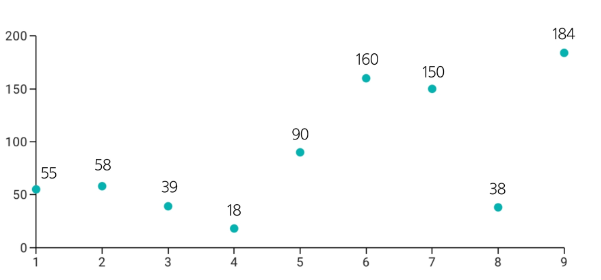
### Shorted Service Time First (SSTF)
: 현재 Head의 위치와 가장 가까운 Track을 먼저 탐색하는 방법.
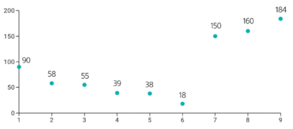
### SCAN
: Head가 들어가고 나오면서 탐색하는 방법
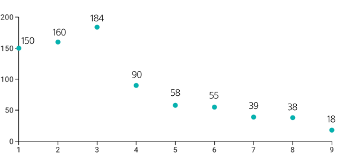
### C-SCAN
: Head가 들어가면서 탐색하지만 나오면서는 탐색하지 않는 방법.
- 184번 트랙을 계속 요청한다면?
  : 오랜 시간 Head가 움직이지 못하는 상황 발생
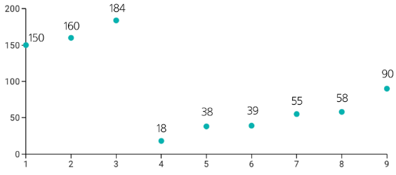
### F-SCAN
: 두 개의 Queue를 사용하여 SCAN과 동일한 방식으로 탐색하는 방법
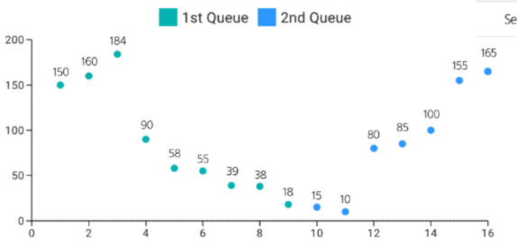
### N-Step-SCAN
: Queue에 도착한 Track을 N개씩 나누어 SCAN과 동일한 방식으로 탐색하는 방법
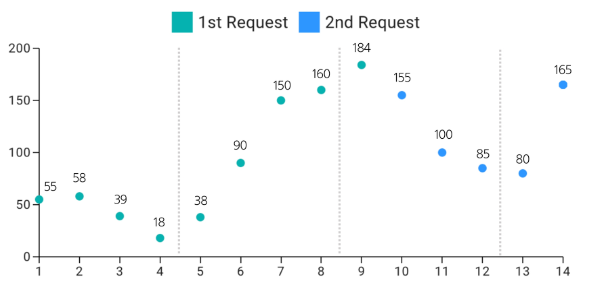
## File Allocation
: Disk에 파일을 어떻게 Read / Write 할 것인지에 대한 방법
### Contiguous Allocation
: 디스크의 연속된 빈 블록에 저장하는 방식으로, 파일 생성 시 파일의 크기를 미리 알아야 함.
연속된 빈 공간에 파일을 기록하기 때문에 *비어있는 공간 발생*
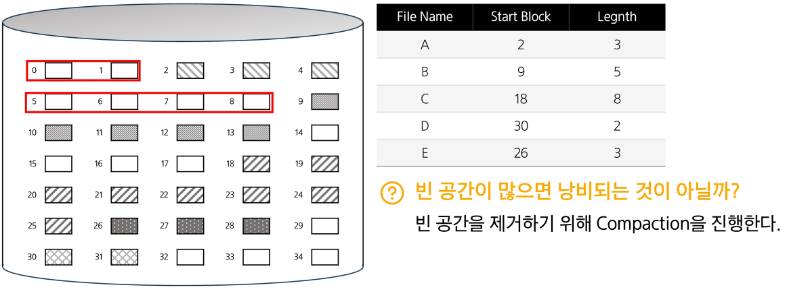
### Chained Allocation
: 각 블록을 연결하는 방식으로, 연속된 빈 공간이 필요 없음. (FAT 16, 32에서 응용)
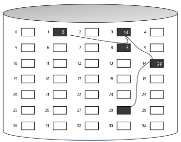
### File Allocation Table (FAT)
: 파일의 데이터 블록을 찾아가는 정보를 저장하고 있는 테이블.
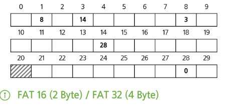
### Indexed Allocation
: Index를 사용하여 파일을 저장하는 방식 (NTFS에서 응용)
#### Indexed Block
: 하나의 Indexed Block에는 *1024개의 블록 번호*를 갖는다.
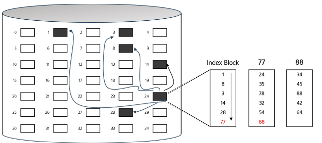
# Memory Management
## Partitioning
: 물리적 메모리 영역을 나누는 방법
### Fixed Partitioning
: *고정된 크기로 메모리 영역을 나누어 사용*하는 방식
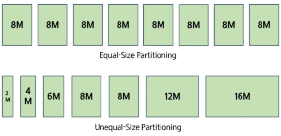
- 5M 영역에 1M만 할당한다면?
	- 4M 영역은 사용되지 못하고 남아있게 된다.
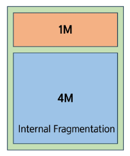
### Dynamic Partitioning
: *필요한 영역 만큼 메모리 영역을 나누어 사용*하는 방식
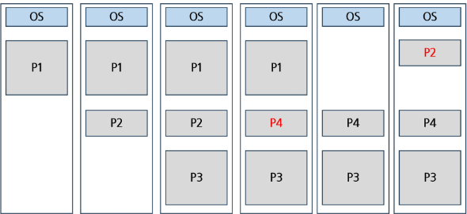
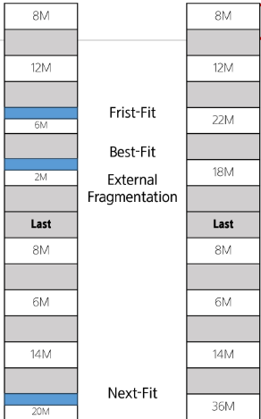
#### Frist-Fit
: *처음부터 확인하여 할당*할 수 있는 공간에 할당.
#### Best-Fit
: *최대한 딱 맞는 공간*에 할당
#### Next-Fit
: *마지막 할당 이후 할당 가능한 공간*에 할당
### Buddy Algorithm
: 실제로 메모리는 2의 지수승 크기로 할당
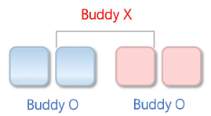
- 40 Bytes 요청 시 메모리가 얼만큼 할당 될까?
	- 2의 지수승으로 할당되므로 40 Byte를 채울 수 있는 64 Byte가 할당됨
- 64Byte 공간도 없다면?
	- 128 Byte 공간이 있다면 이 영역을 절반으로 나누고 나뉜 64 Byte에 할당
