# REST API
## API (Application Programming Interface)
: 두 소프트웨어가 서로 통신할 수 있게 하는 매커니즘
→ 클라이언트-서버 처럼 서로 다른 프로그램에서 요청과 응답을 받을 수 있도록 만든 체계
## Web API
- 웹 서버 또는 웹 브라우저를 위한 API
- 현대 웹 개발은 하나부터 열까지 직접 개발하기보다 여러 Open API들을 활용하는 추세
- 대표적인 Third Party Open API 서비스 목록
	- Youtube API
	- Google Map API
	- Naver Papago API
	- Kakao Map API
## REST (Representational State Transfer)
: API Server를 개발하기 위한 일종의 소프트웨어 설계 "방법론"
→ 모두가 API Server를 설계하는 구조가 다르니 이렇게 맞춰서 설계하는게 어때? "규칙 X"
### RESTful API
- REST 원리를 따르는 시스템을 RESTful하다고 부름
- *자원을 정의*하고 *자원에 대한 주소를 지정*하는 전반적인 방법을 서술
## REST API
: REST라는 설계 디자인 약속을 지켜 구현한 API
### REST에서 자원을 사용하는 법 3가지
1. 자원의 "식별"
   - URI
2. 자원의 "행위"
   - HTTP methods
3. 자원의 "표현"
   - JSON 데이터
   - 궁극적으로 표현되는 데이터 결과물
### 자원의 식별
#### URI (Uniform Resource Identifier) - 통합 자원 식별자
: 인터넷에서 리소스(자원)를 식별하는 문자열
→ 가장 일반적인 URI는 웹 주소로 알려진 `URL`
#### URL (Uniform Resource Locator) - 통합 자원 위치
: 웹에서 주어진 리소스의 주소
→ 네트워크 상에 리소스가 어디 있는지를 알려주기 위한 약속

#### Schema(or Protocol)
- 브라우저가 리소스를 요청하는 데 사용해야 하는 규약
- URL의 첫 부분은 브라우저가 어떤 규약을 사용하는지를 나타냄
- 기본적으로 웹은 `http(s)`를 요구하며 메일을 열기위한 mailto:, 파일을 전송하기 위한 ftp: 등 다른 프로토콜도 존재
#### Domain Name
- 요청 중인 웹 서버를 나타냄
- 어떤 웹 서버가 요구되는 지를 가리키며 직접 IP 주소를 사용하는 것도 가능하지만, 사람이 외우기 어렵기 때문에 주로 Domain Name으로 사용
- 예를 들어 도메인 `google.com`의 IP 주소는 `142.251.42.142`
#### Port
- 웹 서버의 리소스에 접근하는데 사용되는 기술적인 문(Gate)
- HTTP 프로토콜의 표준 포트
	- HTTP - 80
	- HTTPS - 443
- 표준 포트만 작성 시 생략 가능
#### Path
- 웹 서버의 리소스 경로
- 초기에는 실제 파일이 위치한 물리적 위치를 나타냈지만, 오늘날은 실제 위치가 아닌 추상화된 형태의 구조를 표현
- 예를 들어 `/articles/create/` 라는 주소가 실제 articles 폴더안에 create 폴더 안을 나타내는 것은 아님
#### Parameters
- 웹 서버에 제공하는 추가적인 데이터
- `&` 기호로 구분되는 key-value 쌍 목록
- 서버는 리소스를 응답하기 전에 이러한 파라미터를 사용하여 추가 작업을 수행할 수 있음
#### Anchor
- 일종의 "북마크"를 나타내며 브라우저에 해당 지점에 있는 콘텐츠를 표시
- fragment identifier(부분 식별자)라고 부르는 `#` 이후 부분은 서버에 전송되지 않음
## 자원의 행위
### HTTP Request Methods
: 리소스에 대한 행위(수행하고자 하는 동작)를 정의
→ HTTP verbs 라고도 함
### 대표 HTTP Request Methods
1. `GET
	- 서버에 리소스의 표현을 요청
	- GET을 사용하는 요청은 데이터만 검색해야 함
2. `POST`
	- 데이터를 지정된 리소스에 제출
	- 서버의 상태를 변경
3. `PUT`
	- 요청한 주소의 리소스를 수정
4. `DELETE`
	- 지정된 리소스를 삭제
### HTTP response status codes
: 특정 HTTP 요청이 성공적으로 완료 되었는지 여부를 나타냄
#### 5개의 응답 그룹
- `Informational responses` (100-199)
- `Successful responses` (200-299)
- `Redirection messages` (300-399)
- `Client error responses` (400-499)
- `Server error responses` (500-599)
## 자원의 표현
### 그동안 서버가 응답(자원을 표현)했던 것
- 지금까지 Django 서버는 사용자에게 페이지(html)만 응답하고 있었음
- 하지만 서버가 응답할 수 있는 것은 페이지 뿐만 아니라 다양한 데이터 타입을 응답할 수 있음
- REST API는 이 중에서도 *JSON* 타입으로 응답하는 것을 권장
### 응답 데이터 타입의 변화
- 페이지(html)만을 응답했던 서버
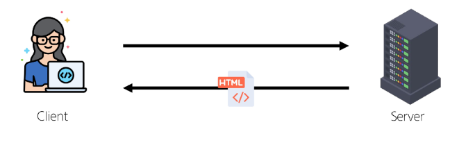
- 이제는 JSON 데이터를 응답하는 REST API 서버로의 변환
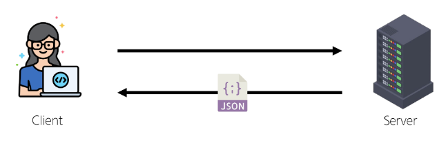
- Django는 더 이상 Template 부분에 대한 역할을 담당하지 않게 되며, 본격적으로 Front-end와 Back-end가 분리되어 구성 됨
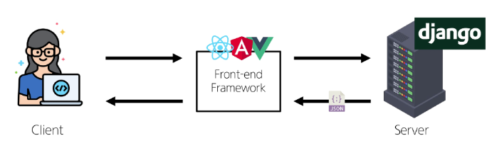
- 이제부터 Django를 사용해 RESTful API 서버를 구축할 것
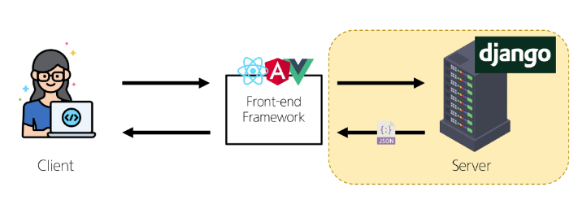
## 사전 준비
- 가상 환경 생성, 활성화 및 패키지 설치
- migrate 진행
- 준비된 fixtures 파일을 load하여 실습용 초기 데이터 입력
```
python manage.py loaddata articles.json
```
- `http://127.0.0.1:8000/api/v1/articles/` 요청 테스트
- python-request-sample.py 확인
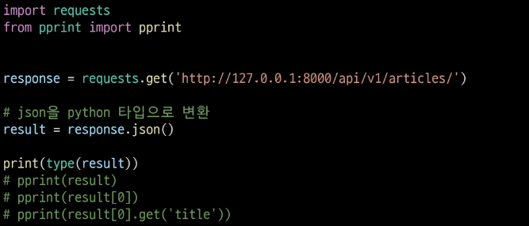
# DRF with Single Model
## DRF (Django REST Framework)
: Django에서 RESTful API 서버를 쉽게 구축할 수 있도록 도와주는 오픈소스 라이브러리
### 프로젝트 준비
1. 가상환경 생성, 활성화 및 패키지 설치
2. migrate 진행
3. 준비된 fixtures 파일을 load하여 실습용 초기 데이터 입력
### Postman 설치 및 안내
- Postman 설치
	- [https://www.postman.com/downloads/](https://www.postman.com/downloads/)
- Postman이란?
	- API를 구축하고 사용하기 위한 플랫폼
	- API를 빠르게 만들 수 있는 여러 도구 및 기능을 제공
- Workspaces - My workspace
#### Postman 화면 구성 안내

### URL과 HTTP requests methods 설계
|             | GET     | POST | PUT     | DELETE  |
| ----------- | ------- | ---- | ------- | ------- |
| articles/   | 전체 글 조회 | 글 작성 |         |         |
| articles/1/ | 1번 글 조회 |      | 1번 글 수정 | 1번 글 삭제 |
### GET
- 게시글 데이터 목록 조회하기
- 게시글 데이터 목록을 제공하는 `ArticleListSerializer` 정의
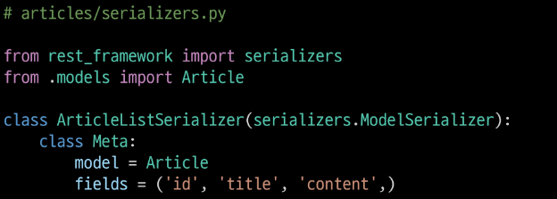
- serializers.py의 위치나 파일명은 자유롭게 작성 가능
#### Serialization 직렬화
: 여러 시스템에서 활용하기 위해 데이터 구조나 객체 상태를 나중에 재구성할 수 있는 포맷으로 변환하는 과정
- 예시
	- 데이터 구조나 객체 상태를 나중에 재구성할 수 있는 포맷으로 변환하는 과정
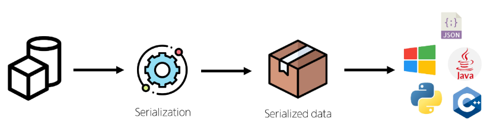
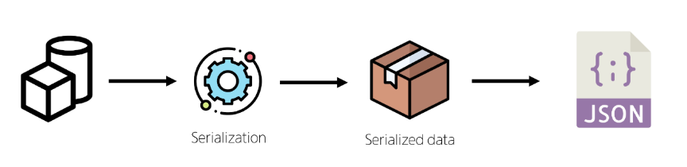
→ 어떠한 언어나 환경에서도 나중에 다시 쉽게 사용할 수 있는 포맷으로 변환하는 과정
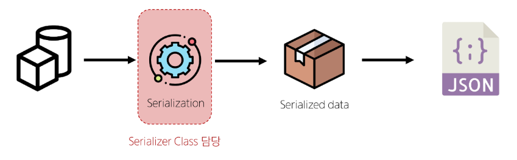
#### Serializer
: Serialization을 진행하여 Serialized data를 반환해주는 클래스
#### ModelSerializer
: Django 모델과 연결된 Serializer 클래스
→ 일반 Serializer와 달리 사용자 입력 데이터를 받아 자동으로 모델 필드에 맞추어 Serialization을 진행
#### GET - List
- url 및 view 함수 작성
```python
# articles/urls.py

urlpatterns = [
	path('articles/', views.article_list),
]
```
```python
# articles/views.py

from rest_framework.response import Response
from rest_framework.decorators import api_view

from .models import Article
from .serializers import ArticleListSerializer

@api_view(['GET'])
def article_list(request):
	articles = Article.objects.all()
	serializer = ArticleListSerializer(articles, many=True)
	return Response(serializer.data)

```
#### ModelSerializer의 인자 및 속성
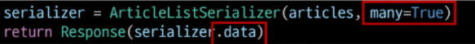
- `many` 옵션
	- Serialize 대상이 QuerySet인 경우 입력
- `data` 속성
	- Serialized data 객체에서 실제 데이터를 추출
#### 과거 view 함수와의 비교
- 똑같은 데이터를 HTML에 출력되도록 페이지와 함께 응답했던 과거의 view 함수, JSON 데이터로 serialization 하여 페이지 없이 응답하는 현재의 view 함수
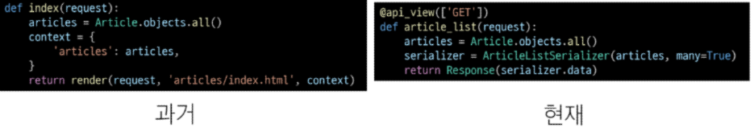
#### `api_view` decorator
- DRF view 함수에서는 *필수로 작성*되며 view 함수를 실행하기 전 HTTP 메서드를 확인
- 기본적으로 GET 메서드만 허용되며 다른 메서드 요청에 대해서는 `405 Method Not Allowed`로 응답
- DRF view 함수가 응답해야 하는 HTTP 메서드 목록을 작성
#### GET - Detail
- 단일 게시글 데이터 조회하기
	- 각 게시글의 상세 정보를 제공하는 `ArticleSerializer` 정의
```python
# articles/serializers.py

class ArticleSerializer(serializers.ModelSerializer):
	class Meta:
		model = Article
		fields = '__all__'
```
- url 및 view 함수 작성
```python
# articles/urls.py

urlpatterns = [
	...,
	path('articles/<int:article_pk>/', views.article_detail),
]
```
```python
# articles/views.py

from .serializers import ArticleListSerializer, ArticleSerializer

@api_view(['GET'])
def article_detail(request, article_pk):
	article = Article.objects.get(pk=article_pk)
	serializer = ArticleSerializer(article)
	return Response(serializer.data)
```
### POST
- 게시글 데이터 생성하기
1. 데이터 생성이 성공했을 경우 `201 Created` 응답
2. 데이터 생성이 실패했을 경우 `400 Bad request` 응답
#### POST
- `article_list` view 함수 구조 변경 (method에 따른 분기처리)
```python
# articles/views.py

from rest_framework import status

@api_view(['GET', 'POST'])
def article_list(request):
	if request.method == 'GET':
		articles = Article.objects.all()
		serializer = ArticleListSerializer(articles, many=True)
		return Response(serializer.data)
	elif request.method == "POST":
		serializer = ArticleSerializer(data=request.data)
		if serializer.is_valid():
			serializer.save()
			return Response(serializer.data, status=status.HTTP_201_CREATED)
		return Response(serializer.errors, status=status.HTTP_400_BAD_REQUEST)
```
### DELETE
- 게시글 데이터 삭제하기
	- 요청에 대한 데이터 삭제가 성공했을 경우는 `204 No Content` 응답
```python
# articles/views.py

@api_view(['GET', 'DELETE'])
def article_detail(request, article_pk):
	article = Article.objects.get(pk=article_pk)
	if request.method == "GET":
		serializer = ArticleSerializer(article)
		return Response(serializer.data)
	elif request.method == 'DELETE':
		article.delete()
		return Response(status=status.HTTP_204_NO_CONTENT)
```
### PUT
- 게시글 데이터 수정하기
	- 요청에 대한 데이터 수정이 성공했을 경우는 `200 OK` 응답
```python
# articles/views.py

@api_view(['GET', 'DELETE', 'PUT'])
def article_detail(request, article_pk):
	...
	elif request.method == "PUT":
		serializer = ArticleSerializer(article, data=request.data, partial=True)
		if serializer.is_valid():
			serializer.save()
			return Response(serializer.data)
		return Response(serializer.errors, status=status.HTTP_400_BAD_REQUEST)
```
### `partial` argument
- 부분 업데이트를 허용하기 위한 인자
- 예를 들어 `partial` 인자 값이 False일 경우 게시글 title만을 수정하려고 해도 반드시 content 값도 요청 시 함께 전송해야 함
- 기본적으로 serializer는 모든 필수 필드에 대한 값을 전달 받기 때문
	- 즉, 수정하지 않는 다른 필드 데이터도 모두 전송해야 하며 그렇지 않으면 유효성 검사에서 오류가 발생

## 참고
### `raise_exception`
- `is_valid()`의 선택 인자
- 유효성 검사를 통과하지 못할 경우 `ValidationError` 예외를 발생시킴
- DRF에서 제공하는 기본 예외 처리기에 의해 자동으로 처리되며 기본적으로 `HTTP 400` 응답을 반환
```python
# articles/views.py

@api_view(['GET', 'POST'])
def article_list(request):
	...
	elif request.method == "POST":
		serializer = ArticleSerializer(data=request.data)
		if serializer.is_valie(raise_exception=True):
			serializer.save()
			return Response(serializer.data, status=status.HTTP_201_CREATED)
		# return Response(serializer.errors, status=status.HTTP_400_BAD_REQUEST)
```