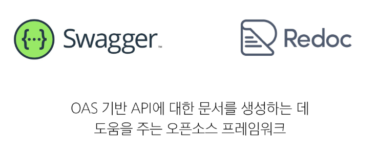

# REST API 2
## DRF with N:1 Relation
### 사전 준비
- Comment 모델 정의
	- Comment 클래스 정의 및 데이터베이스 초기화
	- Migration 및 fixtures 데이터 로드
- URL 및 HTTP request method 구성
  
  ### GET
  #### List
  - 댓글 목록 조회를 위한 CommentSerializer 정의
```python
# articles/serializers.py

class CommentSerializer(serializers.ModelSerializer):
    class Meta:
        model = Comment
        fields = '__all__'
```
- url 작성
```python
urlpatterns = [
	...,
    path('comments/', views.comment_list),
]
```
- view 함수 작성
```python
@api_view(['GET'])
def comment_list(request):
    comments = Comment.objects.all()
    serializer = CommentSerializer(comments, many=True)
    return Response(serializer.data)
```
#### Detail
- 단일 댓글 조회를 위한 url 및 view 함수 작성
```python
urlpatterns = [
	...,
    path('comments/<int:comment_pk>/', views.comment_detail),
]
```
```python
@api_view(['GET'])
def comment_detail(request, comment_pk):
    comment = Comment.objects.get(pk=comment_pk)
    serializer = CommentSerializer(comment)
    return Response(serializer.data)
```
### POST
- 단일 댓글 생성을 위한 url 및 view 함수 작성
```python
urlpatterns = [
	...,
    path('articles/<int:article_pk>/comments/', views.comment_create),
]
```
```python
@api_view(['POST'])
def comment_create(request, article_pk):
    article = Article.objects.get(pk=article_pk)
    serializer = CommentSerializer(data=request.data)
    if serializer.is_valid(raise_exception=True):
        serializer.save()
        return Response(serializer.data, status=status.HTTP_201_CREATED)
```
- serializer 인스턴스의 `save()` 메서드는 특정 Serializer 인스턴스를 저장하는 과정에서 추가 데이터를 받을 수 있음
- [!] *model처럼 commit=False 안됨!!!!!!!!!!!!!!!!!!!!!!!!!!!!!!!!!!!*
```python

@api_view(['POST'])
def comment_create(request, article_pk):
    article = Article.objects.get(pk=article_pk)
    serializer = CommentSerializer(data=request.data)
    if serializer.is_valid(raise_exception=True):
        serializer.save(article=article)  # 추가
        return Response(serializer.data, status=status.HTTP_201_CREATED)
```
- 상태코드 400 확인
- `CommentSerializer`에서 외래 키에 해당하는 `article` field 또한 사용자로부터 입력 받도록 설정되어 있기 때문에 서버 측에서는 누락되었다고 판단한 것
- 유효성 검사 목록에서 제외 필요
- `article` field를 *읽기 전용 필드*로 설정하기
#### 읽기 전용 필드(read_only_fields)
- 데이터를 전송 받은 시점에 *유효성 검사에서 제외*시키고 *데이터 조회 시에는 출력*하는 필드
```python
class CommentSerializer(serializers.ModelSerializer):
    class Meta:
        model = Comment
        fields = '__all__'
        read_only_fields = ('article',)
```
### DELETE & PUT
- 단일 댓글 삭제 및 수정을 위한 view 함수 작성
```python
@api_view(['GET', 'DELETE', 'PUT'])
def comment_detail(request, comment_pk):
    comment = Comment.objects.get(pk=comment_pk)
    if request.method == 'GET':
        serializer = CommentSerializer(comment)
        return Response(serializer.data)
    elif request.method == 'DELETE':
        comment.delete()
        return Response(status=status.HTTP_204_NO_CONTENT)
    elif request.method == 'PUT':
        serializer = CommentSerializer(comment, data=request.data)
        if serializer.is_valid(raise_exception=True):
            serializer.save()
            return Response(serializer.data)
```
## 응답 데이터 재구성
### 댓글 조회 시 게시글 출력 내역 변경
- 댓글 조회 시 게시글 번호만 제공해주는 것이 아닌 *'게시글의 제목'까지 제공*하기
-  필요한 데이터를 만들기 위한 Serializer는 내부에서 추가 선언이 가능
```python
class CommentSerializer(serializers.ModelSerializer):
    class ArticleTitleSerializer(serializers.ModelSerializer):
        class Meta:
            model = Article
            fields = ('title', )
    
    article = ArticleTitleSerializer(read_only=True)

    class Meta:
        model = Comment
        fields = '__all__'
        read_only_fields = ('article',)
```
# 역참조 데이터 구성
### Article → Comment 간 역참조 관계를 활용한 JSON 데이터 재구성
- 아래 2가지 사항에 대한 데이터 재구성하기
	1. 단일 게시글 조회 시 *해당 게시글에 작성된 댓글 목록*도 함께 붙여서 응답
	2. 단일 게시글 조회 시 *해당 게시글에 작성된 댓글 개수*도 함께 붙여서 응답
## 단일 게시글 & 댓글 목록
- `Nested relationships` (역참조 매니저 활용)
	- 모델 관계 상으로 참조하는 대상은 참조되는 대상의 표현에 포함되거나 중첩될 수 있음
	- 이러한 중첩된 관계는 serializers를 필드로 사용하여 표현 가능
```python
class ArticleSerializer(serializers.ModelSerializer):
    comment_set = CommentSerializer(many=True, read_only=True)
    class Meta:
        model = Article
        fields = '__all__'
```
## 단일 게시글 & 댓글 개수
- 댓글 개수에 해당하는 새로운 필드 생성
```python
class ArticleSerializer(serializers.ModelSerializer):
    comment_set = CommentSerializer(many=True, read_only=True)
	comment_count = serializers.IntegerField(source='comment_set.count', read_only=True)
    class Meta:
        model = Article
        fields = '__all__'
```
## `source` arguments
- 필드를 채우는 데 사용할 속성의 이름
- 점 표기법(dotted notation)을 사용하여 속성을 탐색 할 수 있음
## ❗ 읽기 전용 필드 지정 이슈
- 특정 필드를 override 혹은 추가한 경우 `read_only_fields`는 동작하지 않음
	- 이런 경우 새로운 필드에 `read_only` 키워드 인자로 작성해야 함
```python
class ArticleSerializer(serializers.ModelSerializer):
    comment_set = CommentSerializer(many=True)
    comment_count = serializers.IntegerField(source='comment_set.count')
    class Meta:
        model = Article
        fields = '__all__'
        read_only_fields = ('comment_set', 'comment_count')  # 이러면 안됩니다
```
# API 문서화
## 개요
### OpenAPI Specification (OAS)
: RESTful API를 설명하고 시각화하는 표준화된 방법
→ API에 대한 세부사항을 기술할 수 있는 공식 표준

### drf-spectacular 라이브러리
- DRF 위한 OpenAPI 3.0 구조 생성을 도와주는 라이브러리
- 설치 및 등록
```
pip install drf-spectacular
```
```python
# settings.py

INSTALLED_APPS = [
	...,
    'drf_spectacular',
    ...,
]
```
- 관련 설정 코드 입력 (OpenAPI 구조 자동 생성 코드)
```python
# settings.py

REST_FRAMEWORK = {
    # YOUR SETTINGS
    'DEFAULT_SCHEMA_CLASS': 'drf_spectacular.openapi.AutoSchema',
}
```
- swagger, redoc 페이지 제공을 위한 url 작성
```python
# drf/urls.py
from drf_spectacular.views import SpectacularAPIView, SpectacularRedocView, SpectacularSwaggerView

urlpatterns = [
	...,
    path('api/schema/', SpectacularAPIView.as_view(), name='schema'),
    path('api/schema/swagger-ui/', SpectacularSwaggerView.as_view(url_name='schema'), name='swagger-ui'),
    path('api/schema/redoc/', SpectacularRedocView.as_view(url_name='schema'), name='redoc'),
]
```
## "설계 우선" 접근법
- OAS의 핵심 이점
- API를 먼저 설계하고 명세를 작성한 후, 이를 기반으로 코드를 구현하는 방식
- API의 일관성을 유지하고, API 사용자는 더 쉽게 API를 이해하고 사용할 수 있음
- 또한, OAS를 사용하면 API가 어떻게 작동하는지를 시각적으로 보여주는 문서를 생성할 수 있으며, 이는 API를 이해하고 테스트하는 데 매우 유용
- 이런 목적으로 사용되는 도구가 *Swagger-UI* 또는 *ReDoc*
# 참고
## Django shortcuts functions
- `render()`
- `redirect()`
- `get_object_or_404()`
- `get_list_or_404()`
### `get_object_or_404()`
- 모델 manager objects에서 `get()`을 호출하지만, 해당 객체가 없을 땐 기존 `DoesNotExist` 예외 대신 *`Http404`를 raise*함
#### 적용
```python
from django.shortcuts import get_object_or_404

article = Article.objects.get(pk=article_pk)
comment = Comment.objects.get(pk=comment_pk)

# 위 코드를 모두 다음과 같이 변경
article = get_object_or_404(Article, pk=article_pk)
comment = get_object_or_404(Comment, pk=comment_pk)
```
### `get_list_or_404()`
- 모델 manager objects에서 `filter()`의 결과를 반환하고, 해당 객체 목록이 없을 땐 *`Http404`를 raise*함
#### 적용
```python
from django.shortcuts import get_object_or_404, get_list_or_404

articles = Article.objects.all()
comments = Comment.objects.all()

# 위 코드를 모두 다음과 같이 변경
articles = get_list_or_404(Article)
comments = get_list_or_404(Comment)
```
### 적용 전/후 비교
- 존재하지 않는 게시글 조회 시 이전에는 상태 코드 500을 응답했지만 현재는 404를 응답
### 왜 사용해야 할까?
- 클라이언트에게 "서버에 오류가 발생하여 요청을 수행할 수 없다(500)"라는 원인이 정확하지 않은 에러를 제공하기 보다는, 적절한 예외 처리를 통해 클라이언트에게 보다 정확한 에러 현황을 전달하는 것도 매우 중요한 개발 요소 중 하나이기 때문
