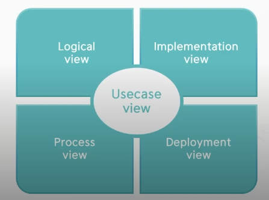
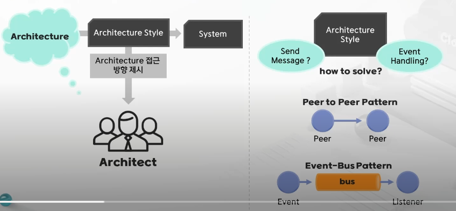
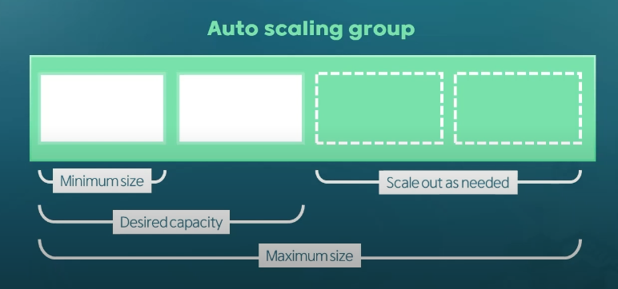
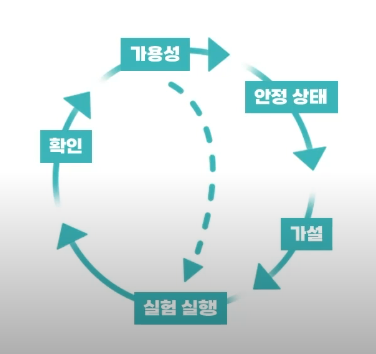
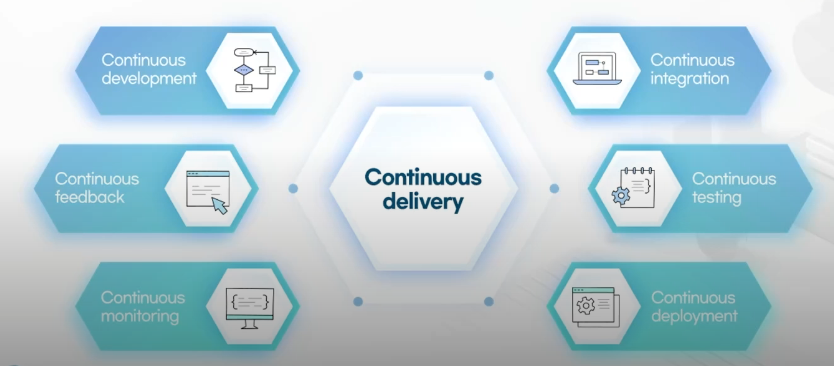
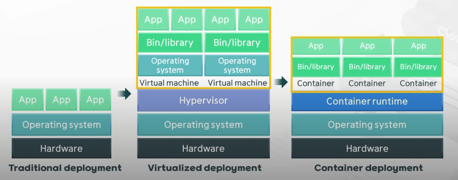
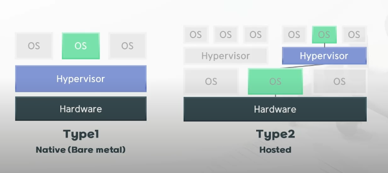
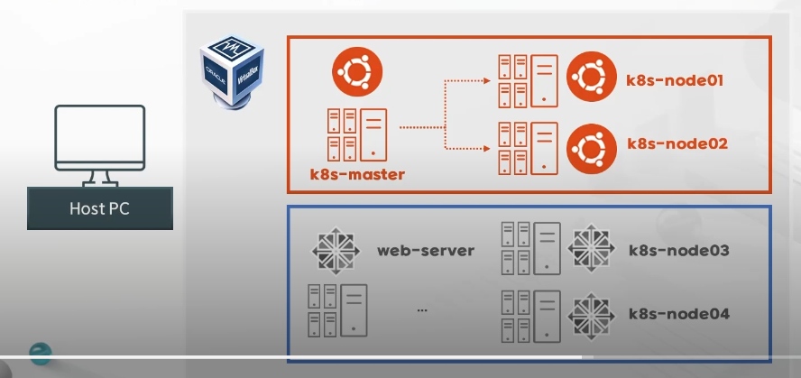

# 1. 소프트웨어 아키텍처

사람: 김민경, sungju yoo

# 1-1. SW Architecture

## 소프트웨어 아키텍처

### SW를 구성하는 요소와 요소 간의 관계 정의

- 전체 구성 관계, 포함 관계, 호출 관계
- SW 설계자, 개발, 사용자 등 이해 관계자들 간의 커뮤니케이션 도구

### 이해관계자들이 시스템을 이해하는 수준은 모두 다름 → 관점 → View

- UML (Unified Modeling Language)
    - 각각 필요한 부분을 도식화

- 무형의 지식 집합체 (코드)
- 기능적 측면 보다는 안정적인 운영을 위한 전체적 구조 설계
    - 예시: 오케스트라

### Architecture 스타일과 패턴

## IT 시스템의 역사

- 생략

## Anti-fragile

### Auto scaling

- 하드웨어 확장
    - CPU, RAM, Storage 등 resource가 부족해짐

→ scaling이란 양적, 질적 시스템 확장

- auto scaling: 필요에 따라 능력, 수량을 늘였다 줄였다

### Microservices

- 기업이 만들었던 서비스를 마이크로 단위로 쪼갬
    - 작은 단위로 쪼개지는 기능으로 서비스를 만들겠다는 것

### Chaos engineering

- 개발 → Test → **운영** 단계일 때
    - 변동
    - 예견된 불확실성
    - 예견되지 않은 불확실성
    - 카오스 불확실성

### Continuous deployments

- **지속적** 어쩌고
    - 반복적으로 개발, 테스트, 배포 등을 거친다는 것
- 주기적으로 단계별 업무 수행 (사이클을 계속적으로)

# 1-2. Cloud Native Architecture

## Cloud Native Architecture

- 확장 가능한 아키텍처
- 탄력적 아키텍처
- 장애 격리 : 문제가 발생한 부분만 사용 불가 (나머지는 정상 작동)

## Cloud Native Application 구성 컴포넌트

- CLOUD NATIVE COMPUTING FOUNDATION (CNCF)
    - 리눅스 산하기관
    - 클라우드에 필요한 모든 기술, 스펙 정의/테스트/소개하는 단체

- **Microservices**
    - 서비스를 하나의 큰 덩어리로 보는 것이 아닌 기능별로 쪼개서 각각이 독립적인 스토리지를 가지고 있어 개발, 배포
    - MSA 요즘 유행
    - Monolithic ↔ MSA
- **Containerization**
    - 컨테이너 가상화 기술 ex) Docker
    - 가상 리소스로 MSA를 수행하자
- **Continuous delivery**
    - 서비스를 잘게 쪼갰기 때문에 그 수만큼 배포가 수행되어야 함 → 지속적으로 해야하는 이유
- **DevOps**
    - 개발 + 운영
    - 분석 → 설계 → 구현 → 테스트 → 배포 → 모니터링 → 개선점 → 분석 …
    - 서비스를 사용하지 않을 때 까지 사이클 반복

# 1-3. 가상화 기술의 발전과 종류

## 가상화 기술의 이해

### 기존 가상화 방식 → 서버 가상화

- **Virtualized deployment**
    - Hypervisor
        - 물리적 시스템을 가상머신으로 쪼개주고 사용할 수 있게 해줌
    - Virtual Machine(가상머신)
        - 일종의 하드웨어지만 가상의 하드웨어
        - 각각의 하드웨어를 사용하기 위해선 OS가 필요함 → Guest OS
        - 각 가상머신마다 CPU, RAM, Storage 지정 가능
            - but 물리적 용량 초과 불가
- **Container deployment**
    - Container runtime
        - 컨테이너 구동, 실행 역할
        - 운영체제를 새롭게 설치,실행하는 것이 아닌 Container 단위로 사용
    - Bin/library가 Host OS와 공유할 수 있는 상태면 공유도 가능
        - 다른 컨테이너와도 서로 공유 가능
        - → 재사용, 필요시 바로 어플리케이션 사용 가능
    
    → 리소스가 적게 든다!!
    

- Container 단위 → Docker

## 서버 가상화 실습

### VirtualBox + Linux (Ubuntu)

- Host PC
    - Host OS: 물리적 하드웨어에 설치된 운영체제
    - Host PC: 가지고 있는 노트북, 데스크탑
- 이미지
    - 운영체제 설치 가능한 파일
    - 운영체제가 저장되어 있는 상태
- Docker → 오케스트레이션 도구 (ex. Kubernetes)
    - docker를 더 업무에서 원활하게 사용하려고 할 때 오케스트레이션 도구를 사용함
- 주황색 시나리오
    - vm 총합 8기가를 사용하려고 할 때 HostOS + Virtual Box + VM 을 모두 사용할 수 있는 용량 필요 → 효율성이 떨어짐
- 파란색 시나리오
    - web-server 형식 이미지 구축
- 그림처럼 사용하면 VM 6개 → resource가 부족할 가능성 높음 (비추천)
    - docker를 사용하면 VM 6개 사용하는 것 간단하게 해결