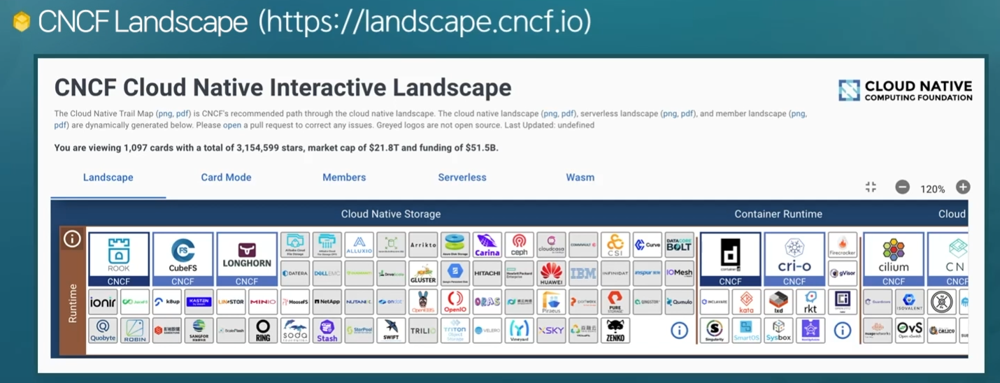
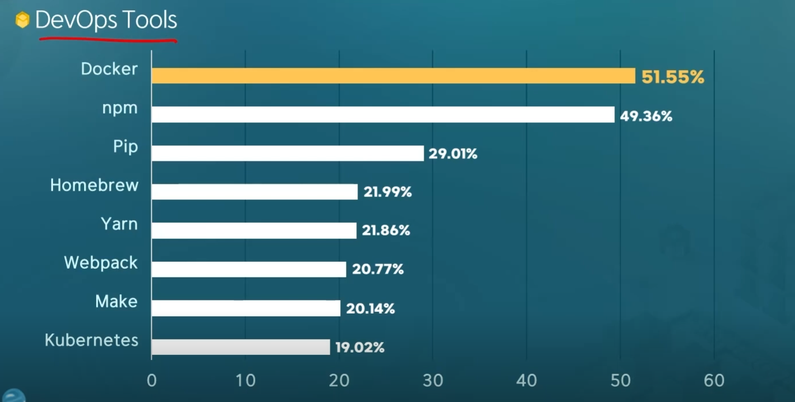
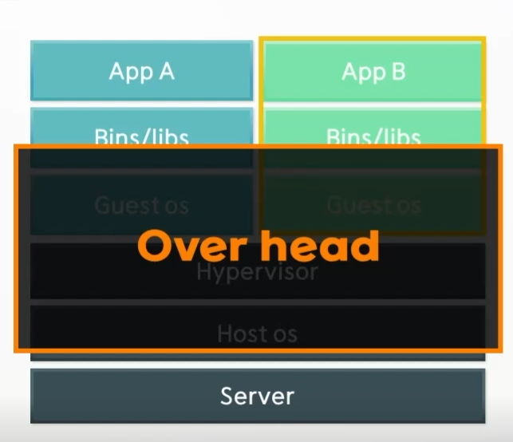

# 가상화 환경 구축을 위한 Docker 시작하기
# 1. Docker Architecture
## [CNCF Landscape](https://landscape.cncf.io)

- Docker는 Container Runtime에 속함
## DevOps Tools

## Docker Architecture
- 백엔드 프로그램, 데이터베이스, 메시지 큐 → 컨테이너로 추상화 가능
	- 일반PC, AWS, Azure, Google Cloud 등에서 실행 가능
- 컨테이너 기반의 오픈소스 가상화 플랫폼

### 기존 가상화 방식 
→ OS를 가상화
- VMWare, VirtualBox(Host OS 위에 Guest OS 전체를 가상화)
- 무겁고 느림
### CPU의 가상화 기술 이용 방식
→ Kernel-based Virtual Machine
- 전체 OS를 가상화 하지 않음, 호스트 형식에 비해 속도 향상
- OpenStack, AWS 등의 클라우드 서비스
- 추가적인 OS는 여전히 필요, 성능 문제
