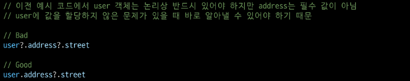
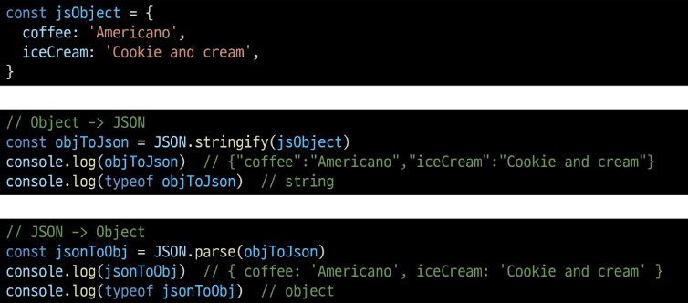

# Reference Type
# 함수
## Function
- 참조 자료형에 속하며 모든 함수는 `Function` object
## 함수 정의
```js
function name([param[, param,[..., param]]]) {
	statements
	return value
}
```
- `function` 키워드
- 함수의 이름
- 함수의 매개변수
- 함수의 body를 구성하는 statements
- *return 값이 없다면 undefined를 반환*
### 선언식 (function declaration)
```js
function funcName () {
	statements
}
```
### 표현식 (function expression)
```js
const funcName = function () {
	statements
}
```
- 함수 이름이 없는 '익명 함수'를 사용할 수 있음
- 선언식과 달리 표현식으로 정의한 함수는 호이스팅 되지 않으므로 함수를 정의하기 전에 먼저 사용할 수 없음
### 종합
|     | 선언식                      | 표현식                        |
| --- | ------------------------ | -------------------------- |
| 특징  | - 익명 함수 불가능<br>- 호이스팅 있음 | - 익명 함수 사용 가능<br>- 호이스팅 없음 |
| 기타  |                          | *사용 권장*                    |
## 매개변수
### 1. 기본 함수 매개변수 (Default function parameter)
- 전달하는 인자가 없거나 `undefined`가 전달될 경우 이름 붙은 매개변수를 기본값으로 초기화
```js
const greeting = function (name = 'Anonymous') {
	return `Hi ${name}`
}
```
### 2. 나머지 매개변수 (Rest parameters)
- 임의의 수의 인자를 '배열'로 허용하여 가변 인자를 나타내는 방법
- 작성 규칙
	- 함수 정의 시 나머지 매개변수는 하나만 작성할 수 있음
	- 나머지 매개변수는 함수 정의에서 매개변수 마지막에 위치해야 함
```js
const myFunc = function (param1, param2, ...restParams) {
	return [param1, param2, restParams]
}

myFunc(1, 2, 3, 4, 5)  // [1, 2, [3, 4, 5]]
myFunc(1, 2)  // [1, 2, []]
```
### 매개변수와 인자 개수가 불일치 할 때
- 매개변수 개수 > 인자 개수
→ 누락된 인자는 `undefined`로 할당
```js
const threeArgs = function (param1, param2, param3) {
	return [param1, param2, param3]
}

threeArgs()  // [undefined, undefined, undefined]
```
- 매개 변수 개수 < 인자 개수
→ 초과 입력한 인자는 사용하지 않음
```js
const noArgs = function () {
	return 0
}
noArgs(1, 2, 3)  // 0
```
## Spread syntax (전개 구문)
- 배열이나 문자열과 같이 반복 가능한 항목을 펼치는 것 (확장, 전개)
- 전개 대상에 따라 역할이 다름
	- 배열이나 객체의 요소를 개별적인 값으로 분리하거나 다른 배열이나 객체의 요소를 현재 배열이나 객체에 추가하는 등
### 전개 구문 활용처
#### 1. 함수와의 사용
1. 함수 호출 시 인자 확장
```js
function myFunc(x, y, z) {
	return x+y+z
}
let numbers = [1, 2, 3]
console.log(myFunc(...numbers)) // 6
```
2. 나머지 매개변수 (압축)
```js
function myFunc2(x, y, ...restArgs) {
	return [x, y, restArgs]
}

console.log(myFunc2(1, 2, 3, 4, 5)) // [1, 2, [3, 4, 5]]
console.log(myFunc2(1, 2)) // [1, 2, []]
```
#### 2. 객체와의 사용 (객체 파트에서 진행)
#### 3. 배열과의 활용 (배열 파트에서 진행)
## 화살표 함수 표현식(Arrow Function Expressions)
- 함수 표현식의 간결한 표현법
### 작성 결과
```js
const arrow = function (name) {
	return `hello, ${name}`
}

const arrow = (name) => `hello, ${name}`
```
### 작성 과정
1. `function` 키워드 제거 후 매개변수와 중괄호 사이에 화살표 작성
2. 함수의 매개변수가 하나 뿐이라면, 매개변수의 () 제거 가능 (단, 생략하지 않는 것을 권장)
3. 함수 본문의 표현식이 한 줄이라면, {}와 return 제거 가능
## 참고
### 화살표 함수 심화
```js
// 1. 인자가 없다면 () or _로 표시 가능
const noArgs1 = () => 'No args'
const noArgs2 = _ => 'No args'

// 2-1. object를 return 한다면 return을 명시적으로 작성해야 함
const returnObject1 = () => {return {key:'value'}}

// 2-2. return을 작성하지 않으려면 객체를 소괄호로 감싸야 함
const returnObject2 = () => ({key:'value'})
```
# 객체
## Object
- 키로 구분된 데이터 집합을 저장하는 자료형(data collection)
## 구조 및 속성
### 객체 구조
- 중괄호를 이용해 작성
- 중괄호 안에는 `key: value` 쌍으로 구성된 속성(property)를 여러 개 작성 가능
- `key`는 문자형만 허용
- `value`는 모든 자료형 허용
```js
const user = {
	name: 'Alice',
	'key with space': true,
	greeting: function () {
		return 'hello'
	}
}
```
### 속성 참조
- 점 또는 대괄호로 객체 요소 접근
- `key` 이름에 띄어쓰기 같은 구분자가 있으면 대괄호 접근만 가능
```js
// 조회
console.log(user.name) // Alice
console.log(user['key with space']) // true

// 추가
user.address = 'korea'
console.log(user) // {name: 'Alice', key with space: true, address: 'korea', greeting: f}

// 수정
user.name = 'Bella'
console.log(user.name) // Bella

// 삭제
delete user.name
console.log(user) // {key with space: true, address: 'korea', greeting: f}
```
### `in` 연산자
- 속성이 객체에 존재하는지 여부를 확인
```js
console.log('greeting' in user) // true
console.log('country' in user) // false
```
## 객체와 함수
### Method
- 객체 속성에 정의된 함수
#### 사용 예시
- `object.method()` 방식으로 호출
- 메서드는 객체를 '행동'할 수 있게 함
```js
console.log(user.greeting()) // hello
```
## this
- `this` 키워드를 사용해 객체에 대한 특정한 작업을 수행할 수 있음
- 함수나 메서드를 호출한 객체를 가리키는 키워드
	- 함수 내에서 객체의 속성 및 메서드에 접근하기 위해 사용
### 사용 예시
```js
const person = {
	name: "Alice",
	greeting: function () {
		return `Hello my name is ${this.name}`
	}
}

console.log(person.greeting()) // Hello my name is Alice
```
### JavaScript에서 `this`는 함수를 *호출하는 방법*에 따라 가리키는 대상이 다름
| 호출 방법  | 대상          |
| ------ | ----------- |
| 단순 호출  | 전역 객체       |
| 메서드 호출 | 메서드를 호출한 객체 |
#### 1. 단순 호출 시 `this`
- 가리키는 대상 → 전역 객체
```js
const myFunc = function () {
	return this
}
console.log(myFunc()) // window
```
#### 2. 메서드 호출 시 `this`
```js
const myObj = {
	data: 1,
	myFunc: function () {
		return this
	}
}

console.log(myObj.myFunc()) // myObj
```
### 중첩된 함수에서의 `this` 문제점과 해결책
```js
const myObj2 = {
	numbers: [1, 2, 3]
	myFunc: function () {
		this.numbers.forEach(function (number) {
			console.log(this)  // window
		})
	}
}

console.log(myObj2.myFunc())
```
- `forEach`의 인자로 작성된 함수는 일반적인 함수 호출이기 때문에 `this`가 전역 객체를 가리킴
```js
const myObj3 = {
	numbers: [1, 2, 3]
	myFunc: function () {
		this.numbers.forEach((number) => {
			console.log(this)  // myObj3
		})
	}
}

console.log(myObj3.myFunc())
```
- *화살표 함수는 자신만의 this를 가지지 않기 때문에* 외부 함수 (myFunc)에서의 `this` 값을 가져옴
### JavaScript `this` 정리
- JavaScript의 함수는 호출될 때 `this`를 암묵적으로 전달 받음
- JavaScript에서 `this`는 함수가 "호출되는 방식"에 따라 결정되는 현재 객체를 나타냄
- Python의 `self`와 Java의 `this`가 선언 시 이미 값이 정해지는 것에 비해 JavaScript의 `this`는 *함수가 호출되기 전까지 값이 할당되지 않고 호출 시에 결정*됨 (동적 할당)
- 장점
	- 함수(메서드)를 하나만 만들어 여러 객체에서 재사용할 수 있다는 것
- 단점
	- 이런 유연함이 실수로 이어질 수 있다는 것
→ 개발자는 `this`의 동작 방식을 충분히 이해하고 장점을 취하면서 실수를 피하는 데에 집중
## 추가 객체 문법
### 1. 단축 속성
- 키 이름과 값으로 쓰이는 변수의 이름이 같은 경우 단축 구문을 사용할 수 있음
```js
const name = 'Alice'
const age = 30
const user = {
	name,
	age,
}
```
### 2. 단축 메서드
- 메서드 선언 시 `function` 키워드 생략 가능
```js
const myObj2 = {
	myFunc() {
		return 'Hello'
	}
}
```
### 3. 계산된 속성 (computed property name)
- 키가 대괄호로 둘러싸여 있는 속성
	- 고정된 값이 아닌 변수 값을 사용할 수 있음
```js
const product = prompt('물건 이름을 입력해주세요')
const prefix = 'my'
const suffix = 'property'

const bag = {
	[product]: 5,
	[prefix + suffix]: 'value',
}

console.log(bag) // {연필: 5, myproperty: 'value'}
```
### 4. 구조 분해 할당 (destructing assingment)
- 배열 또는 객체를 분해하여 객체 속성을 변수에 쉽게 할당할 수 있는 문법
```js
const userInfo = {
	firstName: 'Alice',
	userId: 'alice123',
	email: 'alice123@gmail.com'
}

const {firstName} = userInfo
const {firstName, userId} = userInfo
const {firstName, userId, email} = userInfo

console.log(firstName, userId, email) // Alice alice123 alice123@gmail.com
```
- 함수의 매개변수로 객체 구조 분해 할당 활용 가능
```js
const person = {
	name: 'Bob',
	age: 35,
	city: 'London',
}

function printInfo({name, age, city}) {
	console.log(`이름: ${name}, 나이: ${age}, 도시: ${city}`)
}

// 함수 호출 시 객체를 구조 분해하여 함수의 매개변수로 전달
printInfo(person)  // 이름: Bob, 나이: 35, 도시: London
```
### 5. Object with '전개 구문'
- 객체 복사
	- 객체 내부에서 객체 전개
- 얕은 복사에 활용 가능
```js
const obj = {b:2, c:3, d:4}
const newObj = {a:1, ...obj, e:5}

console.log(newObj) // {a:1, b:2, c:3, d:4, e:5}
```
### 6. 유용한 객체 메서드
- `Object.keys()`
- `Object.values()`
```js
const profile = {
	name: 'Alice',
	age: 30,
}
console.log(Object.keys(profile))  // ['name', 'age']
console.log(Object.values(profile))  // ['Alice', 30]
```
### 7. Optional chaining (`?.`)
- 속성이 없는 중첩 객체를 에러 없이 접근할 수 있는 방법
- 만약 참조 대상이 `null` 또는 `undefined`라면 에러가 발생하는 것 대신 평가를 멈추고 `undefined`를 반환
```js
const user = {
	name: 'Alice',
	greeting: function () {
		return 'hello'
	}
}

console.log(user.address.street) // Uncaught TypeError
console.log(user.address?.street) // undefined

console.log(user.nonMethod()) // Uncaught TypeError
console.log(user.nonMethod?.()) // undefined
```
- 만약 Optional chaining을 사용하지 않는다면 다음과 같이 && 연산자를 사용해야 함
```js
const user = {
	name: 'Alice',
	greeting: function () {
		return 'hello'
	}
}

console.log(user.address && user.address.street)  // undefined
```
#### 장점
- 참조가 누락될 가능성이 있는 경우 연결된 속성으로 접근할 때 더 짧고 간단한 표현식을 작성할 수 있음
- 어떤 속성이 필요한지에 대한 보증이 확실하지 않는 경우에 객체의 내용을 보다 편리하게 탐색할 수 있음
#### 주의사항
1. Optional chaining은 존재하지 않아도 괜찮은 대상에만 사용해야 함 (남용 X)
	- 왼쪽 평가대상이 없어도 괜찮은 경우에만 선택적으로 사용
	- 중첩 객체를 에러 없이 접근하는 것이 사용 목적이기 때문
	
2. Optional chaining 앞의 변수는 반드시 선언되어 있어야 함
   
#### 정리
1. `obj?.prop`
   - obj가 존재하면 `obj?.prop`을 반환하고 그렇지 않으면 `undefined`를 반환
2. `obj?.[prop]`
   - obj가 존재하면 `obj?.[prop]`를 반환하고 그렇지 않으면 `undefined`를 반환
3. `obj?.method()`
   - obj가 존재하면 `obj?.method()`를 반환하고 그렇지 않으면 `undefined`를 반환
## JSON
- JavaScript Object Notation
- Key-Value 형태로 이루어진 자료 표기법
- JavaScript의 Object와 유사한 구조를 가지고 있지만 JSON은 형식이 있는 *문자열*
- JavaScript에서 JSON을 사용하기 위해서는 Object 자료형으로 변경해야 함
### Object ↔ JSON 변환하기

## 참고 
### `new` 연산자
- JS에서 객체를 하나 생성한다고 한다면?
	- 하나의 객체를 선언하여 생성
- 동일한 형태의 객체를 또 만든다면?
	- 또 다른 객체를 선언하여 생성해야 함
```js
function Member(name, age, sId) {
	this.name = name
	this.age = age
	this.sId = sId
}

const member3 = new Member('Bella', 21, 20226543)
```

- 사용자 정의 객체 타입을 생성
- 매개변수
	- `constructor` : 객체 인스턴스의 타입을 기술(명세)하는 함수
	- `arguments: constructor`와 함께 호출될 값 목록
# 배열
- Object : 키로 구분된 데이터 집합을 저장하는 자료형
	- 이제는 *순서가 있는 collection*이 필요
- Array : 순서가 있는 데이터 집합을 저장하는 자료구조
## 배열 구조
- 대괄호를 이용해 작성
- 요소 자료형: 제약 없음
- `length` 속성을 사용해 배열에 담긴 요소가 몇 개인지 알 수 있음
## 배열 메서드
### 주요 메서드
| 메서드                 | 역할               |
| ------------------- | ---------------- |
| `push` / `pop`      | 배열 끝 요소를 추가 / 제거 |
| `unshift` / `shift` | 배열 앞 요소를 추가 / 제거 |
### `push()`
- 배열 끝에 요소를 추가
```js
const names = ['Alice', 'Bella', 'Cathy']

names.push('Dan')
console.log(names) // ['Alice', 'Bella', 'Cathy', 'Dan']
```
### `pop()`
- 배열 끝 요소를 제거하고, 제거한 요소를 반환
```js
console.log(names.pop())  // Dan
console.log(names) // ['Alice', 'Bella', 'Cathy']
```
### `unshift()`
- 배열 앞에 요소를 추가
```js
names.unshift('Eric')
console.log(names) // ['Eric', 'Alice', 'Bella', 'Cathy']
```
### `shift()`
- 배열 앞 요소를 제거하고, 제거한 요소 반환
```js
console.log(names.shift()) // Eric
console.log(names) // ['Alice', 'Bella', 'Cathy']
```
## Array helper method
- 배열 조작을 보다 쉽게 수행할 수 있는 특별한 메서드 모음
- ES6에 도입
- 배열의 각 요소를 *순회*하며 각 요소에 대한 함수(*콜백함수*)를 호출
→ 메서드 호출 시 인자로 함수(*콜백함수*)를 받는 것이 특징
### 콜백 함수(Callback function)
- 다른 함수에 인자로 전달되는 함수
→ 외부 함수 내에서 호출되어 일종의 루틴이나 특정 작업을 진행
#### 주요 Array Helper Methods
| 메서드       | 역할                                                             |
| --------- | -------------------------------------------------------------- |
| `forEach` | - 배열 내의 모든 요소 각각에 대해 함수(콜백함수)를 호출<br>- 반환 값 없음                 |
| `map`     | - 배열 내의 모든 요소 각각에 대해 함수(콜백함수)를 호출<br>- 함수 호출 결과를 모아 새로운 배열을 반환 |
### `forEach()`
- 배열의 각 요소를 반복하며 모든 요소에 대해 콜백함수 호출
##### 구조

- 콜백함수는 3가지 매개변수로 구성
	1. `item` : 처리할 배열의 요소
	2. `index` : 처리할 배열 요소의 인덱스 (선택 인자)
	3. `array` : `forEach`를 호출한 배열 (선택 인자)
- 반환 값 : `undefined`
```js
array.forEach(function (item, index, array) {
	// do something
})

// 화살표 함수
array.forEach((item, index, array) => {
	// do something
})
```
#### `map()`
- 배열의 모든 요소에 대해 함수를 호출하고 반환 된 호출 결과 값을 모아 *새로운 배열을 반환*
##### 구조

- `forEach`의 매개 변수와 동일
- 반환 값
	- 배열의 각 요소에 대해 실행한 callback의 결과를 모든 새로운 배열
	→ `forEach` 동작 원리와 같지만 `forEach`와 달리 새로운 배열을 반환함
```js
const newArr = array.map(function (item, index, array) {
	// do something
})
```
##### 예시
- 배열을 순회하며 각 객체의 `name` 속성 값을 추출하기
```js
const persons = {
	{name: 'Alice', age: 20},
	{name: 'Bella', age: 21}
}

// for...of
let result1 = []
for (const person of persons) {
	result1.push(person.name)
}
console.log(result1) // ['Alice', 'Bella']

// map
const result2 = persons.map(function (person) {
	return person.name
})
console.log(result2) // ['Alice', 'Bella']
```
##### python에서의 map 함수와 비교
- python의 `map`에 `square` 함수를 인자로 넘겨 `numbers` 배열의 각 요소를 `square` 함수의 인자로 사용하였음
```python
numbers = [1, 2, 3]

def square(num):
	return num ** 2

new_numbers = list(map(square, numbers))
```
- `map` 메서드에 `callBackFunc` 함수를 인자로 넘겨 `numbers` 배열의 각 요소를 `callBackFunc` 함수의 인자로 사용하였음
```js
const numbers = [1, 2, 3]

const callBackFunction = function (number) {
	return number ** 2
}

const newNumbers = numbers.map(callBackFunction)
```
### 배열 순회 종합
| 방식         | 특징                                                                                  | 비고      |
| ---------- | ----------------------------------------------------------------------------------- | ------- |
| `for loop` | - 배열의 인덱스를 이용하여 각 요소에 접근<br>- `break`, `continue` 사용 가능                             |         |
| `for...of` | - 배열 요소에 바로 접근 가능<br>- `break`, `continue` 사용 가능                                    |         |
| `forEach`  | - 간결하고 가독성이 높음<br>- callback 함수를 이용하여 각 요소를 조작하기 용이<br>- `break`, `continue` 사용 불가능 | *사용 권장* |
### 기타 Array Helper Methods
| 메서드      | 역할                                                                                  |
| -------- | ----------------------------------------------------------------------------------- |
| `filter` | 콜백 함수의 반환 값이 참인 요소들만 모아서 새로운 배열을 반환                                                 |
| `find`   | 콜백 함수의 반환 값이 참이면 해당 요소 반환                                                           |
| `some`   | 배열의 요소 중 적어도 하나라도 콜백 함수를 통과하면 `true` 반환하며 즉시 배열 순회 중지<br>반면에 모두 통과하지 못하면 `false` 반환 |
| `every`  | 배열의 모든 요소가 콜백 함수를 통과하면 `true` 반환<br>반면에 하나라도 통과하지 못하면 즉시 `false` 반환하고 배열 순회 중지      |
- MDN 문서 참고
## 추가 배열 문법
### Array with '전개 구문'
- 배열 복사
```js
let parts = ['어깨', '무릎']
let lyrics = ['머리', ...parts, '발']

console.log(lyrics) // ['머리', '어깨', '무릎', '발']
```
## 참고
### 콜백함수 구조를 사용하는 이유
#### 1. 함수의 재사용적 측면
- 함수를 호출하는 코드에서 콜백 함수의 동작을 자유롭게 변경할 수 있음
- 예를 들어, `map` 함수는 콜백 함수를 인자로 받아 배열의 각 요소를 순회하며 콜백 함수를 실행
- 이때, 콜백 함수는 각 요소를 변환하는 로직을 담당하므로, `map` 함수를 호출하는 코드는 간결하고 가독성이 높아짐
#### 2. 비동기적 측면
```js
console.log('a')

setTimeout(() => {
	console.log('b')
}, 3000)

console.log('c')

// a
// c
// b
```
- `setTimeout` 함수는 콜백 함수를 인자로 받아 일정 시간이 지난 후에 실행됨
- 이때, `setTimeout` 함수는 비동기적으로 콜백 함수를 실행하므로, 다른 코드의 실행을 방해하지 않음
### `forEach`에서 `break`하는 대안
- `forEach`에서는 `break` 사용 불가능
- 대신 `some`과 `every`의 특징을 활용해 마치 `break`처럼 사용할 수 있다
```js
const names = ['Alice', 'Bella', 'Cathy']

// 1. some
// - 콜백 함수가 true를 반환하면 some 메서드는 즉시 중단하고 true를 반환
names.some(function (name) {
  console.log(name) // Alice, Bella
  if (name === 'Bella') {
    return true
  }
  return false
})

// 2. every
// - 콜백 함수가 false를 반환하면 every 메서드는 즉시 중단하고 false를 반환
names.every(function (name) {
  console.log(name) // Alice, Bella
  if (name === 'Bella') {
    return false
  }
  return true
})
```
### "배열은 객체다"
- 배열도 키와 속성들을 담고 있는 참조 타입의 객체
- 배열의 요소를 대괄호 접근법을 사용해 접근하는 건 객체 문법과 같음
	- 배열의 키는 숫자
- 숫자형 키를 사용함으로써 배열은 객체 기본 기능 이외에도 "순서가 있는 컬렉션"을 제어하게 해주는 특별한 메서드를 제공하는 것
- 배열은 인덱스를 키로 가지며 `length` 속성을 갖는 특수한 객체