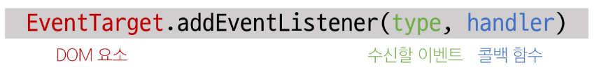
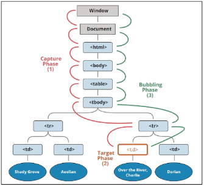

# Controlling event
# 이벤트
## event 객체
- event : 무언가 일어났다는 신호, 사건
→ 모든 DOM 요소는 이러한 event를 만들어 냄
## `event` object
- DOM에서 이벤트가 발생했을때 생성되는 객체
- 이벤트 종류
	- mouse, input, keyboard, touch ...
	- [https://developer.mozilla.org/en-US/docs/Web/API/Event](https://developer.mozilla.org/en-US/docs/Web/API/Event)
- DOM 요소는 event를 받고 받은 event를 '처리'할 수 있음
	- *event handler (이벤트 처리기)*
## event handler
- 이벤트가 발생했을 때 실행되는 함수
	- 사용자의 행동에 어떻게 반응할지를 JavaScript 코드로 표현한 것
### `.addEventListener()`
- 대표적인 이벤트 핸들러 중 하나
	- 특정 이벤트를 DOM 요소가 수신할 때마다 콜백 함수를 호출

> 대상에 특정 Event가 발생하면 지정한 이벤트를 받아 할 일을 등록한다.
#### `addEventListener`의 인자
- `type`
	- 수신할 이벤트 이름
	- 문자열로 작성 (ex. `click`)
- `handler`
	- 발생한 이벤트 객체를 수신하는 콜백함수
	- 콜백 함수는 발생한 `event` object를 유일한 매개변수로 받음
#### `addEventListener` 활용
- 버튼을 클릭하면 버튼 요소 출력하기
	- 버튼에 이벤트 처리기를 부착하여 클릭 이벤트가 발생하면 이벤트가 발생한 버튼 정보를 출력
- 요소에 `addEventListener`를 부착하게 되면 내부의 `this` 값은 대상 요소를 가리키게 됨 (event 객체의 currentTarget 속성 값과 동일)
```html
<button id='btn'>버튼</button>
```
```js
const btn = document.querySelector('#btn')

const detectClick = function (event) {
	console.log(event)
	console.log(event.currentTarget)
	console.log(this)
}

btn.addEventListener('click', detectClick)
```
#### `addEventListener`의 콜백 함수 특징
- 발생한 이벤트를 나타내는 `event` 객체를 유일한 매개변수로 받음
- 반환 값 없음
## 버블링
### 개요
- `form > div > p` 형태의 중첩된 구조에 각각 이벤트 핸들러가 있을 때 만약 `<p>` 요소를 클릭하면?
	- 모든 핸들러가 동작함
	- 왜 `p`를 클릭했는데 `div`와 `form`에 할당된 핸들러까지 동작할까?
### 버블링 (Bubbling)
- 한 요소에 이벤트가 발생하면, 이 요소에 할당된 핸들러가 동작하고, 이어서 부모 요소의 핸들러가 동작하는 현상
- 가장 최상단의 조상 요소(`document`)를 만날 때까지 이 과정이 반복되면서 요소 각각에 할당된 핸들러가 동작
	- 이벤트가 제일 깊은 곳에 있는 요소에서 시작해 부모 요소를 거슬러 올라가며 발생하는 것이 마치 물속 거품과 닮았기 때문
	- 가장 안쪽의 `p` 요소를 클릭하면 `p → div → form` 순서로 3개의 이벤트 핸들러가 모두 동작했던 것
#### 이벤트가 정확히 어디서 발생했는지 접근할 수 있는 방법
- `event.`*`currentTarget`*
- `event.`*`target`*
#### `currentTarget` 속성
- '현재' 요소
- 항상 이벤트 핸들러가 연결된 요소만을 참조하는 속성
- `this`와 같음
#### `target` 속성
- 이벤트가 발생한 가장 안쪽의 요소 (target)를 참조하는 속성
- 실제 이벤트가 시작된 요소
- 버블링이 진행 되어도 변하지 않음
### 캡처링(capturing)
- 이벤트가 하위 요소로 전파되는 단계 (버블링과 반대)

### 캡처링과 버블링
- `table`안에 `tb` 를 클릭하면 이벤트는 최상위 요소부터 아래로 전파
- 실제 이벤트가 발생한 지점(`event.target`)에서 실행된 후 다시 위로 전파
	- 이 과정에서 상위 요소에 할당된 이벤트 핸들러가 호출되는 것
→ 캡처링은 실제 다루는 경우가 거의 없으므로 버블링에 집중하기
### 버블링이 필요한 이유
- 만약 다음과 같이 각자 다른 동작을 수행하는 버튼이 여러 개가 있다고 가정
- 그렇다면 각 버튼마다 서로 다른 이벤트 핸들러를 할당해야 할까?
→ 각 버튼의 *공통 조상이 div 요소에 이벤트 핸들러 단 하나만 할당*하기
- 요소의 공통 조상에 이벤트 핸들러를 단 하나만 할당하면 여러 요소를 한꺼번에 다룰 수 있음
- 공통 조상에 할당한 핸들러에서 `event.target`을 이용하면 실제 어떤 버튼에서 이벤트가 발생했는지 알 수 있기 때문
# event handler 활용
## `currentTarget` 주의사항
- `console.log()`로 `event` 객체를 출력할 경우 `currentTarget` 키의 값은 `null`을 가짐
- `currentTarget`은 이벤트가 처리되는 동안에만 사용할 수 있기 때문
- 대신 `console.log(event.currentTarget)`을 사용하여 콘솔에서 확인 가능
→ `currentTarget` 이후의 속성 값들은 *`target`을 참고해서 사용하기*
## lodash
- 모듈성, 성능 및 추가 기능을 제공하는 JavaScript 유틸리티 라이브러리
- array, object 등 자료구조를 다룰 때 사용하는 유용하고 간편한 함수들을 제공
- [https://lodash.com/](https://lodash.com/)
## 이벤트 기본 동작 취소
- HTML의 각 요소가 기본적으로 가지고 있는 이벤트가 때로는 방해가 되는 경우가 있어 이벤트의 기본 동작을 취소할 필요가 있음
- 예시
	- `form` 요소의 제출 이벤트를 취소하여 페이지 새로고침을 막을 수 있음
	- `a` 요소를 클릭 할 때 페이지 이동을 막고 추가 로직을 수행할 수 있음
### `.preventDefault()`
- 해당 이벤트에 대한 기본 동작을 실행하지 않도록 지정
# 참고
## `addEventListener`에서의 화살표 함수 주의사항
- 화살표 함수는 자신만의 `this`를 가지지 않기 때문에 자신을 포함하고 있는 함수의 `this`를 상속받음
	- `this`를 사용해야 하는 경우 `addEventListener`에서는 일반 함수로 사용하기

## `.trim()`
```js
const text = input.value;
if (text.trim()) {
...
} else {
  alert("할 일을 입력해주세요.");
}
```
-  input이 입력되지 않았을 때 else문의 alert 수행