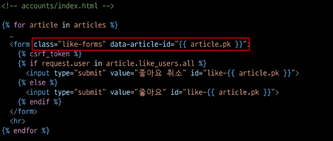
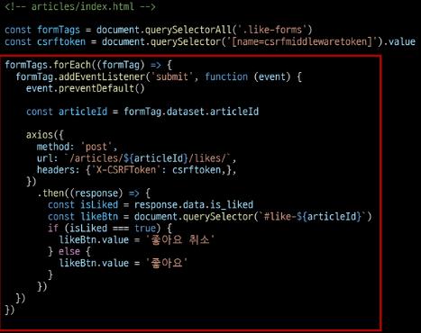

# Ajax with Django
# Ajax와 서버
- XML 객체 생성 및 요청
- Ajax 요청 처리
- 응답 데이터 생성
- JSON 데이터 응답
- Promise 객체 데이터를 활용해 DOM 조작
# Ajax with follow
## 비동기 팔로우 구현
### 사전 준비
1. M:N 까지 진행한 Django 프로젝트 준비
2. 가상 환경 생성 및 활성화, 패키지 설치
### Ajax 적용
#### 프로필 페이지
- axios CDN 작성
```django
<!-- accounts/profile.html -->
...
  <script src="https://cdn.jsdelivr.net/npm/axios/dist/axios.min.js"></script>
  <script>
    
  </script>
</body>
</html>
```
- `form` 요소 선택을 위해 `id` 속성 지정 및 선택
- `action`과 `method` 속성은 삭제
	- 요청은 axios로 대체되기 때문
```django
<form id='follow-form' action="" method="POST">
	...
</form>
```
```js
const formTag = document.querySelector('#follow-form') 
```
- `form` 요소에 이벤트 핸들러 할당
- `submit` 이벤트의 기본 동작 취소
```js
formTag.addEventListener('submit', function (event) {
  event.preventDefault()
})
```
- axios 요청 작성
1. `url`에 작성할 `user pk`는 어떻게 작성해야 할까?
2. `csrftoken`은 어떻게 보내야 할까?
```js
formTag.addEventListener('submit', function (event) {
  event.preventDefault()
  axios({
	method: 'post',
	url: `/accounts/${}/follow/`,
  })
})
```
- `url`에 작성할 `user pk` 가져오기 (HTML → JavaScript)
```django
<form id='follow-form' data-user-id="{{ person.pk }}" action="" method="POST">
	...
</form>
```
```js
const userId = event.currentTarget.dataset.userId
const userId = this.dataset.userId
const userId = formTag.dataset.userId
```
- 요청 `url` 작성 마무리
```js
formTag.addEventListener('submit', function (event) {
  event.preventDefault()

  const userId = event.currentTarget.dataset.userId

  axios({
	method: 'post',
	url: `/accounts/${userId}/follow/`,
  })
})
```
- 문서상 `input hidden` 타입으로 존재하는 `csrf token` 데이터를 이제는 axios로 전송해야 함
- `csrf` 값을 가진 `input` 요소를 직접 선택 후 axios에 작성
```js
const csrftoken = document.querySelector('[name=csrfmiddlewaretoken]').value

formTag.addEventListener('submit', function (event) {
  event.preventDefault()

  const userId = event.currentTarget.dataset.userId

  axios({
	method: 'post',
	url: `/accounts/${userId}/follow/`,
	headers: {'X-CSRFToken':csrftoken,},
  })
})
```
#### view 함수
- 팔로우 버튼을 토글하기 위해서는 현재 팔로우 상태인지 언팔로우 상태인지에 대한 상태 확인이 필요
→ Django의 view 함수에서 팔로우 여부를 파악 할 수 있는 변수를 추가로 생성해 JSON 타입으로 응답하기
- 팔로우 상태 여부를 JavaScript에게 전달할 데이터 작성
- 응답은 더 이상 HTML 문서가 아닌 JSON 데이터로 응답
```python
from django.http import JsonResponse

@login_required
def follow(request, user_pk):
    me = request.user
    you = get_user_model().objects.get(pk=user_pk)

    if me != you:
        if you.followers.filter(pk=request.user.pk).exists():
            you.followers.remove(me)
            is_followed = False
        else:
            you.followers.add(me)
            is_followed = True
        context = {
            'is_followed': is_followed
        }
        return JsonResponse(context)
    return redirect('accounts:profile', you.username)
```
#### 프로필 페이지
- 팔로우 요청 후 Django 서버로 부터 받은 데이터 확인하기
```js
axios({
method: 'post',
url: `/accounts/${userId}/follow/`,
headers: {'X-CSRFToken':csrftoken,},
})
.then((response) => {
  console.log(response)
  console.log(response.data)
})
```
- 응답 데이터 `is_followed`에 따라 팔로우 버튼을 토글하기
```js
axios({
method: 'post',
url: `/accounts/${userId}/follow/`,
headers: {'X-CSRFToken':csrftoken,},
})
.then((response) => {
  const isFollowed = response.data.is_followed
  const followBtn = document.querySelector('input[type=submit]')
  if (isFollowed === true) {
	followBtn.value = 'Unfollow'
  } else {
	followBtn.value = 'Follow'
  }
})
```
- 클라이언트와 서버 간 `XHR` 객체를 주고 받는 것을 확인하기
- 개발자도구 - Network
- 팔로잉 수와 팔로워 수 비동기 적용
- 해당 요소를 선택할 수 있도록 `span` 태그와 `id` 속성 작성
```django
  <div>
    팔로잉 : <span id='followings-count'>{{ person.followings.all|length }}</span> / 
    팔로워 : <span id='followers-count'>{{ person.followers.all|length }}</span>
  </div>
```
- 각 `span` 태그를 선택
```js
const followingsCountTag = document.querySelector('#followings-count')
const followersCountTag = document.querySelector('#followers-count')
```
#### view 함수
- Django view 함수에서 팔로워, 팔로잉 인원 수 연산을 진행하여 결과를 응답 데이터로 전달
```python
@login_required
def follow(request, user_pk):
	...
        context = {
            'is_followed': is_followed,
            'followings_count': you.followings.count(),
            'followers_count': you.followers.count(),
        }
        return JsonResponse(context)
    return redirect('accounts:profile', you.username)
```
#### 프로필 페이지
- 응답 데이터를 받아 각 태그의 인원수 값 변경에 적용
```js
        .then((response) => {
	        ...
		  const followingsCountTag = document.querySelector('#followings-count')
          const followersCountTag = document.querySelector('#followers-count')
          
          followingsCountTag.innerText = response.data.followings_count
          followwersCountTag.innerText = response.data.followwers_count
        })
```
### `data-*` 속성
- 사용자 지정 데이터 특성을 만들어 임의의 데이터를 HTML과 DOM 사이에서 교환 할 수 있는 방법
#### 사용 예시
```html
<div data-my-id='my-data'></div>

<script>
	const myId = event.target.dataset.myId
</script>
```
- 모든 사용자 지정 데이터는 JavaScript에서 `dataset` 속성을 통해 사용
- 주의사항
	1. 대소문자 여부에 상관없이 `xml` 문자로 시작 불가
	2. 세미콜론 포함 불가
	3. 대문자 포함 불가
- html에서는 my-id로 작성된 것이 자동으로 JS로 넘어오면서 카멜케이스로 바뀜 (myId)
# Ajax with likes
## 비동기 좋아요 구현
### Ajax 좋아요 적용 시 유의사항
- 전반적인 Ajax 적용은 팔로우 구현 과정과 모두 동일
- 단, 팔로우와 달리 좋아요 버튼은 *한 페이지에 여러 개*가 존재
	- 모든 좋아요 버튼에 이벤트 리스너를 할당해야 할까?
→ 버블링을 이용
- 각 버튼의 공통 조상에만 이벤트 핸들러를 할당함
### Ajax 적용
#### articles/index 페이지
- 모든 좋아요 `form` 요소를 포함하는 최상위 요소 작성
```django
<article class="article-container">
	
		...
	
</article>
```
- 최상위 요소 선택
- 이벤트 핸들러 할당
- 하위 요소들의 `submit` 이벤트를 감지하고 `submit` 기본 이벤트 취소
```js
const articleContainer = document.querySelector('.article-container')

articleContainer.addEventListener('submit', function (event) {
  event.preventDefault()
})
```
- axios 작성
→ `url`에 작성해야 하는 `article pk`는 어떻게 작성해야 할까?
```js
const csrftoken = document.querySelector('[name=csrfmiddlewaretoken]').value

articleContainer.addEventListener('submit', function (event) {
  event.preventDefault()
  axios({
	method: 'post',
	url: `/articles/${}/likes`,
	headers: {'X-CSRFToken': csrftoken}
  })
})
```
- 각 좋아요 `form`에 `article.pk`를 부여 후 HTML의 `article.pk` 값을 JavaScript에서 참조하기
```django
<form data-article-id="{{ article.pk }}" action="" method="POST">
 ...
</form>
```
```js
articleContainer.addEventListener('submit', function (event) {
  event.preventDefault()

  const articleId = event.target.dataset.articleId
  ...
})
```
- `url` 완성 후 요청 및 응답 확인
```js
articleContainer.addEventListener('submit', function (event) {
  event.preventDefault()
  const articleId = event.target.dataset.articleId
  axios({
	method: 'post',
	url: `/articles/${articleId}/likes`,
	headers: {'X-CSRFToken': csrftoken}
  })
})
  .then((response) => {
	console.log(response)
  })
  .catch((error) => {
	console.log(error)
  })
```
#### view 함수
- 좋아요 버튼을 토글하기 위해서는 현재 사용자가 좋아요를 누른 상태인지 좋아요를 누르지 않은 상태인지에 대한 상태 확인이 필요
	→ Django의 view 함수에서 좋아요 여부를 파악할 수 있는 변수 추가 생성
	→ JSON 타입으로 응답하기
- 좋아요 상태 여부를 JavaScript에게 전달할 데이터 작성 및 JSON 데이터 응답
```python
from django.http import JsonResponse

@login_required
def likes(request, article_pk):
    article = Article.objects.get(pk=article_pk)
    if request.user in article.like_users.all():
        article.like_users.remove(request.user)
        is_liked = False
    else:
        article.like_users.add(request.user)
        is_liked = True
    context = {
        'is_liked': is_liked,
    }
    return JsonResponse(context)
```
#### index 페이지
- 응답 데이터 `is_liked`를 받아 `isLiked` 변수에 할당
```js
.then((response) => {
	console.log(response)
	const isLiked = response.data.is_liked
})
```
- `isLiked`에 따라 좋아요 버튼을 토글하기
	- 그런데 어떤 좋아요 버튼을 선택했는지 확인하기 위한 값이 필요
```js
  .then((response) => {
	console.log(response)
	const isLiked = response.data.is_liked
	const likeBtn = ??
  })
```
- 문자와 `article pk`값을 혼합하여 `id` 속성 값을 설정
	- *id 속성 값은 숫자로 시작할 수 없음*
```django
  
	<input type="submit" value="좋아요 취소" id="like-{{ article.pk }}">
  
	<input type="submit" value="좋아요" id="like-{{ article.pk }}">
  
```
- 각 좋아요 버튼을 선택 후 `isLiked`에 따라 버튼을 토글
```js
  .then((response) => {
	console.log(response)
	const isLiked = response.data.is_liked
	const likeBtn = document.querySelector(`#like-${articleId}`)
	if (isLiked === true) {
	  likeBtn.value = '좋아요 취소'
	} else {
	  likeBtn.value = '좋아요'
	}
  })
```
### 버블링을 활용하지 않은 경우
1. `querySelectorAll()`을 사용해 전체 좋아요 버튼을 선택
2. `forEach()`를 사용해 전체 좋아요 버튼을 순회하면서 진행
#### `querySelectorAll()` 선택을 위한 class 적용

#### `forEach()`를 사용해 전체 좋아요 버튼을 순회하면서 진행
