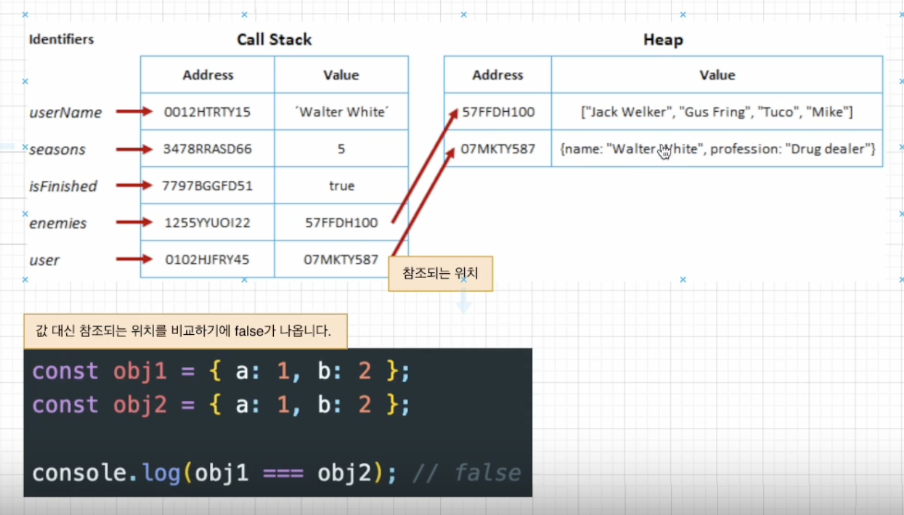

# 얕은 비교(Shallow Compare)
- 원시 자료형: 값 비교 (숫자, 문자열 등)
- 참조 자료형: 참조되는 위치 비교 (배열, 객체 등)

# 깊은 비교(Deep Compare)
- 항상 값으로 비교
```js
const obj1 = { a: 1, b: 2 };
const obj2 = { a: 1, b: 2 };

console.log(JSON.stringify(obj1) === JSON.stringify(obj2))
```
