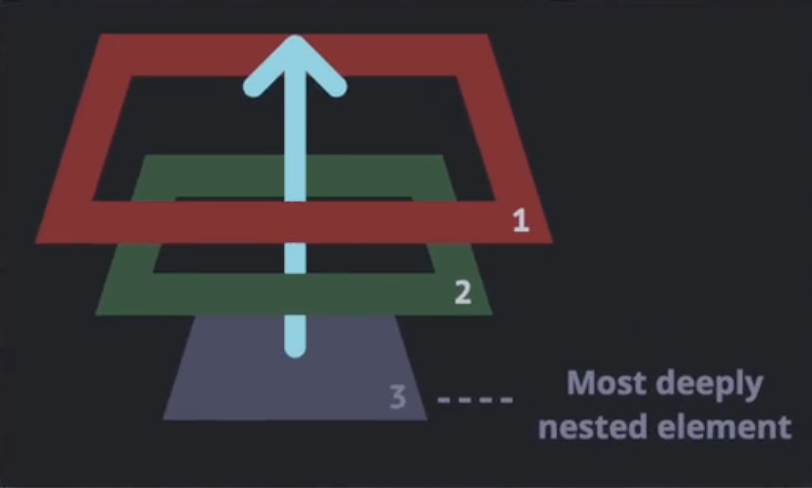
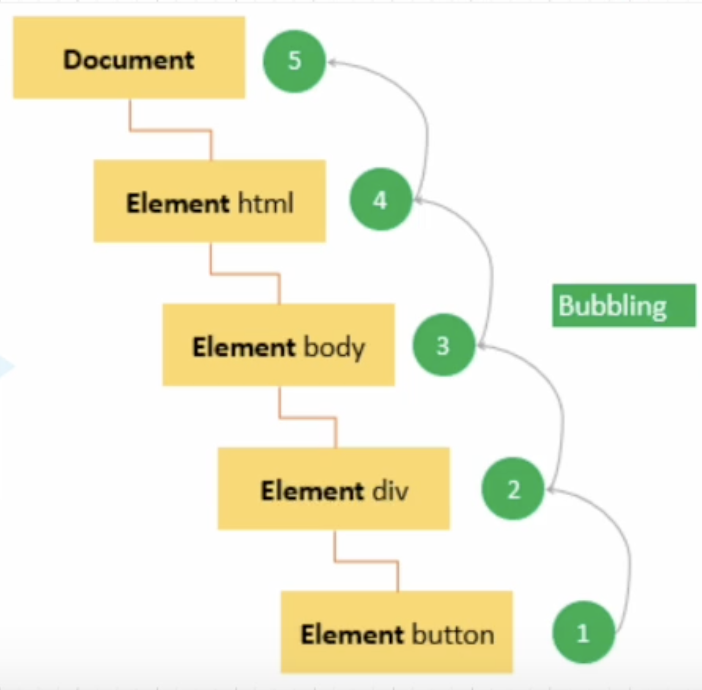
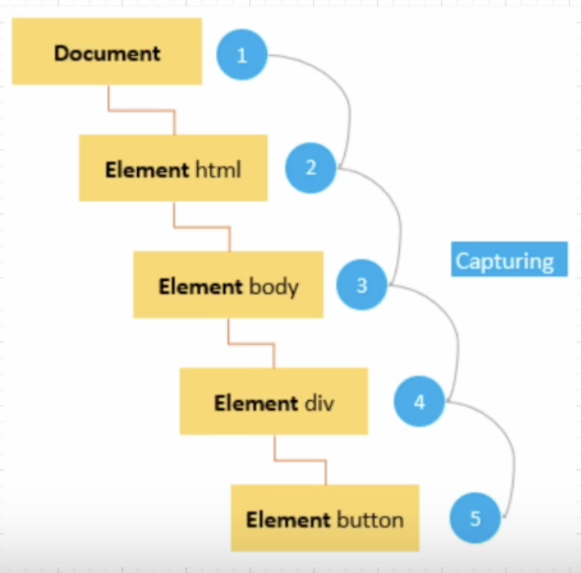
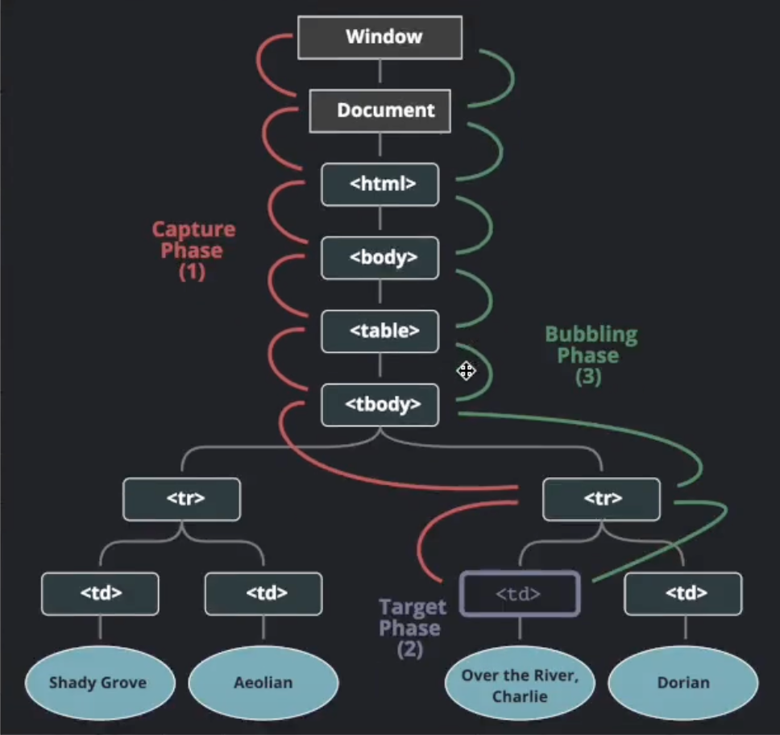

# Event Bubbling
- 가장 깊게 중첩된 요소 (3)에 이벤트가 발생했을 때 이벤트가 위로(bubble up) 전달되는 것을 의미
	- 모두 이벤트 핸들러를 가지고 있으면 3번 핸들러 → 2번 핸들러 → 1번 핸들러 순으로 실행됨


```html
<!DOCTYPE html>
<html lang="en">
<head>
	<meta charset="UTF-8">
	<meta name="viewport" content="width=device-width, init:">
	<title>Event Bubbling</title>
	<style>
		body * {
			margin: 10px;
			border: 1px solid red;
		}
	</style>
</head>
<body>
	<form onclick="alert('form')">Form
		<div onclick="alert('div')">Div
			<p onclick="alert('p')">P</p>
		</div>
	</form>
</body>
</html>
```
- p → div → form 순서로 alert가 실행됨
```javascript
const form = document.querySelector("form");
const div = document.querySelector("div");
const p = document.querySelector("p");

// event.target → 실제 이벤트가 시작된 '타겟' 요소
// this (event.currentTarget) → 핸들러가 할당된 요소

form.onclick = function (event) {
	event.target.style.backgroundColor = "yellow";
	
	setTimeout(() => {
		alert("target = " + event.target.tagName + ", this" + this.tagName);
		event.target.style.backgroundColor = "";
	}, 0);
};
```
- `p` 클릭 시 `target = P, this=FORM`
## 버블링 중단
 - `event.stopPropagation()`
```html
<body>
	<form onclick="alert('form')">Form
		<div onclick="alert('div')">Div
			<p onclick="event.stopPropagation()">P</p>
		</div>
	</form>
</body>
```
- `p` 눌러도 `div` `form` 이벤트 실행 안됨
# Event Capturing
- 이벤트 버블링과 반대로 제일 상단에 있는 요소에서 아래로 이벤트가 내려오는 것

## 이벤트의 3단계 흐름
1. 캡처링 단계
2. 타깃 단계 - 이벤트가 실제 타깃 요소에 전달되는 단계
3. 버블링 단계

## 코드로 이벤트 흐름 살펴보기
- 캡처링의 흐름을 확인하기 위해서 `addEventListener`의 `capture` 옵션을 true로 설정
```javascript
for (let element of document.querySelectorAll('*')) {
	element.addEventListener('click', e => alert(`캡처링: ${element.tagName}`), true)
	element.addEventListener('click', e => alert(`버블링: ${element.tagName}`))
}
```
- 캡처링 HTML → BODY → FORM → DIV → P
- 버블링 P → DIV → FORM → BODY → HTML
# Event Delegation
- 이벤트 위임
- 하위 요소의 이벤트를 상위 요소에 위임하는 것 → **하위 요소의 이벤트를 상위에서 제어**
```html
<body>
	<div id="buttons">
		<button class="buttonClass">Click Me</button>
		<button class="buttonClass">Click Me</button>
	</div>
</body>
<script>
	// const buttons = document.getElementsByClassName('buttonClass');
	
	// for (const button of buttons) {
	// 	button.addEventListener('click', () => alert('clicked'));
	//   }
	
	// 이미 이벤트를 등록 후 버튼 추가를 했기 때문에 새로 생성된 버튼엔 이벤트 안 들어감
	
	const buttonList = document.querySelector('#buttons');
	buttonList.addEventListener("click", (event) => {
		if (event.target.classList.contains("buttonClass")) {
			alert("clicked");
		}
	});
	const button = document.createElement('button');
	button.setAttribute('class', 'buttonClass');
	button.innerText = 'Click Me';
	buttonList.appendChild(button);
</script>	
```
