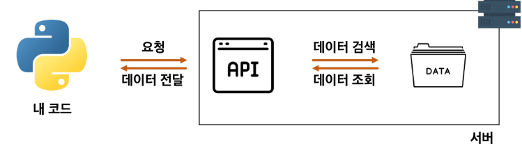
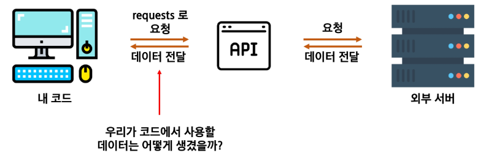

> [!NOTE]
> - Ver1 : 금융 데이터를 활용한 금융 상품 비교 애플리케이션
> - Ver2 : Open AI와 외부 데이터를 활용한 영화 추천 서비스
> 
> - 선택은 07PJT까지 변경 가능

# 프로젝트를 위한 배경지식
## 목표
> 파이썬으로 인터넷에 있는 날씨 정보를 가져와, 내가 원하는 정보만 출력

### 날씨 정보
- 실습 프로젝트를 위해서 날씨 정보 필요 -> 직접 데이터를 수집하기 어려움
- 간단하게, 인터넷에 있는 데이터를 가져오면 됨
	- 데이터를 가져오는 방법을 이해하기 위해 반드시 알아야 할 전문용어들이 있다
### 전문용어 이해하기
- 서버: 부탁을 받으면 처리해주거나, 부탁대로 원하는 값을 돌려주는 역할
- 클라이언트: 부탁하는 역할

- ex. 네이버 홈페이지에 접속하는 것
	- 클라이언트 *"메인 화면 달라고 요청"*
	- 네이버 서버 *"메인 화면 돌려줌"*
- 이번 프로젝트는 날씨 정보 필요
	- 날씨 정보를 가지고 있는 서버에 정보 요청하면 됨
### 클라이언트가 서버에 요청하는 두 가지 방법
1. 웹 브라우저(크롬)을 켜서 주소창에 주소(URL)를 입력한다.
	- 주소창에 주소 입력 = 서버로 페이지를 요청
2. 서버에 정보를 요청하는 파이썬 코드를 작성한다.
#### 1. 웹 브라우저(크롬)을 켜서 URL 입력
[https://fakestoreapi.com/carts](https://fakestoreapi.com/carts)
```
[{"id":1,"userId":1,"date":"2020-03-02T00:00:00.000Z","products":[{"productId":1,"quantity":4},{"productId":2,"quantity":1},{"productId":3,"quantity":6}],"__v":0},{"id":2,"userId":1,"date":"2020-01-02T00:00:00.000Z","products":[{"productId":2,"quantity":4},{"productId":1,"quantity":10},{"productId":5,"quantity":2}],"__v":0},{"id":3,"userId":2,"date":"2020-03-01T00:00:00.000Z","products":[{"productId":1,"quantity":2},{"productId":9,"quantity":1}],"__v":0},{"id":4,"userId":3,"date":"2020-01-01T00:00:00.000Z","products":[{"productId":1,"quantity":4}],"__v":0},{"id":5,"userId":3,"date":"2020-03-01T00:00:00.000Z","products":[{"productId":7,"quantity":1},{"productId":8,"quantity":1}],"__v":0},{"id":6,"userId":4,"date":"2020-03-01T00:00:00.000Z","products":[{"productId":10,"quantity":2},{"productId":12,"quantity":3}],"__v":0},{"id":7,"userId":8,"date":"2020-03-01T00:00:00.000Z","products":[{"productId":18,"quantity":1}],"__v":0}]
```
- 서버가 리스트를 반환하도록 만들어놓았기 때문에 URL에 들어가면 리스트를 전달 받음
#### 2. 서버에 정보를 달라는 파이썬 코드를 작성
##### 라이브러리
: 남들이 만들어놓은 코드를 가져다 쓸 수 있음
- 오픈소스: 공짜
- 데이터를 가져오는 Python 라이브러리(패키지) : requests
##### 파이썬 패키지 관리: pip
- 설치 `pip install <패키지이름>`
- 목록 확인 : `pip list`
##### 내 코드에 다른 패키지 추가
- `import <패키지이름>`
- `func()` (어떤 함수) 입력하면 
	1. 내 파일 검색
	2. 내장모듈 모아둔 곳 검색
```python
import requests

url = 'https://fakestoreapi.com/carts'
data = requests.get(url).json() 
print(data)
```
- url : 요청을 보내는 서버의 주소
- `requests.get(url)` : 해당 서버(url)에 데이터를 달라고 요청을 보내는 함수
- `.json()` : 내부의 데이터를 JSON(파이썬의 딕셔너리와 비슷함) 형태로 변환해주는 함수
### 서버는 어떻게 요청을 해석할까

## API 이해하기
### API
- 클라이언트가 원하는 기능을 수행하기 위해서 서버 측에 만들어 놓은 프로그램
	- 기능 예시: 데이터 저장, 조회, 수정, 삭제 등등
- 서버 측에 특정 주소로 요청이 오면 정해진 기능을 수행하는 API를 미리 만들어 둡니다
	- 클라이언트는 서버가 미리 만들어 놓은 주소로 요청을 보냅니다.

### 날씨 정보를 제공해주는 API
- 날씨 정보를 수집하기 위해 필요한 두 가지
	- 날씨 정보를 가지고 있는 서버
	- 해당 서버가 제공하는 API
### 오픈 API
- 외부에서 사용할 수 있도록 무료로 개방(OPEN)된 API
- 사용법은 공식 문서(Docs)에 명시되어 있습니다.
- 프로젝트에서 사용되는 API
	- [OpenWeatherMap API](https://openweathermap.org/) : 기상 데이터 및 날씨 정보를 제공하는 오픈 API
	- [금융상품통합비교공시 API] : 금융감독원에서 제공하는 금융 상품 정보를 제공하는 오픈 API
#### 오픈 API 특징 및 주의사항
- 악성 사용자가 100만 개의 계정을 생성해 API에 요청을 보내는 상황을 생각해보자
	- 너무 많은 계정에서 동시에 요청을 보내면 서버가 견디지 못함
- 이런 문제점 해결을 위해 오픈 API는 *API KEY* 를 활용하여 사용자를 확인합니다.
	- 사용자 인증 혹은 회원가입을 하면 서버에서 API KEY를 발급해줌
	- 서버에 요청할 때 마다 해당 API KEY를 함께 보내 정상적인 사용자인 것을 확인 받습니다.
- API KEY를 가지고 있는 악성 사용자가 1초에 100만 개의 요청을 보낸다면?
	- 서버가 견디지 못하여 정상적인 서비스 불가능
- 대다수 오픈 API는 *사용량이 제한*되어 있음
	- 공식 문서의 일일 및 월간 사용량 제한을 반드시 확인해야 함
	- [!] 사용량이 초과될 경우 요금이 청구될 수 있음
- [!] **API KEY가 공개된 곳에 올라가지 않도록 주의**
## 날씨 데이터 수집
### JSON
- API가 반환하는 데이터는 어떻게 생겼을까

### API가 사용하는 데이터 형식 - JSON
- JavaScript Object Notation의 약자. 직역하면 '자바스크립트 객체 표기법'
- 데이터를 저장하거나 전송할 때 많이 사용되는 *경량의 텍스트 기반의 데이터 형식*
- 통신 방법이나 프로그래밍 문법이 아니라 단순히 데이터를 표현하는 표현 방법 중 하나
- 특징
	- 데이터는 중괄호({})로 둘러싸인 키-값 쌍의 집합으로 표현됨
	- 키 = 문자열 / 값 = 다양한 데이터 유형을 가질 수 있다
	- 값은 쉼표(,)로 구분됨
#### JSON - python 예제
- 파이썬은 JSON을 활용하는 기능을 가지고 있다
- 참고
	- 파싱(Parsing): 데이터를 의미 있는 구조로 분석하고 해석하는 과정
	- json.loads(): JSON 형식의 문자열을 파싱하여 python Dictionary로 변환
### [OpenWeatherMap API](https://openweathermap.org/)
1. 회원가입
2. API Keys 탭으로 이동
3. API KEY 복사
4. 상단 API 탭 클릭
5. 2.5버전으로 API call 복사 후 코드에 붙여넣기
6. 위도, 경도, API KEY 입력
7. 데이터 받아서 원하는 정보 출력
# 금융 상품 비교 앱 - PJT01
- 프로젝트명: 파이썬을 활용한 API 데이터 수집
- 목표
	- 파이썬으로 정기 예금 데이터 수집 및 미션 수행
- 특징
	- 외부 서버를 활용한 데이터 수집
	- 요구사항에 맞게 JSON 형태 데이터 가공
# 영화 추천 서비스 - PJT01
 - 프로젝트명: 파이썬을 활용한 API 데이터 수집 1
- 목표
	- 파이썬으로 도서 및 아티스트 데이터 가공 및 미션 수행
- 특징
	- 샘플 데이터 제공
	- 요구사항에 맞게 JSON 형태 데이터 가공