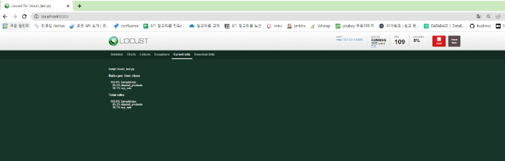

# Django에서 알고리즘 구현 및 성능측정
## 테스트
### 테스트란?
: 원하는 기능이 모두 구현되었는지 확인하고 숨겨져 있는 결함을 찾는 활동
- 여러가지 도구들을 활용하여 버그를 찾아내고 신뢰성, 보안, 성능 등을 검증하는 중요한 단계
### 성능 테스트
- 핵심적인 테스트 중 하나
- 특정 상황에서 시스템이 어느 정도 수준을 보이는가 혹은 어떻게 대처를 하는가를 테스트하는 과정
- 목적
	- 여러 테스트를 통해 *성능 저하가 발생하는 요인을 발견하고 제거*
	- 시장에 출시되기 전에 발생할 수 있는 위험과 개선사항을 파악
	- 안정적이고 신뢰할 수 있는 제품을 빠르게 만들기 위함
#### 예시

### 부하 테스트 (Load Testing)
- 시스템에 임계점의 부하가 계속될 때 문제가 없는가?
- 목적 : 시스템의 신뢰도와 성능을 측정

- 임계점 : 사용자 혹은 요청이 점점 늘어나다가, 응답시간이 급격히 느려지는 시점
### 스트레스 테스트 (Stress Testing)
- 시스템에 과부하가 오면 어떻게 동작할까?
- 목적 : 장애 조치와 복구 절차가 효과적이고 효율적인 지 확인

### 부하테스트 vs 스트레스 테스트
|           | 부하 테스트 (Load Testing)                                             | 스트레스 테스트 (Stress Testing) |
| --------- | ----------------------------------------------------------------- | ------------------------- |
| 도메인       | 성능 테스트의 하위 집합                                                     | 성능 테스트의 하위 집합             |
| 테스트 목적    | 전체 시스템의 성능 확인                                                     | 중단점에서의 동작, 복구 가능성 확인      |
| 테스트 방법    | 임계점 까지의 가상 유저 수를 유지하며 모니터링                                        | 중단점 이상까지 가상 유저를 점진적으로 증가  |
| 테스트 대상    | 전체 시스템                                                            | 식별된 트랜잭션에만 집중하여 테스트       |
| 테스트 완료 시기 | 예상 부하가 모두 적용된 경우                                                  | 시스템 동작이 중단되었을 경우          |
| 결과        | - 부하 분산 문제 - 최대 성능 - 시간 당 서버 처리량 및 응답 시간 - 최대 동시 사용자 수 등 | - 안정성 - 복구 가능성         |
## API 성능 테스트
### Locust
- *오픈 소스 부하 테스트 도구*
	- [공식문서](https://locust.io/)
- 번역하면 메뚜기, 테스트 중 메뚜기 떼가 웹 사이트를 공격한다는 의미로 착안된 이름
- 내가 만든 서버에 *수많은 사용자들이 동시에 들어올 때 어떤 일이 벌어지는 지*를 확인하는 부하 테스트를 할 수 있는 도구
- Locust를 선택한 이유
	- 파이썬 언어로 테스트 시나리오를 간편하게 작성할 수 있습니다.
	- 결과를 웹에서 확인할 수 있는 UI를 지원합니다.
### Locust 사용법
1. 테스트 스크립트 작성하기
	- HttpUser: HTTP 요청을 만드는 가상 유저
	- wait_time: 작업 간 대기 시간
	- on_start(): 가상 유저 생성 시 실행
	- @task: 유저가 실행할 작업
	- @task(N): 가중치 (실행 확률)
		- N만큼 높은 확률로 작업을 수행
	- self.client.get: HTTP GET 요청 전송
2. Django 서버 실행 - 제공된 Django API 서버를 실행합니다.
	
3. vscode 터미널 추가 & Locust 설치 및 실행
	
4. Locust 정상 실행 시 터미널에 아래와 같이 접속할 수 있는 URL이 출력됩니다.
	- http://localhost:8089 로 접속하면 Web화면을 볼 수 있습니다
	- \[주의사항] 콘솔에서 출력되는 http:0.0.0.0:8089 로 접속하면 에러남
5. 웹 실행 화면
	
6. 웹 실행 화면 - Statistics 탭
	
- 각 URL에 대한 요청 수, 실패 수, 각 기준에 대한 응답 시간, 평균 응답 크기, RPS 등 다양한 통계 내용을 확인할 수 있습니다.
- 전체 분석은 터미널에서 터미널 종료 (Ctrl + C) 입력 또는 Download Data 탭의 Download Report 클릭 시 확인할 수 있습니다.
7. 웹 실행 화면 - Charts 탭
	
   8. 웹 실행 화면 - Failures 탭
	
	   - 실패한 요청에 대한 정보와 실패 원인이 출력됩니다.
	   - ex) 대상 컴퓨터에서 연결을 거부했으므로 연결하지 못했습니다.
9. 웹 실행 화면 - Current ratio 탭
	
	- 현재 작업이 수행된 비율 출력
10. 웹 실행화면 - 결과 화면 (Download Data -> Download Report)
	
11. 콘솔 종료 화면
    
    - 콘솔에서 Locust 종료 (Ctrl + C)
    - 위와 같이 전체 요청에 대한 분석을 콘솔에서 확인할 수 있습니다.
## 정렬 알고리즘 테스트
### 테스트 주의사항
- 오늘 테스트는 정석적인 방법과는 거리가 있음
	- 정석: 서버에 배포된 API 또는 프로그램에 부하 테스트를 해야 함
- 하지만, 현재는 PC에서 작동 중인 서버로 요청을 보내는 것
	- PC의 성능에 따라 결과가 매우 달라짐
	- 현재 서버가 작동 중인 PC에서 테스트를 진행하므로, 테스트 중 다른 조작 X
### 테스트 결론
- 