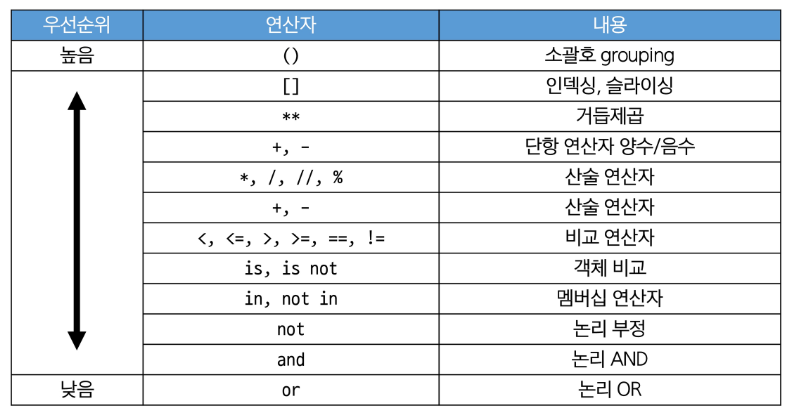

# Data Types
## Sequence Types
: 여러 개의 값들을 순서대로 나열하여 저장하는 자료형
### list(리스트)
: 여러 개의 값을 순서대로 저장하는 *변경 가능한* 시퀀스 자료형
#### 리스트 표현
- 0개 이상의 객체를 포함하며 데이터 목록을 저장
- 대괄호로 표기
- 데이터는 어떤 자료형도 저장할 수 있음
	- 리스트 안에 리스트도 가능
#### 리스트의 시퀀스 특징
- 인덱싱
- 슬라이싱
- 길이
#### 중첩된 리스트 접근
```python
my_list = [1,2,3,'python',['hello','world','!!!']]

print(len(my_list)) #5
print(my_list[4][-1]) #!!!
print(my_list[-1][1][0]) #w
```
#### 리스트는 가변(변경 가능)
```python
my_list = [1, 2, 3]
my_list[0] = 100

print(my_list) #[100, 2, 3]
```
### Tuple(튜플)
: 여러 개의 값을 순서대로 저장하는 *변경 불가능한* 시퀀스 자료형
#### 튜플 표현
- 0개 이상의 객체를 포함하며 데이터 목록을 저장
- 소괄호로 표기
- 데이터는 어떤 자료형도 저장할 수 있음
```python
my_tuple = (1,)
#(1)이면 괄호가 사라지고 정수가 됨 -> 요소가 하나일 때는 무조건 마지막에 콤마(,)가 있어야 튜플이 생성됨
```
#### 튜플의 시퀀스 특징
- 인덱싱
- 슬라이싱
- 길이
#### 튜플은 불변(변경 불가)
```python
my_tuple = (1, 'a', 3, 'b', 5)

#TypeError: 'tuple' object does not support item assignment
my_tuple[1] = 'z'
```
#### 튜플은 어디에 쓰일까?
- 튜플은 불변 특성을 사용한 안전하게 여러 개의 값을 전달, 그룹화, 다중 할당 등 *개발자가 직접 사용하기 보다 '파이썬 내부 동작'에서 주로 사용됨*
### range
: 연속된 정수 시퀀스를 생성하는 변경 불가능한 자료형
#### range 표현
- range(n)
	- 0부터 n-1까지의 숫자 시퀀스
- range(n, m)
	- n부터 m-1까지의 숫자 시퀀스
- 주로 반복문과 함께 사용 예정
## dict(딕셔너리)
: key - value 쌍으로 이루어진 순서와 중복이 없는 변경 가능한 자료형
#### 딕셔너리 표현
- key는 변경 불가능한 자료형만 사용 가능 (str, int, float, tuple, range ...)
- value는 모든 자료형 사용 가능
- 중괄호로 표기
```python
my_dict1 = {}
my_dict2 = {'key' : 'value'}
my_dict3 = {'apple': 12, 'list': [1, 2, 3]}
```
#### 딕셔너리 사용
- key를 통해 value로 접근
- 순서가 없어서 index로 접근 불가능
```python
my_dict = {'apple': 12, 'list': [1, 2, 3]}

#값 변경
my_dict['apple'] = 100
print(my_dict) #{'apple': 100, 'list': [1, 2, 3]}
```
## set(세트)
: 순서와 중복이 없는 변경 가능한 자료형
#### 세트 표현
- 수학에서의 집합과 동일한 연산 처리 가능
- 중괄호로 표기
	- 딕셔너리도 중괄호인데? -> 내부 구조가 다름
```python
my_set_1 = set() 
#빈 세트를 만들 때 {}로 못 만듦 -> 딕셔너리가 됨
my_set_2 = {1, 2, 3}
my_set_3 = {1, 1, 1} #중복 불가

print(my_set_1) #set()
print(my_set_2) #{1, 2, 3}
print(my_set_3) #{1}
```
#### 세트의 집합 연산
```python
my_set_1 = {1, 2, 3}
my_set_2 = {3, 6, 9}

#합집합
print(my_set_1 | my_set_2) #{1, 2, 3, 6, 9}
#차집합
print(my_set_1 - my_set_2) #{1, 2}
#교집합
print(my_set_1 & my_set_2) #{3}
```
## None
: 파이썬에서 '값이 없음'을 표현하는 자료형
#### None 표현
```python
variable = None
print(variable) #None
```
## Boolean
: 참(True)과 거짓(False)을 표현하는 자료형
#### 불리언 표현
- 비교/논리 연산의 평가 결과로 사용됨
- 주로 조건/반복문과 함께 사용
## Collection
: 여러 개의 항목 또는 요소를 담는 자료 구조
#### 컬렉션 정리
| 컬렉션 | 변경 가능 여부 | 순서 여부 |  |
| ---- | ---- | ---- | ---- |
| str | X | O | 시 |
| list | O | O | 퀀 |
| tuple | X | O | 스 |
| set | O | X | 비시 |
| dict | O | X | 퀀스 |
#### 불변과 가변의 차이
- str은 모두 한번에 같은 곳에 저장
- list는 요소 하나 하나 다른 곳에 저장
## Type Conversion
#### 암시적 형변환(Implicit Type Conversion)
: 파이썬이 자동으로 형변환을 하는 것
- Boolean과 Numeric Type에서만 가능
```python
print(3 + 5.0) #8.0
print(True + 3) #4
print(True + False) #1
```
#### 명시적 형변환(Explicit Type Conversion)
: 개발자가 직접 형변환을 하는 것
암시적 형변환이 아닌 경우를 모두 포함
- str -> integer : 형식에 맞는 숫자만 가능
- interger -> str : 모두 가능 
```python
print(int('1')) #1
print(str(1)+'등') #1등
print(float('3.5')) #3.5
print(int(3.5)) #3

#ValueError: invalid literal for int() with base 10: '3.5'
print(int('3.5'))
```
- 컬렉션 간 형변환 정리
| \ | str | 
# 연산자
## 산술 연산자 
| 기호 | 연산자 |
| ---- | ---- |
| - | 음수 부호 |
| + | 덧셈 |
| - | 뺄셈 |
| * | 곱셈 |
| / | 나눗셈 |
| // | 몫 |
| % | 나머지 |
| ** | 지수 |
## 복합 연산자
| 기호 | 예시 | 의미 |
| ---- | ---- | ---- |
| += | a += b | a = a + b |
| -= | a -= b | a = a - b |
| *= | a *= b<br> | a = a * b |
| /= | a /= b<br> | a = a / b |
| //= | a //= b<br> | a = a // b |
| %= | a %= b<br> | a = a % b |
| **= | a **= b<br> | a = a ** b |
#### 복합 연산자 예시
```python
y = 10
y -= 4 #y = y - 4
print(y) #6
```
## 비교 연산자
|기호|내용 |
|---|---|
|< |미만 |
|<= |이하 |
|> |초과 |
|>= |이상 |
|== |같음 |
|!= |같지 않음 |
|is |같음 |
|is not |같지 않음 |
#### is 비교 연산자
- 메모리 내에서 같은 객체를 참조하는지 확인
- \==는 동등성(equality), is는 식별성(identity)
- 값을 비교하는 \==와 다름
```python
print(2.0 == 2) #True

#SyntaxWarning
#==은 값(데이터)을 비교하는 것이지만 is는 레퍼런스(주소)를 비교하기 때문
#is 연산자는 되도록이면 None, True, False 등을 비교할 때 사용
print(2.0 is 2) #False
```
## 논리 연산자
| 기호 | 연산자 | 내용 |
| ---- | ---- | ---- |
| and | 논리곱 | 두 피연산자 모두 True인 경우에만 전체 표현식을 True로 평가 |
| or | 논리합 | 두 피연산자 중 하나라도 True인 경우 전체 표현식을 True로 평가 |
| not | 논리부정 | 단일 피연산자를 부정 |
## 단축평가
: 논리 연산에서 두 번째 피연산자를 평가하지 않고 결과를 결정하는 동작
- 예시
```python
vowels = 'aeiou'

print(('a' and 'b') in vowels) #False
print(('b' and 'a') in vowels) #True

print(3 and 5) #True/5
print(3 and 0) #False/0
print(0 and 3) #False/0
print(0 and 0) #False/0

print(5 or 3) #True/5
print(3 or 0) #True/3
print(0 or 3) #True/3
print(0 or 0) #False/0
```
앞에서 결과가 결정이 나면 뒤까지 굳이 안감
-> 앞에 너무 강력한 조건을 넣으면 단축이 일어날 수 있음 주의
#### 단축평가 동작
- and
	- 첫 번째 피연산자가 False인 경우, 전체 표현식은 False로 결정, 두 번째 피연산자는 평가되지 않고 그 값이 무시
	- 첫 번째 피연산자가 True인 경우, 전체 표현식의 결과는 두 번째 피연산자에 의해 결정, 두 번째 피연산자가 평가되고 그 결과가 전체 표현식의 결과로 반환
- or
	- 첫 번째 피연산자가 True인 경우, 전체 표현식은 True로 결정, 두 번쨰 피연산자는 평가되지 않고 그 값이 무시
	- 첫번째 피연산자가 False인 경우, 전체 표현식의 결과는 두 번째 피연산자에 의해 결정, 두 번째 피연산자가 평가되고 그 결과가 전체 표현식의 결과로 반환
#### 단축평가 이유
: 코드 실행을 최적화하고, 불필요한 연산을 피할 수 있도록 함
## 멤버십 연산자
: 특정 값이 시퀀스나 다른 컬렉션에 속하는지 여부를 확인

| 기호 | 내용 |
| ---- | ---- |
| in | 왼쪽 피연산자가 오른쪽 피연산자의 시퀀스에 속하는지를 확인 |
| not in | 왼쪽 피연산자가 오른쪽 피연산자의 시퀀스에 속하지 않는지를 확인 |
## 시퀀스형 연산자
- +와 \*는 시퀀스 간 연산에서 산술 연산자일때와 다른 역할을 가짐

| 연산자 | 내용 |
| ---- | ---- |
| + | 결합 연산자 |
| \* | 반복 연산자 |
## 연산자 우선순위 정리
