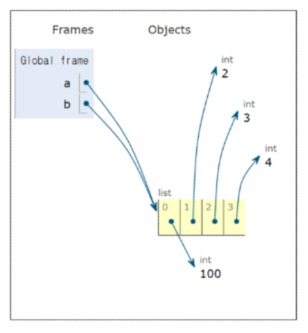
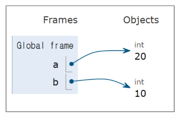
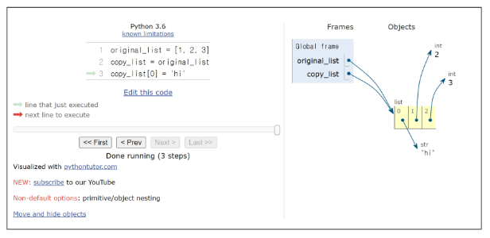
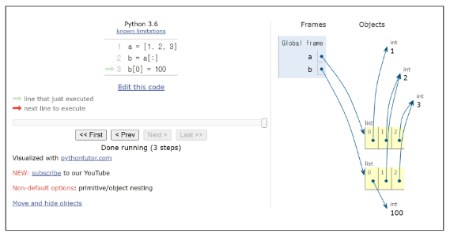
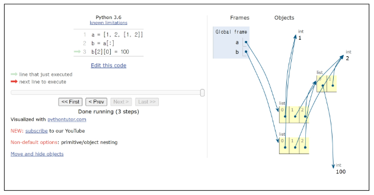
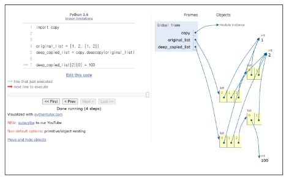
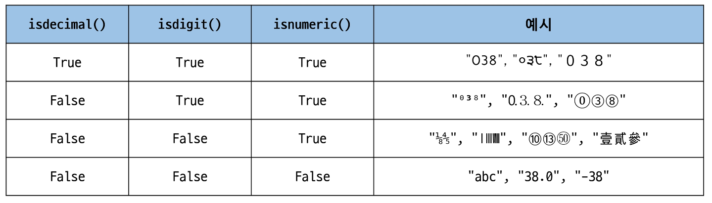

# 데이터 구조 (Data Structure)
: 여러 데이터를 효과적으로 사용, 관리하기 위한 구조 (str, list, dict 등)
- 컴퓨터 공학에서는 '자료 구조'라고 함
- 각 데이터의 효율적인 저장, 관리를 위한 구조를 나눠 놓은 것
- 데이터 구조 활용
- 문자열, 리스트, 딕셔너리 등 각 데이터 구조의 메서드를 호출하여 다양한 기능 활용
## 메서드(method)
: 객체에 속한 함수
- 객체의 상태를 조작하거나 동작을 수행
### 메서드 특징
- 메서드는 클래스(class) 내부에 정의되는 함수
- 클래스는 파이썬에서 '타입을 표현하는 방법'이며 이미 은연중에 사용해봤음
- 예를 들어 help 함수를 통해 str을 호출해보면 class 였다는 것을 확인 가능
- 데이터 타입이 호출함 `객체.메서드()`
- [!] 지금 시점에 알아야 할 것
	- 메서드는 어딘가(클래스)에 속해 있는 함수이며, 각 데이터 타입별로 다양한 기능을 가진 메서드가 존재
### 메서드 호출 방법
`데이터 타입 객체.메서드()
```python
print('hello'.capitalize()) #Hello
```
# 시퀀스 데이터 구조
## 문자열
### 문자열 조회/탐색 및 검증 메서드
- `s.find(x)` : x의 첫 번쨰 위치를 반환. 없으면 -1을 반환
- `s.index(x)` : x의 첫 번쨰 위치를 반환. 없으면 오류 발생
- `s.isalpha()` : 알파벳 문자 여부(단순 알파벳이 아닌 유니코드 상 letter)
	- 알파벳으로만 되어있어야 True
- `s.isupper()` : 대문자 여부
	- 모두 대문자인지
- `s.islower()` : 소문자 여부
	- 모두 소문자인지
### 문자열 조작 메서드 (새 문자열 반환)
원본은 불변이라 새 문자열을 반환함
- `s.replace(old, new[,count])` : 바꿀 대상 글자를 새로운 글자로 바꿔서 변환
	- `[,count]` : 선택적인 세번째 인자 (배커스-나우르 표기법에 의해 이렇게 표기, 파이썬은 확장 배커스-나우르 표기법 사용, EBNF)
- `s.strip([chars])` : 공백이나 특정 문자 제거
- `s.split(sep=None, maxsplit=-1)` : 공백이나 특정 문자를 기준으로 분리하여 문자열의 리스트로 반환 (인자 안넣으면 공백 기준)
- `'separator'.join(iterable)` : 구분자로 iterable을 합침
- `s.capitalize()` : 가장 첫 번째 글자를 대문자로 변경(나머지는 소문자로 변경)
- `s.title()` : 문자열 내 띄어쓰기 기준으로 각 단어의 첫 글자는 대문자로, 나머지는 소문자로 변환
- `s.upper()` : 모두 대문자로 변경
- `s.lower()` : 모두 소문자로 변경
- `s.swapcase()` : 대 <-> 소문자 서로 변경
## 리스트
### 리스트 값 추가 및 삭제 메서드
- `L.append(x)` : 리스트 마지막에 항목 x 추가
- `L.extend(m)` : Iterable m의 모든 항목들을 리스트 끝에 추가 (+=과 같은 기능)
- `L.insert(i, x)` : 리스트 인덱스 i에 항목 x를 삽입
- `L.remove(x)` : 리스트 가장 왼쪽에 있는 항목(첫 번째) x를 제거, 항목이 존재하지 않을 경우 ValueError
- `L.pop()` : 리스트 가장 오른쪽에 있는 항목(마지막)을 반환 후 제거
- `L.pop(i)` : 리스트 인덱스 i에 있는 항목을 반환 후 제거
- `L.clear()` : 리스트의 모든 항목 삭제
### 리스트 탐색 및 정렬 메서드
- `L.index(x, start, end)` : 리스트에 있는 항목 중 가장 왼쪽에 있는 항목 x의 인덱스를 반환
- `L.reverse()` : 리스트의 순서를 역순으로 변경 (정렬 x)
- `L.sort()` : 리스트를 정렬 (매개변수 이용가능)
	- `reverse=True` 옵션을 넣으면 반대로 정렬
- `L.count(x)` : 리스트에서 항목 x의 개수를 반환
# 복사
### 데이터 타입과 복사
- 파이썬에서는 데이터의 분류에 따라 복사가 달라짐
- "변경 가능한 데이터 타입"과 "변경 불가능한 데이터 타입"을 다르게 다룸
### 변경 가능한 데이터 타입의 복사
```python
a = [1, 2, 3, 4]
b = a
b[0] = 100

print(a) # [100, 2, 3, 4]
print(b) # [100, 2, 3, 4]
```

### 변경 불가능한 데이터 타입의 복사
```python
a = 20
b = a
b = 10

print(a) # 20
print(b) # 10
```

## 복사 유형
### 할당(Assignment)
#### 리스트 복사 예시
```python
original_list = [1, 2, 3]
copy_list = original_list
print(original_list, copy_list) # [1, 2, 3] [1, 2, 3]

copy_list[0] = 'hi'
print(original_list, copy_list) # ['hi', 2, 3] ['hi', 2, 3]
```
- 할당 연산자(=)를 통한 복사는 해당 객체에 대한 *객체 참조를 복사*

### 얕은 복사 (Shallow copy)
####  리스트 얕은 복사 예시
```python
a = [1, 2, 3]
b = a[:]
print(a, b) # [1, 2, 3] [1, 2, 3]

b[0] = 100
print(a, b) # [1, 2, 3] [100, 2, 3]
```
- 슬라이싱을 통해 생성된 객체는 원본 객체와 독립적으로 존재

#### 얕은 복사의 한계
- 2차원 리스트와 같이 변경 가능한 객체 안에 변경 가능한 객체가 있는 경우
```python
a = [1, 2 [1, 2]]
b = a[:]
print(a, b) # [1, 2 [1, 2]] [1, 2 [1, 2]]

b[2][0] = 100
print(a, b) # [1, 2 [100, 2]] [1, 2 [100, 2]]
```
- a와 b의 주소는 다르지만 내부 객체의 주소는 같기 때문에 함께 변경됨

### 깊은 복사 (Deep copy)
#### 리스트 깊은 복사 예시
```python
import copy

original_list = [1, 2, [1, 2]]
deep_copied_list = copy.deepcopy(original_list)

deep_copied_list[2][0] = 100

print(original_list) # [1, 2, [1, 2]]
print(deep_copied_list) # [1, 2, [100, 2]]
```
- 내부에 중첩된 모든 객체까지 새로운 객체 주소를 참조하도록 함

# 참고
### 문자열에 포함된 문자들의 유형을 판별하는 메서드
- `isdecimal()` : 문자열이 모두 숫자 문자(0~9)로만 이루어져 있어야 True
- `isdigit()` : `isdecimal()`과 비슷하지만, 유니코드 숫자도 인식('①'도 숫자로 인식)
- `isnumeric()` : `isdigit()`과 유사하지만, 몇 가지 추가적인 유니코드 문자들을 인식(분수, 지수, 루트 기호도 숫자로 인식)
- `.isdecimal()` ⊆ `.isdigit()` ⊆ `.isnumeric()`

- `sorted(시퀀스)` : 내장함수 (list 뿐 아니라 string도 가능 -> 정렬된 값 새로 반환)