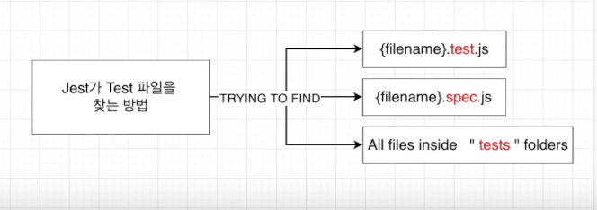

# Jest
## Jest란 무엇인가요?
- Facebook에 의해서 만들어진 테스팅 프레임워크
- 최소한의 설정으로 동작하며 Test Case를 만들어서 어플리케이션 코드가 잘 돌아가는지 확인해줌
- 단위(Unit) 테스트를 위해 이용
## Jest 시작하기
### 1. 라이브러리 설치
```
npm install jest --save-dev
```
### 2. Test 스크립트 변경
```json
"test": "jest"
// or
"test": "jest --watchAll"
```
### 3. 테스트 작성할 폴더 및 파일 기본 구조 생성
## Jest가 Test 파일을 찾는 방법

## Jest 파일 구조
- describe > it  > { expect, matcher }
### describe
- 여러 관련 테스트를 그룹화하는 블록 생성
### it
- 개별 테스트를 수행하는 곳
- 각 테스트를 작은 문장처럼 설명
### expect
- expect 함수는 값을 테스트할 때마다 사용됨
- 혼자서는 거의 사용되지 않으며 matcher와 함께 사용
### matcher
- 다른 방법으로 값을 테스트 하도록 사용