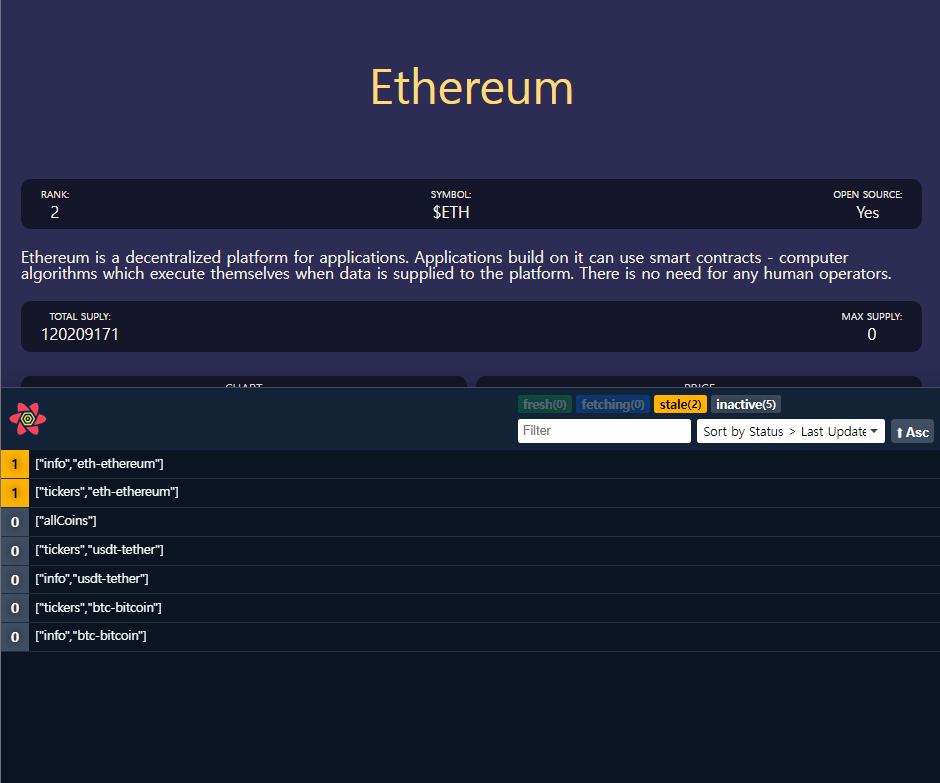

# 0. Setup
## coinpaprika API
- 암호화폐 관련 API
## React Query
- 데이터 fetch 할 수 있는 패키지
## setting
```
npm i react-router-dom react-query
```
- 설치
	- react-router-dom
	- react-query
- src/
	- routes/
		- Coins.tsx
		- Coin.tsx
	- Router.tsx
```ts
// Coins.tsx
function Coins() {
  return <h1>Coins</h1>;
}

export default Coins;
```
```ts
// Coin.tsx
function Coin() {
  return <h1>Coin</h1>;
}

export default Coin;
```
```ts
// Router.tsx
import { BrowserRouter, Routes, Route } from "react-router-dom";
import Coins from "./routes/Coins";
import Coin from "./routes/Coin";

function Router() {
  return (
    <BrowserRouter>
      <Routes>
        <Route path="/:coinId" element={<Coin />} />
        <Route path="/" element={<Coins />} />
      </Routes>
    </BrowserRouter>
  );
}
export default Router;
```
- typescript에서 router 사용할 수 있게 설치
```
npm i --save-dev @types/react-router-dom
```
```tsx
// App.tsx
import Router from "./Router";

function App() {
  return <Router />;
}

export default App;
```

```ts
// Coin.tsx
import { useParams } from "react-router-dom";

function Coin() {
  const { coinId } = useParams();
  return <h1>Coin : {coinId}</h1>;
}

export default Coin;

```
# 1. Styles
## 기본 style 초기화
https://github.com/zacanger/styled-reset/blob/master/src/index.ts
### styled-reset 사용
- 설치 후 import
## Fragment
- 일종의 유령 컴포넌트
- `<> </>`
```ts
import { createGlobalStyle } from "styled-components";
import Router from "./Router";

const GlobalStyle = createGlobalStyle`
  body {
    color: red;
  }
`;

function App() {
  return (
    <>
      <GlobalStyle />
      <Router />
    </>
  );
}

export default App;
```
## 기본 css 세팅
```ts
html, body, div, span, applet, object, iframe,
h1, h2, h3, h4, h5, h6, p, blockquote, pre,
a, abbr, acronym, address, big, cite, code,
del, dfn, em, img, ins, kbd, q, s, samp,
small, strike, strong, sub, sup, tt, var,
b, u, i, center,
dl, dt, dd, menu, ol, ul, li,
fieldset, form, label, legend,
table, caption, tbody, tfoot, thead, tr, th, td,
article, aside, canvas, details, embed,
figure, figcaption, footer, header, hgroup,
main, menu, nav, output, ruby, section, summary,
time, mark, audio, video {
  margin: 0;
  padding: 0;
  border: 0;
  font-size: 100%;
  font: inherit;
  vertical-align: baseline;
}
/* HTML5 display-role reset for older browsers */
article, aside, details, figcaption, figure,
footer, header, hgroup, main, menu, nav, section {
  display: block;
}
/* HTML5 hidden-attribute fix for newer browsers */
*[hidden] {
    display: none;
}
body {
  line-height: 1;
}
menu, ol, ul {
  list-style: none;
}
blockquote, q {
  quotes: none;
}
blockquote:before, blockquote:after,
q:before, q:after {
  content: '';
  content: none;
}
table {
  border-collapse: collapse;
  border-spacing: 0;
}
```
- 리셋시키기 위해 GlobalStyle 컴포넌트에 입력
- 구글 폰트 사용 가능
```ts
body {
	font-family: 'Source Sans Pro', sans-serif;
}
```
- 추가 기본 설정
	- 모든 요소 `border-box` 
	- 모든 a tag 밑줄 제거
```ts
* {
  box-sizing: border-box;
}
a {
  text-decoration: none;
}
```
## theme
- [https://flatuicolors.com/](https://flatuicolors.com/)
	- 컬러 팔레트 사이트
	- 테마 컬러 선택
- `accentColor` 추가 후 적용
```ts
//theme.ts
import { DefaultTheme } from "styled-components/dist/types";

export const theme: DefaultTheme = {
  bgColor: "#40407a",
  textColor: "#f7f1e3",
  accentColor: "#ffda79",
};
```
```ts
//styled.d.ts

// import original module declarations
import "styled-components";

// and extend them!
declare module "styled-components" {
  export interface DefaultTheme {
    textColor: string;
    bgColor: string;
    accentColor: string;
  }
}
```
# 2. Home part One
```ts
// Coins.tsx
import { Link } from "react-router-dom";
import styled from "styled-components";

const Container = styled.div`
  padding: 0px 20px;
`;

const Header = styled.header`
  height: 10vh;
  display: flex;
  justify-content: center;
  align-items: center;
`;

const CoinsList = styled.ul``;

const Coin = styled.li`
  background-color: ${(props) => props.theme.textColor};
  color: ${(props) => props.theme.bgColor};
  border-radius: 15px;
  margin-bottom: 10px;
  a {
    padding: 20px;
    transition: color 0.2s ease-in;
    display: block;
  }
  &:hover {
    a {
      color: ${(props) => props.theme.accentColor};
    }
  }
`;

const Title = styled.h1`
  font-size: 48px;
  color: ${(props) => props.theme.accentColor};
`;

const coins = [
  {
    id: "btc-bitcoin",
    name: "Bitcoin",
    symbol: "BTC",
    rank: 1,
    is_new: false,
    is_active: true,
    type: "coin",
  },
  {
    id: "eth-ethereum",
    name: "Ethereum",
    symbol: "ETH",
    rank: 2,
    is_new: false,
    is_active: true,
    type: "coin",
  },
  {
    id: "hex-hex",
    name: "HEX",
    symbol: "HEX",
    rank: 3,
    is_new: false,
    is_active: true,
    type: "token",
  },
];

function Coins() {
  return (
    <Container>
      <Header>
        <Title>코인</Title>
      </Header>
      <CoinsList>
        {coins.map((coin) => (
          <Coin key={coin.id}>
            <Link to={`/${coin.id}`}>{coin.name} &rarr;</Link>
          </Coin>
        ))}
      </CoinsList>
    </Container>
  );
}

export default Coins;
```
## Link
- parameter로 `coin.id`를 넘겨주어 코인마다 디테일 페이지로 넘어갈 수 있도록 함
# 3. Home part Two
## interface 정의
- API로 받아오는 정보라도 interface로 각 데이터 속성을 정의해 주어야 함
```tsx
interface CoinInterface {
  id: string;
  name: string;
  symbol: string;
  rank: number;
  is_new: boolean;
  is_active: boolean;
  type: string;
}
```
```ts
  const [coins, setCoins] = useState<CoinInterface[]>([]);
```
- coins가 coin으로 이루어진 array라고 선언해줌
### 함수를 바로 실행하는 tip
```ts
(함수)();
```
- 코드에 적용
```tsx
    (async() => {
      fetch("https://api.coinpaprika.com/v1/coins")
    })()
```
- 코인 API로 정보 받아오기
	- loading 까지 구현
```tsx
function Coins() {
  const [coins, setCoins] = useState<CoinInterface[]>([]);
  const [loading, setLoading] = useState(true);
  useEffect(() => {
    (async () => {
      const response = await fetch("https://api.coinpaprika.com/v1/coins");
      const json = await response.json();
      setCoins(json.slice(0, 100));
      setLoading(false);
    })();
  }, []);
  console.log(coins);
  return (
    <Container>
      <Header>
        <Title>코인</Title>
      </Header>
      {loading ? (
        <Loader>"Loading..."</Loader>
      ) : (
        <CoinsList>
          {coins.map((coin) => (
            <Coin key={coin.id}>
              <Link to={`/${coin.id}`}>{coin.name} &rarr;</Link>
            </Coin>
          ))}
        </CoinsList>
      )}
    </Container>
  );
}
```
# 4. Route States
- 비트코인 아이콘도 사용 가능
	- API URL 뒤에 원하는 코인의 symbol 써주면 됨
```tsx
  <Link to={`/${coin.id}`}>
	
	{coin.name} &rarr;
  </Link>
```
- 아이콘 넣어줌
## Link - state
- object를 통해 데이터 그 자체를 보낼 수도 있음
## react-router-dom v6
- v5와 사용 방식이 달라짐
### Parameter
- Generic을 쓰려면 `extends Params` 해야
```tsx
import { Params, useLocation, useParams } from "react-router-dom";

interface RouteParams extends Params {
  coinId: string;
}
const { coinId } = useParams<RouteParams>();
```
### state
- `useLocation`을 사용하고 Generic 지원 X
	- `as` 를 사용해야 함
```tsx
import { Params, useLocation, useParams } from "react-router-dom";

interface RouteState {
  state: { name: string };
}

const { state } = useLocation() as RouteState;
```
# 5. Coin Data
- 각 코인의 정보 받아오기
```tsx

  const [info, setInfo] = useState({});
  const [priceInfo, setPriceInfo] = useState({});
  
  useEffect(() => {
    (async () => {
      const infoData = await (
        await fetch(`https://api.coinpaprika.com/v1/coins/${coinId}`)
      ).json();
      setLoading(false);
      const priceData = await (
        await fetch(`https://api.coinpaprika.com/v1/tickers/${coinId}`)
      ).json();
      setInfo(infoData);
      setPriceInfo(priceData);
    })();
  }, []);
```
- await 구문 한 줄로 쓸 수 있음
# 6. Data Types
- interface 변수명 앞에 `I` 를 붙여줌
## API 데이터 타입 빠르게 정의하기
### 파일 내에서
`console.log(데이터)` 
### 콘솔에서
- 콘솔창에 찍힌 데이터에 우클릭
- Store as global variable
	- temp1, temp2 ... 로 저장됨
```js
Object.keys(temp1).join()

Object.values(temp1).map(v => typeof v).join()
```
- 나온 결과(string)를 이용해서 interface 정의
- Array가 있는 경우
	- 따로 interface 만들어서 정의 가능
```tsx
interface ITag {
  coin_counter: number;
  ico_counter: number;
  id: string;
  name: string;
}

interface IInfoData {
...
  tags: ITag[];
...
}
```
- priceData도 똑같이 정의하고 interface 사용하면 됨
```tsx
interface IPriceData {
  id: string;
  name: string;
  symbol: string;
  rank: number;
  total_supply: number;
  max_supply: number;
  beta_value: number;
  first_data_at: string;
  last_updated: string;
  quotes: {
    USD: {
      ath_date: string;
      ath_price: number;
      market_cap: number;
      market_cap_change_24h: number;
      percent_change_1h: number;
      percent_change_1y: number;
      percent_change_6h: number;
      percent_change_7d: number;
      percent_change_12h: number;
      percent_change_15m: number;
      percent_change_24h: number;
      percent_change_30d: number;
      percent_change_30m: number;
      percent_from_price_ath: number;
      price: number;
      volume_24h: number;
      volume_24h_change_24h: number;
    };
  };
}

  const [info, setInfo] = useState<IInfoData>();
  const [priceInfo, setPriceInfo] = useState<IPriceData>();
```
# 7. Nested Routes part One
## 기타
- React Hook UseEffect 에서 dependency를 사용하는 것을 경고함
	- 따라서 `Coin.tsx`에서 컴포넌트 일생 동안 절대 변하지 않을 `coinId`를 dependency로 사용하면 된다
## nested router
: route 안에 있는 또 다른 route
[https://reactrouter.com/docs/en/v6/getting-started/overview](https://reactrouter.com/docs/en/v6/getting-started/overview)
### 방법 1
- 먼저 nested router를 사용할 Router의 `path`를 수정한다
	- 기존: `path:"/:coinId"`
	- 변경 후: `path:"/:coinId/*"`
	- 기존 path 뒤에 `/*` 추가
```tsx
        <Route path="/:coinId/*" element={<Coin />} />
```
- 중첩시킬 Route를 작성
	- 상대 경로로 작성(앞의 url 작성 x)
```tsx
            <Route path="price" element={<Price />} />
```
### 방법 2
- 자식 route를 부모 element의 내부가 아닌 route 내부에 작성하는 방법
	- Router.tsx에서  chart와 price 컴포넌트를 import하고  
```tsx
<Routes>
	<Route path="/:coinId" element={<Coin />} >  
	<Route path="chart" element={<Chart />} />  
	<Route path="price" element={<Price />} />  
</Routes>
```
- 그리고 이 자식 Route들이 어디에 render 될지 부모의 element안에 Outlet을 이용해 표시
- Coin.tsx에서, react-router-dom에서 Outlet을 import하고 Overview와 Container 사이에 <Outlet />를 작성
# 8. Nested Routes part Two
- `Link` 사용으로 chart, price 부분으로 갈 수 있게 함
	- 앞에 변수 `coinId` 부분을 안 넣어주면 그냥 /chart(price) 로 가게됨
```tsx
          <Link to={`/${coinId}/chart`}>Chart</Link>
          <Link to={`/${coinId}/price`}>Price</Link>
```
## useMatch() hook
- [https://reactrouter.com/en/6.16.0/hooks/use-match](https://reactrouter.com/en/6.16.0/hooks/use-match)
- routematch에게 우리가 `coinId/price`라는 URL에 있는지 확인을 해달라고 요청
```tsx
const priceMatch = useMatch("/:coinId/price");
const chartMatch = useMatch("/:coinId/chart");
```
- 내가 현재 그 url 안에 있다면 `object`를, 아니면 `null` 반환
	- 이걸 활용
## matchPath()
- [https://reactrouter.com/docs/en/v6/api#matchpath](https://reactrouter.com/docs/en/v6/api#matchpath)
## styled component에 prop 사용하기
- prop의 값에 따라 스타일 다르게 적용
```tsx
const Tab = styled.span<{ isActive: boolean }>`
	...
	color: ${(props) => props.isActive ? props.theme.accentColor : props.theme.textColor};
    ...
`;

<Tab isActive={priceMatch !== null}>
	...
</Tab>
```
# 9. React Query part One
- 설치
```
npm i react-query
```
## queryClient()
```tsx
import { QueryClient, QueryClientProvider } from "react-query";

const queryClient = new QueryClient()
```
## queryClientProvider
- client prop 필요
	- client prop에 위에서 만든 `queryClient`를 넣어줌
```tsx
root.render(
  <React.StrictMode>
    <QueryClientProvider client={queryClient}>
	    ...
    </QueryClientProvider>
  </React.StrictMode>
);
```
## React Query
- 우리가 스스로 실행하고 있었던 로직을 축약해줌
```
npm i ==@tanstack==/react-query
```
- typescript에서 안되면 설치(일단 설치안해도 되긴함)
### fetcher 함수
- 꼭 fetch primise를 return해야 함
- `api.tsx` 파일 생성
```tsx
export function fetchCoins() {
  return fetch("https://api.coinpaprika.com/v1/coins").then((response) =>
    response.json()
  );
}
```
- 기존 `Coins.tsx`의 fetch 부분 모두 주석처리
## useQuery()
- 2가지 argument 필요
	- `useQuery(queryKey, fetcher function)`
	- `queryKey` : 고유 식별자
	- `fetcher 함`
- `isLoading` : boolean 값, useState를 활용한 loading 변수와 같은 용도
- `data`: any, useState를 활용한 coins 변수와 같은 용도
```tsx
const { isLoading, data } = useQuery("allCoins", fetchCoins);
```
### 장점
- coin 상세 페이지에 갔다와도 loading이 보이지 않음
	- react query가 데이터를 캐시에 저장해두기 때문
# 10. React Query part Two
## Devtools
```
npm i -D ==@tanstack==/react-query-devtools
```
- render할 수 있는 component
	- 캐시에 있는 query를 볼 수 있음
```tsx
import { ReactQueryDevtools } from "react-query/devtools";

function App() {
  return (
    <>
      <GlobalStyle />
      <Router />
      <ReactQueryDevtools initialIsOpen={true} />
    </>
  );
}
```
- 웹사이트에서 새로운 개발자도구를 볼 수 있다
	- 갖고 있는 query
	- cache에 저장된 데이터도 볼 수 있음
	- refetch, 쿼리 reset 등 가능

- Coin.tsx 에 쓸 함수 정의
```tsx
const BASE_URL = `https://api.coinpaprika.com/v1`;

export function fetchCoin(coinId: string) {
  return fetch(`${BASE_URL}/coins/${coinId}`).then((response) =>
    response.json()
  );
}
```
## useQuery의 queryKey
- queryKey는 고유한 값이어야 함
```tsx
useQuery(coinId, () => fetchCoinInfo(coinId));
useQuery(coinId, () => fetchCoinTickers(coinId));
```
- 이런 경우 `coinId`가 중복됨
	- 배열 사용
```tsx
useQuery(["info", coinId], () => fetchCoinInfo(coinId));
useQuery(["tickers", coinId], () => fetchCoinTickers(coinId));
```
- 사용할 정보도 변수가 겹치지 않게 설정
```tsx
  const { isLoading: infoLoading, data: infoData } = useQuery(
    ["info", coinId],
    () => fetchCoinInfo(coinId!)
  );
  const { isLoading: tickersLoading, data: tickersData } = useQuery(
    ["tickers", coinId],
    () => fetchCoinTickers(coinId!)
  );
```
- [!] fetch 함수 인자값으로 `coinId` 뒤에 `!`를 붙이는 이유
	- react-router-dom v6버전부터 `useParams` 사용시 타입이 string or undefined로 자동 설정됨
	- 변수 뒤에 `!` 붙일 시 "확장 할당 어션셜"로 값이 무조건 할당되어있다고 컴파일러에게 전달해 값이 없어도 변수 사용 가능함
# 12. Price Chart
- API 종료로 가격 정보 API nomad-coder 사용
	- [https://ohlcv-api.nomadcoders.workers.dev?coinId=btc-bitcoin](https://ohlcv-api.nomadcoders.workers.dev/?coinId=btc-bitcoin)
```tsx
// Coin.tsx

<Route path="chart" element={<Chart coinId={coinId!} />} /> // coinId 뒤에 ! 붙여야함
```
```tsx
// Chart.tsx

import { useQuery } from "react-query";
import { fetchCoinHistory } from "../api";
interface ChartProps {
  coinId: string;
}

function Chart({ coinId }: ChartProps) {
  const { isLoading, data } = useQuery(["ohlcv", coinId], () =>
    fetchCoinHistory(coinId)
  );
  return <h1>Chart</h1>;
}

export default Chart;
```
```tsx
// api.ts

export function fetchCoinHistory(coinId: string) {
  return fetch(
    `https://ohlcv-api.nomadcoders.workers.dev/?coinId=${coinId}`
  ).then((response) => response.json());
}
```
# 13. Price Chart part Two
## APEXCHARTS
- 자바스크립트 chart library
- [https://apexcharts.com/docs/installation/](https://apexcharts.com/docs/installation/)
	- docs -> integrations -> react
```
npm install --save react-apexcharts apexcharts
```
```tsx
// Chart.tsx
import ApexChart from "react-apexcharts";

return (
    <div>
      {isLoading ? (
        "Loading chart..."
      ) : (
        <ApexChart
          type="line"
          options={{
            chart: {
              height: 500,
              width: 500,
            },
          }}
        />
      )}
    </div>
  );
```
-  공식문서의 Options 항목에서 커스텀 가능
# 14. Price Chart part Three
```tsx
// Chart.tsx
<ApexChart
  type="line"
  series={[
	{
	  name: "Price",
	  data: data?.map((price) => parseFloat(price.close)) ?? [],
	},
  ]}
  options={{
	theme: {
	  mode: "dark",
	},
	chart: {
	  height: 500,
	  width: 500,
	  toolbar: {
		show: false,
	  },
	  background: "transparent",
	},
	grid: { show: false },
	stroke: {
	  curve: "smooth",
	  width: 4,
	},
	yaxis: {
	  show: false,
	},
	xaxis: {
	  labels: {
		show: false,
	  },
	  axisTicks: {
		show: false,
	  },
	  axisBorder: {
		show: false,
	  },
	  type: "datetime",
	  categories: data?.map((price) =>
		new Date(price.time_close * 1000).toUTCString()
	  ),
	},
	fill: {
	  type: "gradient",
	  gradient: { gradientToColors: ["yellow"], stops: [0, 100] },
	},
	colors: ["purple"],
	tooltip: {
	  y: {
		formatter: (value) => `$ ${value.toFixed(2)}`,
	  },
	},
  }}
/>
```
- Options가 너무 방대해서 쓰는게 어려울 수 있다
	- *Demos*에서 이미 만들어진 것들을 볼 수 있어서 사람들이 어떻게 data를 구조화했고 어떻게 커스텀했는지 원하는 것을 살펴볼 수 있음
	  - [https://apexcharts.com/javascript-chart-demos/](https://apexcharts.com/javascript-chart-demos/)
# 15. Final Touches
- `toFixed(num)` : 소수점 num 자리까지 잘라줌
## useQuery Hook 세번째 인자
- Object 형식
	- `refetchInterval` : ms 단위로 fetch 설정
```tsx
  const { isLoading: tickersLoading, data: tickersData } = useQuery<IPriceData>(
    ["tickers", coinId],
    () => fetchCoinTickers(coinId!),
    {
      refetchInterval: 5000,
    }
  );
```
### `refetchInterval` 장점
- 주기적으로 백그라운드에서 앱을 업데이트할 수 있다.
## react helmet
> head로 가는 direct link
```
npm install react-helmet
```
- typescript용
```
npm i --save-dev @types/react-helmet
```
- component인테 여기서 무엇을 render하던 그게 문서의 head로 감
```tsx
import { Helmet } from "react-helmet";

      <Helmet>
        <title>COINS</title>
      </Helmet>
```
# 16. Conclusions
- 뒤로가기 버튼
- 가격에 대해 더 많은 정보
- candlestick chart