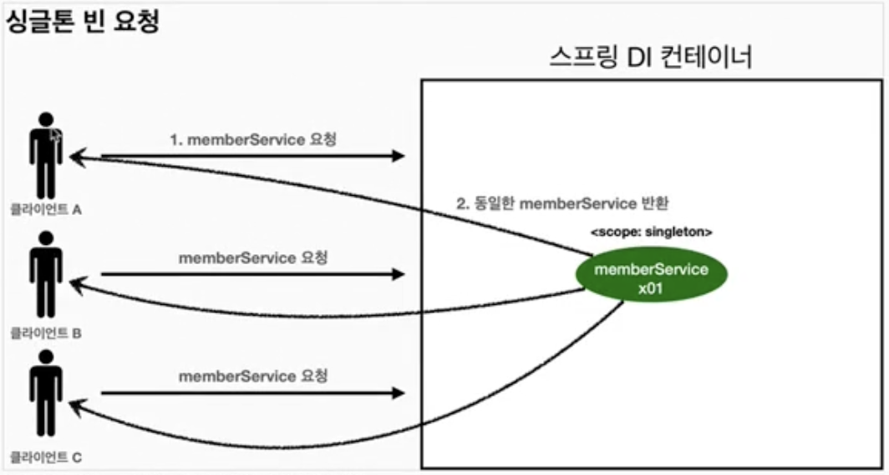
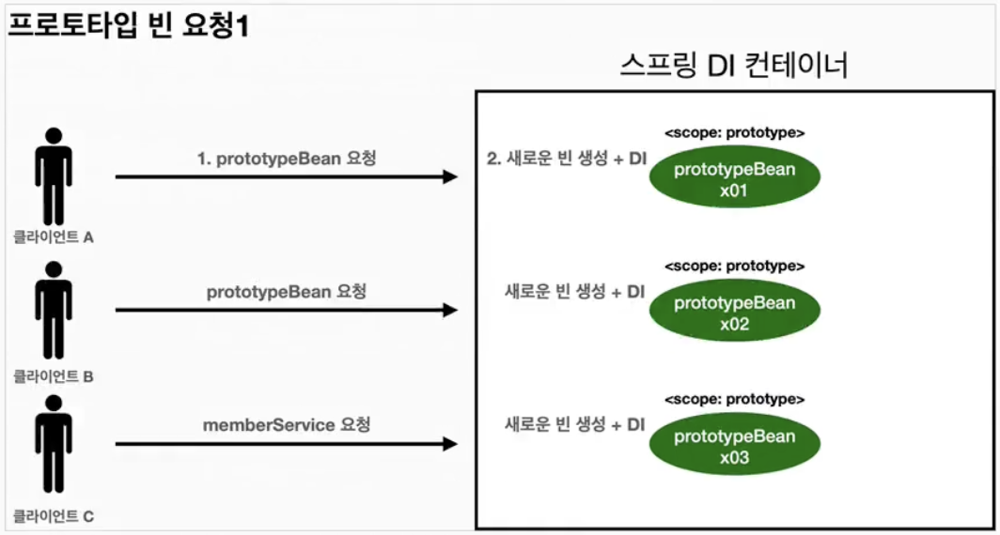
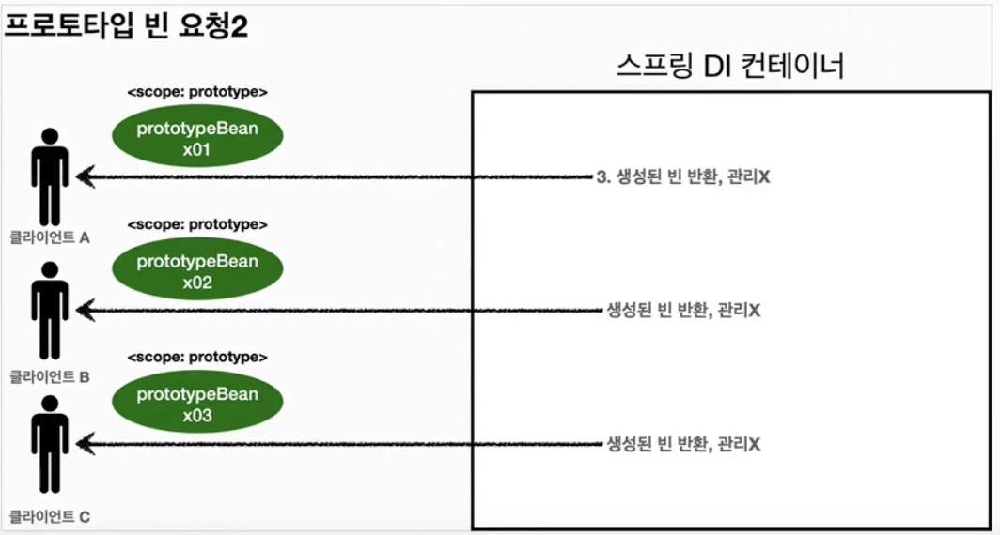
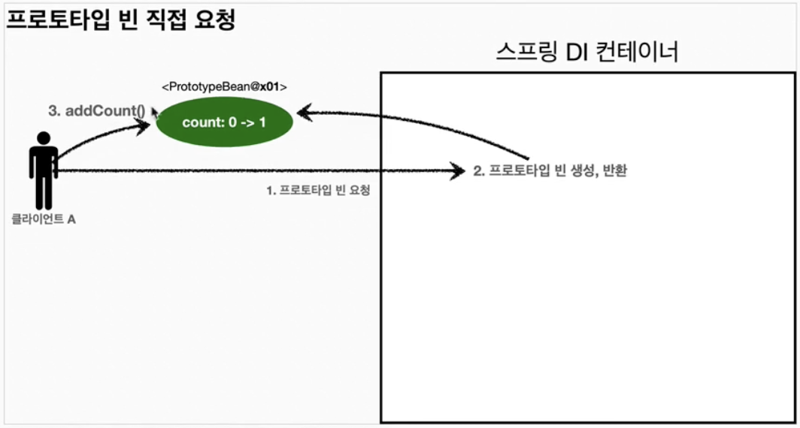
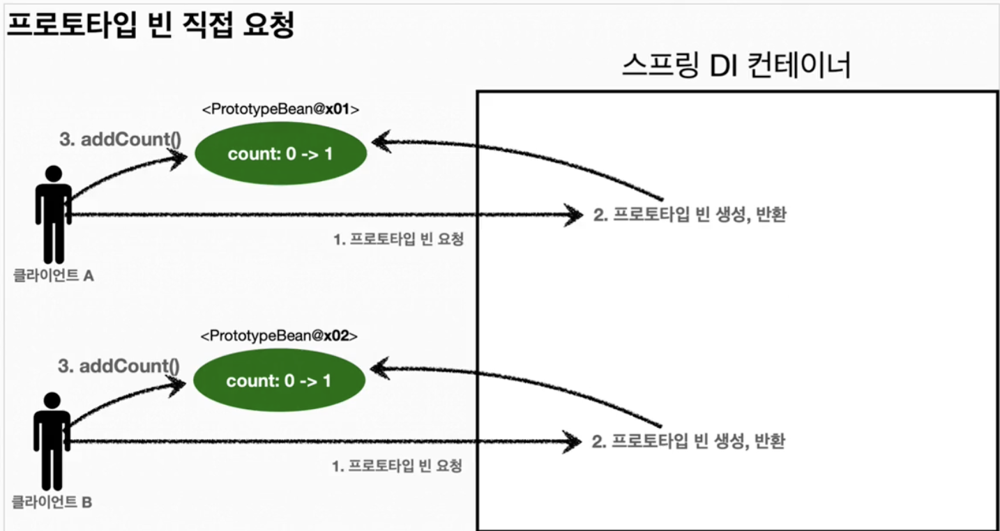
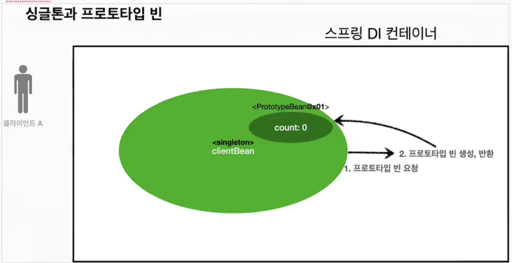
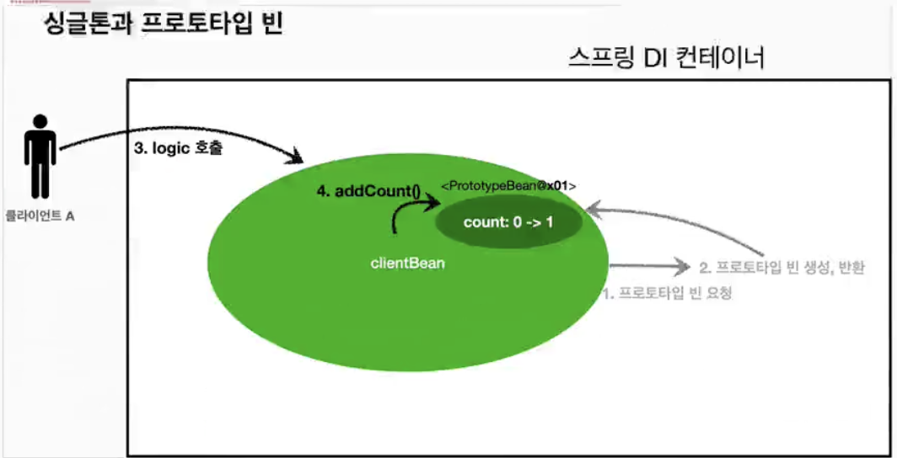
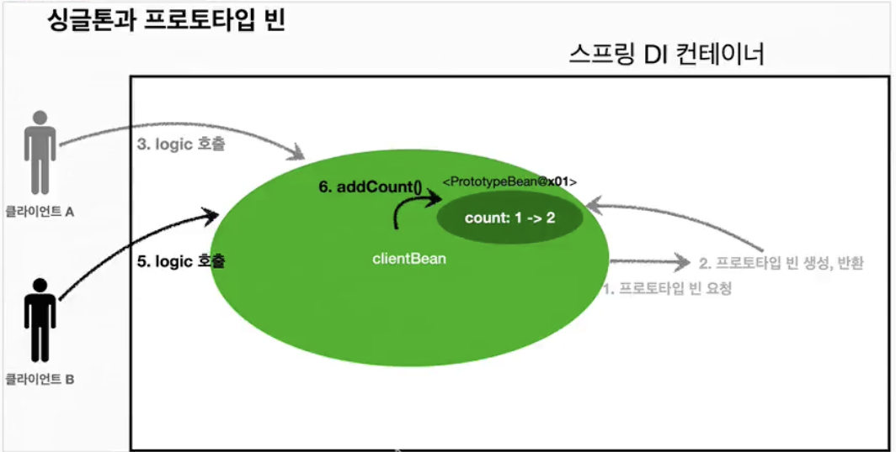

# 빈 스코프
## 빈 스코프란?
- 지금까지 우리는 스프링 빈이 스프링 컨테이너의 시작과 함께 생성되어서 스프링 컨테이너가 종료될 때까지 유지된다고 학습했다.
- 이것은 스프링 빈이 기본적으로 싱글톤 스코프로 생성되기 때문.
- 스코프: 빈이 존재할 수 있는 범위
### 스프링은 다양한 스코프 지원
- 싱글톤: 기본 스코프, 스프링 컨테이너의 시작과 종료까지 유지되는 가장 넓은 범위의 스코프
- 프로토타입: 스프링 컨테이너는 프로토타입 빈의 생성과 의존관계 주입까지만 관여하고 더는 관리하지 않는 매우 짧은 범위의 스코프
- 웹 관련 스코프
	- request
	- session
	- application
### 빈 스코프 지정 방법
#### 컴포넌트 스캔 자동 등록
```java
@Scope("prototype")
@Component
public class HelloBean() {}
```
#### 수동 등록
```java
@Scope("prototype")
@Bean
PrototypeBean HelloBean() {
	return new HelloBean();
}
```
## 프로토타입 스코프
- 싱글톤 스코프의 빈을 조회하면 스프링 컨테이너는 항상 같은 인스턴스의 스프링 빈을 반환함
- 반면에 프로토타입 스코프를 스프링 컨테이너에 조회하면 스프링 컨테이너는 항상 새로운 인스턴스를 생성해서 반환
### 싱글톤 빈 요청

1. 싱글톤 스코프의 빈을 스프링 컨테이너에 요청
2. 스프링 컨테이너는 본인이 관리하는 스프링 빈 반환
3. 이후에 스프링 컨테이너에 같은 요청이 와도 같은 객체 인스턴스의 스프링 빈 반환
### 프로토타입 빈 요청1

1. 프로토타입 스코프의 빈을 스프링 컨테이너에 요청
2. 스프링 컨테이너는 이 시점에 프로토타입 빈을 생성하고 필요한 의존관계 주입
### 프로토타입 빈 요청2

3. 스프링 컨테이너는 생성한 프로토타입 빈을 클라이언트에 반환
4. 이후에 스프링 컨테이너에 같은 요청이 오면 항상 새로운 프로토타입 빈을 생성해서 반환
> **스프링 컨테이너는 프로토타입 빈을 생성하고, 의존관계 주입, 초기화까지만 처리함**
> 프로토타입 빈을 관리할 책임은 클라이언트에 있음. 따라서 종료 메서드가 호출되지 않음
```java
package hello.core.scope;  
  
import jakarta.annotation.PostConstruct;  
import jakarta.annotation.PreDestroy;  
import org.junit.jupiter.api.Assertions;  
import org.junit.jupiter.api.Test;  
import org.springframework.context.ConfigurableApplicationContext;  
import org.springframework.context.annotation.AnnotationConfigApplicationContext;  
import org.springframework.context.annotation.Scope;  
  
public class PrototypeTest {  
  
    @Test  
    void prototypeBeanFind() {  
        ConfigurableApplicationContext ac = new AnnotationConfigApplicationContext(PrototypeBean.class);  
        System.out.println("find prototypeBean1");  
        PrototypeBean prototypeBean1 = ac.getBean(PrototypeBean.class);  
        System.out.println("find prototypeBean2");  
        PrototypeBean prototypeBean2 = ac.getBean(PrototypeBean.class);  
  
        System.out.println("prototypeBean = " + prototypeBean1);  
        System.out.println("prototypeBean2 = " + prototypeBean2);  
        Assertions.assertNotSame(prototypeBean2, prototypeBean1);  
  
  
        ac.close();  
    }  
  
    @Scope("prototype")  
    static class PrototypeBean {  
        @PostConstruct  
        public void init() {  
            System.out.println("PrototypeBean.init");  
        }  
  
        @PreDestroy  
        public void destroy() {  
            System.out.println("PrototypeBean.destroy");  
        }  
    }  
}
```
- 실행 결과
```java
find prototypeBean1
PrototypeBean.init
find prototypeBean2
PrototypeBean.init
prototypeBean = hello.core.scope.PrototypeTest$PrototypeBean@2b87581
prototypeBean2 = hello.core.scope.PrototypeTest$PrototypeBean@66434cc8
```
### 특징
- 스프링 컨테이너에 요청할 때마다 새로 생성
- 스프링 컨테이너는 프로토타입 빈의 생성과 의존관계 주입 그리고 초기화까지만 관여함
- 종료 메서드가 호출 X
- 클라이언트가 직접 관리해야 함. 종료 메서드도 직접 호출해야 함
	- `prototypeBean.destroy();` 이런식으로
## 프로토타입 스코프 - 싱글톤 빈과 함께 사용시 문제점
- 스프링 컨테이너에 프로토타입 스코프의 빈을 요청하면 항상 새로운 객체 인스턴스를 생성해서 반환
- 하지만 싱글톤 빈과 함께 사용할 때는 의도한 대로 잘 동작하지 않으므로 주의해야 함
### 프로토타입 빈 직접 요청
#### 스프링 컨테이너에 프로토타입 빈 직접 요청1

1. 클라이언트A는 스프링 컨테이너에 프로토타입 빈을 요청
2. 스프링 컨테이너는 프로토타입 빈을 새로 생성해서 반환(*x01*)함. 해당 빈의 count 필드 값은 0
3. 클라이언트는 조회한 프로토타입 빈에 `addCount()`를 호출하면서 count 필드를 +1
4. 결과적으로 프로토타입 빈(*x01*)의 count는 1이 됨
#### 스프링 컨테이너에 프로토타입 빈 직접 요청2

1. 클라이언트B는 스프링 컨테이너에 프로토타입 빈을 요청
2. 스프링 컨테이너는 프로토타입 빈을 새로 생성 후 반환(*x02*). 해당 빈의 count 필드 값은 0
3. 클라이언트는 조회한 프로토타입 빈에 `addCount()`를 호출하면서 count 필드를 +1
4. 결과적으로 프로토타입 빈(*x02*)의 count는 1이 됨
```java
public class SingletonWithPrototypeTest1 {  
  
    @Test  
    void prototypeFind() {  
        AnnotationConfigApplicationContext ac = new AnnotationConfigApplicationContext(PrototypeBean.class);  
        PrototypeBean prototypeBean1 = ac.getBean(PrototypeBean.class);  
        prototypeBean1.addCount();  
        Assertions.assertEquals(1, prototypeBean1.getCount());  
  
        PrototypeBean prototypeBean2 = ac.getBean(PrototypeBean.class);  
        prototypeBean2.addCount();  
        Assertions.assertEquals(1, prototypeBean2.getCount());  
    }  
  
    @Scope("prototype")  
    static class PrototypeBean {  
        private int count = 0;  
  
        public void addCount() {  
            count++;  
        }  
  
        public int getCount() {  
            return count;  
        }  
  
        @PostConstruct  
        public void init() {  
            System.out.println("PrototypeBean.init" + this);  
        }  
  
        @PreDestroy  
        public void destroy() {  
            System.out.println("PrototypeBean.destroy");  
        }  
    }  
}
```
### 싱글톤 빈에서 프로토타입 빈 사용
- 이번에는 `clientBean`이라는 싱글톤 빈이 의존관계 주입을 통해 프로토타입 빈을 주입받아서 사용하는 예
#### 싱글톤에서 프로토타입 빈 사용1

-  `clientBean`은 싱글톤이므로, 보통 스프링 컨테이너 생성 시점에 함께 생성되고, 의존관계 주입도 발생한다.
1. `clientBean`은 의존관계 자동 주입을 사용한다. 주입 시점에 스프링 컨테이너에 프로토타입 빈을 요청한다.
2. 스프링 컨테이너는 프로토타입 빈을 생성해서 `clientBean`에 반환한다. 프로토타입 빈의 count 필드 값은 0이다.
-  이제 `clientBean`은 프로토타입 빈을 내부 필드에 보관한다. (정확히는 참조값을 보관한다)
#### 싱글톤에서 프로토타입 빈 사용2

- 클라이언트 A는 `clientBean`을 스프링 컨테이너에 요청해서 받는다. 싱글톤이므로 항상 같은 `clientBean`이 반환됨
3. 클라이언트 A는 `clientBean.logic()` 호출
4. `clientBean`은 prototypeBean의 `addCount()`를 호출해서 프로토타입 빈의 count를 증가. count값이 1이 됨
#### 싱글톤에서 프로토타입 빈 사용3

- 클라이언트 B는 `clientBean`을 스프링 컨테이너에 요청해서 받는다. 싱글톤이므로 항상 같은 `clientBean`가 반환
- **여기서 중요한 점: `clientBean`이 내부에 가지고 있는 프로토타입 빈은 이미 과거에 주입이 끝난 빈이다. 주입 시점에 스프링 컨테이너에 요청해서 프로토타입 빈이 새로 생성이 된 것이지, 사용할 때마다 새로 생성되는 것이 아님**
5. 클라이언트 B는 `clientBean.logic()` 호출
6. `clientBean`은 prototypeBean의 `addCount()`를 호출해서 프로토타입 빈의 count를 증가. count값이 원래 1이었으므로 2가 됨
```java
public class SingletonWithPrototypeTest1 {  
  
    @Test  
    void prototypeFind() {  
        AnnotationConfigApplicationContext ac = new AnnotationConfigApplicationContext(PrototypeBean.class);  
        PrototypeBean prototypeBean1 = ac.getBean(PrototypeBean.class);  
        prototypeBean1.addCount();  
        Assertions.assertEquals(1, prototypeBean1.getCount());  
  
        PrototypeBean prototypeBean2 = ac.getBean(PrototypeBean.class);  
        prototypeBean2.addCount();  
        Assertions.assertEquals(1, prototypeBean2.getCount());  
    }  
  
    @Test  
    void singletonClientUsePrototype() {  
        AnnotationConfigApplicationContext ac = new AnnotationConfigApplicationContext(ClientBean.class, PrototypeBean.class);  
  
        ClientBean clientBean1 = ac.getBean(ClientBean.class);  
        int count1 = clientBean1.logic();  
        Assertions.assertEquals(1, count1);  
  
  
        ClientBean clientBean2 = ac.getBean(ClientBean.class);  
        int count2 = clientBean2.logic();  
        Assertions.assertEquals(2, count2);  
    }  
  
    @Component  
    @Scope("singleton")  
    static class ClientBean {  
        private final PrototypeBean prototypeBean;  
  
        @Autowired  
        public ClientBean(PrototypeBean prototypeBean) {  
            this.prototypeBean = prototypeBean;  
        }  
  
        public int logic() {  
            prototypeBean.addCount();  
            int count = prototypeBean.getCount();  
            return count;  
        }  
    }  
  
    @Scope("prototype")  
    @Component  
    static class PrototypeBean {  
        private int count = 0;  
  
        public void addCount() {  
            count++;  
        }  
  
        public int getCount() {  
            return count;  
        }  
  
        @PostConstruct  
        public void init() {  
            System.out.println("PrototypeBean.init" + this);  
        }  
  
        @PreDestroy  
        public void destroy() {  
            System.out.println("PrototypeBean.destroy");  
        }  
    }  
}
```
- 스프링은 일반적으로 싱글톤 빈을 사용하므로, 싱글톤 빈이 프로토타입 빈을 사용하게 된다. 그런데 싱글톤 빈은 생성 시점에만 의존관계 주입을 받기 때문에, 프로토타입 빈이 새로 생성되기는 하지만 싱글톤 빈과 함께 계속 유지되는 것이 문제
## 프로토타입 스코프 - 싱글톤 빈과 함께 사용시 Provider로 문제 해결
### 스프링 컨테이너에 요청
- 로직을 호출할 때마다 prototypeBean을 새로 생성해달라고 요청
```java
@Component  
    @Scope("singleton")  
    static class ClientBean {  
        @Autowired  
        private ApplicationContext ac;  
  
        public int logic() {  
            PrototypeBean prototypeBean = ac.getBean(PrototypeBean.class);  
            prototypeBean.addCount();  
            int count = prototypeBean.getCount();  
            return count;  
        }  
    }
```
- 실행해보면 `ac.getBean()`을 통해서 항상 새로운 프로토타입 빈이 생성되는 것을 확인 가능함
- 의존관계를 외붸서 주입받는게 아니라 이렇게 직접 필요한 의존관계를 찾는 것을 Dependency Lookup(DL) - 의존관계 조회(탐색) 이라함
- 그런데 이렇게 스프링의 애플리케이션 컨텍스트 전체를 주입받게 되면, 스프링 컨테이너에 종속적인 코드가 되고, 단위 테스트도 어려워짐
- 지금 필요한 기능은 지정한 프로토타입 빈을 컨테이너에서 대신 찾아주는 딱 DL 정도의 기능만 제공하는 무언가가 있으면 됨
### ObjectFactory, ObjectProvider
- 지정한 빈을 컨테이너에서 대신 찾아주는 DL 서비스를 제공해주는 것
- 과거에는 `ObjectFactory`가 있었는데 여기에 편의 기능을 추가해 `ObjectProvider`가 만들어짐
```java
@Component  
@Scope("singleton")  
static class ClientBean {  
    @Autowired  
    private ObjectProvider<PrototypeBean> prototypeBeanProvider;  
  
  
    public int logic() {  
        PrototypeBean prototypeBean = prototypeBeanProvider.getObject();  
        prototypeBean.addCount();  
        int count = prototypeBean.getCount();  
        return count;  
    }  
}
```
- 실행하면 항상 새로운 프로토타입 빈이 생성되는 것을 확인 가능
- `ObjectProvider`의 `getObject()`를 호출하면 내부에서는 스프링 컨테이너를 통해 해당 빈을 찾아서 반환한다 (*DL*)
- 스프링이 제공하는 기능을 사용하지만 기능이 단순하므로 단위테스트를 만들거나 mock 코드 만들기 훨씬 쉬워짐
- `ObjectProvider`는 지금 딱 필요한 DL정도의 기능만 제공함
#### 특징
- ObjectFactory: 기능 단순, 별도 라이브러리 필요 없음, 스프링에 의존
- ObjectProvider: ObjectFactory 상속, 옵션, 스트림 처리 등 편의 기능 많음, 별도의 라이브러리 필요 없음, 스프링에 의존
### JSR: 330 Provider
- `javax.inject.Provider`라는 JSR: 330 자바 표준을 사용하는 방법
	- [!] 지금은 `jakarta.inject.Provider`
- 라이브러리 추가해야 함
```java
@Component  
@Scope("singleton")  
static class ClientBean {  
    @Autowired  
    private Provider<PrototypeBean> prototypeBeanProvider;  
  
  
    public int logic() {  
        PrototypeBean prototypeBean = prototypeBeanProvider.get();  
        prototypeBean.addCount();  
        int count = prototypeBean.getCount();  
        return count;  
    }  
}
```
- `provider`의 `get()`을 호출하면 내부에서는 스프링 컨테이너를 통해 해당 빈을 찾아서 반환(*DL*)
- 자바 표준이고, 기능이 단순하므로 단위테스트를 만들거나 mock코드 만들기 훨씬 쉬움
- `Provider`는 지금 필요한 DL 기능만 제공
#### 특징
- `get()` 메서드 하나로 기능이 매우 단순
- 별도의 라이브러리 필요
- 자바 표준이므로 스프링이 아닌 다른 컨테이너에서도 사용 가능
