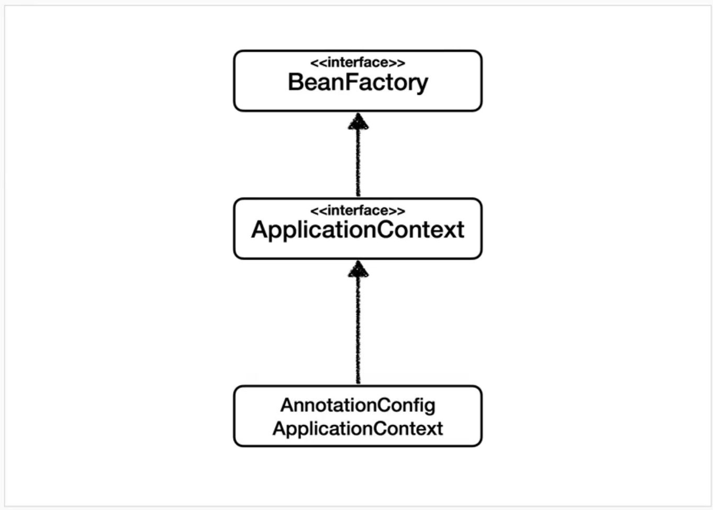
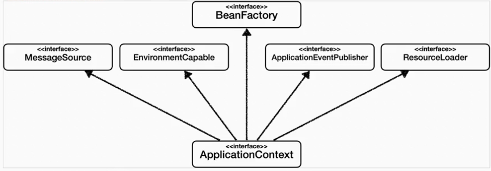
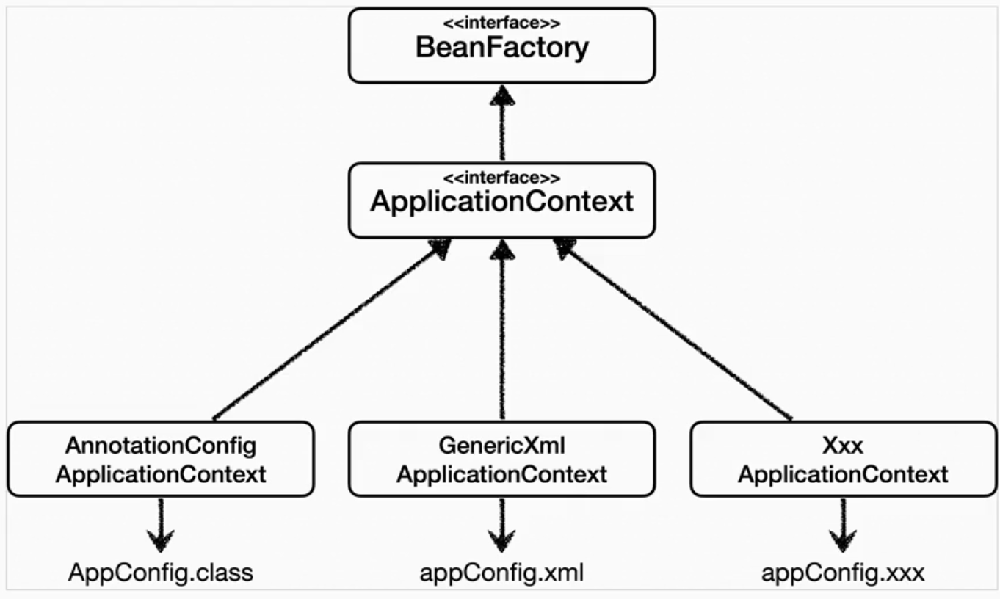

# BeanFactory와 ApplicationContext

## BeanFactory
- 스프링 컨테이너의 최상위 인터페이스
- 스프링 빈을 관리하고 조회하는 역할 담당
- `getBean()` 제공
## ApplicationContext
- BeanFactory의 기능을 모두 상속받아 제공
- 빈 관리/조회 이외에 애플리케이션 개발에 필요한 수 많은 부가기능 제공
### 제공하는 부가기능

- 메시지 소스를 활용한 국제화 기능
- 환경변수
- 애플리케이션 이벤트
- 편리한 리소스 조회
## 다양한 설정 형식 지원 - 자바 코드, XML

### 애노테이션 기반 자바 코드 설정 사용
- `AnnotationConfigApplicationContext` 클래스를 사용하면서 자바 코드로 된 설정 정보 넘기면 됨
### XML 설정 사용
- 최근에는 스프링 부트를 사용하면서 잘 사용 X
```xml
<?xml version="1.0" encoding="UTF-8"?>  
<beans xmlns="http://www.springframework.org/schema/beans"  
       xmlns:xsi="http://www.w3.org/2001/XMLSchema-instance"  
       xsi:schemaLocation="http://www.springframework.org/schema/beans http://www.springframework.org/schema/beans/spring-beans.xsd">  
  
    <bean id="memberService" class="hello.core.member.MemberServiceImpl" >  
        <constructor-arg name="memberRepository" ref="memberRepository" />  
    </bean>  
    <bean id="memberRepository" class="hello.core.member.MemoryMemberRepository"/>  
  
    <bean id="orderService" class="hello.core.order.OrderServiceImpl">  
        <constructor-arg name="memberRepository" ref="memberRepository" />  
        <constructor-arg name="discountPolicy" ref="discountPolicy" />  
    </bean>  
    <bean id="discountPolicy" class="hello.core.discount.RateDiscountPolicy" />  
</beans>
```
- 자바 코드로 된 `AppConfig.java`와 거의 비슷