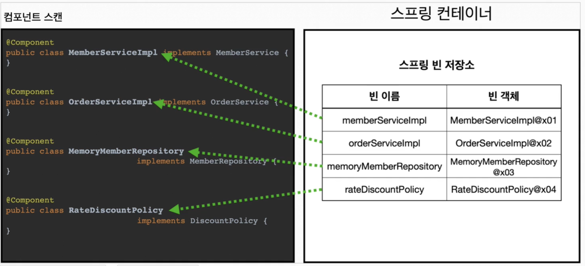
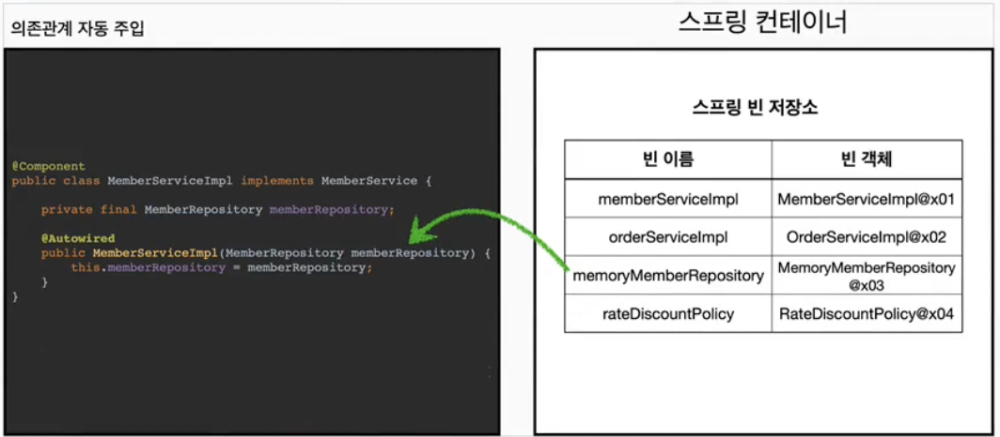

# 컴포넌트 스캔
## 컴포넌트 스캔과 의존관계 자동 주입 시작하기
- 설정 정보 없이도 자동으로 스프링 빈을 등록하는 컴포넌트 스캔이라는 기능 제공
- 의존관계도 자동으로 주입하는 `@Autowired`라는 기능도 제공
- 사용하려면 `@ComponentScan` 설정 정보에 붙이면 됨
- [!] 참고: 컴포넌트 스캔을 사용하면 `@Configuration`이 붙은 설정 정보도 자동으로 등록되기 때문에 `excludeFilters`를 이용해 설정 정보는 컴포넌트 스캔 대상에서 제외 가능 (여기서 예제를 위해 사용)
- `Component` 애노테이션이 붙은 클래스를 스캔해서 스프링 빈으로 등록함
### @Autowired
- 이전에는 `@Bean`으로 직접 설정 정보를 작성했고 의존관계도 직접 명시함
- 이제는 이런 설정 정보 자체가 없기 때문에 의존관계 주입도 클래스 안에서 해결해야 함
- `@Autowired`는 여러 의존관계 한번에 자동 주입해줌
```java
@Component  
public class MemberServiceImpl implements MemberService {  
  
    private final MemberRepository memberRepository;  
  
    @Autowired  
    public MemberServiceImpl(MemberRepository memberRepository) {  
        this.memberRepository = memberRepository;  
    }
    
    // ...
}
```
#### 1. @ComponentScan

- `@ComponentScan`은 `@Component`가 붙은 모든 클래스를 스프링 빈으로 등록
- 이때 스프링 빈의 기본 이름은 클래스명을 사용하되 맨 앞글자만 소문자 사용
	- 빈 이름 기본 전략: MemberServiceImpl 클래스 -> memberServiceImpl
	- 빈 이름 직접 지정: 만약 스프링 빈의 이름을 직접 지정하고 싶으면 `@Component("memberService2")` 이런 식으로 이름 부여
#### 2. @Autowired 의존관계 자동 주입

- 생성자에 `@Autowired`를 지정하면, 스프링 컨테이너가 자동으로 해당 스프링 빈을 찾아서 주입
- 이 때 기본 조회 전략은 타입이 같은 빈 찾아 주입
	- `getBean(MemberRepository.class)`와 동일하다고 이해하면 됨
- 생성자에 파라미터가 많아도 다 찾아서 자동으로 주입
## 탐색 위치와 기본 스캔 대상
### 탐색할 패키지의 시작 위치 지정
- 꼭 필요한 위치부터 탐색하도록 시작 위치 지정 가능
```java
@ComponentScan(  
        basePackages = "hello.core.member",
)
```
- `basePackages`: 탐색할 패키지의 시작 위치를 지정. 이 패키지 포함해서 하위 패키지를 모두 탐색
	- `basePackages = {"hello.core", "hello.service"}` 처럼 여러 시작 위치 지정 가능
- `basePackageClasses`: 지정한 클래스의 패키지를 탐색 시작 위로 지정
- 만약 지정하지 않으면 `@ComponentScan`이 붙은 설정 정보 클래스의 패키지가 시작 위치가 됨
- 권장하는 방법
	- **패키지 위치를 지정하지 않고, 설정 정보 클래스의 위치를 프로젝트 최상단에 두는 것**
	- 최근 스프링부트도 이 방법을 기본으로 제공
### 컴포넌트 스캔 기본 대상
- 다음 내용도 추가로 스캔 대상에 포함함
	- `@Component`: 컴포넌트 스캔에 사용
	- `@Controller`: 스프링 MVC 컨트롤러에 사용
		- 스프링 MVC 컨트롤러로 인식
	- `@Service`: 스프링 비즈니스 로직에서 사용
		- 특별한 처리 X
		- 대신 개발자들이 핵심 비즈니스 로직이 여기에 있겠구나하고 인식하는데 도움이 됨
	- `@Repository`: 스프링 데이터 접근 계층에서 사용
		- 스프링 데이터 접근 계층으로 인식하고, 데이터 계층의 예외를 스프링 예외로 변환
	- `@Configuration`: 스프링 설정 정보에서 사용
		- 스프링 설정 정보로 인식, 스프링 빈이 싱글톤 유지하도록 추가 처리
## 필터
- `includeFilters`: 컴포넌트 스캔 대상을 추가로 지정
- `excludeFilters`: 컴포넌트 스캔에서 제외할 대상 지정
### FilterType 옵션
- ANNOTATION: 기본값, 애노테이션 인식해서 동작
- ASSIGNABLE_TYPE: 지정한 타입과 자식 타입을 인식해서 동작
- ASPECTJ: AspectJ 패턴 사용
- REGEX: 정규 표현식
- CUSTOM: TypeFilter이라는 인터페이스 구현해서 처리\
## 중복 등록과 충돌
- 컴포넌트 스캔에서 같은 빈 이름을 등록하면 어떻게 될까?
	1. 자동 빈 등록 vs 자동 빈 등록
	2. 수동 빈 등록 vs 자동 빈 등록
### 자동 빈 등록 vs 자동 빈 등록
- 컴포넌트 스캔에 의해 자동으로 스프링 빈이 등록되는데, 그 이름이 같은 경우 스프링은 오류 발생시킴
	- `ConflictingBeanDefinitionException` 예외 발생
### 수동 빈 등록 vs 자동 빈 등록
- 수동 빈 등록이 우선권 가짐 (수동 빈이 자동 빈을 오버라이딩 해버림)
- 보통 의도하지 않게 이런 경우가 생기는데 에러가 안나니 디버깅이 어려워짐
	- 스프링부트는 이 경우도 에러를 띄워줌
- 